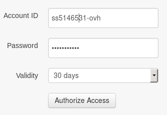
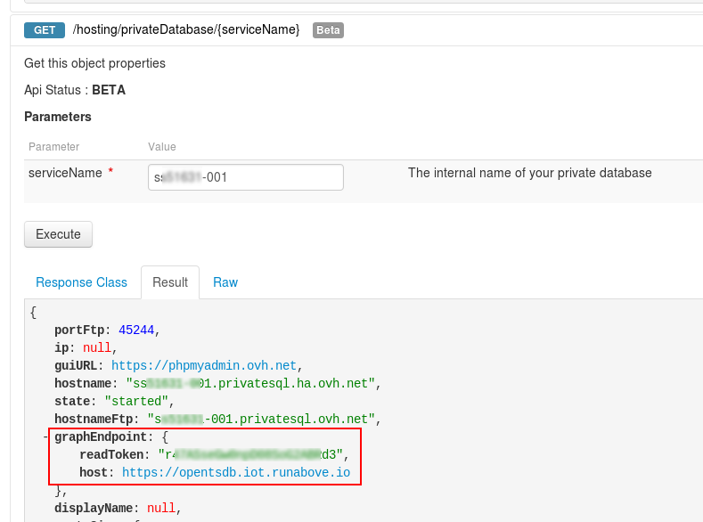
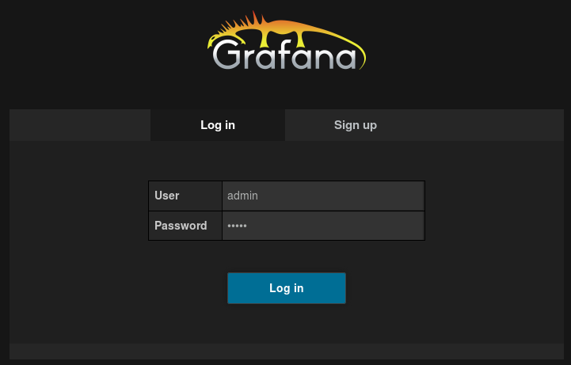
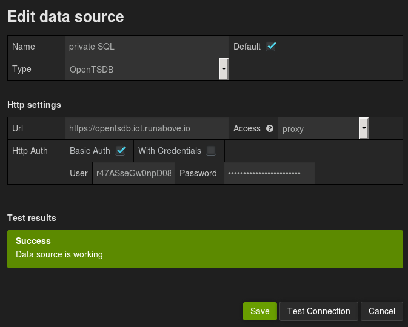
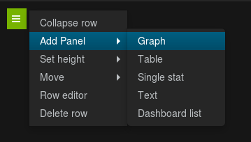
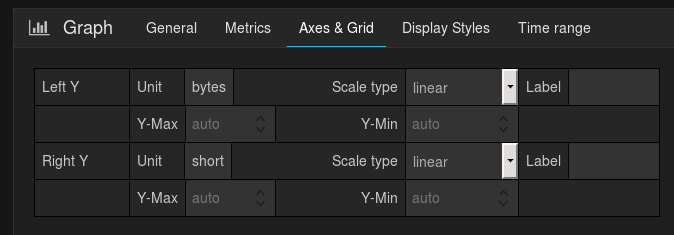
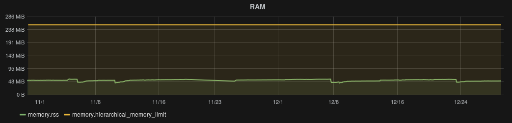

## 

## What is Docker?
Docker is an open-source project that automates the deployment of applications within software containers.

{.thumbnail}

## What is Grafana?
Grafana is an open-source solution that allows you to transform data into graphs, for example.

{.thumbnail}


## An instance
To install Grafana, you need to use Docker. You can install it on different OVH solutions:


- [VPS](https://www.ovh.co.uk/vps/)
- [Dedicated server](https://www.ovh.co.uk/dedicated_servers/)
- [Cloud Instance](https://www.ovh.co.uk/cloud/instances/)


## Docker

## Installation
See the documentation available at [this link](https://docs.docker.com/engine/installation/) to install Docker, based on your particular machine.

## On VPS
If you have an OVH VPS, you can choose to install the "Docker on Ubuntu" distribution that includes a server that already has Docker.

{.thumbnail}


## Grafana

## Install Grafana in Docker
If you want to use Grafana on port 80 of your server, just use the following command:


```
docker run -i -p 80:3000 grafana/grafana
```


For more information, you can consult the following [link](http://docs.grafana.org/installation/docker/).
It is possible to install Grafana without Docker. To do this, see the following [document](http://docs.grafana.org/installation/).


## A Private SQL Server

## Type of Private SQL
Your private SQL server must be "Docker" to be able to get the metrics.

## Free activation on Performance hosting packages.
If you have a Performance hosting package, you can enable a Private SQL server for free by following [this guide](https://www.ovh.co.uk/g2023.all_about_private_sql).

## Order a Private SQL server
You can order a Private SQL server directly from your control panel. 


- All new Private SQL servers are Docker servers.


{.thumbnail}

## Is my Private SQL Server Legacy or Docker?
The old Private SQL servers are Legacy servers (for example: "sqlprive-kx11111-009"), the new ones are Docker (for example: "sx11111-012").
They are two different infrastructures.

{.thumbnail}


## Get the token via the OVH API

## Connect to the OVH API
Use the following link to connect to the OVH API, and then click "Login" to connect.

[https://api.ovh.com/console/](https://api.ovh.com/console/)

{.thumbnail}

## Retrieve the token
Use the following function to retrieve the list of Private SQL servers in your account, and then click "Run":


```
/hosting/privateDatabase
```


{.thumbnail}
Enter the name of your Docker Private SQL server through the following command:


```
/hosting/privateDatabase/{serviceName}
```


In "graphEndpoint" you will find the data you need:


- readToken
- host


{.thumbnail}


## Use Grafana

## Connect to your Grafana
Access Grafan through your browser, with these credentials:


- admin/admin


{.thumbnail}

## Add your data source
To do this, click on "Data Sources in the left column and then on "Add new.

Enter the following information:


- Name: The name of your data source. In our case, it could be "private SQL".
- Default: Yes.
- Type: "OpenTSDB".
- URL: Specify the content of the "host" field that you previously retrieved from the OVH API.
- Access: "proxy"
- Http Auth: Check "Basic Auth" and uncheck "With Credentials".
- User: Specify the contents of the "readToken" field that you previously retrieved from the OVH API.
- Password: Re-enter the contents of the "readToken" field that you previously retrieved from the OVH API.


Do a connection test and if it works, add the data source.

{.thumbnail}

## Configure your "Dashboard"
Click Dahboards in the left column, and then click "Home" > "New".

You will then get a virgin control panel whose name you can change by clicking "Manage Dashboard" > "Settings".

You can save your control panel at any time by clicking the icon at the top.

A control panel consists of a line ("Row"). To add the first graphic, click on the green button and select "Add Panel" > "Graph".

{.thumbnail}
In the "General" tab, enter the title of your graph, for example "RAM".

{.thumbnail}
In the "Metrics" tab, check that your data source is correct, at the bottom right.

The first metric to enter is "memory.hierarchical_memory_limit", which refers to the maximum RAM allocated to your Private SQL server.

Then click "+ Query" to set the second metric «memory.rss», which refers to the RAM used by your server.

{.thumbnail}
In the "Axes & Grid" tab, select the data unit in "Left Y" and then "Bytes".

{.thumbnail}

- At the top right, select the time interval you want. This is the result obtained in the last 60 days.


{.thumbnail}


## The metrics
We have included 3 examples of relevant metrics to track the performance of your Private SQL:

|Limit of RAM used|memory.hierarchical_memory_limit|
|RAM used|memory.rss|

|Number of active MySQL 
connections|mysql.active_connections|


In the following link you will find official information on Docker metrics:


- [https://docs.docker.com/engine/articles/runmetrics/](https://docs.docker.com/engine/articles/runmetrics/)


