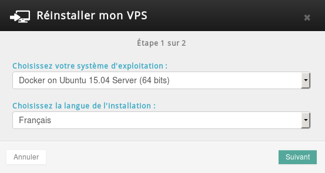
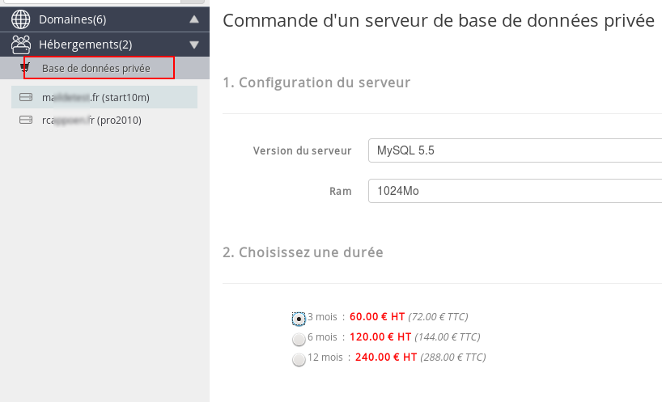
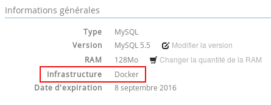
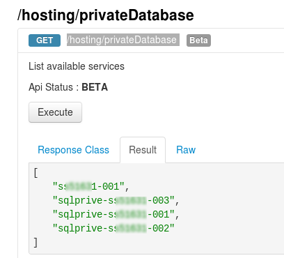
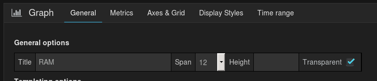
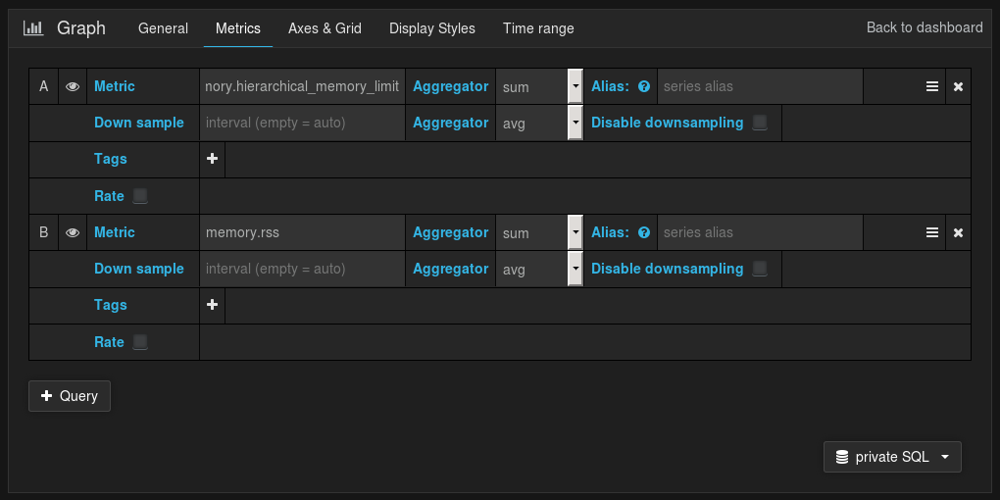

**Dernière mise à jour le 05/05/2020**

Ce guide technique vous indiquera comment récupérer les métriques (RAM par exemple) de votre serveur SQL en utilisant Grafana.

- Cela s'adresse à des utilisateurs avancés.
- Vous devez disposez d'un serveur SQL Privé de type "Docker" pour utiliser Grafana
- Il est possible de récupérer les métriques directement depuis votre espace client dans l'onglet "Métriques" sur les serveurs de type "Docker".

> [!warning]
>
> OVHcloud met à votre disposition des services dont la configuration, la gestion et la responsabilité vous incombent. Il vous revient de ce fait d'en assurer le bon fonctionnement.
> 
> Nous mettons à votre disposition ce guide afin de vous accompagner au mieux sur des tâches courantes. Néanmoins, nous vous recommandons de faire appel à un prestataire spécialisé et/ou de contacter l'éditeur du service si vous éprouvez des difficultés. En effet, nous ne serons pas en mesure de vous fournir une assistance. Plus d'informations dans la section « Aller plus loin » de ce guide.
> 


## Que sont Docker et Grafana ?
Docker est un logiciel libre qui automatise le déploiement d'applications dans des conteneurs logiciels.


{.thumbnail}

Grafana est une solution open-source permettant de mettre en forme des données sous forme de graphique par exemple.


{.thumbnail}


## Les pre-requis pour les utiliser

### Une instance
Pour installer Grafana, il sera nécessaire d'utiliser Docker. Celui-ci pourra être installé sur différents produits proposés par OVHcloud :

- [VPS](https://www.ovh.com/ca/fr/vps/){.external}
- [Serveur dédié](https://www.ovh.com/ca/fr/serveurs_dedies/){.external}
- [Instance Cloud](https://www.ovh.com/ca/fr/cloud/instances/){.external}


### Docker
En fonction de votre machine, vous pouvez suivre la documentation accessible via [ce lien](https://docs.docker.com/engine/installation/){.external} pour l'installer. Si vous disposez d'un VPS chez OVHcloud, vous pouvez choisir d'installer la distribution "Docker on Ubuntu" qui vous permettra de disposer d'un serveur disposant déjà de Docker.


{.thumbnail}


### Grafana
Si vous souhaitez utiliser Grafana sur le port 80 de votre serveur, il vous suffit d'utiliser la commande suivante :


```bash
docker run -i -p 80:3000 grafana/grafana
```

Vous retrouverez plus d'informations sur [ce lien](http://docs.grafana.org/installation/docker/){.external}.


### Un serveur SQL privé
Votre serveur SQL Privé doit être de type " **Docker**" pour récupérer des métriques. Si vous disposez d'un hébergement performance, vous pouvez activer un serveur SQL Privé gratuitement. Vous pouvez commander un serveur SQL Privé directement dans votre espace client.

- Tous les nouveaux serveurs SQL Privé mis en place sont de type "Docker".

{.thumbnail}

Les anciens serveurs SQL Privé sont de type "Legacy" (exemple : sqlprivé-kx11111-009), les nouveaux sont de type "Docker" (exemple : sx11111-012). Il s'agit de deux infrastructures différentes.


{.thumbnail}


## Comment les utiliser ?

### Obtenir le token via l'API OVHcloud
Pour vous connecter à l'API OVHcloud, veuillez vous rendre sur le lien suivant puis cliquer sur "Login" afin de vous connecter.

[https://api.ovh.com/console/](https://api.ovh.com/console/){.external}


{.thumbnail}

Il faut utiliser la fonction suivante pour récupérer la liste des serveurs SQL Privé présents sur votre compte puis cliquer sur "Execute" :


> [!api]
>
> @api {GET} /hosting/privateDatabase
> 

{.thumbnail}

Renseigner via la fonction suivante le nom de votre serveur SQL Privé de type "Docker" :


> [!api]
>
> @api {GET} /hosting/privateDatabase/{serviceName}
> 
Vous retrouverez dans "graphEndpoint" les deux informations nécessaires :

- readToken
- host


{.thumbnail}


### Utiliser Grafana
Accéder à votre Grafana via votre navigateur, les identifiants par défaut sont :

- admin / admin


{.thumbnail}

Il faut pour cela cliquer sur "Data Sources" dans la colonne de gauche puis en haut sur "Add new".

Remplissez les informations suivantes :

- Name : le nom de votre source de données, dans notre cas je la nommerai "private SQL".
- Default : Oui
- Type : "OpenTSDB"
- URL : renseigner ici le contenu du champs " host " récupéré précédemment dans l'API OVHcloud
- Access : "proxy"
- Http Auth : Cochez "Basic Auth", décochez "With Credentials"
- User : renseignez ici le contenu du champs " readToken " récupéré précédemment dans l'API OVHcloud
- Password : renseignez également ici le contenu du champs " readToken " récupéré précédemment dans l'API OVHcloud

Réalisez un test de connexion et si celui-ci est concluant, ajouter la source de données.


{.thumbnail}

Cliquez dans la colonne de gauche sur "Dahboards", cliquez en haut sur "Home" puis sur "New".

- Vous obtenez de cette manière un tableau de bord vierge que vous pouvez renommer en cliquant sur l'icône " Manage Dashboard " puis " Settings ".
- Vous pouvez à tout moment sauvegarder votre tableau de bord en cliquant sur l'icône de "Disquette" en haut.

Un tableau de bord est composée de ligne ("Row"), pour ajouter le premier graphique, cliquez sur le bouton vert, puis sur "Add Panel" et "Graph".


{.thumbnail}

Dans l'onglet "General", renseigner le titre de votre graphique, pour cet exemple nous le nommerons "RAM".


{.thumbnail}

- Dans l'onglet " Metrics ", vérifiez dans un premier temps que votre source de données soit bien sélectionnée en bas à droite.

La première métrique à renseigner est " **memory.hierarchical_memory_limit** ", cela correspond à la RAM maximum allouée à votre serveur SQL Privé.

Cliquez ensuite sur "+ Query" pour ajouter la seconde métrique " **memory.rss** ", celle-ci correspond à la RAM utilisée par votre serveur.


{.thumbnail}

Dans l'onglet "Axes & Grid", sélectionnez dans "Left Y" l'unité ""data" puis "Bytes"


{.thumbnail}

- Choisissez en haut à droite l'intervalle de temps à observer, voici le rendu obtenu sur les 60 derniers jours.


{.thumbnail}


### Les metriques
Voici 3 exemples de métriques pertinentes pour suivre vos performances sur votre SQL Privé :

|RAM Maximum utilisable|memory.hierarchical_memory_limit|
|---|---|
|RAM Utilisée|memory.rss|
|Nombre de connexions MySQL actives|mysql.active_connections|

Vous retrouverez sur le lien suivant la documentation officielle sur les métriques Docker : <https://docs.docker.com/config/containers/runmetrics/>

## Aller plus loin

Échangez avec notre communauté d'utilisateurs sur <https://community.ovh.com>.
