## 

## ¿En qué consiste la solución del SQL Privado?
El servicio SQL Privado ha sido especialmente diseñado para aquellos clientes con necesidades específicas o de gran volumen en sus bases de datos. Con el SQL Privado, dispondrá de su propio servidor SQL, al tiempo que disfrutará de la tranquilidad que le ofrece el alojamiento compartido gestionado por OVH. 

- El servidor SQL requiere un alojamiento compartido.


## Las ventajas del SQL Privado

- Tamaño ilimitado de las bases de datos (dentro del espacio disponible en el servidor). 
- 100 conexiones simultáneas de base, aumentable hasta 200.
- Elección de la versión de SQL y cambio posible a una versión superior en todo momento.
- Configuración del servidor MySQL adaptable a sus necesidades.
- Posibilidad de crear cuentas privilegiadas con acceso a varias bases de datos.


## Disfrute del SQL Privado sin límite
Con su servidor SQL Privado, dispondrá de recursos reservados exclusivamente para usted, y no de recursos compartidos como sucede en el caso de los servidores compartidos. 

Así pues, haga lo que haga, no corre el riesgo de molestar al resto de usuarios. El tamaño de las bases de datos es ilimitado. De este modo, podrá elegir la mejor configuración entre el volumen de datos y el rendimiento de su servidor SQL.

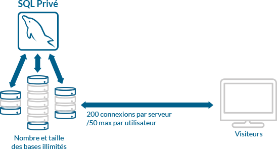{.thumbnail}

## Seleccione su versión SQL
Al realizar su pedido, podrá elegir la versión de servidor SQL que mejor se adapte a sus necesidades entre la lista de versiones disponibles. 

Si, posteriormente, desea mejorar su versión SQL, podrá hacerlo con un solo clic desde su área de cliente y cambiar a una versión superior, siempre y cuando esté disponible.

## Copias de seguridad automáticas
Puede automatizar las copias de seguridad de sus bases de datos en pocos clics directamente desde el área de cliente y, si se produce algún problema, restaurarlas con la misma facilidad. Así podrá ejecutar cualquier actualización sin preocuparse de nada. 

Para ello, solo necesita activar el servicio directamente desde su área de cliente.

## Principio de funcionamiento
Su SQL Privado dispone de sus propios recursos (procesador, memoria RAM, etc.) asignados por el sistema principal. Así los usuarios no se obstaculizan unos a otros.

{.thumbnail}


## Activar mi SQL Privado gratis
Si dispone de un web hosting Performance, tiene la posibilidad de activar gratis un servidor SQL Privado con 128 MB de RAM (incluido con el plan Performance). Para activarlo, acceda a su área de cliente y haga clic en el nombre de su alojamiento compartido.

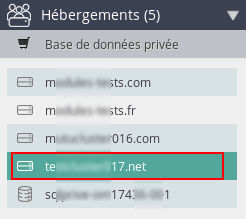{.thumbnail}
En el apartado de «Información general», puede comprobar si hay un servidor SQL privado asociado al alojamiento. Haga clic en «Activar» para activar su base de datos privada.

{.thumbnail}
A continuación, haga clic en «Aceptar» para completar la activación, que se hará efectiva en los próximos minutos.

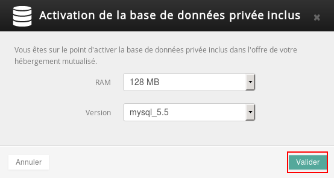{.thumbnail}


## Cambiar el plan de mi servidor SQL Privado
Para cambiar el plan de su servidor SQL Privado, haga clic en el SQL Privado que desea modificar, en la sección «Alojamientos» > «Información general» > «Cambiar la cantidad de RAM».

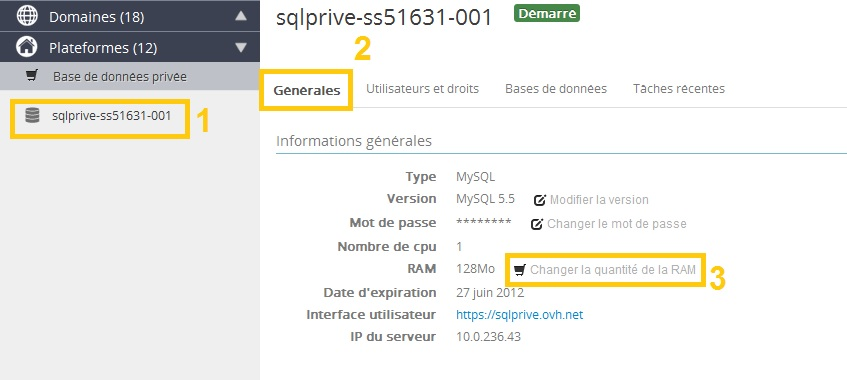{.thumbnail}
A continuación, seleccione la cantidad de RAM que desee y haga clic en «Siguiente». En nuestro ejemplo, el servidor SQL Privado cuenta con 128 MB de RAM. Las opciones propuestas son 256 MB, 512 MB o 1024 MB.

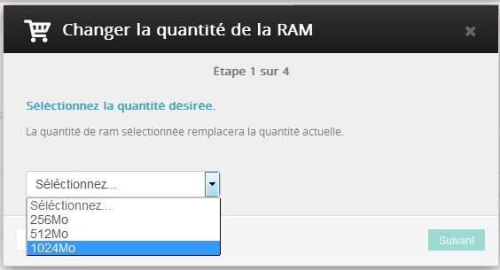{.thumbnail}
Aquí puede seleccionar la duración deseada: entre 3, 6 y 12 meses.

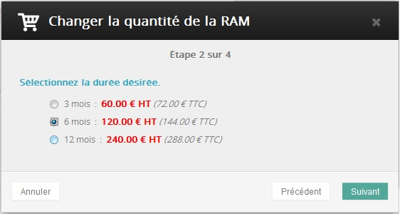{.thumbnail}
Si faltan algunos meses para la caducidad del producto, se calculará la parte proporcional en base a la fecha de caducidad del servidor SQL Privado, y no de la orden de pedido.
A continuación, debe indicar que acepta el contrato. Para ello, haga clic en el botón «Acepto los contratos» (1) y, a continuación, en «Siguiente».

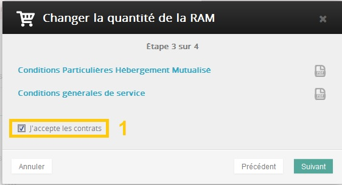{.thumbnail}
En la última etapa aparecerá un resumen de su pedido. Haga clic en «Aceptar» para confirmar el pedido.

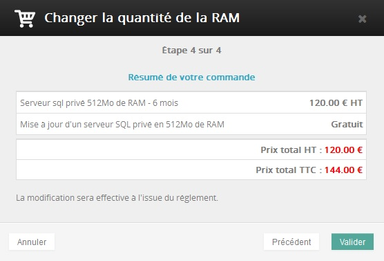{.thumbnail}

- Será redirigido a la orden de pedido para que abone el importe del cambio, que se hará efectivo en las próximas horas.


Si dispone actualmente de un servidor SQL Privado gratis con su web hosting Performance, el servidor SQL Privado dejará de ser gratis al cambiar de plan.


## Crear un usuario
Para utilizar un servidor SQL Privado, debe crear usuarios que tendrán derechos específicos para conectarse a una base de datos. 

Para ello, acceda a «Usuarios y permisos» y haga clic en «Añadir un usuario».

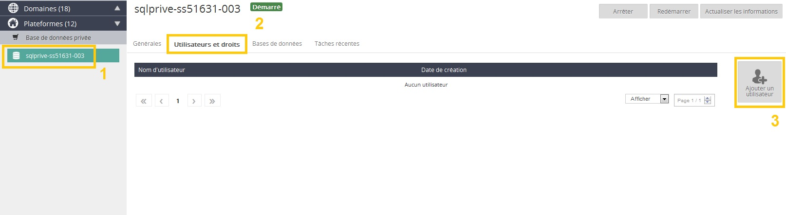{.thumbnail}
A continuación, indique un «Nombre de usuario» y una «Contraseña», y haga clic en «Aceptar».

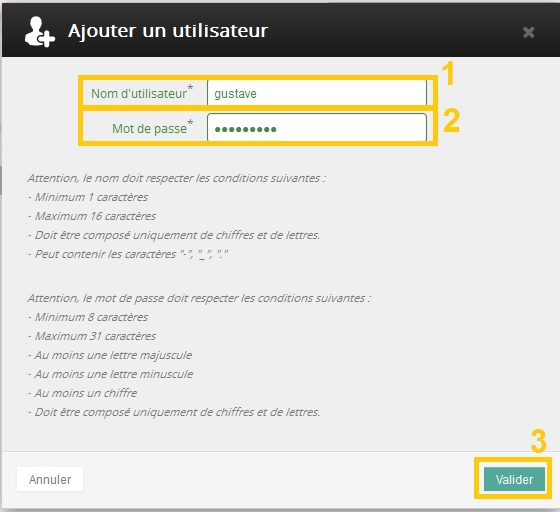{.thumbnail}
Se mostrará el siguiente mensaje en la parte superior de su área de cliente:

{.thumbnail}
En la pestaña «Usuarios y permisos» podrá comprobar que se está creando un usuario. Este proceso puede tardar algunos minutos ya que la sincronización no se realiza en tiempo real. A veces, para ver la información actualizada, será necesario hacer clic en «Actualizar la información». Deberá esperar unos 5 o 10 minutos para actualizar la página.

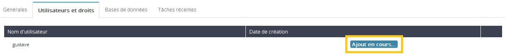{.thumbnail}


## Crear una base de datos
Para crear una base de datos, seleccione el nombre de su servidor en la columna de la izquierda (1) y haga clic en «Bases de datos» (2) > «Añadir una base de datos» (3).

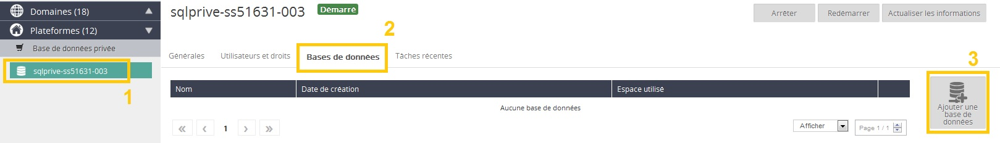{.thumbnail}
A continuación, indique el «Nombre de la BD» (1), asegúrese de que el nombre cumple con los criterios indicados y haga clic en «Aceptar» (2).

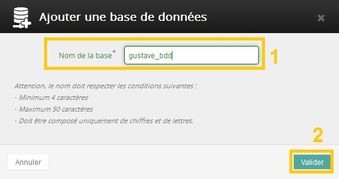{.thumbnail}
Se mostrará el siguiente mensaje en la parte superior de su área de cliente:

{.thumbnail}
Este proceso puede tardar algunos minutos ya que la sincronización no se realiza en tiempo real. A veces, para ver la información actualizada, será necesario hacer clic en «Actualizar la información». Deberá esperar unos 5 o 10 minutos para actualizar la página.


## Eliminar una base de datos
Para eliminar una base de datos de su servidor SQL Privado, seleccione su servidor SQL Privado en la columna de la izquierda (1) y haga clic en «Bases de datos» (2). A continuación, haga clic en el engranaje que aparece a la derecha de su base y seleccione «Eliminar la BD» (3).

{.thumbnail}
Para eliminar una base de datos en un servidor SQL Privado, no es necesario comprobar el contenido de dicha base. Así pues, la base se eliminará aunque tenga datos registrados. Le recomendamos que [realice una copia de seguridad](#save_bdd) antes de eliminar la base de datos.
A continuación, haga clic en «Aceptar».

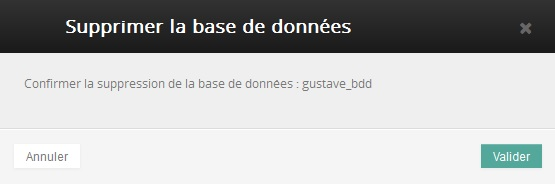{.thumbnail}
Se mostrará el siguiente mensaje y la base de datos se eliminará. Este proceso puede tardar algunos minutos ya que la sincronización no se realiza en tiempo real. A veces, para ver la información actualizada, será necesario hacer clic en «Actualizar la información». Deberá esperar unos 5 o 10 minutos para actualizar la página.

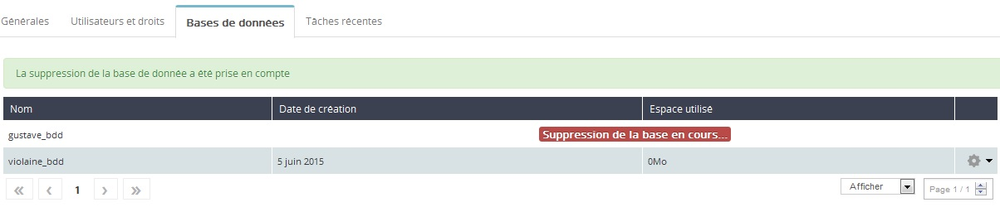{.thumbnail}


## Gestión de los permisos de usuario
Para gestionar los permisos de cada usuario, haga clic en «Usuarios y permisos». 

A continuación, haga clic en el engranaje que aparece a la derecha del usuario que desea editar y seleccione «Editar los permisos».

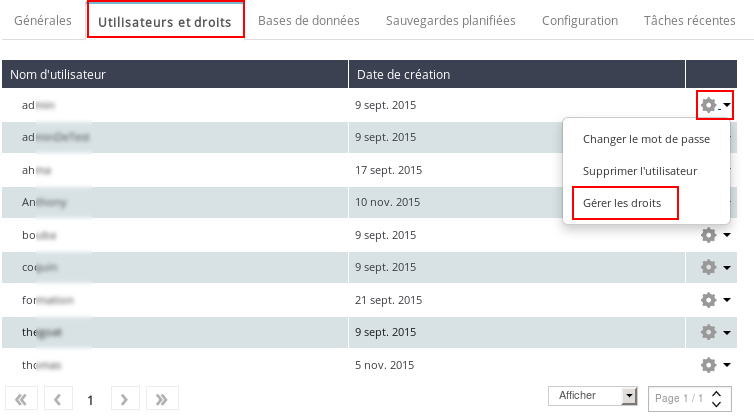{.thumbnail}
En la columna de la izquierda se muestran las bases de datos de su servidor SQL Privado. 


- Estos son los permisos que podrá editar: 

Administrador: El usuario posee los mismos permisos que en «Lectura y escritura» y puede gestionar él mismo dichos permisos. 

Lectura y escritura: El usuario puede realizar operaciones de tipo SELECT, DELETE y UPDATE, por ejemplo.

Lectura: El usuario tan solo puede realizar operaciones de tipo SELECT.

Ninguno: El usuario no posee ningún permiso.


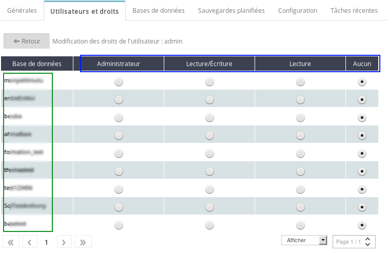{.thumbnail}
La edición de los permisos del usuario puede tardar algunos minutos.


## Conectarse a una base de datos de SQL Privado
Si desea conectarse a su base de datos, deberá acceder a través del enlace que encontrará en la sección «Generales» > «Administración de la base de datos».

{.thumbnail}
Mediante este enlace accederá a la página de conexión de phpMyAdmin. 

1. Servidor: Indique el nombre de su servidor host, tal y como se indica en el cuadro verde inferior. 

Para los servidores Legacy, debe indicar la dirección IP de su servidor tal y como aparece en el apartado «Conexión SQL». 

2. Usuario: Indique el nombre de usuario tal y como se indica en el apartado «Usuarios y permisos» de su área de cliente. 

3. Contraseña: Introduzca la contraseña asociada a este usuario.

4. Puerto: Introduzca el puerto que encontrará en el apartado «Generales».

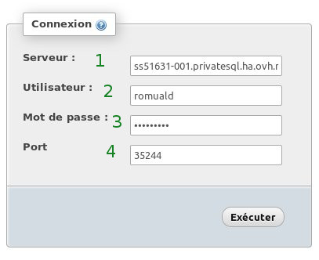{.thumbnail}
Encontrará el nombre del servidor (nombre del host) y el puerto en su área de cliente, en el apartado «Conexión SQL».

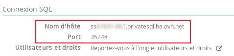{.thumbnail}
Si se ha conectado correctamente, accederá a la página de phpMyAdmin.

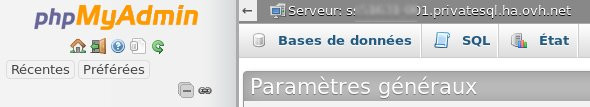{.thumbnail}

## En caso de error 1045
Si aparece el siguiente mensaje de error (#1045), significa que las claves de acceso no son correctas. Compruebe que el nombre de usuario o la contraseña son correctas.

{.thumbnail}

## En caso de error 2005
Si aparece el siguiente mensaje de error (#2005), deberá comprobar el nombre del servidor y si está operativo.

{.thumbnail}


## Realizar una copia de seguridad de una base de datos
Para realizar la copia de seguridad de una base de datos, acceda a la sección «Bases de datos», haga clic en el engranaje que se muestra a la derecha de la base de datos y seleccione «Realizar una copia de seguridad ahora».

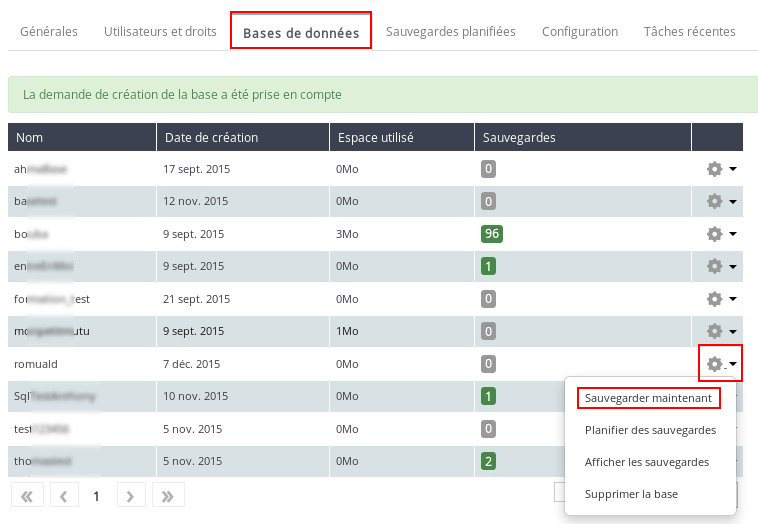{.thumbnail}
Esta copia de seguridad se hará efectiva en los próximos minutos.
Las copias de seguridad se conservan durante 30 días. Trascurrido este período, se eliminarán de forma automática.


## Programar una copia de seguridad de una base de datos
Para programar una copia de seguridad automática de una base de datos en su servidor SQL Privado, acceda a la sección «Bases de datos», haga clic en el engranaje que se muestra a la derecha de la base de datos y seleccione «Programar las copias de seguridad».

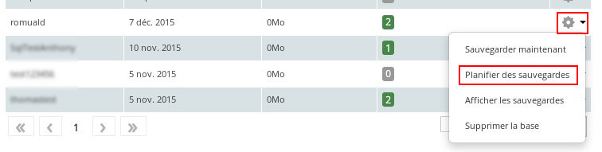{.thumbnail}
A continuación, podrá activar las notificaciones por correo electrónico.

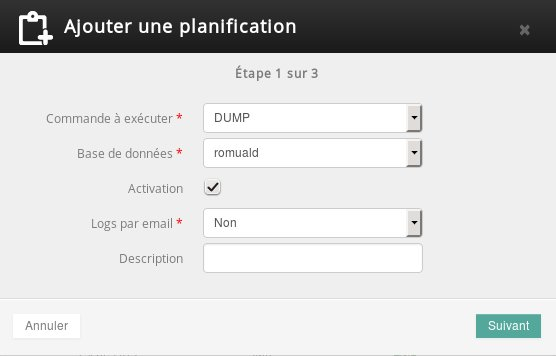{.thumbnail}
En la Etapa 2, podrá seleccionar la periodicidad de la tarea.

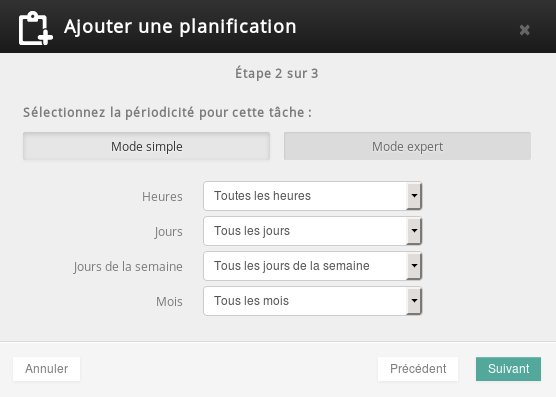{.thumbnail}
En la Etapa 3, podrá comprobar los parámetros definidos para esta copia de seguridad programada.

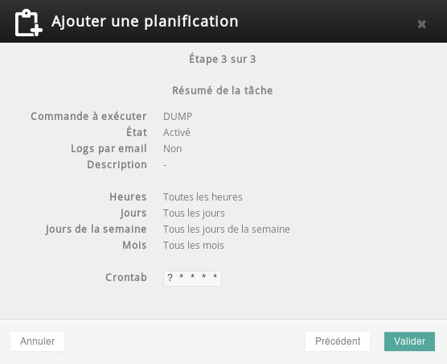{.thumbnail}
Podrá consultar la lista de las copias de seguridad programadas en la sección «Copias de seguridad programadas».

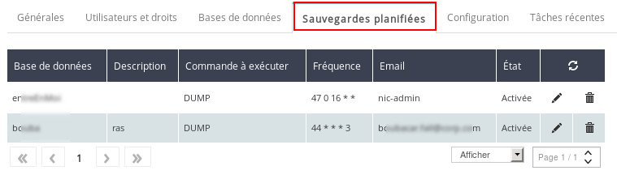{.thumbnail}


## Descargar una copia de seguridad
Para descargar una copia de seguridad, haga clic en la cifra que se muestra en la columna «Copias de seguridad». Esta cifra corresponde al número de copias de seguridad disponibles para su base de datos.

{.thumbnail}
A continuación, se muestra la lista de copias de seguridad disponibles. Haga clic en el icono que aparece en el recuadro rojo para descargar su copia de seguridad.

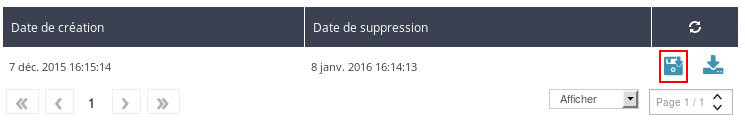{.thumbnail}


## Restaurar una copia de seguridad
Para restaurar una copia de seguridad, haga clic en la cifra que se muestra en la columna «Copias de seguridad». Esta cifra corresponde al número de copias de seguridad disponibles para su base de datos.

{.thumbnail}
A continuación, se muestra la lista de copias de seguridad disponibles. Haga clic en el icono que aparece en el recuadro rojo para restaurar su copia de seguridad.

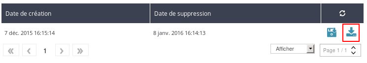{.thumbnail}
La restauración se hará efectiva en los próximos minutos. La duración del proceso dependerá del tamaño de la copia de seguridad seleccionada.


## Exportar una base de datos desde phpMyAdmin
Para exportar su base de datos directamente desde phpMyAdmin, deberá conectarse previamente siguiendo las instrucciones que se indican más arriba. 

Haga clic en la base de datos que desea exportar y, a continuación, seleccione el botón «Exportar».

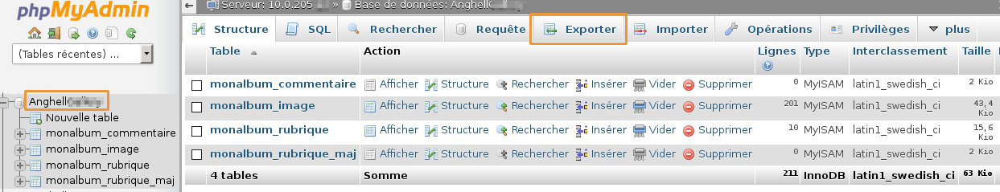{.thumbnail}
Existen dos formas de exportación. Si no tiene ninguna necesidad específica, le aconsejamos que seleccione el modo «Rápido» en formato SQL.

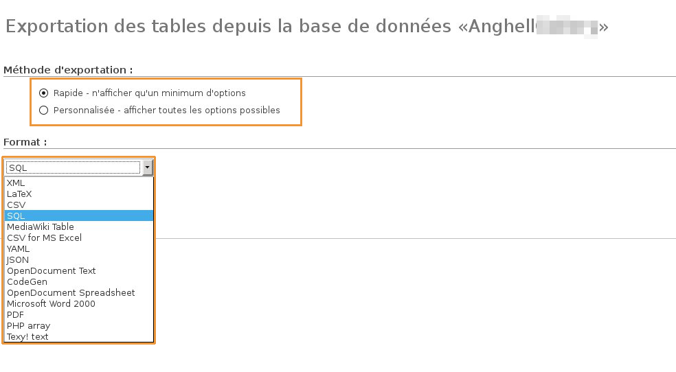{.thumbnail}


## Importar una base de datos desde phpMyAdmin
Para importar su base de datos directamente desde phpMyAdmin, deberá conectarse previamente siguiendo las instrucciones que se indican más arriba. 

Una vez conectado a phpMyAdmin, seleccione su base de datos haciendo clic en su nombre. 

Haga clic en la sección «Importar» > «Seleccionar archivo» para seleccionar el archivo de la copia de seguridad. 

Atención: El archivo no puede superar los 16 MB.

Haga clic en «Continuar» para lanzar la importación.

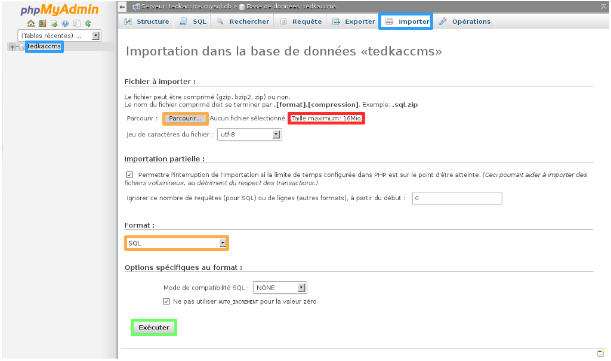{.thumbnail}


## ¿Cómo exportar mi base de datos en línea de comandos mediante SSH?

- Export (Docker):

```
mysqldump --host=servidor_sql --user=nombre_de_la_base --port=Puerto --password=contraseña nombre_de_la_base > nombre_de_la_base.sql
```


- Export (Legacy):

```
mysqldump --host=servidor_sql --user=nombre_de_la_base --password=contraseña
nombre_de_la_base > nombre_de_la_base.sql
```


## ¿Cómo importar mi base de datos en línea de comandos mediante SSH?

- Import (Docker):

```
cat nombre_de_la_base.sql | mysql --host=servidor_sql --user=nombre_de_la_base --port=Puerto --password=contraseña nombre_de_la_base
```


- Import (Legacy):

```
cat nombre_de_la_base.sql | mysql --host=servidor_sql --user=nombre_de_la_base --password=contraseña nombre_de_la_base
```


## ¿Cómo exportar mi base de datos desde un archivo PHP?

- Export (Docker):

```
<?
echo "Guardando su base de datos...";
system("mysqldump --host=servidor_sql --user=nombre_de_la_base --port=Puerto --password=contraseña nombre_de_la_base > nombre_de_la_base.sql");
echo "Hecho. Puede recuperar la base por FTP";
?>
```


- Export (Legacy):

```
<?
echo "Guardando su base de datos...";
system("mysqldump --host=servidor_sql --user=nombre_de_la_base --password=contraseña nombre_de_la_base > nombre_de_la_base.sql");
echo "Hecho. Puede recuperar la base por FTP";
?>
```


## ¿Cómo importar mi base de datos desde un archivo PHP?

- Import (Docker):

```
<?php
echo "Restaurando su base de datos...
<br>";
system("cat nombre_de_la_base.sql | mysql --host=servidor_sql --user=nombre_de_la_base --port=Puerto --password=contraseña nombre_de_la_base");
echo "Hecho. Su base de datos ya está en el alojamiento";
?>
```


- Import (Legacy):

```
<?php
echo "Restaurando su base de datos...
<br>";
system("cat nombre_de_la_base.sql | mysql --host=servidor_sql --user=nombre_de_la_base --password=contraseña nombre_de_la_base");
echo "Hecho. Su base de datos ya está en el alojamiento";
?>
```


## Servidor de tipo Legacy
Acceda a [este enlace](#type_srv) para encontrar su tipo de servidor SQL Privado.

## Conexión FTP en un SQL Privado

- Net2Ftp


Para conectarse en FTP en su servidor SQL Privado de tipo Legacy a través de Net2FTP, haga clic en el siguiente enlace: 

[http://sqlprive.ovh.net/ftp](http://sqlprive.ovh.net/ftp)

En el campo «Username» introduzca el nombre del servidor SQL Privado. A continuación, introduzca la contraseña FTP del SQL Privado. 
Si deja el campo «Initial directory» en blanco, accederá a la raíz del espacio FTP.

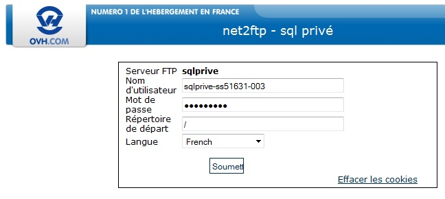{.thumbnail}

- Conexión a través de un cliente FTP (FileZilla) 


En el nombre del host deberá indicar «sqlprive.ovh.net». En el nombre de usuario deberá indicar la referencia de su SQL Privado en forma de «sqlprive-XXXX-0XX» e introducir la contraseña.

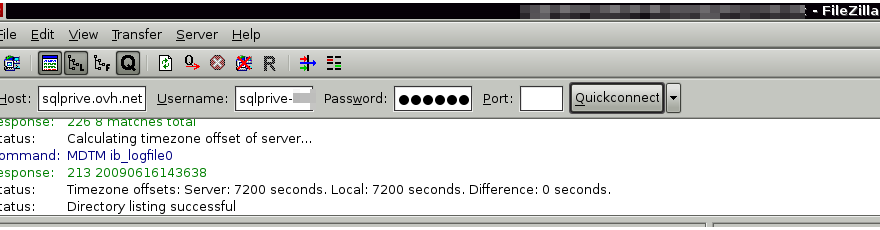{.thumbnail}

## Modificar la contraseña FTP
Para modificar la contraseña FTP de su servidor SQL Privado Legacy, haga clic en la sección «Generales» > «Contraseña del FTP» > «Cambiar la contraseña». 

A continuación, reinicie su servidor. El cambio se hará efectivo en los próximos minutos.

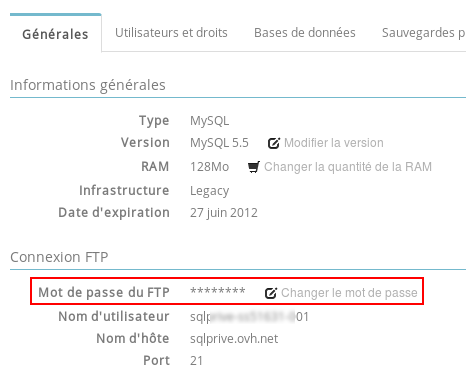{.thumbnail}

## Configurar el archivo «my.cnf»
Para configurar el archivo «my.cnf» en los antiguos servidores SQL Privados de tipo Legacy, deberá conectarse en FTP y editar el archivo que desee.

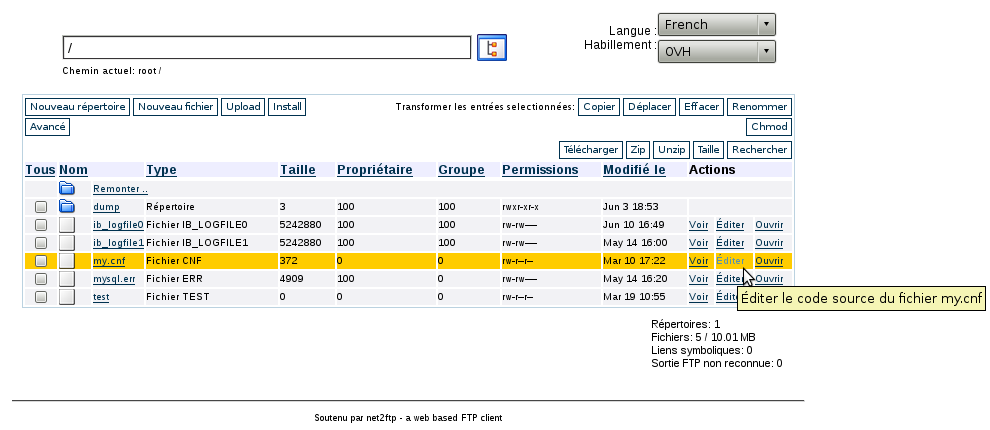{.thumbnail}
Una vez realizados los cambios, guarde el archivo y reinicie.

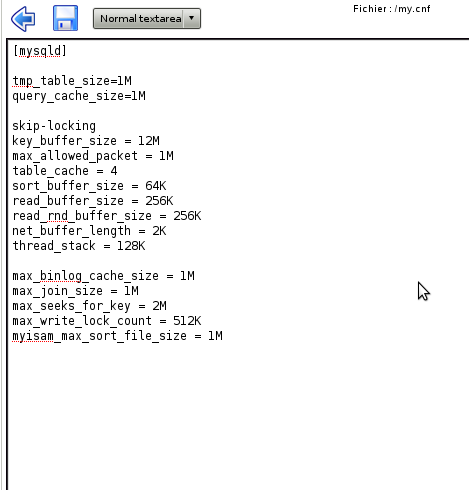{.thumbnail}


## Servidor de tipo Docker
Haga clic en la pestaña «Configuración». En el apartado «Configuración general de mi SQL», encontrará la configuración actual definida en el archivo «my.cnf». 
Puede modificar esta configuración haciendo clic en «Editar».

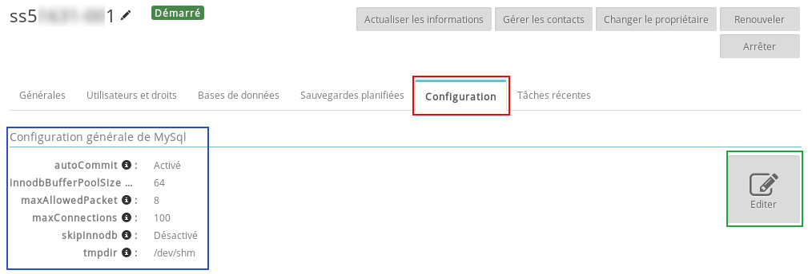{.thumbnail}
Realice los cambios necesarios y, a continuación, haga clic en «Aceptar».

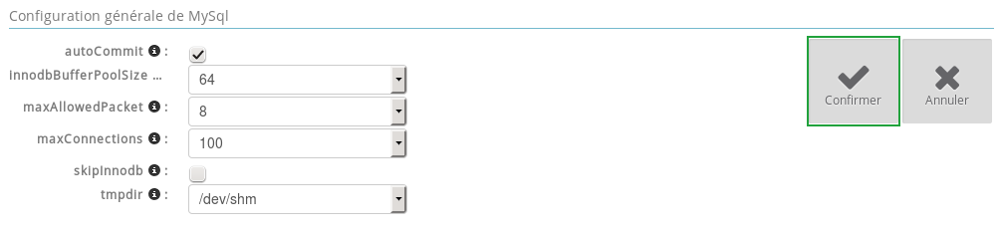{.thumbnail}

## Atención:
Deberá reiniciar el servidor para registrar los cambios.


## Acceso a los logs del servidor

## ¿Qué son los Slow Logs?
Estos logs contienen solicitudes SQL demasiado largas. 


- Servidor de tipo Legacy: 

Para obtener este tipo de logs, deberá añadir las líneas siguientes en el archivo «my.cnf»: 


```
slow_query_log = 1
slow_query_log_file = /home/mysql/slow.log
```


Puede acceder a los logs de su servidor SQL Privado en el archivo «sqlprivado.log» que se encuentra en el directorio «home/mysql/» del FTP de su SQL Privado. 

Le recomendamos que vacíe o elimine este archivo regularmente para evitar que su SQL Privado se sobrecargue innecesariamente. 


- Servidor de tipo Docker: 

Para obtener este tipo de logs, deberá acceder a la raíz de su servidor FTP del SQL Privado Docker mediante conexión SFTP. 

Si necesita ayuda, consulte nuestra guía: 
[]({legacy}1380)


## Optimizar su base de datos
Deberá procurar que el rendimiento de su base de datos sea óptimo. Por rendimiento, entendemos el hecho de que la información que contiene su base de datos llegue lo antes posible al script que la solicite. 

Para ello, necesita una base de datos bien estructurada y optimizada. Veremos a continuación cómo optimizar la base de datos.

## Indexar la base de datos
Para aumentar la velocidad de las búsquedas en cada consulta, hay que indexar los campos que se utilizan en las cláusulas WHERE. 

Por ejemplo, si realiza con frecuencia una búsqueda de personas en una ciudad determinada, hay que indexar el campo «ciudad» con la siguiente consulta: 


```
ALTER TABLE `test` ADD INDEX ( `ciudad` );
```


## Limpiar la base de datos
Si hay datos que ya no consulta, ¿por qué no archivarlos? Las tablas serán más ligeras y las búsquedas se realizarán con mayor rapidez.

## Limitar los resultados
Limitar el número de resultados visualizados (por ejemplo, a 10 por página) con la cláusula LIMIT de la consulta SQL.

## Agrupar las consultas
Agrupar las consultas al principio del script de esta forma: 


```
conexion_BD
consulta1
consulta2
...
desconexion_BD
Visualización...
Tratamiento de los datos
Boucles...
Visualizacion...
...
```


## Optimizar utilizando la caché
Si hay elementos que se obtienen de la base de datos y que no cambian, guárdelos en caché. 

Este truco reducirá drásticamente los accesos a la base de datos y acelerará la carga del sitio web.

También puede utilizar la caché de sesión, guardando los resultados de las consultas en variables de sesión. De ese modo, cuando deba realizar una consulta igual, ya no tendrá que ejecutarla y, en su lugar, podrá recuperar las variables de sesión.

## Obtener solo los datos útiles
Compruebe que, en las consultas SQL, solo selecciona lo que realmente necesita y, sobre todo, que no ha olvidado las conexiones entre las tablas.

Por ejemplo:


```
(where tabla1.campo = tabla2.campo2)
```


## Evitar las opciones que consumen muchos recursos
Por ejemplo, evite utilizar HAVING que ralentiza las consultas, así como GROUP BY, a menos que sea necesario.


## Cambiar la versión MySQL
Si desea conocer la versión MySQL de su servidor SQL Privado, deberá acceder a la sección «Generales». 

La versión que utiliza actualmente se muestra en el apartado «Versión» de la «Información general». 

Si desea modificar esta versión, haga clic en «Cambiar la versión».

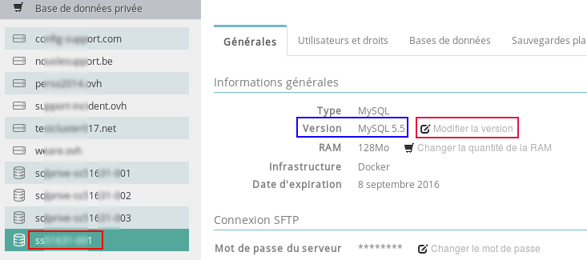{.thumbnail}

- Antes de migrar a una versión superior, asegúrese de que su base de datos es compatible con la versión seleccionada. 
- El cambio de versión se hará efectivo en los próximos minutos.


Si ya utiliza la versión 5.5 de MySQL, no podrá cambiar de versión ya que se trata de la última versión propuesta.

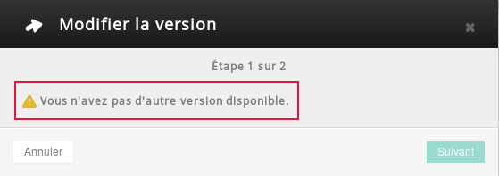{.thumbnail}


## ¿Mi servidor SQL Privado es de tipo Legacy o Docker?
Los antiguos servidores SQL Privado son de tipo Legacy (por ejemplo, «sqlprive-kx11111-009»), los nuevos son de tipo Docker (por ejemplo, «sx11111-012»).

Son dos infraestructuras diferentes.

{.thumbnail}


## ¿Por qué se produce un error de fecha errónea en mi servidor SQL Privado?
Se trata de un problema oficial de la versión 5.1.31 de Mysql. Para solucionar este problema, deberá [migrar](#version) a la version 5.5.14.


## ¿Puedo conectarme en root a mi servidor SQL Privado?
Solo es posible en los servidores SQL Privado de tipo Legacy.


## ¿Cómo puedo saber el tamaño de una de mis bases de datos?
Esta información se muestra en la sección «Bases de datos» > «Espacio utilizado».

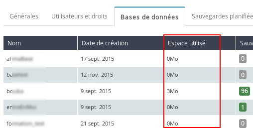{.thumbnail}


## ¿Cómo eliminar una base de datos o un usuario?
Acceda a la sección «Usuarios y permisos» o en «Bases de datos», haga clic en el engranaje y seleccione «Eliminar la BD».

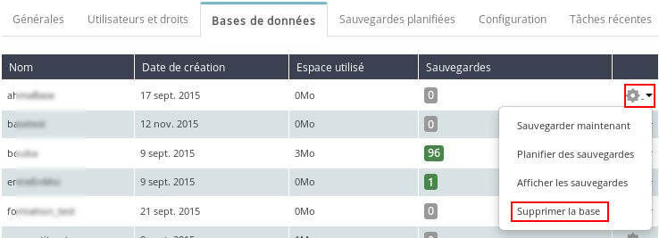{.thumbnail}


## ¿Cómo puedo saber la RAM que consume actualmente mi servidor?
En el caso de los servidores SQL Privado de tipo Docker, puede encontrar esta información en la pestaña «Métricas» de su área de cliente.

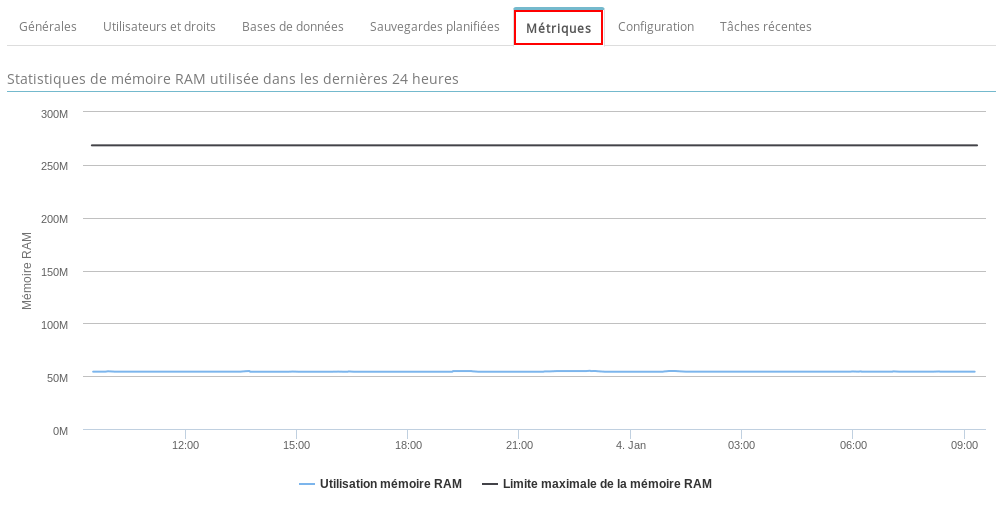{.thumbnail}
No es posible acceder a esta información con un servidor de tipo Legacy.


## ¿Cómo visualizar los logs en mi servidor?
Por ahora no es posible acceder a esta información desde su área de cliente.


## ¿Puedo reiniciar mi servidor SQL Privado en CRON?
Este servicio no está disponible por ahora.


## ¿Puedo duplicar una base de datos?
Por ahora no es posible acceder a este servicio desde su área de cliente.


## ¿Las copias de seguridad de mi base de datos se almacenan en mi servidor SQL Privado?
Las copias de seguridad de su base no se almacenan en su servidor SQL Privado, ya que este último no consume espacio del usuario. Se almacenan durante 30 días en nuestra infraestructura.


## ¿Por qué aparece el mensaje «Too many connections» en mi sitio web?
Porque ha superado el número de conexiones simultáneas de su SQL Privado. Puede aumentar el número máximo de conexiones [modificando su servidor](#config).

