Le service SQL Privé a été conçu pour les besoins importants ou spécifiques sur les bases de données. Avec un serveur SQL Privé, vous disposez de votre propre serveur de base de données tout en bénéficiant de la tranquillité d'un hébergement géré par OVH. Vous disposez de ressources réservées à votre seul usage et non de ressources partagées.

- Consultez l'offre depuis [notre
site](https://www.ovhcloud.com/fr/web-hosting/options/start-sql/){.external} .


## Généralités
**Qu'est ce que l'offre SQL Privé ?**

Le service SQL Privé a été conçu pour les clients ayant des besoins importants ou spécifiques pour leurs bases de données. Avec SQL Privé, vous disposez de votre propre serveur SQL tout en bénéficiant de la tranquillité d'un hébergement mutualisé géré par OVH.


> [!warning]
>
> Attention : Le serveur SQL Privé est compatible uniquement avec les hébergements mutualisés OVH.
> 

**Les avantages du SQL Privé :**

- Nombre de bases illimité.
- Jusqu'à 200 connexions simultanées
- Choix de la version SQL et changement vers une version supérieur possible à tout moment
- Configuration du serveur MySQL adaptable à vos besoins
- Possibilité de créer des comptes privilégiés pouvant accéder à plusieurs bases de données

**Ressources réservées**

Avec votre serveur SQL Privé, vous disposez de ressources réservées à votre seul usage et non de ressources partagées comme c'est le cas sur les serveurs mutualisés.

Par conséquent, quoi que vous fassiez, vous ne risquez pas de gêner les autres utilisateurs. La taille des bases de données n'est pas limitée. Vous pouvez ainsi choisir le meilleur compromis entre le volume de données et les performances de votre serveur SQL.


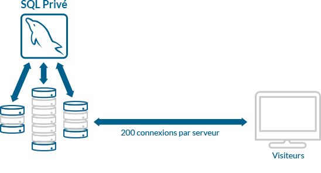{.thumbnail}

**Choisissez votre systèmes de gestion de base de données**

Vous pouvez choisir la version du serveur SQL dont vous avez besoin au moment de la commande parmi la liste des versions disponibles. Si vous souhaitez évoluer par la suite, vous pourrez le faire d'un simple clic dans votre manager et changer de version SQL vers une version supérieur si disponible.

**Sauvegardez vos données automatiquement**

Vos bases de données sont sauvegardées automatiquement chaque jour, et les sauvegardes sont disponibles pendant 30 jours glissants !

Vous pouvez également sauvegarder vos bases manuellement en quelques clics ! Vous pourrez tout aussi facilement les restaurer en cas de problème et ainsi faire vos mises à jour l'esprit tranquille.

**Principe de fonctionnement**

Votre SQL Privé dispose de ses propres ressources (processeurs, mémoire vive, ...), attribuées par le système principal. Ainsi, il n'y a aucune gêne entre les utilisateurs.


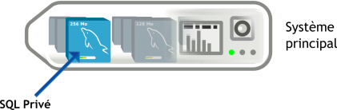{.thumbnail}


## Gerer mon offre SQL privé

### Commander une offre SQL privé
Pour commander un SQL Privé, il faut vous rendre dans votre espace client. Cliquez ensuite sur **"Hébergements"**, puis **"Commander des bases de données"**.


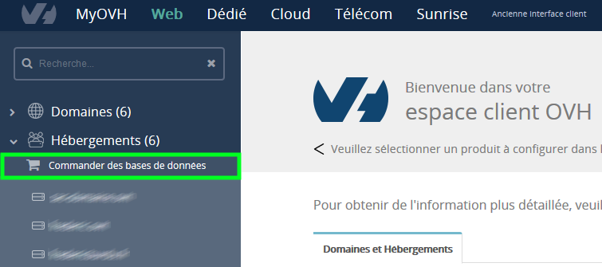{.thumbnail}

- Sélectionnez ensuite **"SQL Privé"**


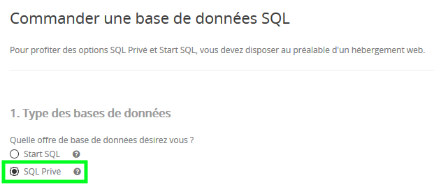{.thumbnail}

Il vous faudra ensuite choisir plusieurs choses :

- **Version du serveur** : MySQL, PostgreSQL ou MariaDB.
- **RAM** : La quantité de RAM voulue pour votre serveur
- **Hébergement à utiliser** : Choisissez pour quel hébergement OVH le serveurs SQL sera utilisé


> [!warning]
>
> Attention :
> il n'est pas possible d'utiliser un serveur SQL Privé du datacentre de Gravelines
> avec un hébergement installé dans le datacentre de Paris, et inversement.
> Vous pouvez retrouver cette information à cette rubrique.
> 


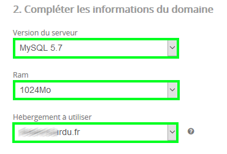{.thumbnail}

Si vous désirez utiliser votre SQL Privé avec un autre hébergement mutualisé OVH que ceux gérés sur votre espace client, il vous faudra choisir **"Autre"** dans la rubrique hébergement. Vous devrez ensuite choisir le **"Datacentre"** d'installation du SQL Privé.


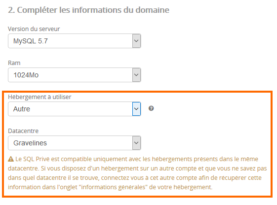{.thumbnail}

Choisissez ensuite la **période d'utilisation** du SQL Privé, **acceptez les contrats**, et **générez votre bon de commande** afin de le régler.


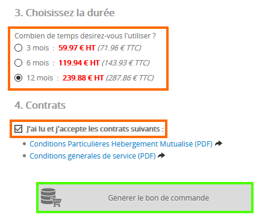{.thumbnail}


### Activer mon SQL privé offert
Lorsque vous disposez d'un hébergement de type Performance, vous avez la possibilité d'activer gratuitement un serveur SQL Privé de 256 Mo de RAM (compris dans l'offre). Pour l'activer, il faut vous rendre dans votre espace client et cliquer sur le nom de votre hébergement performance.


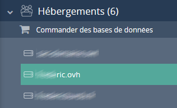{.thumbnail}

Vous pouvez constater qu'il n'y a actuellement aucun serveur SQL Privé associé à cet hébergement. Il suffit de cliquer sur `Activer`{.action} ans un premier temps.


{.thumbnail}

Vous pouvez de cette manière cliquer sur `Valider`{.action} et l'activation sera ensuite effective sous quelques minutes.


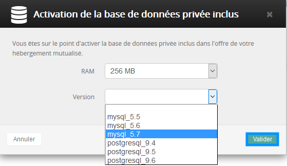{.thumbnail}


### Modifier l'offre de mon serveur SQL privé
Pour modifier l'offre de votre serveur SQL Privé, vous devez pour cela cliquer sur le SQL Privé concerné dans la rubrique **"Hébergement" (1)**, puis sur l'onglet **"Informations générales" (2)** qui est affiché par défaut. Il suffira ensuite de cliquer sur **"Changer la quantité de la RAM" (3)** afin d'accéder à la commande de ce basculement.


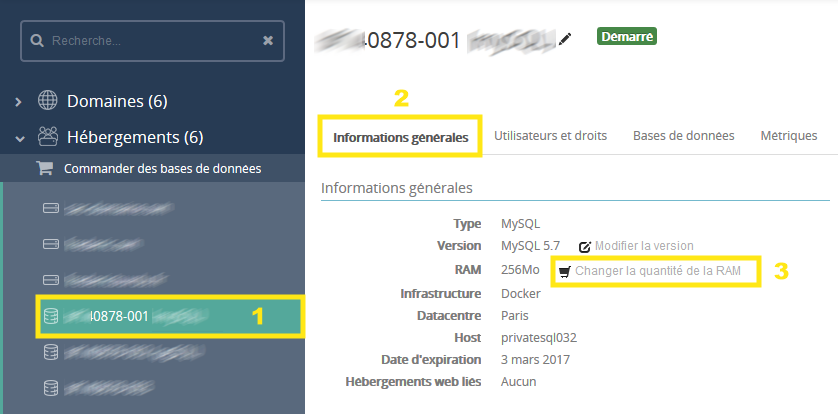{.thumbnail}

Vous devez ici choisir la quantité de RAM souhaitée puis cliquez sur le bouton `Suivant`{.action}. Dans cet exemple, le serveur SQL Privé est actuellement en 256 Mo de RAM, le basculement vers 512 Mo, 1024 Mo ou 2048 Mo est donc proposé.


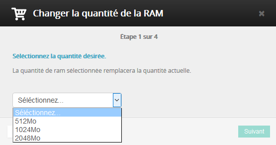{.thumbnail}

Vous pouvez ici choisir la durée souhaitée entre 3, 6 et 12 mois.


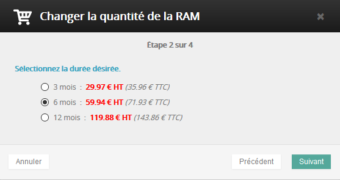{.thumbnail}


> [!primary]
>
> Un report au prorata sera effectué s'il vous reste quelques mois avant
> l'expiration. Ce prorata sera basé sur la date d'expiration du serveur SQL
> Privé et non pas sur celle du bon de commande.
> 

Il vous suffit ici de prendre connaissance des contrats, de cocher la case **"J'accepte les contrats" (1)** puis de cliquer sur `Suivant`{.action}.


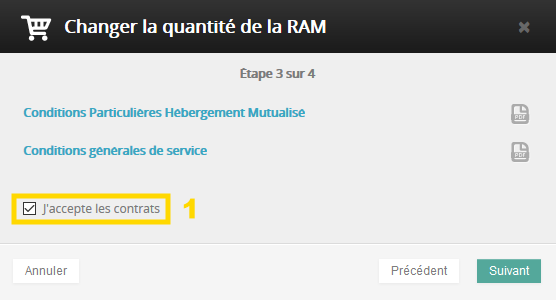{.thumbnail}

La dernière étape résume simplement votre commande, il vous suffit donc de cliquer sur `Valider`{.action}.


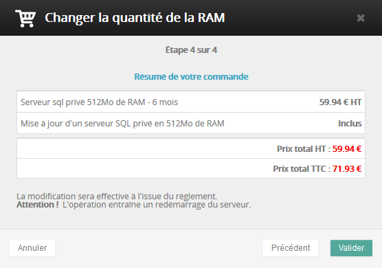{.thumbnail}

- Vous serez redirigé vers le bon de commande afin de régler cette modification. Celle-ci sera effective sous quelques heures.


> [!warning]
>
> Attention : si vous disposez actuellement d'un serveur SQL Privé gratuit grâce à votre
> hébergement Performance, la modification de l'offre vous fera perdre sa
> gratuité.
> 


## Creer mes bases et mes utilisateurs

### Creer un utilisateur
- Pour utiliser un serveur SQL Privé, il est nécessaire de créer des utilisateurs qui auront des droits spécifiques pour se connecter à une base de données.

Vous devez pour cela vous rendre dans l'onglet **"Utilisateurs et droits" (1)** et enfin cliquer sur **"Ajouter un utilisateur" (2)**.


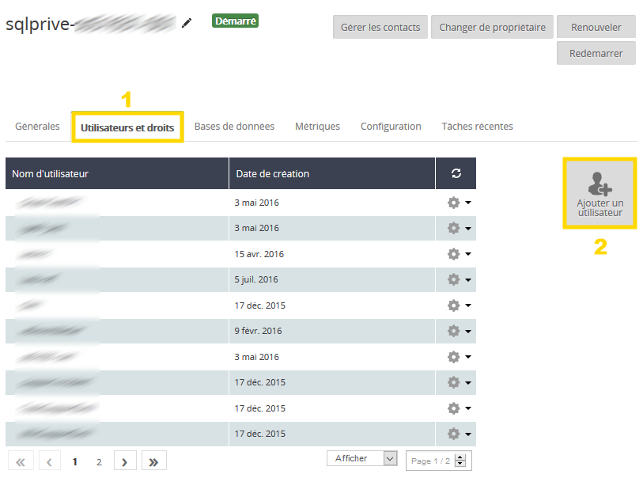{.thumbnail}

Il vous sera ensuite demandé de renseigner un **nom d'utilisateur (1)** et un **mot de passe (2)** puis de cliquer sur `Valider`{.action} **(3)**.


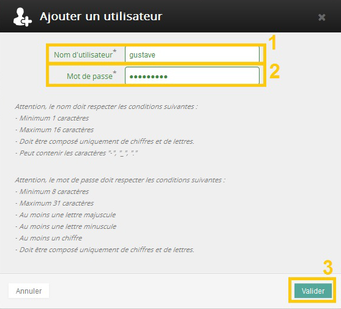{.thumbnail}

Vous pourrez voir dans l'onglet **"Utilisateurs et droits"** que l'ajout de l'utilisateur est en cours.


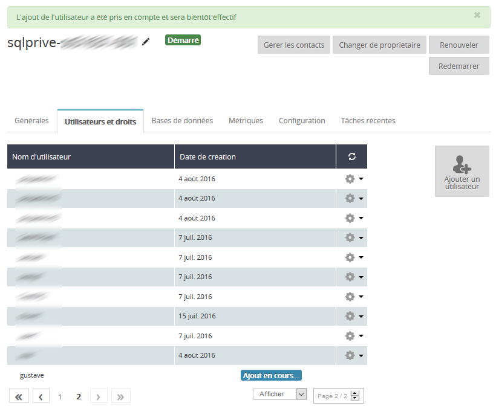{.thumbnail}

La création pouvant prendre quelques minutes, il vous est possible de cliquer sur le bouton `Actualiser les informations`{.action} afin de lancer un rafraîchissement des informations :


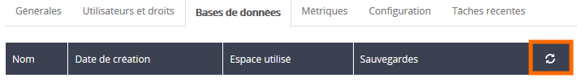{.thumbnail}


### Creer une base de donnees
Pour créer une base de données, vous devez cliquer sur l'onglet **"Bases de données" (1)** et enfin sur **"Ajouter une base de données" (2)**.


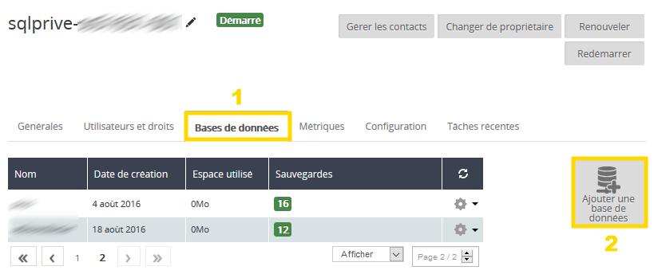{.thumbnail}

Il faut ensuite renseigner le **nom de la base de données (1)** en respectant les critères indiqués. Il est également possible de créer un utilisateur en cochant la **case correspondante (2)**. Remplissez ensuite les **éléments demandés (3)**, puis cliquez sur `Valider`{.action} **(4)**.


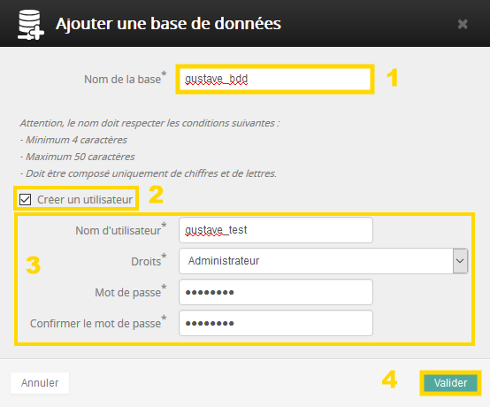{.thumbnail}

Le message suivant apparaît ensuite en haut de votre espace client :


{.thumbnail}

La création pouvant prendre quelques minutes, il vous est possible de cliquer sur le bouton `Actualiser les informations`{.action} afin de lancer un rafraîchissement des informations :


{.thumbnail}


### Supprimer une base de donnees
Pour supprimer une base de données sur votre serveur SQL Privé, vous devez vous rendre sur l'onglet **"Bases de données" (1)** puis cliquer sur la **roue crantée (2)** à droite de votre base et enfin sur `Supprimer la base`{.action} **(3)**.


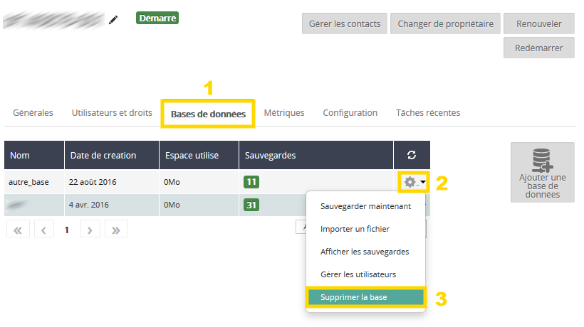{.thumbnail}


> [!warning]
>
> Attention : pour supprimer une base de données sur un serveur SQL Privé, il n'y a pas de
> vérification sur le contenu de la base. Celle-ci sera donc supprimée même si
> des données y sont encore enregistrées, il est donc recommandé de réaliser
> une sauvegarde de votre côté avant toute suppression.
> 

Il vous suffit ensuite de valider l'opération.


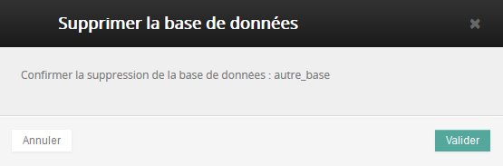{.thumbnail}

Le message suivant apparaîtra ensuite et la base sera ainsi supprimée.


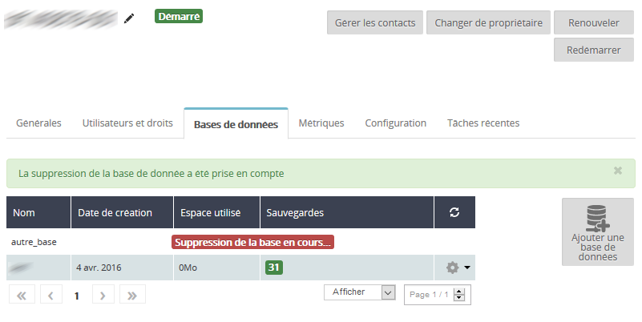{.thumbnail}

La suppression pouvant prendre quelques minutes, il vous est possible de cliquer sur le bouton `Actualiser les informations`{.action} afin de lancer un rafraîchissement des informations :


{.thumbnail}


## Utiliser mes bases de donnees

### Gestion des droits utilisateurs
Pour gérer les droits de chaque utilisateurs, cliquez sur l'onglet **"Utilisateurs et droits"**.

Il suffit ensuite de cliquer sur la **"roue crantée"** à droite de l'utilisateur concerné puis de cliquer sur `Gérer les droits`{.action}.


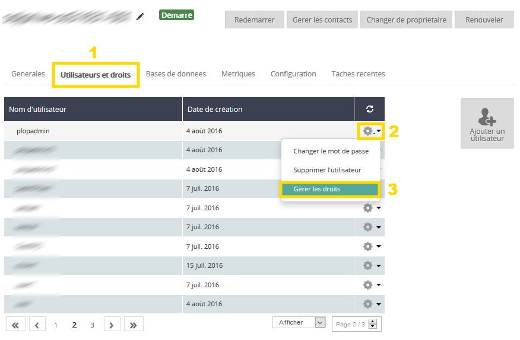{.thumbnail}

Vous retrouverez dans la colonne de gauche la liste **des base de données** présentes sur votre serveur SQL Privé.

Voici la description des 3 droits proposés :

- **Administrateur :** Autorisation des requêtes de type **Select / Insert / Update / Delete / Create / Alter / Drop**
- **Lecture / Ecriture :** Autorisation des requêtes de type **Select / Insert / Update / Delete**
- **Lecture :** Autorisation des requêtes de type **Select**
- **Aucun :** Aucun droit sur la base


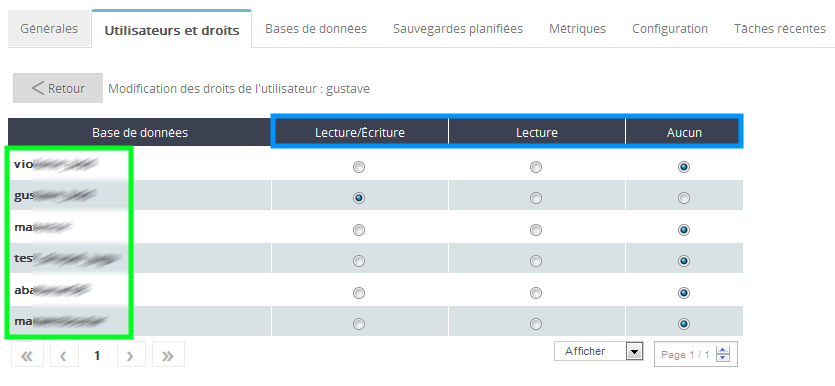{.thumbnail}


> [!primary]
>
> La modification des droits d'un utilisateur peut prendre quelques minutes.
> 


### Se connecter a une base de donnees MySQL ou MariaDB par phpMyAdmin
Pour vous connecter à votre base de données, vous trouverez le lien d'accès dans le paragraphe **"Administration de la base de données"** de l'onglet **"Informations générales**".


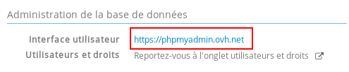{.thumbnail}

Vous arrivez de cette manière sur la page de connexion de phpMyAdmin.


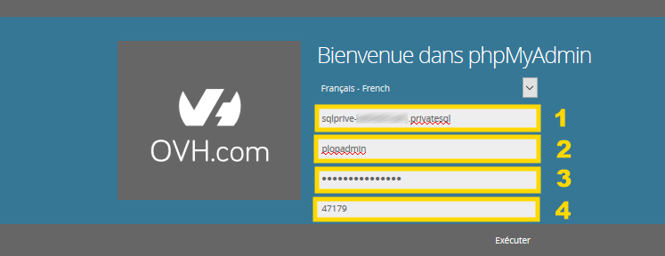{.thumbnail}

**1. Serveur :** Vous devez renseigner le nom d'hôte de votre serveur comme indiqué sur l'image ci-dessous.

**2. Utilisateur :** Il s'agit ici du nom d'utilisateur défini dans l'onglet **"Utilisateurs et droits"** de votre espace client.

**3. Mot de passe :** Renseignez le mot de passe associé à l'utilisateur concerné.

**4. Port :** Il s'agit ici du port que vous pouvez récupérer dans l'onglet **"Informations générales"** de votre espace client comme indiqué sur l'image ci-dessous.


> [!primary]
>
> Vous retrouverez le nom du serveur à renseigner (nom d'hôte) et le port dans
> votre espace client dans le cadre "Connexion SQL".
> 


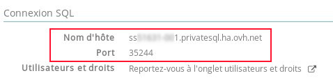{.thumbnail}

Si la connexion aboutie, la page phpMyAdmin apparaîtra.


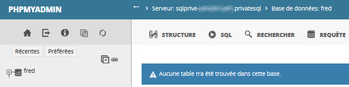{.thumbnail}

**En cas d'erreur #1045**

En cas d'erreur #1045, cela signifie que les identifiants ne sont pas corrects. Il faut donc vérifier votre nom d'utilisateur ou votre mot de passe.


{.thumbnail}

**En cas d'erreur #2005**

En cas d'erreur #2005, il est conseillé de vérifier le nom du serveur et si celui-ci est bien fonctionnel.


{.thumbnail}


### Se connecter a une base de donnees MySQL ou MariaDB en ligne de commande

```bash
mysql --host=serveur --user=utilisateur --port=port --password=password nom_de_la_base
```


> [!warning]
>
> Attention : Cette action est possible uniquement en SSH depuis un hébergement mutualisé OVH
> 


### Se connecter a une base de donnees PostgreSQL par phpPgAdmin
Pour vous connecter à votre base de données, vous trouverez le lien d'accès dans le paragraphe **"Administration de la base de données"** de l'onglet **"Informations générales**".


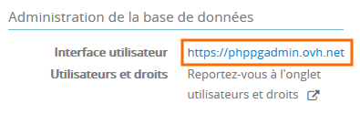{.thumbnail}

Vous arrivez de cette manière sur la page de connexion de phpPgAdmin.


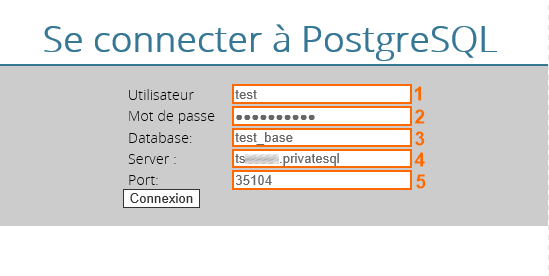{.thumbnail}

**1. Utilisateur :** Il s'agit ici du nom d'utilisateur défini dans l'onglet **"Utilisateurs et droits"** de votre espace client.

**2. Mot de passe :** Renseignez le mot de passe associé à l'utilisateur concerné.

**3. Database :** Vous devez renseigner le nom de la base de données à laquelle vous désirez vous connecter.

**4. Serveur :** Vous devez renseigner le nom d'hôte de votre serveur comme indiqué sur l'image ci-dessous.

**5. Port :** Il s'agit ici du port que vous pouvez récupérer dans l'onglet **"Informations générales"** de votre espace client comme indiqué sur l'image ci-dessous.


> [!primary]
>
> Vous retrouverez le nom du serveur à renseigner (nom d'hôte) et le port dans
> votre espace client dans le cadre "Connexion SQL".
> 


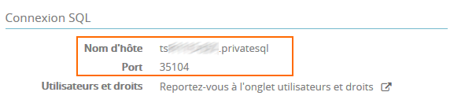{.thumbnail}


### Se connecter a une base de donnees PostgreSQL en ligne de commande

```bash
psql --host=serveur --port=port --user=utilisateur --password=password nom_de_la_base
```


> [!warning]
>
> Attention : Cette action est possible uniquement en SSH depuis un hébergement mutualisé OVH en version stable ou supérieur :
> []({legacy}2149)
> 

<a name="save_bdd"></a>

## Sauvegarde, restauration et importation depuis l'espace client

### Realiser une sauvegarde manuelle d'une base de donnees
Pour réaliser une sauvegarde manuelle de votre base de données, rendez-vous dans l'onglet **"Bases de données"**, puis vous cliquez sur la **"roue crantée"** à droite de votre base, puis sur `Sauvegarder maintenant`{.action}.


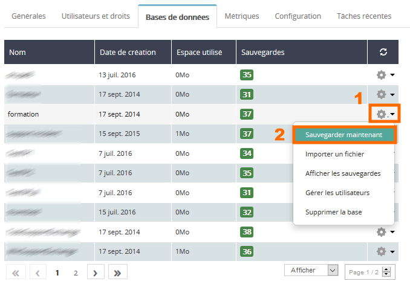{.thumbnail}

*Cette sauvegarde sera ensuite effective sous quelques minutes.*


> [!primary]
>
> Des sauvegardes sont également effectuées automatiquement une fois par jour
> sur toutes vos bases de données.
> 


> [!warning]
>
> Attention : les sauvegardes automatiques et manuelles sont conservées pendant 30 jours.
> Passé ce délai, elles seront automatiquement supprimées.
> 


### Telecharger une sauvegarde
Pour télécharger une sauvegarde, vous devez cliquez sur le nombre apparaissant dans la colonne **"Sauvegardes"**. Ce chiffre correspond au nombre de sauvegardes disponibles pour votre base de données.


{.thumbnail}

La liste des sauvegardes disponibles apparaît, vous pouvez cliquer sur l'icône de `Téléchargement`{.action} pour récupérer cette sauvegarde.


{.thumbnail}


### Restaurer une sauvegarde
Pour restaurer une sauvegarde, vous devez cliquez sur le nombre apparaissant dans la colonne **"Sauvegardes"**. Ce chiffre correspond au nombre de sauvegardes disponibles pour votre base de données.


{.thumbnail}

La liste des sauvegardes disponibles apparaît, vous pouvez cliquer sur l'icône encadrée en orange pour restaurer cette sauvegarde.


{.thumbnail}


> [!warning]
>
> Attention : la restauration implique le remplacement du contenu de la base de données suite à la restauration.
> Si vous n'êtes pas sûr de ce que vous faites, nous vous invitons à effectuer une sauvegarde auparavant.
> 


> [!primary]
>
> Cette restauration peut prendre de quelques minutes, celle-ci peut prendre plus
> ou moins longtemps en fonction de la taille de la sauvegarde choisie.
> 


### Importer et restaurer une sauvegarde
Il est également possible d'importer une sauvegarde présente sur votre ordinateur et de la restaurer.

Pour cela, cliquez sur **"Bases de données"**, puis sur la **"roue crantée"** de la base à restaurer, et enfin sur `Importer un fichier`{.action}.


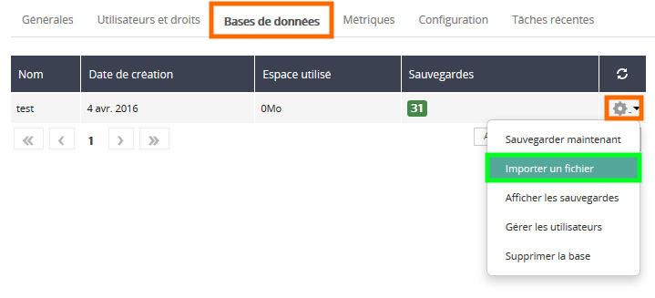{.thumbnail}

Cliquez ensuite sur **"Importer un nouveau fichier"**, pius cliquez sur `Suivant`{.action}.


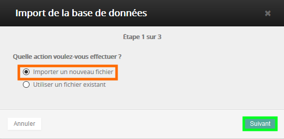{.thumbnail}

Indiquez **"un nom"** pour votre fichier importé, cliquez sur **"Parcourir"** pour le sélectionner, puis `Envoyer`{.action}, et enfin sur `Suivant`{.action}.


> [!warning]
>
> Attention : le fichier doit être au format ".gz".
> 


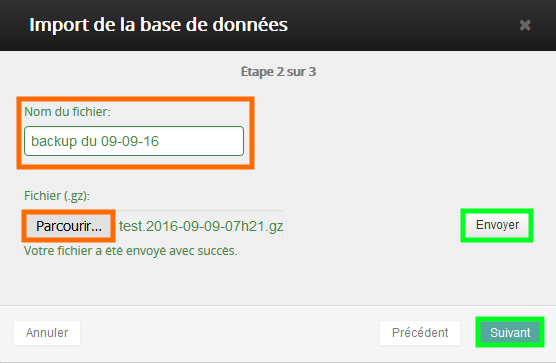{.thumbnail}

Choisissez ensuite si vous désirez **"vider"** la base de données à restaurer avant l'import, et si vous désirez qu'un **"mail de confirmation"** soit envoyé à la fin de l'opération, puis cliquez sur `Valider`{.action}.


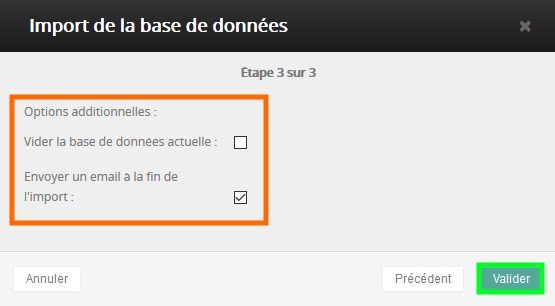{.thumbnail}

Si vous aviez déjà importé un fichier auparavant, il est possible de choisir l'option **"Utiliser un fichier existant"**.


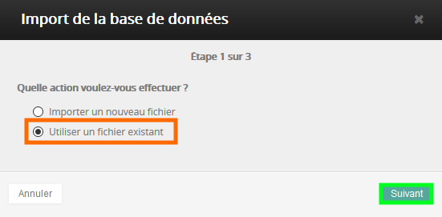{.thumbnail}

Choisissez ensuite le fichier dans le **"menu déroulant"**, puis cliquez sur `Suivant`{.action}.


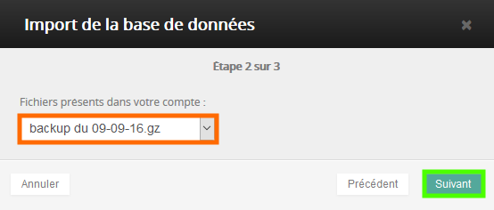{.thumbnail}

Choisissez ensuite si vous désirez **"vider"** la base de données à restaurer avant l'import, et si vous désirez qu'un **"mail de confirmation"** soit envoyé à la fin de l'opération, puis cliquez sur `Valider`{.action}.


{.thumbnail}


## Export et import de base de donnees MySQL ou MariaDB hors espace client

> [!primary]
>
> Dans certains cas, il se peut que la RAM disponible dans votre instance SQL Privé ne permette pas de réaliser l'export ou l'import souhaité. Si tel est le cas, nous vous recommandons d'utiliser l'outil OVH dans l'espace client. Reportez-vous à la section [« Sauvegarde, restauration et importation depuis l’espace client »](https://docs.ovh.com/fr/hosting/tout-sur-le-sql-prive/#sauvegarde-restauration-et-importation-depuis-lespace-client_1){.external} de cette documentation.
>

### Exporter ma base MySQL ou MariaDB depuis phpMyAdmin
Pour exporter votre base de données directement depuis phpMyAdmin, il est nécessaire de vous y connecter au préalable, vous pouvez pour cela vous aider du paragraphe ci-dessus.

Cliquez sur le nom de la base de données que vous souhaitez exporter et ensuite sur le bouton `Exporter`{.action}.


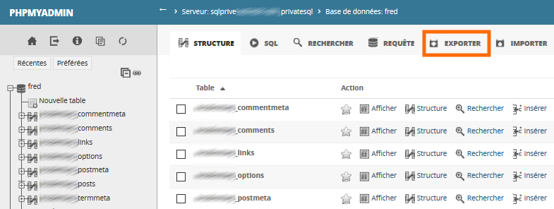{.thumbnail}

Vous avez deux modes d'exportation possibles. Si vous n'avez pas de besoin spécifique, nous vous conseillons d'utiliser le mode **rapide** au format **SQL**.


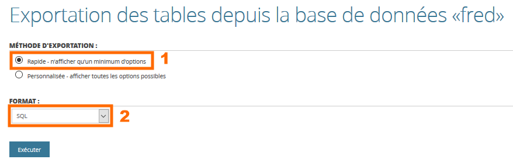{.thumbnail}


### Importer ma base MySQL ou MariaDB depuis phpMyAdmin
Pour importer votre base de données directement depuis phpMyAdmin, il est nécessaire de vous y connecter au préalable, vous pouvez pour cela vous aider du paragraphe ci-dessus.

Une fois connecté sur PhpMyAdmin, sélectionnez votre base de données en cliquant sur son nom.

Cliquez ensuite sur `Importer`{.action}.


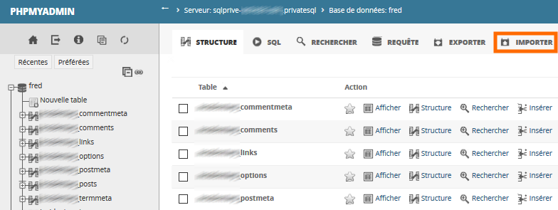{.thumbnail}

Sélectionnez votre fichier de sauvegarde en cliquant sur **"Parcourir"** (attention, le fichier ne peut pas dépasser 128 Mo).

Cliquez sur `Exécuter`{.action} pour lancer l'importation.


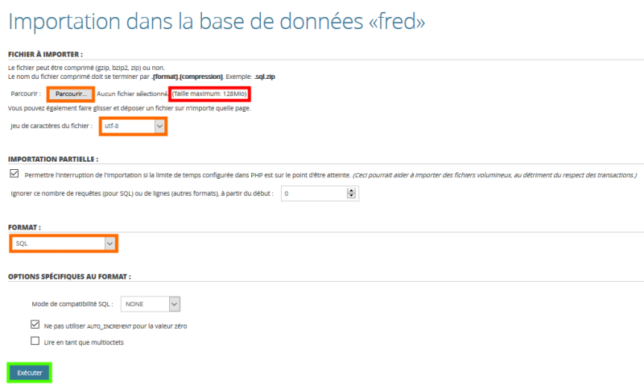{.thumbnail}


### Exporter ma base MySQL ou MariaDB en ligne de commande

```bash
mysqldump --host=serveur --user=utilisateur --port=port --password=password nom_de_la_base > nom_de_la_base.sql
```


> [!warning]
>
> Attention : Cette action est possible uniquement en SSH depuis un hébergement mutualisé OVH.
> 


### Importer ma base MySQL ou MariaDB en ligne de commande

```bash
cat nom_de_la_base.sql | mysql --host=serveur --user=utilisateur --port=port --password=password nom_de_la_base
```


> [!warning]
>
> Attention : Cette action est possible uniquement en SSH depuis un hébergement mutualisé OVH.
> 


### Exporter ma base MySQL ou MariaDB depuis un fichier PHP

```php
1. <?php echo "Votre base est en cours de sauvegarde.......";
2. system("mysqldump --host=serveur --user=utilisateur --port=port --password=password nom_de_la_base > nom_de_la_base.sql");
3. echo "C'est fini. Vous pouvez récupérer la base par FTP";
4. ?>
```


> [!warning]
>
> Attention :
> - Afin d'éviter que quelqu'un accède à ce fichier comportant des données sensibles, pensez à sécuriser l'accès à celui-ci à l'aide de ce guide : []({legacy}1968)
> - Cette action est possible uniquement depuis un hébergement OVH mutualisé.
>

### Importer ma base MySQL ou MariaDB depuis un fichier PHP

```php
1. <?php
2. echo "Votre base est en cours de restauration.......<br>";
3. system("cat nom_de_la_base.sql | mysql --host=serveur --user=utilisateur --port=port --password=password nom_de_la_base");
4. echo "C'est fini. Votre base est en place sur cet hébergement.";
5. ?>
```


> [!warning]
>
> Attention :
> - Afin d'éviter que quelqu'un accède à ce fichier comportant des données sensibles, pensez à sécuriser l'accès à celui-ci à l'aide de ce guide : []({legacy}1968)
> - Cette action est possible uniquement depuis un hébergement OVH mutualisé.
>

## Export et import de base de donnees PostgreSQL hors espace client

> [!primary]
>
> Dans certains cas, il se peut que la RAM disponible dans votre instance SQL Privé ne permette pas de réaliser l'export ou l'import souhaité. Si tel est le cas, nous vous recommandons d'utiliser l'outil OVH dans l'espace client. Reportez-vous à la section [« Sauvegarde, restauration et importation depuis l’espace client »](https://docs.ovh.com/fr/hosting/tout-sur-le-sql-prive/#sauvegarde-restauration-et-importation-depuis-lespace-client_1){.external} de cette documentation.
>

### Exporter ma base PostgreSQL en ligne de commande

```bash
pg_dump --host=serveur --port=port --user=utilisateur --password=password nom_de_la_base > nom_de_la_base.sql
```


> [!warning]
>
> Attention :
> - Cette action est possible uniquement en SSH depuis un hébergement mutualisé OVH en version stable ou supérieur : []({legacy}2149)
> - Cette action est possible uniquement pour les bases de données PostgreSQL en version 9.4.
>

### Importer ma base PostgreSQL en ligne de commande

```bash
psql --host=serveur --port=port --user=utilisateur --password=password nom_de_la_base < nom_de_la_base.sql
```


> [!warning]
>
> Attention : Cette action est possible uniquement en SSH depuis un hébergement mutualisé OVH en version stable ou supérieur : []({legacy}2149)
> 


### Exporter ma base PostgreSQL depuis un fichier PHP

```php
1. <?php echo "Votre base est en cours de sauvegarde.......";
2. system("PGPASSWORD=mot_de_passe pg_dump --host=serveur --port=port --user=utilisateur --password=password nom_de_la_base > nom_de_la_base.sql");
3. echo "C'est fini. Vous pouvez récupérer la base par FTP";
4. ?>
```


> [!warning]
>
> Attention :
> - Afin d'éviter que quelqu'un accède à ce fichier comportant des données sensibles, pensez à sécuriser l'accès à celui-ci à l'aide de ce guide : []({legacy}1968)
> - Cette action est possible uniquement depuis un hébergement OVH mutualisé.
>

### Importer ma base PostgreSQL depuis un fichier PHP

```php
1. <?php
2. echo "Votre base est en cours de restauration.......<br>";
3. system("PGPASSWORD=mot_de_passe psql --host=serveur --port=port --user=utilisateur --password=password nom_de_la_base < nom_de_la_base.sql");
4. echo "C'est fini. Votre base est en place sur cet hébergement.";
5. ?>
```


> [!warning]
>
> Attention :
> - Afin d'éviter que quelqu'un accède à ce fichier comportant des données sensibles, pensez à sécuriser l'accès à celui-ci à l'aide de ce guide : []({legacy}1968)
> - Cette action est possible uniquement depuis un hébergement OVH mutualisé.
>

<a name="config"></a>

## Modifier la configuration de mon serveur SQL privé

### Instance MySQL

- Cliquez sur l'onglet **"Configuration"**.

Vous trouverez dans le cadre **"Configuration générale de MySql"** la configuration actuellement définie pour votre SQL Privé.

- Cliquez sur `Editer`{.action} pour modifier celle-ci.


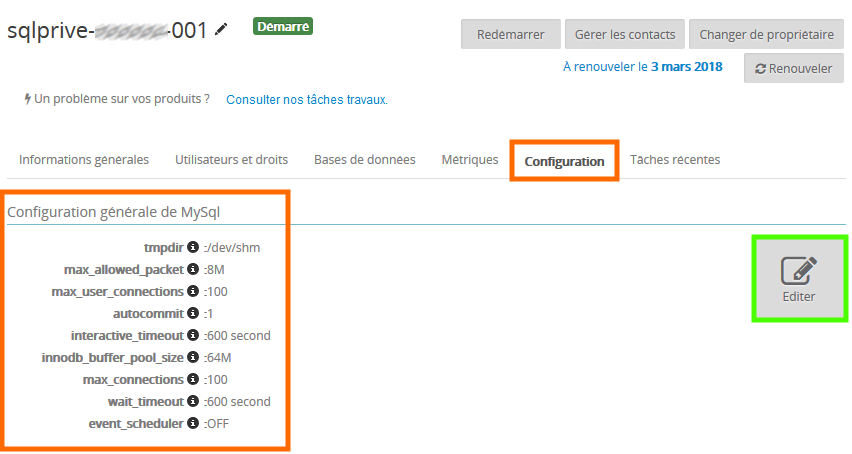{.thumbnail}

- **Tmpdir** : Répertoire des fichiers temporaires. **"/dev/shm** correspond à la mémoire RAM de l'instance. **"/tmp"** correspond au disque dur de l'instance.
- **MaxAllowedPacket** : Taille maximum des paquets.
- **Max_user_connections** : Nombre de connexions simultanées autorisées par utilisateur.
- **AutoCommit** : Définit si les requêtes sont automatiquement commitées ou non.
- **Interactive_timeout** : Temps en secondes pendant lequel le serveur attend l'activité sur une connexion interactive avant de la fermer.
- **InnodbBufferPoolSize** : Choix de la taille de la mémoire tampon.
- **MaxConnexions :** Nombre de connexions simultanées autorisées sur le SQL Privé.
- **Wait_timeout** : Temps en secondes pendant lequel le serveur attend l'activité sur une connexion non interactive avant de la fermer.
- **Event_scheduler** : Permet de déclencher l’exécution de requêtes programmées directement dans le serveur MySQL.


> [!primary]
>
> Tmpdir :
> - /dev/shm : Le serveur SQL Privé allouera la moitié de sa mémoire RAM à ce répertoire pour plus de performances.
> - /tmp : Le serveur allouera sur son disque dur un espace illimité pour ce répertoire, mais cela sera beaucoup moins performant. Nous vous conseillons d'utiliser ce répertoire uniquement pour les opérations occasionnelles lourdes.
>

Effectuez les modifications nécessaires puis cliquez sur `Confirmer`{.action}.


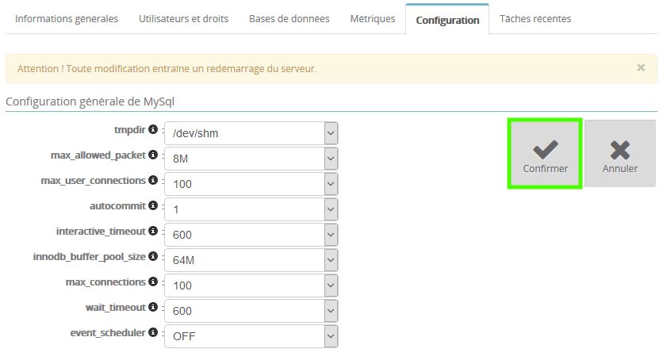{.thumbnail}


> [!warning]
>
> Attention : toute modification nécessite un redémarrage du SQL Privé.
> 


### Instance PostgreSQL
Il n'est pas possible de modifier la configuration d'une instance PostgreSQL actuellement.


## Optimiser mon serveur
<a name="slow"></a>

### Acces aux logs du serveur
- **Qu'est ce que les Slow Query Log ?**

Ce sont les requêtes qui prennent plus de temps que la valeur définie dans la variable **"long_query_time"**. Nous avons défini le "**long_query_time"** à 1 seconde.

Pour obtenir ce type de logs appelé **"slow-query.log"**, il vous faut les récupérer à la racine de votre serveur SFTP du SQL Privé. Pour vous y connecter en **SFTP**, vous pouvez vous aider de ce guide : []({legacy}1380){.ref}.

Afin de vous y connecter, il vous faut récupérer les informations de connexion dans l'onglet **"Génerales"** du SQL Privé.


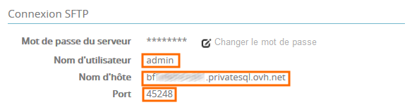{.thumbnail}

Si ce fichier est vide, c'est que vous n'avez aucune requête lente.


### Optimiser vos bases de donnees
Il faut entretenir sa base de données pour qu'elle soit toujours performante. Ce que l'on entend par performante, c'est le fait que les informations contenues dans la base soient le plus rapidement retournées au script qui les demande.

Pour cela, il faut une base bien structurée et optimisée. Nous allons voir comment optimiser au mieux votre base.

- **Indexer la base de données**

Pour augmenter la rapidité des recherches lors d'une requête, il faut mettre un index sur les champs qui sont utilisés dans les clauses WHERE.

Exemple : *Vous faites régulièrement une recherche de personne par rapport à la ville. Il faut indexer le champ "ville" avec la requête suivante :*


```bash
ALTER TABLE `test` ADD INDEX ( `ville` );
```

- **Purger la base de données**

Certaines de vos données ne sont plus consultées. Pourquoi ne pas les archiver ? Vos tables seront moins remplies et les recherches iront plus vite.

- **Limitation d'affichage**

Limiter l'affichage des enregistrements à un nombre restreint (par exemple 10 par page) avec la partie LIMIT de votre requête SQL.

- **Regroupement des requêtes**

Regrouper vos requêtes en début de script de cette manière :


```bash
connexion_base
requete1
requete2
...
déconnexion_base
Affichage ...
Traitement des données
Boucles ...
Affichage ...
...
```

- **Récupérer uniquement les données utiles**

Dans vos requêtes SQL, vérifiez que vous ne sélectionnez que ce dont vous avez besoin, et surtout que vous n'avez pas oublié les liaisons entre les tables.

Exemple :


```bash
(where table1.champs = table2.champs2)
```

- **Éviter les options très gourmandes en ressources**

Évitez d'utiliser "HAVING" par exemple. Elle alourdit vos requêtes. De la même manière, évitez d'utiliser **"GROUP BY"**, sauf si cela s'avère strictement nécessaire.

<a name="version"></a>

### Changer la version MySQL, PostgreSQL ou MariaDB de mon SQL privé
Pour connaître la version de MySQL, PostgreSQL ou MariaDB de votre serveur SQL Privé, vous devez vous rendre sur l'onglet **"Informations générales"** après avoir choisi votre serveur SQL Privé.

La version utilisée actuellement apparaît à la ligne **"Version"**.

Pour modifier cette version, il vous suffit de cliquer sur `Modifier la version`{.action}.


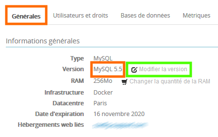{.thumbnail}


> [!primary]
>
> - Avant de migrer vers une version supérieur, assurez vous que votre base de données est compatible avec la version choisie.
> - La modification est ensuite effective sous quelques minutes.
>


> [!warning]
>
> Attention : Il n'est pas possible de passer d'une ancienne version à la dernière
> directement. Il est obligatoire de passer par toutes les versions intermédiaires.
> 

Si vous utilisez déjà la dernière version de MySQL, il ne sera pas possible de changer celle-ci car il s'agit de la dernière version proposée.


{.thumbnail}


> [!warning]
>
> Attention : toute modification nécessite un redémarrage du serveur.
> 


## FAQ
<a name="datacentre"></a>

### Dans quel Datacentre est installe mon SQL privé ?
Vous pouvez retrouver cette information dans l'onglet **"Informations générales"** de votre SQL Privé, rubrique **"Informations générales"**.


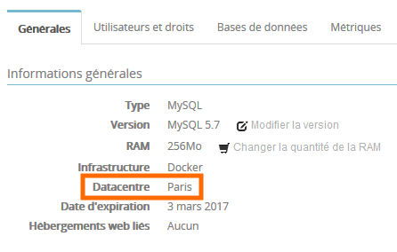{.thumbnail}


### Dans quel Datacentre est installe mon hebergement web ?
Vous pouvez retrouver cette information dans l'onglet **"Informations Générales"** de votre hébergement.


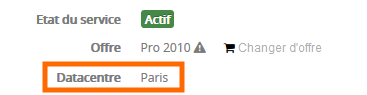{.thumbnail}


### Puis-je me connecter en Root sur mon serveur SQL privé ?
- Non.


### Comment connaitre la taille d'une de mes bases de donnees ?
- Celle-ci apparaît dans l'onglet **"Bases de données"** dans la colonne **"Espace utilisé"**.


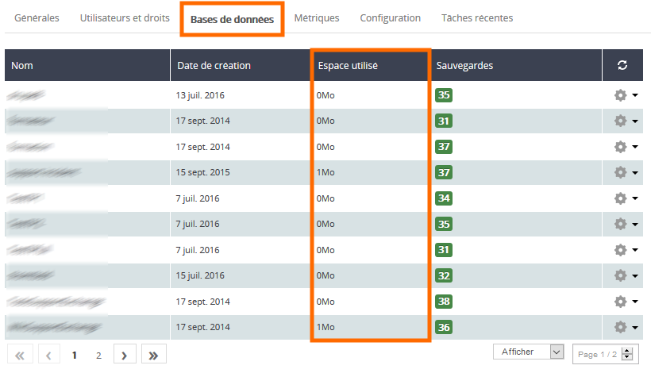{.thumbnail}


### Comment supprimer une base de donnees ou un utilisateur ?
- Il vous suffit pour cela de vous rendre dans l'onglet **"Utilisateurs et droits**" ou **"Bases de données"**, puis de cliquer sur la **roue crantée**, et enfin sur `Supprimer`{.action}.


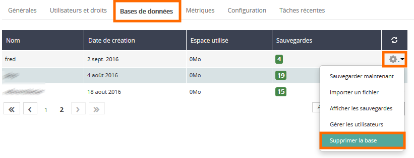{.thumbnail}


### Comment connaitre la RAM consommee actuellement sur votre serveur ?
- Vous pouvez retrouver cela dans l'onglet **"Métriques"** de votre espace client.


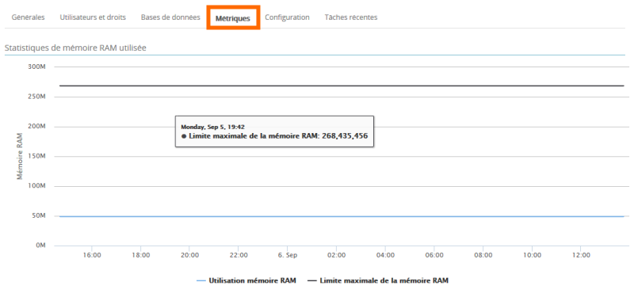{.thumbnail}


### Comment visualiser les logs sur votre serveur ?
- Seuls les slow logs sont disponibles actuellement sur le STFP du SQL Privé. [Rendez-vous ici pour plus d'informations](#slow){.external}.


### Comment connaitre la version exacte de mySQL ou MariaDB que j'utilise ?
- Il faut pour cela entrer cette commande dans phpMyAdmin, rubrique **"SQL"**, puis cliquer sur `Exécuter`{.action} :

show variables like "version";


### Comment connaitre la version exacte de PgSQL que j'utilise ?
- Il faut pour cela entrer cette commande dans phpPgAdmin en cliquant sur **votre base de données**, rubrique **"SQL"**, puis cliquer sur `Lancer`{.action} :

select version();


### Puis-je mettre en place un redemarrage planifie de mon serveur SQL privé ?
- Non, cela n'est pas possible.


### Puis-je dupliquer une base de donnees ?
- Non, cela n'est pas possible.


### Mes sauvegardes de bases de donnees sont-elles stockees sur mon serveur SQL privé ?
- Les sauvegardes de vos bases ne sont pas stockées sur votre serveur SQL Privé, cela n'utilise donc pas d'espace de votre côté. De plus, celles-ci sont stockées 30 jours sur notre infrastructure.


### Pourquoi je rencontre le message &quot;Too many connections&quot; sur mon site web ?
- Cela est dû au dépassement du nombre de connexions simultanés sur votre SQL Privé. Il vous est possible d'augmenter la variable **"MaxConnections"** en [modifiant votre serveur](#config){.external}.
