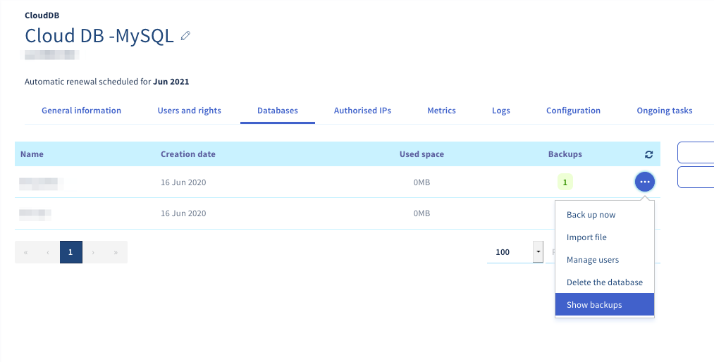

**Letzte Aktualisierung am 16.09.2020**

## Ziel

Ihre Datenbank kann eine große Anzahl von für Ihre Website wesentlichen Informationen enthalten. Es ist daher von entscheidender Bedeutung, sie speichern oder exportieren zu können.

**Hier erfahren Sie, wie Sie Ihre Datenbank von Ihrem Datenbankserver aus sichern und exportieren.**

## Voraussetzungen

- Sie verfügen über ein [SQL Private oder ](https://www.ovh.com/fr/hebergement-web/options-sql.xml){.external}Cloud Databases Hosting[ ](https://www.ovh.com/fr/cloud-databases){.external}.
- Sie sind in Ihrem [OVHcloud Kundencenter](https://www.ovh.com/auth/?action=gotomanager){.external} angemeldet.

## In der praktischen Anwendung

> [!primary]
>
> Hinweis: Die Angebote >Es gibt keinen "root" Superuser Zugang.
> <br> Generische SQL-Befehle funktionieren normal, und Programme wie HeidiSQL, SQuirreL oder Adminer sind vollständig kompatibel.
> 

### Eine Datenbank über das Kundencenter sichern und exportieren

Begeben Sie sich in Ihr Kundencenter (Rubrik IP) Klicken Sie auf den Tab `Web` und dann `auf`{.action} Datenbank im linken Bereich. Wählen Sie den Namen Ihres Datenbankservers aus. Gehen Sie zum Tab `Datenbanken`.

In der Spalte **"Sicherungen"** entspricht die Zahl der für Ihre Datenbank verfügbaren Sicherungen.

> [!primary]
>
> - Backups werden automatisch einmal täglich durchgeführt
> Datenbanken konfigurieren
> - Automatische und manuelle Backups werden 30 Tage lang aufbewahrt.
> Nach Ablauf dieser Frist werden sie automatisch gelöscht.

#### 1. Manuelles Backup durchführen 

Klicken Sie auf `...`{.action} rechts neben der Datenbank und dann auf `Speichern`{.action}.

{.thumbnail}

#### 2. Backup erstellen

Klicken Sie auf den Button `..`{.action}. rechts neben der Datenbank und dann auf `Sicherungen anzeigen`{.action}

{.thumbnail}

Die Liste der verfügbaren Backups erscheint, klicken Sie auf den Button `...`{.action} rechts neben dem ausgewählten Backup und dann auf `Backup herunterladen`{.action}, um dieses wiederherzustellen.

\###Eine Datenbank sichern und exportieren

#### 1. Export von MySQL oder MariaDB Datenbanken

 In einigen Fällen kann es sein, dass das auf Ihrem Datenbankserver verfügbare RAM nicht den gewünschten Export durchführen kann. Ist das der Fall, empfehlen wir Ihnen, das Tool von OVHcloud im Kundencenter zu verwenden. Dies ermöglicht es Ihnen, externe Ressourcen für diese Operation zu verwenden. In dieser Anleitung finden Sie [im Abschnitt "Eine Datenbank speichern und exportieren"](./#sauvegarder-et-exporter-une-base-de-donnees-depuis-lespace-client){.external}.

##### 1.1 MySQL oder MariaDB Datenbank über OVHcloud phpMyAdmin exportieren (nur für SQL Private Angebote)

Um Ihre Datenbank direkt über phpMyAdmin exportieren zu können müssen Sie sich zuerst mit ihr verbinden. Weitere Informationen finden Sie in der [Anleitung "Mit einer Datenbank verbinden"](../connexion-base-de-donnees-serveur-bdd){.external}

Wenn Sie auf phpMyAdmin eingeloggt sind, klicken Sie auf den Namen der Datenbank, die Sie exportieren möchten, und anschließend auf den Tab `Exportieren`{.action}.

Sie haben zwei mögliche Exportmethoden. Wenn Sie keine besonderen Bedürfnisse haben, empfehlen wir Ihnen die Verwendung des Schnellmodus im **SQL**-Format ****.

{.thumbnail}

##### 1.2 MySQL oder MariaDB Datenbank in die Kommandozeile exportieren

> [!primary]
>
> Für einen SQL Private Server ist diese Aktion ausschließlich über [SSH]( ../mutualise-le-ssh-sur-les-hebergements-mutualises/){.external} über ein OVHcloud Shared Hosting möglich.

```bash
mysqldump --host=serveur --user=utilisateur --port=port --password=password nom_de_la_base > nom_de_la_base.sql
```

##### 1.3 Meine MySQL oder MariaDB Datenbank über ein PHP Skript exportieren

> [!primary]
>
> Für einen SQL Private Server kann dieses Skript nur über ein OVHcloud Shared Hosting ausgeführt werden.


```php
1. <?php echo "Ihre Datenbank wird gesichert......."
2. system("mysqldump --host=serveur --user=utilisateur --port=port --password=password nom_de_la_base > nom_de_la_base.sql");
3. echo: "Es ist vorbei. Sie können die Datenbank per FTP abrufen."
4
```

> [!warning]
>
> - Um zu vermeiden, dass ein Dritter auf diese Datei mit sensiblen Daten zugreift, stellen Sie in der Anleitung sicher, dass Sie auf diese zugreifen können: [Wie kann ich den Zugang zu einem Verzeichnis per Authentifizierung schützen?]( ../mutualise-le-ssh-sur-les-hebergements-mutualises/){.external}
> - Diese Aktion ist nur über ein Shared Hosting von OVHcloud möglich.
>

#### 2. Export und Import von PostgreSQL-Datenbanken außerhalb des Kundencenters

 In einigen Fällen kann es sein, dass das auf Ihrem Datenbankserver verfügbare RAM nicht den gewünschten Export durchführen kann. Ist das der Fall, empfehlen wir Ihnen, das Tool von OVHcloud im Kundencenter zu verwenden. Dies ermöglicht es Ihnen, externe Ressourcen für diese Operation zu verwenden. In dieser Anleitung finden Sie [im Abschnitt "Eine Datenbank speichern und exportieren"](./#sauvegarder-et-exporter-une-base-de-donnees-depuis-lespace-client){.external}.
 
##### 2.1 PostgreSQL Datenbank in die Kommandozeile exportieren

> [!primary]
>
> Für einen SQL Private Server ist diese Aktion ausschließlich über [SSH]( ../mutualise-le-ssh-sur-les-hebergements-mutualises/){.external} über ein OVHcloud Shared Hosting möglich.

```bash
pg_dump --host=serveur --port=port --user=utilisateur --password=password nom_de_la_base > nom_de_la_base.sql
```

##### 2.2 Meine PostgreSQL Datenbank über ein PHP Skript exportieren

> [!primary]
>
> Für einen SQL Private Server kann dieses Skript nur über ein OVHcloud Shared Hosting ausgeführt werden.

```php
1. <?php echo "Ihre Datenbank wird gesichert......."
2. system("PGPASSWORD=mot_de_passe pg_dump --host=serveur --port=port --user=utilisateur --password=password nom_de_la_base > nom_de_la_base.sql");
3. echo: "Es ist vorbei. Sie können die Datenbank per FTP abrufen."
4
```

> [!warning]
>
> - Um zu vermeiden, dass ein Dritter auf diese Datei mit sensiblen Daten zugreift, stellen Sie in der Anleitung sicher, dass Sie auf diese zugreifen können: [Wie kann ich den Zugang zu einem Verzeichnis per Authentifizierung schützen?]( ../mutualise-le-ssh-sur-les-hebergements-mutualises/){.external}
> - Diese Aktion ist nur über ein Shared Hosting von OVHcloud möglich.
>

## Weiterführende Informationen

[Eine Datenbank über das Kundencenter sichern und exportieren](./#sauvegarder-et-exporter-une-base-de-donnees-depuis-lespace-client){.external}

Für den Austausch mit unserer User Community gehen Sie auf <https://community.ovh.com>.
