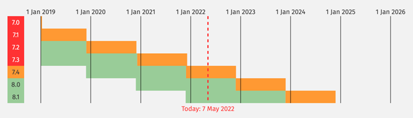
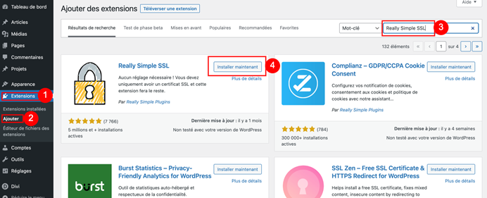
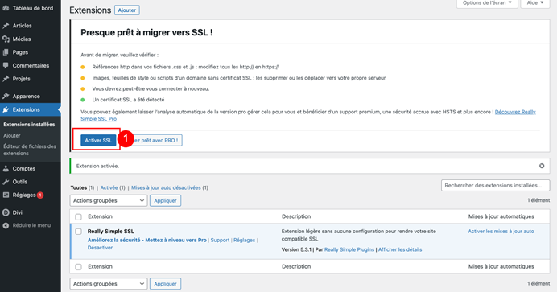
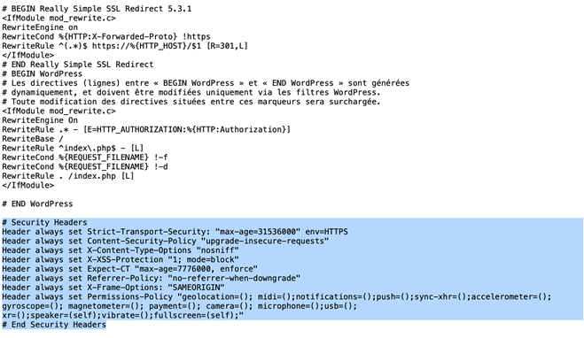
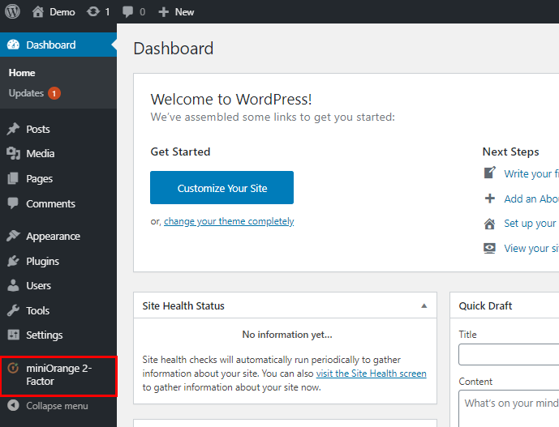
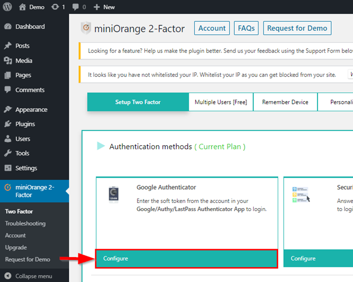
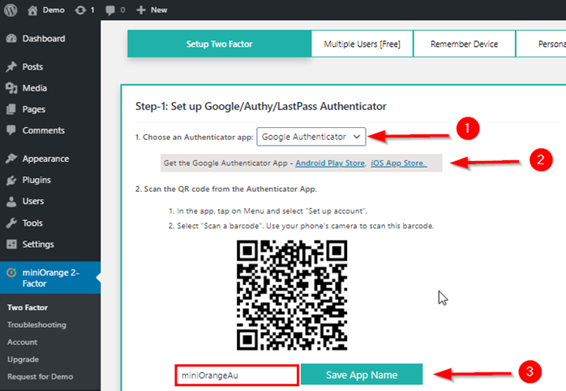
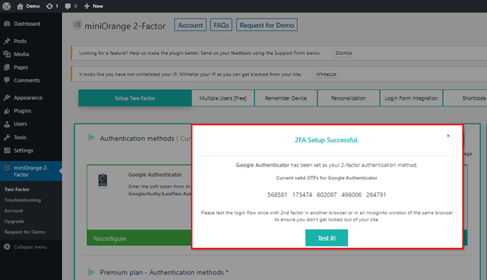
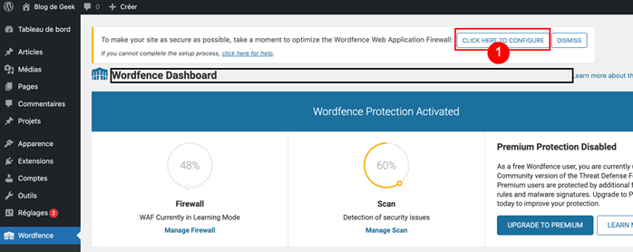

**Dernière mise à jour le 04/10/2022**

## Objectif

WordPress est, actuellement, le CMS _(Content Management System ou Système de Gestion de Contenu)_ le plus utilisé pour réaliser un site web. De par son exposition (plus de 40% des tous les sites web) et son écosystème de thèmes et d’extensions (gratuits ou payants), WordPress comprend des failles qui peuvent être exploitées avec des conséquences telles que des vols de données, du défacement ou l’arrêt simple du fonctionnement d’un site. Nous allons voir ce qui peut être rapidement en œuvre pour le sécuriser.

## Prérequis

Vous devez disposer d'un [hébergement web](https://www.ovhcloud.com/fr/web-hosting/), avoir installé le CMS WordPress et la possibilité d'accéder à l'interface d'administration (via le login et le mot de passe qui vous auront été fournis au moment de l'installation). 

## En pratique

### À quel moment appliquer les mises à jour WordPress ?

Un point essentiel est de veiller à **toujours utiliser les dernières versions de WordPress, de vos thèmes et de vos extensions**. Les mises à jour corrigent notamment les failles de sécurité détectées préalablement. Vous pouvez, pour cela, suivre régulièrement les informations communiquées sur la [version française du CMS](https://fr.wordpress.org/news/), mais aussi suivre les communications de l’[ANSSI](https://cert.ssi.gouv.fr/alerte/) et interroger les bases de données recensant les failles de sécurité trouvées sur divers outils tel que [Exploit Database](https://www.exploit-db.com/). 

En soi la règle à suivre est simple : dès qu’une mise à jour apparaît sur votre WordPress, il faut la faire ! Mieux encore, vous pouvez activer la mise à jour automatique de vos thèmes et extensions !

_Point important : Vérifiez d’avoir assez d’espace de stockage sur votre serveur avant de faire les mises à jour (au moins 1Go). En effet, si votre stockage arrive à saturation et que vous appliquez des mises à jour, il se peut que votre site ne puisse les finaliser complètement, ce qui risque de casser votre site internet_.

Même si les mises à jour de vos thèmes et extensions sont configurées pour être faites automatiquement, vous devez veiller à la date des dernières mises à jour effectuées. En effet, outre les risques d’incompatibilité avec une nouvelle version de WordPress, un composant qui n’est pas mis à jour depuis plusieurs mois peut ne plus être maintenu par son ou ses auteurs et donc présenter de potentielles failles de sécurité.

### Comment configurer la mise à jour automatique de votre thème WordPress ?

Pour activer la mise à jour automatique d’un thème, c’est très simple. Depuis le tableau de bord, allez sur « Apparence » > « Thèmes » puis cliquez sur le thème choisi puis « Activer les mises à jour auto ».


### Comment activer la mise à jour automatique de vos extensions WordPress ?


### Pourquoi mettre à jour la version PHP de votre hébergement ?

Il est également important d’utiliser la dernière version de PHP disponible (à condition que vos thèmes et extensions installées la supportent). Là aussi, de nombreux correctifs de performances et de sécurité sont fournis à chaque mise à jour. Vous pouvez vérifier les versions encore supportées de PHP ici : [https://www.php.net/supported-versions.php](https://www.php.net/supported-versions.php).



A l'heure de la rédaction ces lignes, il vous est recommandé de configurer votre hébergement OVHcloud en :
- Environnement d’exécution: Stable 64
- Version de PHP: 8.1
- Moteur : PHP
- Mode : Production

Pare feu applicatif : désactivé.

Si votre WordPress a été installé et configuré sur une version de PHP qui n’est plus maintenue, vous devez vous assurez que les extensions que vous utilisez sont compatibles avec la nouvelle version du langage que vous allez configurer. Il peut parfois être nécessaire de changer d’extension pour une équivalente lorsque l’une d’entre elle ne propose pas de version compatible.

### Comment mettre à jour PHP sur votre hébergement OVHcloud ?

Voici à quoi cela ressemble sur l’espace client :


_Point important : il est crucial à cette étape que votre WordPress, ses thèmes et ses extensions soient bien tous à jour avant de procéder à cette modification !_

Plus d’informations sur notre guide : [https://docs.ovh.com/fr/hosting/modifier-lenvironnement-dexecution-de-mon-hebergement-web/](https://docs.ovh.com/fr/hosting/modifier-lenvironnement-dexecution-de-mon-hebergement-web/).

## Existe-t-il des extensions pour sécuriser WordPress ?

Nous vous proposons ici quelques extensions populaires de WordPress, qui de ce fait, sont mises à jour régulièrement et ont déjà fait leurs preuves. Néanmoins, elles sont prévues à des fins pédagogiques dans ce tutoriel. Bien qu’elles soient efficaces, il en existe d'autres tout aussi intéressantes et performantes.

### Comment configurer votre WordPress entièrement en HTTPS ?

« Really Simple SSL » détecte automatiquement vos réglages et configure votre site web pour qu’il fonctionne avec le protocole HTTPS (protocole privilégié par les moteurs de recherche).

Point important : Elle nécessitera au préalable d’avoir installé un certificat SSL sur son hébergement et de l’avoir activé. Je vous renvoie au guide si vous n’en avez pas encore un : [https://docs.ovh.com/fr/hosting/les-certificats-ssl-sur-les-hebergements-web/](https://docs.ovh.com/fr/hosting/les-certificats-ssl-sur-les-hebergements-web/).

Depuis votre tableau de bord WordPress, cliquez sur « Extensions » puis « ajouter ». Tapez Really Simple SSL en recherche, puis « Installer maintenant ». Patientez quelques secondes, puis cliquez sur « Activer ».



Il ne reste plus qu’à activer le SSL ! Rien de plus simple, il suffit de cliquer sur le bouton qui apparaît :



C’est parfait : le SSL est désormais actif par défaut sur votre site internet. Il ne reste plus qu’à faire quelques réglages comme activer la redirection 301 via _.htaccess_ :


On va ensuite installer les en-têtes de sécurité recommandées pour notre connexion HTTPS, en modifiant le .htaccess via Filezilla.

Si vous ne savez pas utiliser Filezilla, un guide est disponible ici : [https://docs.ovh.com/fr/hosting/mutualise-guide-utilisation-filezilla/](https://docs.ovh.com/fr/hosting/mutualise-guide-utilisation-filezilla/).

Sachez qu’il est également possible de le faire depuis FTP Explorer : [https://docs.ovh.com/fr/hosting/connexion-espace-stockage-ftp-hebergement-web/#1-connexion-via-le-ftp-explorer](https://docs.ovh.com/fr/hosting/connexion-espace-stockage-ftp-hebergement-web/#1-connexion-via-le-ftp-explorer).

Une fois connecté, un simple clic droit sur le fichier _.htaccess_ puis « afficher / éditer » :


Une fois ouvert dans un éditeur de texte, il suffit de copier/coller les lignes de texte suivantes à la fin :

```
# Security Headers
Header always set Strict-Transport-Security: "max-age=31536000" env=HTTPS
Header always set Content-Security-Policy "upgrade-insecure-requests"
Header always set X-Content-Type-Options "nosniff"
Header always set X-XSS-Protection "1; mode=block"
Header always set Expect-CT "max-age=7776000, enforce"
Header always set Referrer-Policy: "no-referrer-when-downgrade"
Header always set X-Frame-Options: "SAMEORIGIN"
Header always set Permissions-Policy "geolocation=(); midi=();notifications=();push=();sync-xhr=();accelerometer=(); gyroscope=(); magnetometer=(); payment=(); camera=(); microphone=();usb=(); xr=();speaker=(self);vibrate=();fullscreen=(self);"
# End Security Headers
```

Ce qui nous donne à la fin de cette opération le résultat suivant dans le fichier _.htaccess_ situé à la de le dossier racine de votre site web :



_Point important : Une fois ces lignes copiées, pensez bien depuis votre éditeur de texte à cliquer sur « Fichier » puis « Enregistrer », et, en fermant votre éditeur de texte, à retourner sur Filezilla pour valider le popup vous demandant de renvoyer le fichier sur le serveur. Sans cela, vos modifications ne seront pas prises en compte._

### Comment mettre en place un second facteur d’authentification ?

L’utilisation conventionnelle d’un login et d’un mot de passe est insuffisante en matière de sécurité. Les failles sont connues : mots de passe trop simples à trouver, un même mot de passe pour plusieurs comptes, non renouvellement ou encore stockage sur un support non sécurisé. Malgré la complexité de votre mot de passe, il est toujours possible de subir une attaque malveillante qui permettrait à un pirate de passer avec succès la page de connexion à votre interface d'administration.

La mise en place d’un processus d’authentification à double facteur (2FA pour _Two Factor Authentication_) renforcera la sécurité d’accès à votre interface d’administration. Le fonctionnement est simple : outre le couple login/mot de passe conventionnel, il vous sera demandé une authentification avec un facteur supplémentaire (code à durée limitée, authentification sur un smartphone, SMS, reçu, _passphrase_). Vous protégerez et sécuriserez vos accès admin, et éviterez ainsi de compromettre la sécurité de votre site.
Même si utilisateur malveillant vient à récupérer votre mot de passe de manière malveillante, la sécurité de vos accès ne sera pas compromise.

Parmi ces facteurs 2FA que vous pouvez utiliser l’application Google Authenticator (ou toute application équivalente).
Lors de la création de votre compte, un QR Code sera affiché à l’écran. Il vous suffira de le scanner avec votre smartphone via l’application Google Authenticator. Une nouvelle entrée apparaîtra dans votre application générant un code (par défaut à 6 chiffres) qui changera régulièrement (30 secondes). C’est ce code que vous devrez fournir lors de votre authentification sur votre interface d’administration.

Une extension très complète vous permettra de gérer plusieurs modes d’authentification sur votre site, pour les administrateurs mais également pour les utilisateurs ayant un compte. L’extension  miniOrange’s Google Authenticator est disponible à cette adresse : [https://fr.wordpress.org/plugins/miniorange-2-factor-authentication/](https://fr.wordpress.org/plugins/miniorange-2-factor-authentication/).

Pour activer la double authentification pour le compte administrateur (accessible avec un compte non payant) :

Se connecter sur l’interface dédiée avec le compte administrateur

Cliquer sur le plugin « miniOrange 2-Factor »



Cliquer sur « Configure » sous la méthode d’authentification « Google Authenticator »



Sur la première étape du processus de configuration, sélectionner l’application que vous utiliserez sur votre smartphone pour générer la série de chiffres. Une fois la méthode sélectionnée, scannez le QR Code avec votre smartphone via l’application Google Authenticator



Attribuer un nom puis passer à l’étape 2 de la vérification en saisissant le code généré sur votre application mobile

Si l’opération est un succès, une fenêtre vous confirmera que l’accès à votre compte est bien effectif en 2FA



### Comment mesurer la santé du site de votre site web ?

Pourquoi avons-nous fait tout cela ? Tout simplement pour mieux sécuriser votre connexion HTTPS, et surtout, pour le plaisir de voir la santé de notre site en pleine forme !


Cette section n’est pas une extension, elle fait partie intégrante d’un WordPress par défaut. Elle peut vous alerter d’un problème de performances ou de sécurité sur votre site internet.

Vous pouvez par ailleurs tester vos en-têtes de sécurité ici : [https://securityheaders.com/](https://securityheaders.com/).


### Comment configurer WordFence pour votre WordPress ?

Wordfence comprend un pare-feu et un scanner de logiciels malveillants qui ont été conçus dès le départ pour protéger WordPress.


Une fois activé, renseignez votre adresse e-mail pour recevoir les rapports hebdomadaires, accepter les conditions générales puis à l’écran suivant cliquez sur « no thanks ».
Le firewall, aussi appelé WAF (Web Application Firewall) entre en mode apprentissage. Cela ne va durer que quelques dizaines de minutes tout au plus.
Entre temps, cliquez sur « Click here to configure ».




On télécharge la sauvegarde de notre fichier .htaccess sur notre ordinateur, puis on clique sur « continue ».


Maintenant nous allons optimiser les réglages pour la protection contre les attaques de type _brute force_.

On clique sur « Managing Firewall » puis « Brute Force Protection ».

Voici les réglages que à privilégier :
- **Lock out after how many login failures** (Au bout de combien d’échec de connexion l’internaute est banni) : 2 (attention à ne pas vous tromper dans vos identifiants/mots de passe pour vous connecter ou utilisez un gestionnaire de mots de passe).
- **Lock out after how many forgot password attempts** (Au bout de combien de tentatives de réinitialisation d’un mot de passe utilisateur l’internaute est banni) : 2
- **Amount of time a user is locked out** (combien de temps l’internaute est-il banni) : 2 mois
- **Immediately lock out invalid usernames** (bloquez immédiatement les internautes se connectant avec un nom d’utilisateur WordPress qui n’existe pas


Sachez que si par mégarde vous vous auto-bannissiez lors de la connexion à votre tableau de bord, un e-mail est envoyé à l’adresse que vous avez renseignée dans WordFence qui vous permettra de vous dé-bannir et donc pouvoir retenter une connexion.

Si vous avez besoin d’une protection équivalente pour vos sites web (autre que WordPress) voici un lien qui parle des fonctionnalité de notre option « CDN Security »&nbsp;: [https://blog.ovhcloud.com/website-security-a-vital-factor-to-maintain/](https://blog.ovhcloud.com/website-security-a-vital-factor-to-maintain/).

## En conclusion, les bonnes pratiques à retenir

- Maintenir son CMS et ses extensions et thèmes à jour
- Configurer WordPress pour que ces mises à jour  se fassent automatiquement
- Veiller à ce que toutes les pages soient accessibles en TLS/SSL et que votre certificat soit valide
- Mettre en place un second facteur d'authentification pour les comptes critiques
- Vérifier régulièrement la santé de votre site.