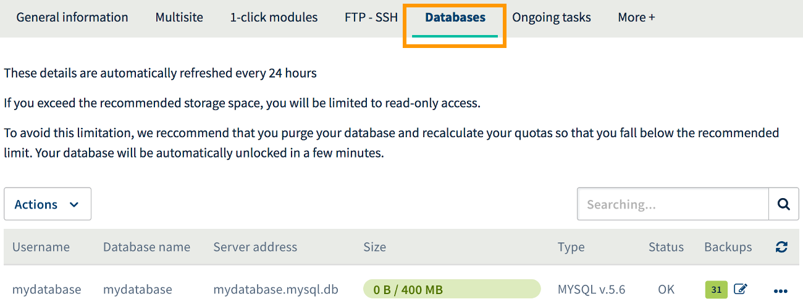
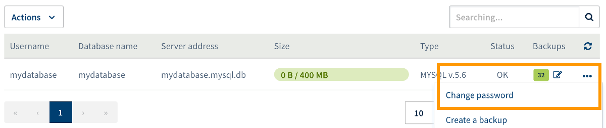
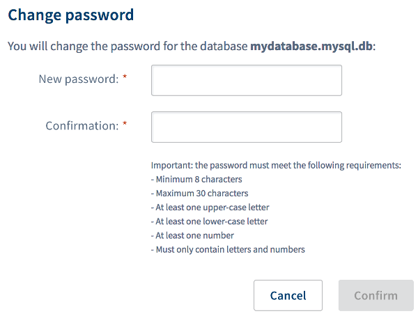

**Last updated May 25th, 2018**

## Objective

A *database* (“DB”) is used to store what are known as dynamic elements, such as comments or articles. These databases are used in virtually all modern *content management systems* (CMS), such as WordPress or Joomla!, and can be accessed using the password associated with them.

**Find out how to change the password for a database created as part of a Web Hosting plan.**

## Requirements

- You must have an [OVH Web Hosting plan](https://www.ovh.co.uk/web-hosting/){.external}.
- You must have the correct permissions to manage the Web Hosting plan in question from your [OVH Control Panel](https://www.ovh.com/auth/?action=gotomanager){.external}.

> [!warning]
>
> If you change the password for your database, you will need to make sure you also change the password in the configuration file that connects your database to your website.
>

## Instructions

### Step 1: Evaluate the situation

**Please take special care when changing your database's password.** If any changes are made incorrectly, any websites that use the database may become inaccessible. By learning more about the impact of changing database passwords, you can get a better understanding of the changes you will make.

Today, virtually all CMSs (WordPress, Joomla!, etc.) use a database for storing dynamic elements, such as comments or articles. As a result, the ability to connect to a database is essential for these websites to function correctly. To establish this connection, a configuration file is used that contains the database’s information. Accordingly, if you change the password for the database hosted at OVH, you need to make sure you make the same change in the file used to allow your website to connect to the database.

> [!primary]
>
> Before you make any changes, we highly recommend that you check whether or not your website is connected to a database. If it is, ensure that you know how to carry over the change to make sure that your website remains accessible.
>
> If you do not know how to do this, and since this procedure involves configuring your website rather than the services provided by OVH, we recommend that you contact the website’s editor, or contact a professional, such as a specialist service provider, for assistance.
>

### Step 2: Access the Web Hosting database management area

First of all, log in to your [OVH Control Panel](https://www.ovh.com/auth/?action=gotomanager){.external}, click `Web hosting`{.action} in the services bar on the left-hand side, then choose the Web Hosting plan concerned. Next, go to the `Databases`{.action} tab.

The table shown contains all the databases created as part of your Web Hosting plan.

{.thumbnail}

### Step 3: Change the password for the database

To change the password, click on the three dots to the right of the database concerned, then on `Change password`{.action}.

{.thumbnail}

Enter your new password in the window that pops up, enter it again, and click `Confirm`{.action}.

**The password change will take effect after a few minutes.**

> [!primary]
>
> For security reasons, please follow the conditions required when you choose a new password. We also recommend:
>
> - not using the same password twice
>
> - setting a password that does not contain any personal information (don’t include your surname, first name, or date of birth, for example)
>
> - regularly renewing your password 
>
> - not keeping any written records of your password, and not sending passwords to other people using your email address
>
> - not saving your passwords in your browser, even if your browser offers to do so
>

{.thumbnail}

### Step 4: Restore the link between the database and the website

> [!primary]
>
> This step may be optional, if your website is not connected to a database.
>

If your website displays a message to say that it was unable to connect to the database, this means that you have not added your new password to the configuration file used by your website to connect to your database.

In order for your website to be able to connect, there must be a file saved in your storage space that contains the information required for connecting to the database: a username and password, the name of the database, and the server address. Because the password has been modified in your OVH Control Panel, the connection is now broken.

To restore it, you need to enter the new password into the file containing the database’s information. Since this procedure involves configuring your website rather than the services provided by OVH, we recommend that you contact the website’s editor, or contact a professional, such as a specialist service provider, for assistance.

## Go further

[To find out more about password security, refer to this comprehensive advice page published by Get Safe Online](https://www.getsafeonline.org/protecting-yourself/passwords/){.external}.

Join our community of users on <https://community.ovh.com/en/>.