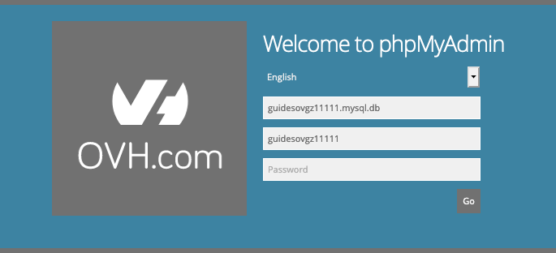

**Last updated 23th June 2020**

## Objective

A database (DB) is used to store what are known as dynamic elements, such as comments or articles. These databases are used in virtually all modern content management systems (CMS), such as WordPress or Joomla!.

**This guide explains the first steps with a database in your OVHcloud Web Hosting plan and provides some essential information about their management.**

## Requirements

- an [OVHcloud Web Hosting plan](https://www.ovh.co.uk/web-hosting)
- an available database of those included in your Web Hosting plan
- access to the [OVHcloud Control Panel](https://www.ovh.com/auth/?action=gotomanager) with the necessary permissions to manage the Web Hosting plan 

## Instructions

### Step 1: Accessing the Web Hosting database management section

Log in to your [OVHcloud Control Panel](https://www.ovh.com/auth/?action=gotomanager) and select `Web`{.action} in the top navigation bar. Click `Hosting plans`{.action} in the services bar on the left-hand side, then choose the Web Hosting plan concerned. Next, navigate to the `Databases`{.action} tab.

The table in this section contains all the databases created as part of your Web Hosting plan.

{.thumbnail}

### Step 2: Creating the database

There are two ways of creating a new database:

- **If you have not created a database yet**: click on the `Create a database`{.action} button.

- **If you have already created a database**: click on the `Actions`{.action} button, then on `Create a database`{.action}.

In the window that pops up, select the appropriate information, then click on `Next`{.action}.

|Information|Description|  
|---|---|  
|Database engine|Select the engine that the database will use. Databases included in an [OVHcloud Web Hosting plan](https://www.ovh.co.uk/web-hosting) are available with the MySQL engine only.|  
|Database version|Select the version used by the database engine. Verify that your website is compatible with the version you have chosen. |  
|Database type|Select the size of the database. This size refers to the space available to your database for storing data.|   

Then, fill in the information requested, and click `Next`{.action}.

|Information|Description|   
|---|---|   
|User|Enter a custom username that will be associated with your database.|   
|Password|Enter a password for this user, then confirm it.|   

Check that all the information displayed in the summary is correct. If it is, click on `Confirm`{.action} to launch the creation of the database. You can repeat this process as many times as you need, to create multiple databases (depending on the maximum number of included databases).

> [!primary]
>
> For security reasons, please follow the conditions required when you choose your password. We also recommend:
>
> - not using the same password twice
>
> - setting a password that does not contain any personal information (e.g. your surname, first name, date of birth, etc.)
>
> - renewing your password regularly
>
> - not keeping any written records of your password, and not sending passwords to other people using your email address
>
> - not saving your passwords in your browser, even if your browser offers to do so.
>

> [!warning]
>Bear in mind that if you change a database password, all applications that access this database must be updated accordingly.
>

{.thumbnail}

### Step 3: Managing your database

> [!warning]
>This guide does not replace the support of a professional, such as a webmaster. We recommend enlisting the services of a specialist provider and/or contacting your solution’s software publisher if you encounter any difficulties. We will not be able to assist you ourselves. You can find more information in the “Go further” section of this guide.
>

Now you can use your database. To do this, you will need your login details: the username and the password you have just set, the name of the database you have specified, and the server address. This information is essential for your website to connect to the database.

Depending on the software used, this connection may need to be configured manually, or via an interface generated by the website backend itself. Since this procedure involves configuring your website rather than the services provided by OVHcloud, we recommend that you make use of the appropriate knowledge resources available online. 

#### Accessing the phpMyAdmin interface

OVHcloud provides an online tool for database managment: phpMyAdmin. To find the access link for this application, from the `Databases`{.action} tab click on `...`{.action} to the right of the database concerned, then select `Go to phpMyAdmin`{.action} in the drop-down menu.

The login details will be pre-filled in the new window; you will only have to enter the database password. This is also a good way to verify your current password, for example if you are troubleshooting a CMS producing an "permission denied" error message.

{.thumbnail}

#### Using database backups

For every Web Hosting database, snapshots will be automatically created daily (up to 32 entities). This means you can simply restore an earlier version of a database from your OVHcloud Control Panel. 

To verify the available snapshots and their creation timestamp, click on the symbol right next to the green circle in your database table. You can also download each backup of a database from here. For detailed information about this topic, please refer to our guide on [Retrieving the backup of a Web Hosting plan’s database](../web_hosting_database_export_guide).

#### Understanding common issues

**Too many connections**

Web Hosting databases are limited to 30 simultaneous connections (system variable *max_connections*). SQL requests should therefore be optimised to prevent this kind of error. If issues persist anyway, alternative measures should be considered i.e. switching to a Private SQL database or a [hosting plan upgrade](https://www.ovh.co.uk/web-hosting/what_web_hosting_choice.xml). 

**Connection / "not found" errors**

It is best practice to always use the actual database name for scripts and configuration files, instead of IP addresses or _localhost_.

**Database overquota**

If a Web Hosting database exceeds the recommended storage space, it will be automatically switched to "read only" / "select only". The administrator will receive a notification by email.

After the database has been optimised (purged), you can recalculate its quota in your OVHcloud Control Panel to have it unlocked again. It is best practice to download the database, manage the revision locally and then replace it via import. Please refer to [this guide](../web_hosting_optimise_your_website_performance/#step-7-optimise-your-database) for further information.

## Go further

[Changing the password for a Web Hosting plan database](../change-password-database)

[Retrieving the backup of a Web Hosting plan’s database](../web_hosting_database_export_guide)

[Importing a backup into a Web Hosting plan database](../web_hosting_guide_to_importing_a_mysql_database)

[Optimise your website’s performance](../web_hosting_optimise_your_website_performance)

Join our community of users on <https://community.ovh.com/en/>.