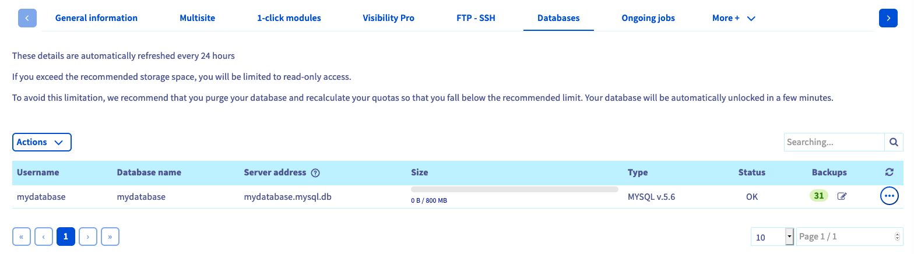

**Last updated May 24th, 2018**

## Objective

A *database* (“DB”) is used to store what are known as dynamic elements, such as comments or articles. These databases are used in virtually all modern *content management systems* (CMS), such as WordPress or Joomla!.

**Find out how to create a database in your OVH Web Hosting plan.**

## Requirements

- You must have an [OVH Web Hosting plan](https://www.ovh.co.uk/web-hosting/){.external}.
- You must be able to create databases as part of your package.
- You must have the necessary permissions to manage the Web Hosting plan in question from your [OVH Control Panel](https://www.ovh.com/auth/?action=gotomanager){.external}.

## Instructions

### Step 1: Access the Web Hosting database management section

First of all, log in to your [OVH Control Panel](https://www.ovh.com/auth/?action=gotomanager){.external}, click `Web Hosting`{.action} in the services bar on the left-hand side, then choose the web hosting plan concerned. Next, go to the `Databases`{.action} tab.

The table that pops up contains all the databases created as part of your Web Hosting plan.

{.thumbnail}

### Step 2: Create the database

There are two ways of creating a new database:

- **If you have not created a database yet**: click on the `Create a database`{.action} button.

- **If you have already created a database**: click on the `Actions`{.action} button, then on `Create a database`{.action}.

In the window that pops up, select the information that you want, then click on `Next`{.action}.

|Information|Description|  
|---|---|  
|Database engine|Select the engine that the database will use. Databases included in an [OVH Web Hosting plan](https://www.ovh.co.uk/web-hosting/){.external} are available with the MySQL engine only.|  
|Database version|Select the version used by the database engine. Check that your website is compatible with the version you have chosen. |  
|Database type|Select the size of the database. This size refers to the space available to your database for storing data.|   

Then fill in the information requested, and click `Next`{.action}.

|Information|Description|   
|---|---|   
|User|Enter a custom username that will be associated with your database.|   
|Password|Enter a password for this user, then confirm it.|   

Check that all the information displayed in the summary is correct. If it is, click on `Confirm`{.action} to launch the creation of the database. You can repeat this process as many times as you need, to create multiple databases.

> [!primary]
>
> For security reasons, please follow the conditions required when you choose your password. We also recommend:
>
> - not using the same password twice
>
> - setting a password that does not contain any personal information (don’t include your surname, first name, or date of birth, for example)
>
> - renewing your password regularly
>
> - not keeping any written records of your password, and not sending passwords to other people using your email address
>
> - not saving your passwords in your browser, even if your browser offers to do so
>

{.thumbnail}

### Step 3: Use your database

Now you can use your database. To do this, you will need your login details: the username and the password you have just set, the name of the database you have also just customised, and the server address.

This information is essential for your website to connect to the database. Depending on the website used, this connection may need to be configured manually, or via an interface generated by the site itself. Since this procedure involves configuring your website rather than the services provided by OVH, we recommend that you contact the website’s editor, or contact a professional, such as a specialist service provider, for advice on how to proceed.

OVH offers an online tool for this purpose: phpMyAdmin. To find the access link for this application, from the `Databases`{.action} tab, click on the three dots to the right of the database concerned in the table, then on `Go to phpMyAdmin`{.action}. You will need to enter the login details for the database created at OVH.

## Go further

Join our community of users on <https://community.ovh.com/en/>.