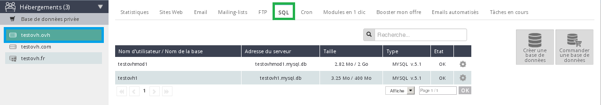
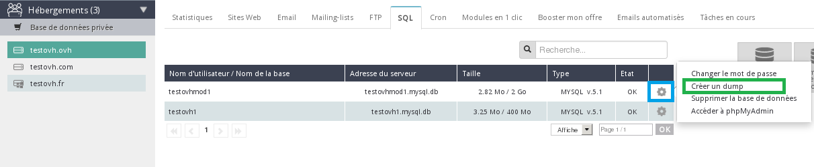
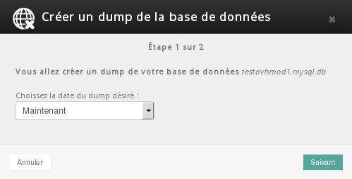
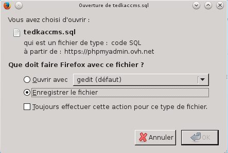

## Voraussetzungen
Für die Umsetzung dieser Anleitung benötigen Sie:


- Zugang zu Ihrem OVH Kundencenter.

- Den Namen und das Passwort Ihrer SQL Datenbank sowie den Namen des SQL Servers, auf dem diese läuft.
Wie Sie Ihre SQL Zugangsdaten abrufen wird in folgender Hilfe beschrieben:[]({legacy}1374)


In den folgenden Absätzen werden verschiedene Methoden für den Export Ihrer Datenbank vorgestellt.

{.thumbnail}


## Über das Kundencenter
Sie können eine Kopie Ihrer Datenbank direkt über Ihr OVH Kundencenter abrufen.

Dies ist die einfachste und schnellste Methode für den Export Ihrer Datenbank.

Verbinden Sie sich dazu mit Ihrem [OVH Kundencenter](https://www.ovh.com/manager/web).

Wählen Sie anschließend das Webhosting, dessen Datenbank exportiert werden soll, in der Rubrik Hosting-Pakete aus.

## Schritt 1
Wählen Sie das gewünschte Webhosting-Paket aus und klicken Sie dann in der Rubrik "Hosting-Pakete" auf "Datenbank".

Abhängig von der Größe Ihrer Datenbank kann der Export einige Zeit benötigen.

{.thumbnail}

## Schritt 2
Klicken Sie dann auf das Zahnrad-Icon rechts in der Zeile mit der gewünschten Datenbank und wählen Sie Einen Dump erstellen aus.

Die Liste der Datenbanken wird in der Tabelle angezeigt (siehe nebenstehenden Screenshot).

{.thumbnail}

## Schritt 3
Wählen Sie anschließend das gewünschte Datum für den Dump aus den gebotenen drei Möglichkeiten aus: Jetzt, Gestern oder Letzte Woche.


- Jetzt: Kopie der Datenbank zum jetzigen Zeitpunkt.

- Gestern: Kopie der Datenbank der vorherigen Nacht (Tag T-0), die Sicherung wird gegen 03:00 Uhr erstellt.

- Letzte Woche: Kopie der Datenbank voder vorherigen Woche (Tag T-7), die Sicherung wird gegen 03:00 Uhr erstellt.


Klicken Sie auf "Weiter" und anschließend auf "Bestätigen", um den Abruf der Sicherung zu starten.

Nach der Bestätigung dauert es abhängig von der Größe der Datenbank einige Zeit, bis Ihr Dump* bereitgestellt wurde. Sobald dies abgeschlossen wurde erhalten Sie eine E-Mail mit einem Link zum Download der Sicherungsdatei (Dump).

Hier ein Beispiel der Betreffszeile der versandten E-Mail:


```
[OVH Info] testovh.ovh - Dump Ihrer Datenbank: testovhmod1
```


In dieser E-Mail finden Sie den Link zum Herunterladen Ihres Dumps. Die Sicherung Ihrer Datenbank wird auf unserem Server für eine Dauer von 30 Tagen vorgehalten.

Die empfangene Datei ist komprimiert, es wird empfohlen, diese vor dem Import Ihrer SQL Sicherungsdatei erst zu dekomprimieren.

{.thumbnail}


## Über PhpMyAdmin
Wenn Sie den Export Ihrer Datenbank über PhpMyAdmin durchführen möchten, verbinden Sie sich zuerst mit dem [PhpMyAdmin Interface](https://phpmyadmin.ovh.net/).

## Schneller Export
Sobald Sie mit dem PhpMyAdmin Interface Interface verbunden sind wählen Sie Ihre Datenbank aus.

Klicken Sie anschließend auf "Exportieren".

Beim schnellen Export kann lediglich das Format Ihrer Datenbank ausgewählt werden.

Beim im nächsten Abschnitt beschriebenen personalisierten Export haben Sie zahlreiche weitere Optionen.

{.thumbnail}

## Personalisierter Export
Sobald Sie mit dem PhpMyAdmin Interface Interface verbunden sind wählen Sie Ihre Datenbank aus.

Klicken Sie anschließend auf "Exportieren".

Wählen Sie "Personalisiert - Alle verfügbaren Optionen anzeigen" aus.

Es werden dann verschiedene Optionen angezeigt:

Tabelle(n): 

Sie können auswählen, dass alle oder nur ein Teil der Tabellen exportiert werden sollen.

Dies ist zum Beispiel bei sehr großen Datenbanken interessant. So können Sie Ihre Datenbank in kleinere Teile aufsplitten, um sie in mehreren Etappen zu exportieren und wieder zu importieren.

Ausgabe: 

Hier können Sie auswählen, ob Ihre SQL Sicherung in eine externe Datei geschrieben oder das Ergebnis der Abfrage direkt angezeigt werden soll.

Format: 

Legen Sie das Format für den Export Ihrer Datenbank fest. Es wird empfohlen, die Einstellung "SQL" zu verwenden.

Formatspezifische Optionen:

Sie können hier angeben, welche Bestandteile der Tabelle Sie exportieren möchten: nur die Struktur, nur die Daten oder beides. Es wird empfohlen, die Einstellung "Struktur und Daten" zu verwenden.

Export-Optionen:

Wählen Sie die Export-Option "Keiner der oben aufgeführten Modi" aus, um einen Fehler im Zusammenhang mit "Max_Allowed_Packet" zu vermeiden.

In dieser Hilfe werden nur die wichtigsten Optionen vorgestellt.

Klicken Sie auf "Ausführen", um den Export zu starten.

{.thumbnail}

## Sicherung der .sql Datei
Wählen Sie aus, dass der Dump in eine Datei geschrieben werden soll, und speichern Sie dann die von PhpMyAdmin zum Download angebotene Datei.

{.thumbnail}

## Vorherige Sicherungen

- Sie können über PhpMyAdmin auch eine Sicherung vom Vortag oder der Vorwoche abrufen. Sie finden diese Option in dem Dropdown-Menü auf der Empfangsseite von phpMyAdmin.


## Mit Hilfe eines Skripts
Tip: Sie können diese Skripte als einfache Textdateien (.txt) erstellen und dann mit der Dateiendung der verwendeten Skriptsprache versehen.

Diese Lösung ist für alle Webhosting-Angebote verfügbar und erlaubt insbesondere den Export umfangreicher Dumps*.

Ersetzen Sie in den unten aufgeführten Skripten:


- name_der_sql_datei.sql durch den Namen Ihrer Datei.

- sql_server durch den Namen des Servers, auf dem Ihre Datenbank erstellt wurde.

- name_der_datenbank durch den Namen Ihrer Datenbank.

- passwort durch das Passwort Ihrer Datenbank.

Ihre Sicherungsdatei muss vor der Durchführung dieser Operationen per FTP auf Ihrem Webhosting-Speicherplatz abgelegt werden.

In PHP (backupbase.php):
Anzugebender und zu vervollständigender Code: 


```
<?
echo "Ihre Datenbank wird gesichert.......";
system("mysqldump --host=sql_server --user=name_der_datenbank --password=passwort name_der_datenbank > name_der_sql_datei.sql");
echo "Operation abgeschlossen. Sie können nun Ihre Datenbank per FTP herunterladen";
?>
```


In perl (backupbase.cgi):
Anzugebender und zu vervollständigender Code: 


```
#!/usr/bin/perl
print "Ihre Datenbank wird gesichert.......";
system("mysqldump --host=sql_server --user=name_der_datenbank --password=passwort name_der_datenbank > name_der_sql_datei.sql");
print "Operation abgeschlossen. Sie können nun Ihre Datenbank per FTP herunterladen";
```


- Laden Sie das von Ihnen erstellte Skript per FTP in den Ordner www auf Ihrem Webhosting-Speicherplatz hoch und rufen Sie es in Ihrem Browser über folgende URL auf: http://ihre_domain.tld/backupbase.php


Ersetzen Sie ihre_domain.tld durch Ihren Domainnamen und backupbase.php durch den Namen Ihrer Datei.

Der Befehl erzeugt eine Datei name_der_sql_datei.sql in dem Ordner, in dem sich das Skript befindet.

In dieser Datei finden Sie sämtliche SQL Instruktionen, um Ihre Datenbank mit allen zum Zeitpunkt der Sicherung vorhandenen Daten wiederherzustellen.

- Hinweis 1: Wenn Ihre Datenbank zu groß für einen Export im Ganzen ist, können Sie einen tabellenweisen Dump* erstellen, indem Sie die Option "--tables name_der_tabelle" am Ende hinzufügen. Sie erhalten dann folgenden Befehl:

mysqldump --host=sql_server --user=name_der_datenbank --password=passwort name_der_datenbank --tables name_der_tabelle > name_der_sql_datei.sql


- Hinweis 2: Sie können die erstellte Datei auch komprimieren, um deren Download-Volumen zu verringern.

Zur Komprimierung der Datei verwenden Sie den Befehl gzip, der als Ergebnis dann eine Datei mit der Endung .sql.gz erzeugt:
system("gzip name_der_sql_datei.sql");


## Über einen SSH Befehl

## Voraussetzungen

- Ihre FTP Zugangsdaten für die Verbindung mit dem Speicherplatz des Webhostings.
 In folgender Hilfe wird beschrieben, wo Sie Ihre FTP Zugangsdaten finden: []({legacy}1374)

- Ein Webhosting-Angebot, das den Zugriff per SSH unterstützt: ([Unsere Webhosting-Angebote vergleichen](https://www.ovh.de/hosting/))


Unter folgendem Link finden Sie eine Hilfe zur Nutzung von SSH bei einem Webhosting-Paket:


- [Verwendung von SSH auf einem Webhosting](http://hilfe.ovh.de/SshSharedHosting)


## Durchführung des Datenbankexports per SSH:
Verbinden Sie sich per SSH mit Ihrem Webhosting.

Begeben Sie sich in das Verzeichnis, in dem die Sicherung gespeichert werden soll, und geben Sie folgenden Befehl ein:

Anzugebender und zu vervollständigender Code: 


```
mysqldump --host=sql_server --user=name_der_datenbank --password=passwort name_der_datenbank > name_der_sql_datei.sql
```


Beispiel: 


```
mysqldump --host=sql3 --user=testbackup --password=RtPgDsmL testbackup > testbackup.sql
```


## Über die SQL Private Dienstleistung
Unter folgendem Link finden Sie eine Hilfe zum Import von Datenbanken:


- []({legacy}2023)


## Sicherung - Backup
Wenn Sie mit Hilfe eines Skripts eine ältere Sicherung einer Ihrer Datenbanken abrufen möchten, müssen Sie jeweils einen bestimmten Port angeben:

Aktuelle Kopie = Port 3306
Gestern = Port 3307
Letzte Woche = Port 3317

Hier ein Beispiel für den zu verwendenden Code:

PHP:

```
system("mysqldump --host=sql_server --user=name_der_datenbank --password=passwort --port=3317 name_der_datenbank > name_der_sql_datei.sql ");
```


- Dieses Backup-System ist für Datenbanken ab MySQL Version 5 aufwärts verfügbar.


## Fehler "Max_Allowed_Packet" beim Import des Dumps*
Bei der Erstellung eines Dumps* kann es hilfreich sein, den Export Ihrer SQL Datenbank über PhpMyAdmin zu personalisieren.

Das Ziel dabei ist, zu vermeiden, dass der gesamte Inhalt einer Tabelle mit einem einzigen "INSERT INTO" hinzugefügt wird, was beim Import des Dumps zu Fehlern in Zusammenhang mit der Variable "Max_Allowed_Packet führen kann, wenn der Inhalt dieser Tablle sehr umfangreich ist.

Beispiel: Wenn die Tabelle A 500 Zeilen enthält, erhält man so statt einem einzigen "INSERT INTO" für die 500 Zeilen 500 getrennte "INSERT INTO" Operationen.

Über PhpMyAdmin:

Setzen Sie dazu für den Export in PhpMyAdmin ein Häkchen bei der Option "Keiner der oben aufgeführten Modi", um Fehler in Zusammenhang mit "Max_Allowed_Packet" zu vermeiden.

Per SSH:

Sie müssen die Option --skip-extended-insert verwenden.

Die Option --extended-insert ist in der standardmäßig aktivierten Option --opt enthalten und generiert ein einziges INSERT INTO für eine gesamte Tabelle. Diese Option muss deshalb mit folgendem Befehl deaktiviert werden:


```
--skip-extended-insert
```


{.thumbnail}


## Glossar
Dump*: Datei mit der Sicherung Ihrer Datenbank. 

