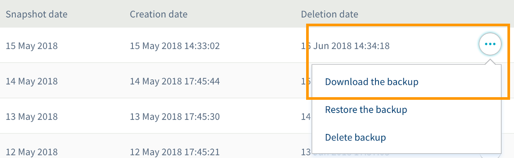

**Dernière mise à jour le 11/07/2018**

## Objectif

Aujourd'hui utilisées par la quasi-totalité des systèmes de gestion de contenu (Content Management System ou CMS) comme WordPress, Joomla!, les bases de données permettent de stocker des éléments dits dynamiques comme des commentaires ou des articles par exemple. Pour diverses raisons, vous pouvez être amené à devoir réaliser une sauvegarde de votre base de données afin d'en récupérer le contenu.

**Découvrez comment récupérer la sauvegarde d'une base de données de votre hébergement web OVH.**

## Prérequis

- Disposer d'une offre d’[hébergement web OVH](https://www.ovh.com/fr/hebergement-web/){.external}.
- Disposer d'une base de données créée dans le cadre d'une offre d'[hébergement web OVH](https://www.ovh.com/fr/hebergement-web/){.external}.
- Selon la méthode de sauvegarde utilisée, disposer d'un accès à la gestion de l'offre d'hébergement web depuis l'[espace client OVH](https://www.ovh.com/auth/?action=gotomanager){.external} ou des informations permettant de se connecter à la base de données.

## En pratique

Avant de commencer cette manipulation, vous devez définir la méthode que vous allez utiliser pour récupérer la sauvegarde de la base de données. Plusieurs possibilités s’offrent à vous, suivant les compétences techniques dont vous disposez sur le sujet.

- **Utiliser l'outil de sauvegarde d'OVH** : cette solution vous permet de récupérer des sauvegardes de vos bases de données depuis l'[espace client OVH](https://www.ovh.com/auth/?action=gotomanager){.external}. Il s'agit de la solution la plus accessible, car elle ne demande pas de compétences techniques particulières.

- **Réaliser la sauvegarde depuis l'interface web phpMyAdmin** : cette solution nécessite de se connecter à l'interface phpMyAdmin pour effectuer la manipulation. Savoir maîtriser cette dernière est donc nécessaire pour pouvoir l'utiliser.

- **Utiliser un script réalisant la sauvegarde** : cette solution nécessite de créer un script enregistré sur votre hébergement web OVH, afin de pouvoir réaliser la sauvegarde. Des connaissances spécifiques pour cette création sont nécessaires.

- **Réaliser la sauvegarde depuis une commande SSH** : cette solution nécessite de vous connecter à votre espace de stockage via le protocole SSH, puis d'utiliser des commandes pour interagir avec celui-ci. Des connaissances plus avancées, ainsi qu’une offre d’[hébergement web OVH](https://www.ovh.com/fr/hebergement-web/){.external} spécifique sont nécessaires pour utiliser ce type d’accès.

Certaines des méthodes ci-dessus ne sont pas inhérentes à une interface OVH. Vous devrez donc, pour ces dernières, réaliser la manipulation selon vos propres connaissances. Quelques informations sont présentes ci-dessous, mais elles ne peuvent se substituer à l’aide d’un webmaster. 

Poursuivez la lecture de cette documentation selon la méthode de sauvegarde souhaitée.

> [!warning]
>
> OVH met à votre disposition des services dont la configuration, la gestion et la responsabilité vous incombent. Il vous revient de ce fait d’en assurer le bon fonctionnement.
>
> Nous mettons à votre disposition ce guide afin de vous accompagner au mieux sur des tâches courantes. Néanmoins, nous vous recommandons de faire appel à un prestataire spécialisé et/ou de contacter l’éditeur du service si vous éprouvez des difficultés. En effet, nous ne serons pas en mesure de vous fournir une assistance. Plus d’informations dans la section « Aller plus loin » de ce guide.
>

### Récupérer une sauvegarde via l'outil d'OVH

Pour accéder à l'outil de sauvegarde d'OVH, connectez-vous à votre [espace client OVH](https://www.ovh.com/auth/?action=gotomanager){.external}, cliquez sur `Hébergements`{.action} dans la barre de services à gauche, puis choisissez le nom de l'hébergement concerné. Positionnez-vous enfin sur l'onglet `Bases de données`{.action}.

Le tableau qui s'affiche contient toutes les bases de données créées dans le cadre de votre offre d'hébergement web. Dès lors, vous pourrez choisir de réaliser une nouvelle sauvegarde ainsi que d'en récupérer une via deux manipulations distinctes.

#### Étape 1 : effectuer une nouvelle sauvegarde de la base de données

Toujours depuis l'onglet `Bases de données`{.action}, cliquez sur les trois points à droite de la base de données dont vous souhaitez réaliser une sauvegarde, puis sur `Créer une sauvegarde`{.action}.

{.thumbnail}

Sur la fenêtre qui apparaît, sélectionnez la date souhaitée de la sauvegarde, puis cliquez sur le bouton `Suivant`{.action}. Assurez-vous que les informations dans le récapitulatif sont correctes, puis cliquez sur `Valider`{.action} pour initier la manipulation.

Patientez le temps que la sauvegarde se réalise. Dès que celle-ci est disponible, vous pourrez la récupérer.

{.thumbnail}

#### Étape 2 : récupérer une sauvegarde de la base de données

Toujours depuis l'onglet `Bases de données`{.action}, cliquez sur les trois points à droite de la base de données dont vous souhaitez récupérer une sauvegarde, puis sur `Restaurer une sauvegarde`{.action}.

{.thumbnail}

Le tableau qui s'affiche contient toutes les sauvegardes disponibles de la base de données sélectionnée. Vous pourrez y visionner la date précise des sauvegardes ainsi que celle à laquelle ces dernières seront supprimées de l'outil d'OVH.

Pour télécharger une sauvegarde, cliquez sur les trois points à droite de celle que vous souhaitez récupérer, puis sur `Télécharger la sauvegarde`{.action}. Une fenêtre vous invitant à l'enregistrer sur votre machine apparaît. Acceptez, puis patienter le temps que la sauvegarde soit téléchargée.

{.thumbnail}

### Récupérer une sauvegarde depuis l'interface web phpMyAdmin

Pour réaliser la manipulation, vous devez vous connecter à phpMyAdmin. Pour connaître le lien d'accès à ce dernier, connectez-vous à votre [espace client OVH](https://www.ovh.com/auth/?action=gotomanager){.external}, cliquez sur `Hébergements`{.action} dans la barre de services à gauche, puis choisissez le nom de l'hébergement concerné. Positionnez-vous enfin sur l'onglet `Bases de données`{.action}.

Le tableau qui s'affiche contient toutes les bases de données créées dans le cadre de votre offre d'hébergement web. Cliquez dans ce dernier sur les trois points à droite de la base de données concernée puis sur `Accéder à phpMyAdmin`{.action}.

{.thumbnail}

Une fois sur la page de phpMyAdmin, renseignez les informations de la base de données, choisissez dans le menu déroulant si vous souhaitez afficher les données actuelles de la base de données ou celles d'une sauvegarde antérieure, puis connectez-vous. Une fois connecté, rendez-vous à présent sur l'onglet `Exporter`{.action} où deux méthodes d'exportation sont proposées :

- **méthode rapide** : vous pouvez définir le format d'export de la sauvegarde. Le plus courant est le format SQL, mais d'autres sont proposés selon vos besoins ;

- **méthode personnalisée** : vous pouvez définir en détail les paramètres d'exportation de la sauvegarde.

> [!warning]
>
> L'interface phpMyAdmin n'ayant pas été créée par OVH, vous devrez réaliser la manipulation selon vos propres connaissances. Nous vous recommandons de faire appel à un prestataire spécialisé et/ou de vous rapprocher du site l’éditeur de l'interface si vous éprouvez des difficultés. En effet, nous ne serons pas en mesure de vous fournir une assistance à ce propos.
>

### Récupérer une sauvegarde en utilisant un script

La manipulation s'effectue en plusieurs étapes. Assurez-vous d'être en possession des informations permettant de se connecter à la base de données dont vous souhaitez réaliser la sauvegarde : un nom d’utilisateur, son mot de passe, le nom de la base de données ainsi que l’adresse du serveur.

> [!warning]
>
> Cette solution est technique et requiert des compétences en programmation. Quelques informations sur la manière de procéder sont présentes ci-dessous. Cependant, nous vous recommandons de faire appel à un prestataire spécialisé si vous éprouvez des difficultés. En effet, nous ne serons pas en mesure de vous fournir une assistance à ce propos.
>

#### Étape 1 : créer le script de sauvegarde

La première étape consiste à créer le script qui permettra de réaliser la sauvegarde de la base de données. Vous trouverez ci-dessous un exemple de script pouvant vous aider dans votre démarche mais il ne se substitue pas à l’aide d’un webmaster.

```php
<?
system("mysqldump --host=adresse_du_serveur --user=nom_utilisateur --password=mot_de_passe_utilisateur nom_base_de_données > nom_fichier_sauvegarde.sql");
?>
```

Prenez soin de remplacer les informations génériques dans ce script par les informations de la base de données concernée en vous aidant des éléments ci-dessous. Une fois le script terminé, nous vous conseillons de le nommer « sauvegarde.php » par exemple.

|Informations|À remplacer par|
|---|---|
|adresse_du_serveur|L'adresse du serveur de la base de données concernée.|
|nom_utilisateur|Le nom d'utilisateur disposant d'un accès à la base de données.|
|mot_de_passe_utilisateur|Le mot de passe du nom d'utilisateur indiqué précédemment.|
|nom_base_de_données|Le nom de la base de données concernée.|
|nom_fichier_sauvegarde|Le nom que portera le fichier de sauvegarde une fois cette dernière exécutée.|

> [!primary]
>
> Si le datacenter de votre hébergement web est Paris (P19), vous pouvez réaliser une sauvegarde à partir d'une date antérieure en ajoutant un port dans votre script. Pour une sauvegarde à la date d'hier, utilisez le port « 3307 ». Pour une sauvegarde d'il y a sept jours, utilisez le port « 3317 ». 
> 
> À noter que l'utilisation du port « 3306 » permettra de réaliser une sauvegarde des données actuellement présentes dans la base de données.
>

#### Étape 2 : télécharger le script sur l'espace de stockage

Une fois le script de sauvegarde correctement créé, vous devez le télécharger sur l'espace de stockage de votre hébergement web. Pour cela, vous devrez vous connecter à ce dernier. Si vous ne savez pas comment faire, reportez-vous aux informations décrites dans l'étape 2 de la documentation intitulée « [Se connecter à l’espace de stockage](https://docs.ovh.com/fr/hosting/mettre-mon-site-en-ligne/#2-se-connecter-a-lespace-de-stockage){.external} ».

Afin de pouvoir mener à bien les étapes suivantes, téléchargez le script dans le dossier « www ». **Nous vous invitons à être particulièrement attentif quant au nom du fichier du script de sauvegarde.** Assurez-vous de ne pas écraser un fichier déjà existant portant le même nom sur l'espace de stockage lorsque vous allez télécharger le script. Si un message d'avertissement de ce type apparaît, modifiez le nom du script nouvellement créé pour un autre puis tentez de nouveau de le télécharger.

#### Étape 3 : appeler le script

À présent que le script est téléchargé sur l'espace de stockage, il ne reste plus qu'à initier le code présent dans celui-ci. Pour cela, il est nécessaire d'appeler le script.

Pour effectuer cette manipulation, vous devez accéder depuis votre navigateur internet à l'adresse URL complète du script (par exemple : mypersonaldomain.ovh/sauvegarde.php si vous avez nommé votre script « sauvegarde.php »). Si les informations renseignées dans le script sont correctes, la sauvegarde s'initie. Il ne vous reste plus qu'à patienter quelques instants le temps qu'elle s'exécute. Si ce n'est pas le cas, vérifiez les informations renseignées dans le script puis tentez de nouveau la manipulation.

#### Étape 4 : récupérer la sauvegarde depuis l'espace de stockage

Une fois la sauvegarde réalisée, vous pouvez la récupérer dans le dossier où le script de sauvegarde a été téléchargé. La sauvegarde de la base de données doit porter le nom qui a été défini précédemment dans le script. Il ne vous reste donc plus qu'à récupérer la sauvegarde sur votre propre machine.

Avant de terminer, nous vous conseillons vivement de supprimer le fichier de sauvegarde ainsi que le script du répertoire « www ».

> [!primary]
>
> L'utilisation d'un script de sauvegarde et des tâches planifiées (dites « CRON ») peuvent vous permettre d'automatiser des sauvegardes à une fréquence de votre choix. Apprenez-en plus sur les tâches planifiées via notre documentation : « [Mettre en place une tâche planifiée (CRON) sur son hébergement web](https://docs.ovh.com/fr/hosting/mutualise-taches-automatisees-cron/){.external} ».
>

### Récupérer une sauvegarde via une commande SSH

Pour réaliser la manipulation, vous devrez utiliser des commandes depuis un terminal pour interagir avec votre espace de stockage.

> [!warning]
>
> Des connaissances plus avancées sont nécessaires pour utiliser ce type d’accès. Quelques informations sur comment procéder sont présentes ci-dessous, cependant, nous vous recommandons de faire appel à un prestataire spécialisé si vous éprouvez des difficultés. En effet, nous ne serons pas en mesure de vous fournir une assistance à ce propos.
>

Une fois connecté à votre espace de stockage via une connexion en SSH, vous devez utiliser une commande permettant de réaliser la sauvegarde de la base de données. Vous en trouverez une ci-dessous pouvant vous aider dans votre démarche. Prenez en compte que la sauvegarde sera réalisée dans le répertoire actif au moment où vous enverrez la commande dans votre terminal.

```sh
mysqldump --host=adresse_du_serveur --user=nom_utilisateur --password=mot_de_passe_utilisateur nom_base_de_données > nom_fichier_sauvegarde.sql
```

Prenez soin de remplacer les informations génériques de cette commande par les informations de la base de données concernée. Une fois la sauvegarde réalisée, il ne vous reste plus qu'à la récupérer sur votre propre machine.

## Aller plus loin

Échangez avec notre communauté d'utilisateurs sur <https://community.ovh.com>.