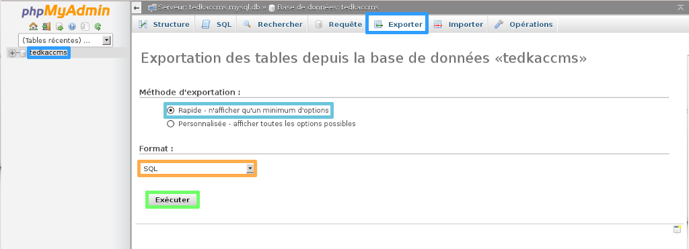
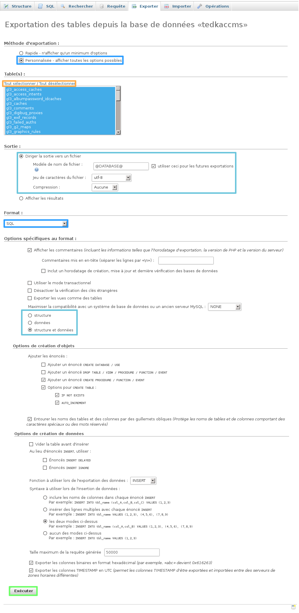
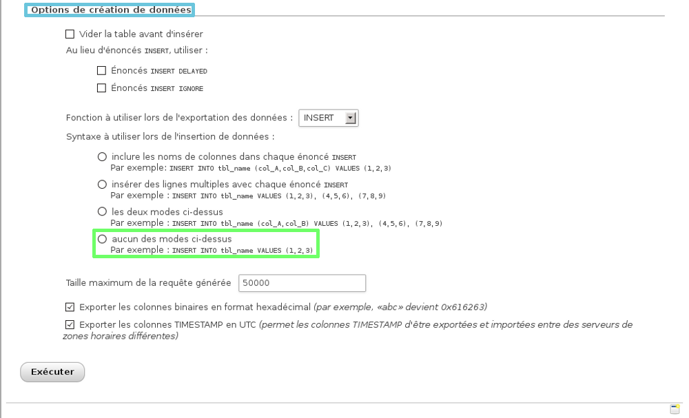

## Généralités

### Pre-requis
Vous devez avoir en votre possession :

- Un accès à votre espace client.
- Votre identifiant et le mot de passe de la base de données SQL ainsi que l'hôte sql qui vous permettent de vous y connecter.


{.thumbnail}


## Exportation

### Depuis l'espace client
Il vous est possible de récupérer la copie de votre base de données depuis l'espace client.

Ceci est la méthode la plus simple et la plus rapide afin de réaliser l'exportation de votre base de données.

Vous devez dans un premier temps vous connecter à [l'espace client](https://www.ovh.com/manager/web){.external}.

Une fois connecté à l'espace client, sélectionnez votre hébergement dans la section hébergement. Dans la partie "Hébergement" sélectionnez l'hébergement concerné puis onglet "Gestion SQL".

*En fonction de la taille de votre base de données, la création de la sauvegarde de votre base peut être plus ou moins longue.*


{.thumbnail}

Cliquez ensuite sur "la roue crantée" à droite de la base concerné puis créer un dump.

La liste des bases de données apparaît dans le tableau (cf. screen ci-contre).


{.thumbnail}

Vous devez ensuite sélectionner la date de votre backup: Maintenant, Hier, la semaine dernière.

Trois dates de sauvegarde sont récupérables :

- Maintenant : copie de la base de données à l'instant T.
- Hier : copie de la base de données de la nuit (J-0), la sauvegarde récupérée est réalisés aux alentours de 3h du matin.
- La semaine dernière : copie de la base de données à J-7, la sauvegarde récupérée est réalisée aux alentours de 3h du matin.

Cliquez sur "Suivant" puis "Valider"pour lancer le rapatriement de votre sauvegarde SQL.

Une fois validé, il vous faut patienter le temps que votre dump* soit rapatrié, ensuite vous recevrez un mail avec un lien permettant de télécharger le fichier de sauvegarde (dump).

Voici un exemple du sujet de l'e-mail reçu :


```bash
[OVH-SQL] testovh.ovh - Dump de votre base: testovhmod1
```

Un lien vers le fichier de sauvegarde sera disponible dans l'e-mail. La sauvegarde de votre base sera disponible sur un serveur distant pendant une durée de  **30**  jours.

Le fichier reçu sera compressé, il est conseillé de le décompresser avant d'importer votre fichier de sauvegarde SQL.


{.thumbnail}


### Depuis PhpMyAdmin
Si vous souhaitez réaliser l'exportation de la base de données depuis **PhpMyAdmin** .

Vous devez dans un premier temps vous connecter sur [l'interface de PhpMyAdmin](https://phpmyadmin.ovh.net/){.external}. Une fois connecté, sélectionnez votre base de données (cf. cadre bleu screen ci-contre).

Rendez-vous ensuite dans "Exporter".

L'exportation rapide ne vous permet que de choisir le format concernant l'importation de votre base de données.

Voyons dans la seconde partie l'exportation personnalisée qui sera plus complète.


{.thumbnail}

Une fois connecté, sélectionnez votre base de données.

Rendez-vous ensuite dans "Exporter".

Sélectionnez "Personnalisée - afficher toutes les options possibles".

*Différentes options vont apparaître.*

**Table(s)** :

Il vous est possible de sélectionner la totalité ou une partie des tables que vous souhaitez exporter.

*Cela peut être intéressant lorsque votre base de données est très imposante, vous pouvez exporter puis importer votre base de données en plusieurs fois.*

**Sortie** :

Il vous est possible de définir ici si vous souhaitez générer votre sauvegarde SQL dans un fichier externe, ou afficher directement le résultat de la requête qu'il faudra copier.

**Format** :

Définissez le format d'exportation de votre base de données. Il est conseillé de laisser SQL.

**Options spécifiques au format** :

Il vous est possible de définir ce que vous souhaitez exporter de la table. Soit uniquement les structures ou les données, ou alors exporter les deux. Il est conseillé de renseigner "structure et données".

**Options d'exportation** :

Sélectionnez l'option d'exportation "Aucun des modes ci-dessus" afin d'éviter l'erreur associé au "Max_Allowed_Packet".

*Ne seront vues dans ce guide que les options les plus importantes.*

Afin de lancer l'exportation, cliquez sur "Exécuter".


{.thumbnail}

Un lien vers votre dump* va ainsi pouvoir être téléchargé.

Enregistrez le fichier que PhpMyAdmin vous propose de télécharger.


{.thumbnail}


> [!success]
>
> - Il est possible depuis PhpMyAdmin de récupérer une sauvegarde de la
> veille et de la semaine dernière depuis l'accueil de phpMyAdmin via
> un menu déroulant.
>

### En utilisant un script
*Il vous est possible de créer ces scripts dans un fichier txt. Vous devrez leur donner l'extension correspondant au langage utilisé.*

Cette solution est intéressante, car elle vous permet d'exporter des dumps* importants et est accessible pour tous les hébergements mutualisés.

Dans les scripts ci-dessous, remplacez :

- nom_de_la_base.sql par le nom de votre fichier.
- serveur_sql par le nom du serveur sur lequel votre base de données est créé .
- nom_de_la_base par le nom de votre base de données.
- mot_de_passe par le mot de passe associé à votre base de données.
- Uploadez via FTP le script que vous avez créé dans le répertoire www de votre hébergement, et appelez votre script avec le navigateur via cette url : [http://votre_domaine.com/backupbase.php](http://votre_domaine.com/backupbase.php){.external}

**backupbase.php**  par le nom de votre fichier.

Cette commande générera un ficher  **nom_de_la_base.sql**  dans le répertoire où le script est placé.

Dans ce fichier, vous trouverez toutes les instructions SQL pour recréer la base telle qu'elle était lors de la sauvegarde avec l'ensemble de ses données.


> [!success]
>
> - Remarque 1 : Si jamais votre base est trop volumineuse, vous pouvez
> faire un dump* table par table en ajoutant l'option "--tables
> nom_de_la_table" à la fin pour avoir cette commande :
> 
> mysqldump --host=serveur_sql --user=nom_de_la_base --password=mot_de_passe nom_de_la_base --tables nom_de_la_table > nom_de_la_base.sql
> - Remarque 2 : Vous pouvez aussi compresser ce fichier pour mieux le
> télécharger sur votre ordinateur (par FTP ou par le web).
> 
> Pour compresser le fichier, exécutez la commande gzip ce qui créera le fichier par l'extension .sql.gz :
> system("gzip nom_de_la_base.sql");
> 


### Via une commande ssh
- Récupérez votre identifiant et le mot de passe FTP qui vous permettent de vous connecter sur l'hébergement web.
- Avoir une offre permettant l'accès via ssh ( [voir les
caractéristiques de nos
offres](https://www.ovh.com/fr/hebergement-web/){.external} )
- [Connexion ssh mutualisé](http://guide.ovh.net/SshMutualise){.external}

Connectez-vous en ssh à votre hébergement mutualisé.

Dirigez-vous dans le répertoire voulu pour stocker la sauvegarde, et lancez cette commande :

*Le code à renseigner et à compléter :*


```bash
mysqldump --host=serveur_sql --user=nom_de_la_base --password=mot_de_passe nom_de_la_base > nom_de_la_base.sql
```

*Le code complété en exemple :*


```bash
mysqldump --host=sql3 --user=testbackup --password=RtPgDsmL testbackup > testbackup.sql
```


### Depuis le service SQL privé
Un guide concernant l'importation d'une base de données est disponible à ce niveau :

- []({legacy}2023){.ref}


## Informations utiles

### Sauvegarde - Backup
Si vous souhaitez récupérer une sauvegarde de l'une de vos bases de données à une date antérieure via l'utilisation d'un script, vous devrez préciser un numéro de port spécifique :

Copie actuelle =  **3306** Hier =  **3307** Semaine dernière =  **3317**

Exemple de code qu'il est possible d'utiliser :

PHP :


```bash
system("mysqldump --host=serveur_sql --user=nom_de_la_base --password=mot_de_passe --port=3317 nom_de_la_base > nom_de_la_base.sql ");
```


> [!success]
>
> - Ce système de backup est disponible pour les bases de données avec la
> version Mysql5 minimum.
>

### Erreurs &quot;Max_Allowed_Packet&quot; lors de l'import du dump*
Lors d'un dump*, il peut être intéressant de personnaliser l'export de votre base de données SQL via PhpMyAdmin.

Le but est d'éviter que tout le contenu d'une table soit ajouté via un seul "**INSERT INTO**" pour éviter les erreurs liées à la variable serveur "**Max_Allowed_Packet**" lors de l'import du dump* si le contenu de cette table est important.

Exemple, si la table A contient 500 lignes, au lieu d'avoir un seul "INSERT INTO" pour les 500 lignes, il y aura à la place 500 "INSERT INTO".

**Via PhpMyAdmin** :

Pour cela lors de votre export dans PhpMyAdmin, cochez l'option de création de données "Aucun des modes ci-dessus" afin d'éviter l'erreur associée au "Max_Allowed_Packet".

**En ssh** :

Vous devez utiliser l'option --*skip-extended-insert*.

L'option --extended-insert, incluse dans l'option --opt (Activée par  défaut), génère un unique INSERT INTO pour tout une table, il faut donc désactiver cette option grâce au :


```bash
--skip-extended-insert
```


{.thumbnail}


### Lexique
dump* : *fichier de sauvegarde de la base de données de votre site.*