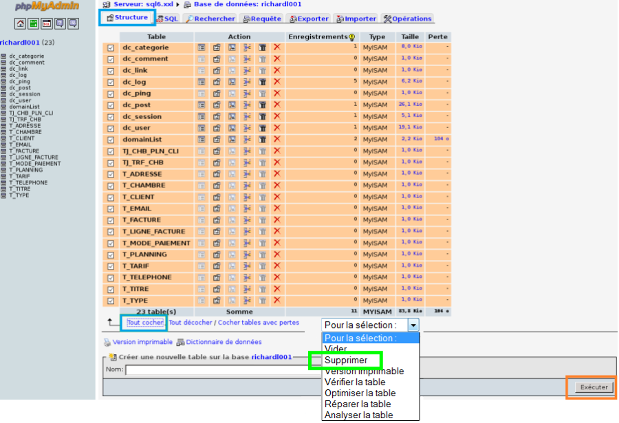

## Warum migrieren?
Es ist wichtig, immer mit den neuesten Versionen der verschiedenen Dienste zu arbeiten.
Wenn neue Versionen veröffentlicht werden, gibt es manchmal auch neue Funktionalitäten, vor allem aber wird die Sicherheit verbessert und der gesamte Dienst optimiert.
Wenn Sie die von Ihnen verwendeten Dienste immer aktuell halten, sind auch die von Ihnen selbst angebotenen Dienste aktuell, leistungsfähig und sicher.

## Wie viel Zeit wird die Migration in Anspruch nehmen?
Wenn Sie alle in dieser Anleitung beschriebenen Schritte genau befolgen, sollte die Migration etwa 10 bis 40 Minuten dauern.

## Wenn Sie die Zugangsdaten vergessen haben
Loggen Sie sich zunächst in Ihr [Kundencenter](https://www.ovh.com/manager/web/login/) ein.

Wählen Sie dann im Menü links unter "Hosting-Pakete" das gewünschte Hosting aus.
Gehen Sie anschließend in den Tab "Datenbank".

Hier sehen Sie die Liste der bisher erstellten Datenbanken.
Schauen Sie dort nach, ob es noch eine Datenbank in Version 4 gibt.
Links sehen Sie den Benutzernamen und die Server-Adresse (wenn Sie ihre Maus darüberbewegen, werden die Details angezeigt).

Klicken Sie rechts auf das kleine Zahnrad:
Hier können Sie Das Passwort ändern, falls Sie es vergessen haben.

{.thumbnail}

## Verbindung zur Datenbank Version SQL 4
Um sich mit Ihrer SQL 4 Datenbank zu verbinden, haben Sie zwei Möglichkeiten:

- Verwenden Sie [diesen Link](https://phpmyadmin.ovh.net/old/).
oder
- Gehen Sie in Ihrem [Kundencenter](https://www.ovh.com/manager/web/login/) in den Bereich "Hosting-Pakete" und dort in den Tab "Datenbank", klicken Sie auf das kleine Zahnrad rechts neben der betroffenen SQL 4 Datenbank. Klicken Sie dann auf "Zugang zu phpMyAdmin" und dann unten auf der Seite auf den Link [https://phpmyadmin.ovh.net/old/](https://phpmyadmin.ovh.net/old/).

{.thumbnail}
Wenn Sie auf dem [phpmyadmin](https://phpmyadmin.ovh.net/old/) Interface sind, müssen Sie sich einloggen:

- Benutzername = Benutzer der Datenbank (in unserem Screenshot blau).
- Passwort = Passwort der Datenbank.
- Server Auswählen = Adresse des Servers. Diese finden Sie in Ihrem Kundencenter im Tab "Datenbank", z. B. sql6.xxl in unserem Screenshot.

{.thumbnail}

## Wie kann ich eine Sicherung meiner SQL 4 Datenbank erstellen?
Wenn Sie mit PhpMyAdmin verbunden sind, klicken Sie in der Spalte links auf Ihre Datenbank.
Klicken Sie dann auf den Tab "Exportieren".
Wählen Sie Ihre Export-Optionen aus.
Im Zweifel verwenden Sie einfach die Standard-Einstellungen.

Klicken Sie jetzt ganz unten rechts auf "Ausführen".

Nun wird ein Text mit dem Inhalt Ihrer Datenbank erstellt.

Übertragen Sie diesen Text per Copy&Paste in eine Textdatei auf ihrem Rechner, die Sie im Format ".SQL" abspeichern.

Ihre Datenbank ist jetzt lokal auf ihrem Rechner gespeichert.

{.thumbnail}

## Wie kann ich meine SQL 4 Datenbank leeren?
Wenn Sie eine Sicherung Ihrer Datenbank erstellt haben, müssen Sie diese in PhpMyAdmin leeren.
Klicken Sie dafür erneut in der Spalte links auf die betreffende Datenbank.

In der Mitte erscheint eine Übersicht aller Tabellen.

Nun müssen Sie nur unten auf "Alle auswählen" klicken und im Dropdown-Menü rechts "Löschen" auswählen.

Klicken Sie dann "Ausführen".

Nun wird eine Bestätigung angefordert. Klicken Sie einfach auf "Ja".

Wenn Sie diese Operation ausgeführt haben, ist Ihre Datenbank leer.

{.thumbnail}

## Wie kann ich meine SQL 4 Datenbank löschen?
Sie können PhpMyAdmin jetzt verlassen.
Wählen Sie nun in Ihrem [Kundencenter](https://www.ovh.com/manager/web/login/) das gewünschte Hosting aus und begeben Sie sich in den Tab "Datenbank".

Klicken Sie rechts neben Ihrer MYSQL v4.0 Datenbank auf das kleine Zahnrad und dann auf "Die Datenbank löschen".

Nun wird in einem Popup eine Bestätigung angefordert. Klicken Sie auf "Bestätigen".

Es wird nun 10 bis 15 Minuten dauern, bis Ihre Datenbank endgültig gelöscht ist.

{.thumbnail}

## Wie erstelle ich eine MySQL 5.5 Datenbank?
Wenn Ihre SQL 4 Datenbank gelöscht ist, müssen Sie eine neue Datenbank in MySQL Version 5.5 erstellen.
Gehen Sie hierfür in Ihrem [Kundencenter](https://www.ovh.com/manager/web/login/) im Bereich Hosting-Pakete, in den Tab Datenbank.

Klicken Sie rechts auf den Button Eine Datenbank erstellen.

Wählen Sie die Engine MySQL und die zurzeit einzige verfügbare Version 5.5 und klicken Sie auf "Weiter".

Nun dauert es etwa 5 bis 10 Minuten, bis Ihre Datenbank erstellt ist. Sie können den Prozess im Tab "Laufende Tasks" nachverfolgen.

## Wie kann ich meine Sicherung wiederherstellen/ in meine MySQL 5.5 Datenbank importieren?
Wie Sie die Sicherung Ihrer Datenbank wiederherstellen, erfahren Sie in [dieser Hilfe](https://docs.ovh.com/de/hosting/webhosting_import_einer_mysql-datenbank).

## Nach Sicherung und Wiederherstellung meiner Datenbank funktioniert meine Seite nicht mehr. Warum?
Wenn Sie Ihre Datenbank exportiert/wiederhergestellt haben, erscheint ein "Fehler bei der Verbindung zur Datenbank".

Das passiert, wenn Ihre Webseite weiterhin versucht, eine Verbindung zur alten Datenbank herzustellen, die aber gelöscht wurde.
Sie müssen also dafür sorgen, dass Ihre Webseite auf die neue Datenbank zugreift. Ändern Sie hierfür die Konfigurationsdatei entsprechend.

## Wie kann ich meine Konfigurationsdatei ändern?
Je nachdem, was für eine Art von Webseite Sie haben, kann sich die Datei an verschiedenen Orten befinden. Sie finden sie aber immer in Ihrem FTP-Bereich.
Um eine FTP-Verbindung herzustellen, befolgen Sie [diese Anleitung](https://docs.ovh.com/de/hosting/webhosting_hilfe_zur_verwendung_von_filezilla).

Wenn Ihre Seite beispielsweise auf WordPress basiert, heißt die Konfigurationsdatei wp-config.php und befindet sich im FTP-Hauptverzeichnis.

Für die anderen CMS oder von einem Entwickler erstellt Webseiten empfehlen wir Ihnen, direkt bei Ihrem Kontakt nachzufragen, wo sich die Konfigurationsdatei  befindet.

Wenn Sie die Datei in Ihrem FTP-Bereich gefunden haben, müssen Sie sie bearbeiten.
Erstellen Sie zunächst eine lokale Kopie auf Ihrem Rechner und bearbeiten Sie diese mit einem Textbearbeitungsprogramm wie WordPad.

Sie müssen alle Zeilen des Typs "DB_NAME", "DBPASSWORD", "DB_USER" und "DB_HOST" (kann je nach Webseitentyp auch anders benannt sein) ändern und die neuen korrekten Werte angeben, die Sie in Ihrem [Kundencenter](https://www.ovh.com/manager/web/login/) im Tab "Datenbank" finden.

## Fehlermeldung "Sichere Verbindung fehlgeschlagen"
Möglicherweise erscheint die Fehlermeldung "Sichere Verbindung fehlgeschlagen", wenn Sie an Ihrer Datenbank arbeiten möchten.
In diesem Fall sind Ihre Firefox-Version und unsere PhpMyAdmin-Seite nicht kompatibel.

Verwenden Sie einen anderen Browser, damit dieses Problem nicht mehr auftritt.

## Der Import kann nicht korrekt ausgeführt werden.
Normalerweise dürfte es keine Probleme geben, wenn Sie eine unter MySQL4 erstellte Datenbank auf einen MySQL5 Server importieren wollen.
Allerdings  dürfen Sie im Tabellennamen folgende Begriffe nicht verwenden:

|ADD ALL ALTER ANALYZE AND AS ASC ASENSITIVE BEFORE BETWEEN BIGINT BINARY BLOB BOTH BY CALL CASCADE CASE CHANGE CHAR CHARACTER CHECK COLLATE COLUMN CONDITION CONNECTION CONSTRAINT CONTINUE CONVERT CREATE CROSS CURRENT_DATE CURRENT_TIME CURRENT_TIMESTAMP CURRENT_USER CURSOR DATABASE DATABASES DAY_HOUR DAY_MICROSECOND DAY_MINUTE DAY_SECOND DEC DECIMAL DECLARE DEFAULT DELAYED DELETE DESC DESCRIBE DETERMINISTIC DISTINCT DISTINCTROW DIV DOUBLE DROP DUAL EACH ELSE ELSEIF ENCLOSED ESCAPED EXISTS EXIT EXPLAIN FALSE FETCH FLOAT FLOAT4 FLOAT8 FOR FORCE FOREIGN FROM FULLTEXT GRANT GROUP HAVING HIGH_PRIORITY HOUR_MICROSECOND HOUR_MINUTE HOUR_SECOND IF IGNORE IN INDEX INFILE INNER INOUT INSENSITIVE INSERT INT INT1 INT2 INT3 INT4 INT8 INTEGER INTERVAL INTO IS ITERATE JOIN KEY KEYS KILL LEADING LEAVE LEFT LIKE LIMIT LINES LOAD LOCALTIME LOCALTIMESTAMP LOCK LONG LONGBLOB LONGTEXT LOOP LOW_PRIORITY MATCH MEDIUMBLOB MEDIUMMINT MEDIUMTEXT MIDDLEINT MINUTE_MICROSECOND MINUTE_SECOND MOD MODIFIES NATURAL NOT NO_WRITE_TO_BINLOG NULL NUMERIC ON OPTIMIZE OPTION OPTIONALLY OR ORDER OUT OUTER OUTFILE PRECISION PRIMARY PROCEDURE PURGE RAID0 READ READS REAL REFERENCES REGEXP RELEASE RENAME REPEAT REPLACE REQUIRE RESTRICT RETURN REVOKE RIGHT RLIKE SCHEMA SCHEMAS SECOND_MICROSECOND SELECT SENSITIVE SEPARATOR SET SHOW SMALLINT SONAME SPATIAL SPECIFIC SQL SQLEXCEPTION SQLSTATE SQLWARNING SQL_BIG_RESULT SQL_CALC_FOUND_ROWS SQL_SMALL_RESULT SSL STARTING STRAIGHT_JOIN TABLE TERMINATED THEN TINYBLOB TINYINT TINYTEXT TO TRAILING TRIGGER TRUE UNDO UNION UNIQUE UNLOCK UNSIGNED UPDATE USAGE USE USING ETC_DATE ETC_TIME UTC_TIMESTAMP VALUES VARBINARY VARCHAR VARCHARACTER VARYING WHEN WHERE WHILE WITH WRITE X509 XOR YEAR_MONTH ZEROFILL|

