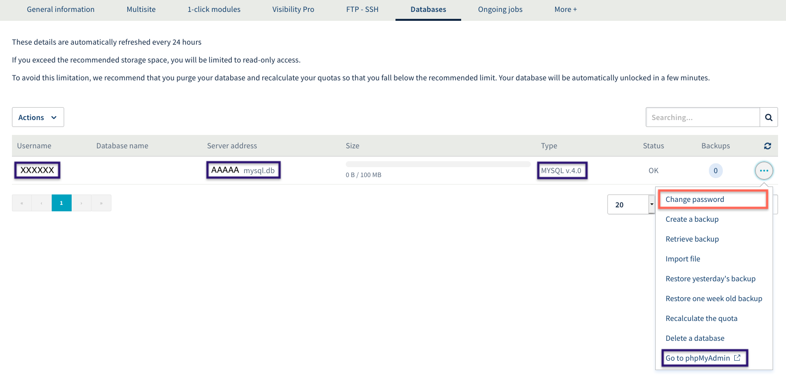
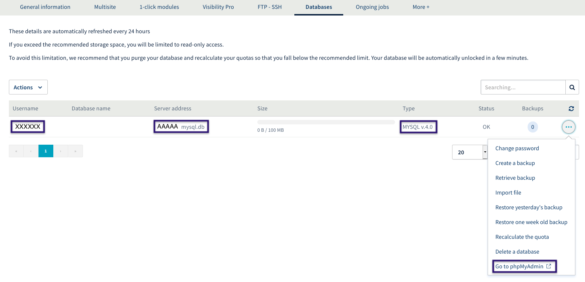
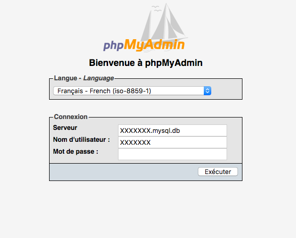
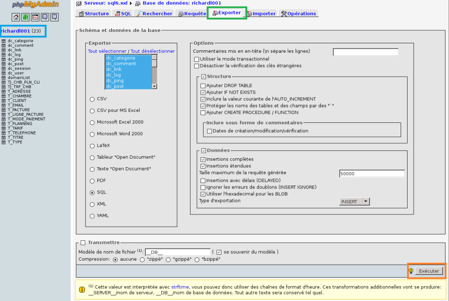

In this guide, you will find a range of information and support on migrating your databases from MySQL 4.0 to MySQL 5.6.

You can also refer to the [web hosting FAQ](https://www.ovh.co.uk/web-hosting/faq/){.external} available on our website.

> [!warning]
>
> OVHcloud provides services which you manage and configure yourself. You are therefore responsible for ensuring that they work correctly. 
> 
> We have provided you with this guide in order to help you with common tasks. Nevertheless, we recommend contacting a specialist provider and/or the service’s software publisher if you encounter any difficulties. We will not be able to assist you ourselves. You can find more information in the “Go further” section of this guide.
> 

## General information on databases

### Why migrate?
It is always important to work on the latest versions from service providers. These later versions sometimes add features, but generally they increase security and optimise the service. By ensuring that all of your services are based on the latest versions, you get a higher level of quality and security on the services you manage.

### How long does it take to complete this migration?
By following the steps in this guide, the migration should take between 10 and 40 minutes maximum.

## Find the access details, and access your database.

### Where to find your database’s access details
First of all, log in to the [OVHcloud Control Panel](https://www.ovh.com/manager/web/login/){.external}.

Then select the web hosting plan on the left, in the Hosting section. Next, go to the Databases tab.

In this tab, you will see a list of the databases you have created. Find **the line that concerns your database in version 4**. You will see the **username** and **server address**, which you will need to use in the next step.

Click on the **cogwheel icon on the right**: You can **change the password** for your database, if you have forgotten it.

{.thumbnail}

### How do I log in to my database in MySQL version 4.0?
To log in to your database in MySQL version 4.0, you have two options:

- Use [this link](https://phpmyadmin.ovh.net/old/){.external}.
- In the Hosting & SQL tab section of the [OVHcloud Control Panel](https://www.ovh.com/manager/web/login/){.external}, click on the cogwheel icon to the right of your MySQL version 4.0 database, and "Access phpMyAdmin". Then click on [https://phpmyadmin.ovh.net/old/](https://phpmyadmin.ovh.net/old/){.external} (at the bottom of the page).

{.thumbnail}

Once you are on the [phpMyAdmin interface](https://phpmyadmin.ovh.net/old/){.external} , you will need to enter your login details:

- Server = Server address, which you can find in the SQL tab of the OVHcloud Control Panel.
- Username = Database user (blue in the screenshot above).
- Password = Database password.

{.thumbnail}

## Export, empty, and delete your database in MySQL version 4.0.

### How do I create a backup of my database in MySQL version 4.0?
Once you are logged in to phpMyAdmin, click on your **database in the left column**, below the home buttons. Then click on the **Export** tab. **Choose your export options.** **If you are not sure which options to pick, we recommend leaving the default options selected.**

**Finally, click ‘Run’ in the bottom right-hand corner**.

This will generate text, representing the content of your database.

Simply copy and paste all of this text into a text file on your computer, then save it in ".SQL" format.

Your database is now backed up locally on your computer.

{.thumbnail}

### How do I empty my database in MySQL version 4.0?
Once your database is backed up, you will now need to empty it via phpMyAdmin. To do this, click again on your database in the left-hand column.

In the centre, you will have an overview of all your tables.

Click “**Tick all**”, then on the right, click “**For the selection**”, and replace it with “**Delete**”.

**Then click Run** .

A confirmation window will appear, and you can confirm by clicking “Yes”.

Following this operation, your database will be empty.

{.thumbnail}

### How do I delete my database in MySQL version 4.0?
You can now close phpMyAdmin. In the [OVHcloud Control Panel](https://www.ovh.com/manager/web/login/){.external}, click on your web hosting plan, then on the SQL tab.

To the right of the line of your database in MySQL version 4.0, click on the cogwheel icon, then choose "Delete database".

A pop-up window will ask you to confirm by clicking on "Confirm".

You will then need to wait 10-15 minutes for your database to be deleted.

{.thumbnail}

## How do I delete my database in MySQL version 5.6?

### How do I create my database in MySQL version 5.6?
Now that you have deleted your database in MySQL version 4.0, you will now need to create a new database in MySQL version 5.6. To do this, go to the Hosting section of the [OVHcloud Control Panel](https://www.ovh.com/manager/web/login/){.external}, then the SQL tab.

Here, click on the “Create a database” button.

Choose your MySQL engine, and the only version currently available: 5.6, then click “Next”.

You will need to wait 5 to 10 minutes maximum for the database to be created. You can track this step in the "More + - Current Tasks" tab.

### How do I restore/import my backup to my database in MySQL version 5.6?
To restore your database backup, simply follow [this guide](https://docs.ovh.com/gb/en/hosting/web_hosting_guide_to_importing_a_mysql_database){.ref}.

## Modify your website’s configuration file.

### My website no longer works after I have backed up and restored my database, why is this?
If you have exported/restored your database, it is normal for your website to display a message such as "Database connection error".

This happens because your website is still trying to connect to the old database, which has been deleted. For this reason, you will need to modify your website’s configuration file, so that it uses the new database.

### How do I edit my configuration file?
Depending on the type of website you have, it may be located in different places, but always on your FTP space. To connect to your FTP space, simply follow [this guide](https://docs.ovh.com/gb/en/hosting/log-in-to-storage-ftp-web-hosting){.ref}.

For example, if your website is based on WordPress, the configuration file is called wp-config.php, and is located in your website’s main folder, on your FTP space.

For other CMS or websites build by a developer, it is best to contact the provider who built your website, and ask them where the configuration file is located.

Once you have found this file on your FTP space, you will need to edit it. First, copy the file locally to your computer, and edit it with text software, such as WordPad or a notepad.

You need to modify the "DB_NAME", "DBPASSWORD", "DB_USER" and "DB_HOST" lines (may be named differently depending on the type of website), and replace the corresponding values with the new values found earlier in the SQL tab of the [OVHcloud Control Panel](https://www.ovh.com/manager/web/login/){.external}.

## Special cases
You may get a "Secure connection failed”\*\*\*\*\*\*\*\*\*\*\*\*\*\*\*\*\*\*\*\*\*\*\*\*\*\*\*\*\*\*\*\*\*\*\*\*\*\*\*\*\*\*\*\*\*\*\*\*\*\*\*\*\*\*\*\** error.

This error may appear while you carry out operations on your databases. This is a conflict between your version of Firefox, and our phpMyAdmin website.

You can avoid this problem by using a different browser.

### The import may not work correctly.
Normally, you should not experience any problems importing your databases created using MySQL version 4.0 to a MySQL version 5 server. However, **you cannot use a table name that is partially or completely identical to MySQL-specific words** defined in the following list:

|---|
|ADD ALL ALTER ANALYZE AND AS ASC ASENSITIVE BEFORE BETWEEN BIGINT BINARY BLOB BOTH BY CALL CASCADE CASE CHANGE CHAR CHARACTER CHECK COLLATE COLUMN CONDITION CONNECTION CONSTRAINT CONTINUE CONVERT CREATE CROSS CURRENT_DATE CURRENT_TIME CURRENT_TIMESTAMP CURRENT_USER CURSOR DATABASE DATABASES DAY_HOUR DAY_MICROSECOND DAY_MINUTE DAY_SECOND DEC DECIMAL DECLARE DEFAULT DELAYED DELETE DESC DESCRIBE DETERMINISTIC DISTINCT DISTINCTROW DIV DOUBLE DROP DUAL EACH ELSE ELSEIF ENCLOSED ESCAPED EXISTS EXIT EXPLAIN FALSE FETCH FLOAT FLOAT4 FLOAT8 FOR FORCE FOREIGN FROM FULLTEXT GRANT GROUP HAVING HIGH_PRIORITY HOUR_MICROSECOND HOUR_MINUTE HOUR_SECOND IF IGNORE IN INDEX INFILE INNER INOUT INSENSITIVE INSERT INT INT1 INT2 INT3 INT4 INT8 INTEGER INTERVAL INTO IS ITERATE JOIN KEY KEYS KILL LEADING LEAVE LEFT LIKE LIMIT LINES LOAD LOCALTIME LOCALTIMESTAMP LOCK LONG LONGBLOB LONGTEXT LOOP LOW_PRIORITY MATCH MEDIUMBLOB MEDIUMMINT MEDIUMTEXT MIDDLEINT MINUTE_MICROSECOND MINUTE_SECOND MOD MODIFIES NATURAL NOT NO_WRITE_TO_BINLOG NULL NUMERIC ON OPTIMIZE OPTION OPTIONALLY OR ORDER OUT OUTER OUTFILE PRECISION PRIMARY PROCEDURE PURGE RAID0 READ READS REAL REFERENCES REGEXP RELEASE RENAME REPEAT REPLACE REQUIRE RESTRICT RETURN REVOKE RIGHT RLIKE SCHEMA SCHEMAS SECOND_MICROSECOND SELECT SENSITIVE SEPARATOR SET SHOW SMALLINT SONAME SPATIAL SPECIFIC SQL SQLEXCEPTION SQLSTATE SQLWARNING SQL_BIG_RESULT SQL_CALC_FOUND_ROWS SQL_SMALL_RESULT SSL STARTING STRAIGHT_JOIN TABLE TERMINATED THEN TINYBLOB TINYINT TINYTEXT TO TRAILING TRIGGER TRUE UNDO UNION UNIQUE UNLOCK UNSIGNED UPDATE USAGE USE USING ETC_DATE ETC_TIME UTC_TIMESTAMP VALUES VARBINARY VARCHAR VARCHARACTER VARYING WHEN WHERE WHILE WITH WRITE X509 XOR YEAR_MONTH ZEROFILL|

## Go further

Join our community of users on <https://community.ovh.com/en/>.
