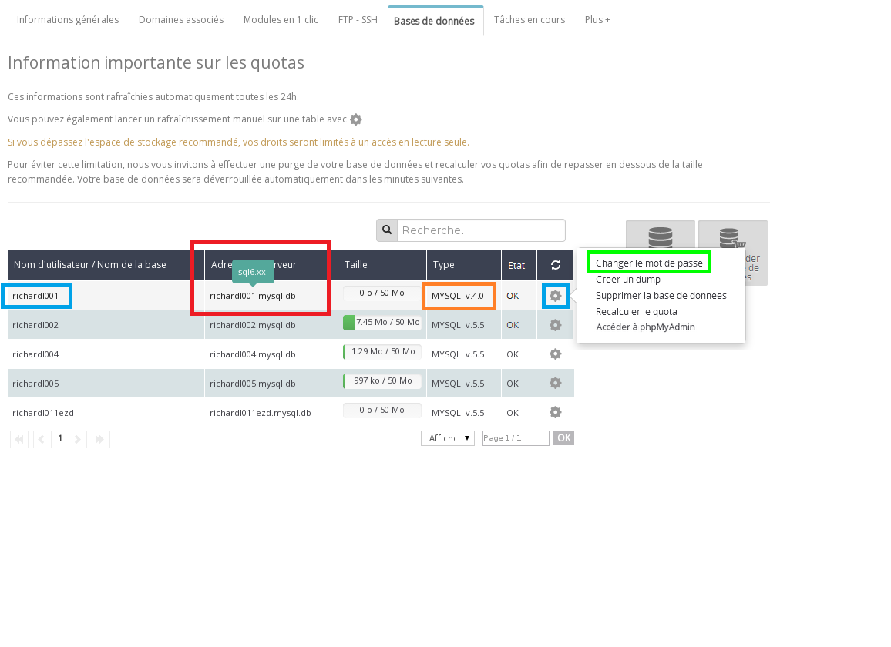
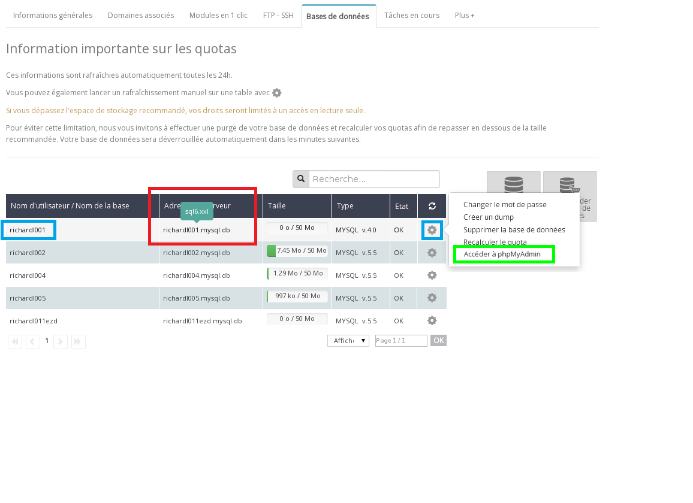

## Perché eseguire la migrazione?
Utilizzare le ultime versioni disponibili di un servizio è importante: non solo ti permettono di usufruire di nuove funzionalità, ma garantiscono anche una maggiore sicurezza e l'ottimizzazione dei tuoi servizi.

## Quanto tempo richiede la migrazione?
Se segui la nostra guida, la tua migrazione dovrebbe richiedere tra i 10 e 40 minuti.

## Recupera le credenziali del tuo database
Accedi al tuo [Spazio Cliente OVH](https://www.ovh.com/auth/?action=gotomanager&from=https://www.ovh.it/&ovhSubsidiary=it), seleziona il tuo hosting nella sezione "Hosting" a sinistra e clicca su "Database".

Visualizzi la lista dei database esistenti.
Individua il tuo database in versione 4. Il Nome utente e l'Indirizzo del server (posiziona il mouse sopra per maggiori dettagli) ti serviranno nello step successivo.

Se non ricordi più la password del tuo database, clicca sull'icona a forma di ingranaggio e clicca su Modifica la password.

{.thumbnail}

## Come fai ad accedere al tuo database SQL 4?
Hai due possibilità:

- utilizza [questo link](https://phpmyadmin.ovh.net/old/)
o
- accedi al tuo [Spazio Cliente OVH](https://www.ovh.com/auth/?action=gotomanager&from=https://www.ovh.it/&ovhSubsidiary=it), clicca sulla sezione "Hosting" e seleziona la scheda "Database", poi clicca sull'icona a forma di ingranaggio in corrispondenza del tuo database. Seleziona l'opzione Accedi a phpMyAdmin e clicca su [https://phpmyadmin.ovh.net/old/](https://phpmyadmin.ovh.net/old/) (in fondo alla pagina).

{.thumbnail}
Nell'interfaccia [phpmyadmin](https://phpmyadmin.ovh.net/old/), inserisci le tue credenziali:

- Nome utente = l'utente del database (riquadro blu dell'immagine)
- Password = la password del database
- Scelta del server = l'indirizzo del server, indicato nella scheda "Database" del tuo Spazio Cliente OVH. Nel nostro esempio, sql6.xxl.

{.thumbnail}

## Come salvare in locale un backup del tuo database SQL 4?
Una volta effettuato l'accesso a PhpMyAdmin, clicca sul tuo database nella colonna a sinistra.
Clicca sullla scheda Esporta.
Seleziona le opzioni per l'esportazione.
Se non sai quale scegliere, ti consigliamo di utilizzare le opzioni predefinite.

Clicca su Esegui.

Questa azione genera il contenuto del tuo database in formato testo.

Copialo e incollalo in un file di testo sul tuo pc e salvalo in formato ".SQL". 

In questo modo, una copia del tuo database sarà salvata in locale suo tuo computer.

{.thumbnail}

## Come cancellare il contenuto del tuo database SQL 4?
Una volta salvato il tuo database, cancella il suo contenuto su PhpMyAdmin.

Per farlo, clicca di nuovo sul tuo database nella colonna di sinistra. Visualizzi l'anteprima delle tue tabelle.

Clicca su Seleziona tutti e nel menu a destra Se selezionati, scegli l'opzione Elimina.

Clicca su Esegui.

Si apre una finestra, clicca su "Sì" per confermare l'operazione.

{.thumbnail}

## Come eliminare il tuo database SQL 4?
Non è necessario utilizzare PhpMyAdmin.
Accedi di nuovo al tuo [Spazio Cliente OVH](https://www.ovh.com/auth/?action=gotomanager&from=https://www.ovh.it/&ovhSubsidiary=it), clicca sul tuo hosting e poi su "Database".

Clicca sull'icona a forma di ingranaggio in corrispondenza del tuo database SQL 4 e seleziona "Elimina il database".

Una finestra pop-up ti chiederà di confermare l'operazione.

L'eliminazione definitiva del tuo databse richiede 10-15 minuti.

{.thumbnail}

## Come creare il tuo database MySQL 5.5?
Ora che hai eliminato il tuo database SQL 4, puoi crearne uno in versione MySQL 5.5.
Per farlo, accedi al tuo [Spazio Cliente OVH](https://www.ovh.com/auth/?action=gotomanager&from=https://www.ovh.it/&ovhSubsidiary=it), sezione Hosting, scheda Database.

Clicca su Crea un database.

Scegli il tuo motore MySQL e la versione del database (al momento l'unica disponibile è la 5.5). Clicca su Seguente.

Il tuo database verrà creato in 5-10 minuti. Puoi seguire lo stato dell'operazione nella sezione Interventi in corso.

## Come ripristinare/importare il tuo backup nel nuovo database MySQL 5.5?
Per importare il backup del tuo database, consulta [questa guida](https://www.ovh.it/g1393.import-database-mysql).

## Perché il tuo sito non funziona più dopo il backup e l'importazione del tuo database?
Se hai esportato e reimportato il tuo database, è normale visualizzare il messaggio Errore di connessione al database.

Il tuo sito, infatti, tenta ancora di connettersi al vecchio database, che hai eliminato.
Per correggere l'errore, modifica il file di configurazione del tuo sito, sostituendo i dati del tuo database SQL 4 con quelli del tuo nuovo MySQL 5.5.

## Come modificare il tuo file di configurazione?
La posizione del file di configurazione dipende dalla tipologia del tuo sito, ma si trova sempre nel tuo spazio FTP.
Per accederevi, consulta [questa guida](https://www.ovh.it/g1380.hosting_condiviso_guida_allutilizzo_di_filezilla).

Ad esempio, se il tuo sito è sviluppato in WordPress il file di configurazione si chiama wp-config.php e si trova nella cartella principale del tuo sito nel tuo spazio FTP.

Se ti sei rivolto a uno sviluppatore per costruire il tuo sito, ti consigliamo di contattarlo per sapere dove si trova il tuo file di configurazione.

Una volta individuato il file sul tuo spazio FTP, copialo in locale sul tuo pc e modificalo con un editor di testo, ad esempio WordPad o Blocco note.

Modifica le righe di tipo DB_NAME, DBPASSWORD, DB_USER e DB_HOST (il nome delle variabili può cambiare in base al tipo di sito) e il loro valore, sostituiendole con quelli che trovi nella scheda Database del tuo [Spazio Cliente OVH](https://www.ovh.com/auth/?action=gotomanager&from=https://www.ovh.it/&ovhSubsidiary=it).

## Errore "Connessione sicura non riuscita"
Questo errore può verificarsi in caso di conflitto tra la versione di Firefox che stai utilizzando e il nostro sito PhpMyAdmin.

Per evitare questo problema, utilizza un altro browser.

## Impossibile importare correttamente il database
Durante l'importazione dei tuoi database Mysql4 su un server Mysql5 non dovrebbero verificarsi problemi. 
Ricordati che i nomi delle tabelle non possono contenere totalmente o in parte parole riservate a Mysql, come quelle indicate in questa lista:

|ADD ALL ALTER ANALYZE AND AS ASC ASENSITIVE BEFORE BETWEEN BIGINT BINARY BLOB BOTH BY CALL CASCADE CASE CHANGE CHAR CHARACTER CHECK COLLATE COLUMN CONDITION CONNECTION CONSTRAINT CONTINUE CONVERT CREATE CROSS CURRENT_DATE CURRENT_TIME CURRENT_TIMESTAMP CURRENT_USER CURSOR DATABASE DATABASES DAY_HOUR DAY_MICROSECOND DAY_MINUTE DAY_SECOND DEC DECIMAL DECLARE DEFAULT DELAYED DELETE DESC DESCRIBE DETERMINISTIC DISTINCT DISTINCTROW DIV DOUBLE DROP DUAL EACH ELSE ELSEIF ENCLOSED ESCAPED EXISTS EXIT EXPLAIN FALSE FETCH FLOAT FLOAT4 FLOAT8 FOR FORCE FOREIGN FROM FULLTEXT GRANT GROUP HAVING HIGH_PRIORITY HOUR_MICROSECOND HOUR_MINUTE HOUR_SECOND IF IGNORE IN INDEX INFILE INNER INOUT INSENSITIVE INSERT INT INT1 INT2 INT3 INT4 INT8 INTEGER INTERVAL INTO IS ITERATE JOIN KEY KEYS KILL LEADING LEAVE LEFT LIKE LIMIT LINES LOAD LOCALTIME LOCALTIMESTAMP LOCK LONG LONGBLOB LONGTEXT LOOP LOW_PRIORITY MATCH MEDIUMBLOB MEDIUMMINT MEDIUMTEXT MIDDLEINT MINUTE_MICROSECOND MINUTE_SECOND MOD MODIFIES NATURAL NOT NO_WRITE_TO_BINLOG NULL NUMERIC ON OPTIMIZE OPTION OPTIONALLY OR ORDER OUT OUTER OUTFILE PRECISION PRIMARY PROCEDURE PURGE RAID0 READ READS REAL REFERENCES REGEXP RELEASE RENAME REPEAT REPLACE REQUIRE RESTRICT RETURN REVOKE RIGHT RLIKE SCHEMA SCHEMAS SECOND_MICROSECOND SELECT SENSITIVE SEPARATOR SET SHOW SMALLINT SONAME SPATIAL SPECIFIC SQL SQLEXCEPTION SQLSTATE SQLWARNING SQL_BIG_RESULT SQL_CALC_FOUND_ROWS SQL_SMALL_RESULT SSL STARTING STRAIGHT_JOIN TABLE TERMINATED THEN TINYBLOB TINYINT TINYTEXT TO TRAILING TRIGGER TRUE UNDO UNION UNIQUE UNLOCK UNSIGNED UPDATE USAGE USE USING ETC_DATE ETC_TIME UTC_TIMESTAMP VALUES VARBINARY VARCHAR VARCHARACTER VARYING WHEN WHERE WHILE WITH WRITE X509 XOR YEAR_MONTH ZEROFILL|

