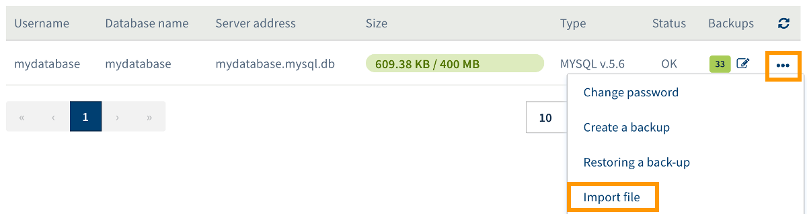
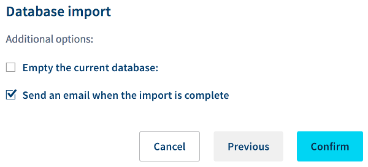

**Last updated 25th September 2018**

## Objective

Databases are used in virtually all modern content management systems (CMS), such as WordPress or Joomla!, to store dynamic elements like comments or articles. For various reasons, you may find that you need to import data into one of your databases in order to modify or replace its contents.

**Find out how to import a backup into a database on your OVH Web Hosting plan.**

## Requirements

- an [OVH Web Hosting plan](https://www.ovh.co.uk/web-hosting/){.external}
- a database created as part of an [OVH Web Hosting plan](https://www.ovh.co.uk/web-hosting/){.external}
- access to the backup that you want to import into your database, or the ability to retrieve it
- Depending on which import method you use, you must be able to administer the Web Hosting plan from the [OVH Control Panel](https://www.ovh.com/auth/?action=gotomanager){.external}, or have the information you need in order to connect to the database.

## Instructions

Before you start, you must choose which method you are going to use to import the backup into the database concerned. There are three ways to do this, depending on the level of technical knowledge you have.

- **Restore an earlier version of your database in just a few clicks**: this method can be used to restore the contents of your databases, thanks to the backups present in the OVH backup tool. This method does not require any particular technical knowledge, and can be carried out from your [OVH Control Panel](https://www.ovh.com/auth/?action=gotomanager){.external}.

- **Import your own backup file in just a few clicks**: this method lets you import the data from your own backup file, already in your possession, into one of your databases. This method can be carried out from your [OVH Control Panel](https://www.ovh.com/auth/?action=gotomanager){.external}.

- **Carry out the import from the phpMyAdmin web interface**: this method involves logging in to the phpMyAdmin interface in order to carry out the procedure. You need to be familiar with the interface to use this method, and the backup file may not exceed a certain size.

- **Carry out the import using a script**: this solution requires writing a script, hosted on your OVH Web Hosting plan, which will perform the import. Writing this script requires a specific level of technical knowledge.

- **Carry out the import from an SSH command line**: this method involves using the SSH protocol to log in to your storage space, then using commands to interact with the storage space. More advanced knowledge and a specific [OVH Hosting Plan](https://www.ovh.co.uk/web-hosting/){.external} are required to use this type of access.

Some of the methods listed above are not included in the OVH interface. You will, therefore, need to rely on your own knowledge to follow these methods. We have set out some instructions below, but they are not a substitute for the assistance of a webmaster.

We recommend reading this guide, and focusing on the import method you wish to use.

> [!warning]
>
> OVH is providing you with services for which you are responsible, with regard to their configuration and management. You are therefore responsible for ensuring they function correctly.
>
> This guide is designed to assist you in common tasks as much as possible. Nevertheless, we recommend contacting a specialised provider and/or the software publisher for the service if you encounter any difficulties. We will not be able to assist you ourselves. You can find more information in the “Go further” section of this guide.
>

### Restore a backup from the Control Panel.
First of all, log in to your [OVH Control Panel](https://www.ovh.com/auth/?action=gotomanager){.external}, click `Web Hosting`{.action} in the services bar on the left-hand side, then select the plan concerned. Next, go to the `Databases`{.action} tab.

The table shown contains all the databases created as part of your Web Hosting plan. You can now click on the three dots to the right of the database that you want to restore to an earlier version, then `Restore backup`{.action}. Please note that this will replace the current contents of the database with the contents of the backup.

{.thumbnail}

All available backups for the database you have selected will now be diplayed. You can view the exact date of each backup, and the date on which they will be deleted from the OVH tool.

Click on the three dots to the right of the backup that you would like to restore, then on `Restore the backup`{.action}. In the popup window, check that the information is correct, then click `Confirm`{.action}. Then wait for the restore process to complete.

{.thumbnail}

### Import your own backup via your Control Panel.
First of all, log in to your [OVH Control Panel](https://www.ovh.com/auth/?action=gotomanager){.external}, click `Web Hosting`{.action} in the services bar on the left-hand side, then select the plan concerned. Next, go to the `Databases`{.action} tab.

The table shown contains all the databases created as part of your Web Hosting plan. You can now click on the three dots to the right of the database you want to import data into, then on `Import file`{.action}.

{.thumbnail}

On the window that opens, select `Import a new file`{.action}, then click `Next`{.action}.

> [!primary]
>
> By clicking the `Use an existing file`{.action} button, you can reimport data from a file you have already sent to the import tool.
>

{.thumbnail}

Enter a filename (which you can use to identify this backup at a later date, if you wish to restore it again), then next to `File`, select the database backup file on your computer. Click on `Send`{.action}.

Wait until the interface confirms that the file has been sent successfully, then click `Next`{.action}.

{.thumbnail}

Finally, you can choose whether or not to apply the additional options displayed:

- **Empty the current database.** By ticking this box, the content currently stored in the database will be completely deleted, then replaced by your backup. If (and only if) you wish to replace the current contents of the database with the contents of the backup file, we recommend ticking this box.

- **Send an email when the import is complete.** By ticking this box, you will be sent an email notification when the database import is complete.

Once you have made your choice, click the `Confirm`{.action} button, and wait for the import process to finish.

{.thumbnail}

### Carry out the import from the phpMyAdmin web interface.

To carry out this procedure, you will need to log in to phpMyAdmin. To get the access link for this interface, log in to your [OVH Control Panel](https://www.ovh.com/auth/?action=gotomanager){.external}, click `Web Hosting`{.action} in the services bar on the left-hand side, then select the plan concerned. Next, go to the `Databases`{.action} tab.

The table shown contains all the databases created as part of your Web Hosting plan. In the table, click on the three dots to the right of the database concerned, then on `Go to phpMyAdmin`{.action}.

{.thumbnail}

Once you are on the phpMyAdmin page, enter the database information, use the drop-down menu to access the data from the current version of the database, then log in. Once you have logged in, go to the `Import`{.action} tab, and enter the information requested. As a reminder, there is a limit to the size of the backup file you can use.

> [!warning]
>
> Since the phpMyAdmin interface was not developed by OVH, you will need to rely on your own knowledge to carry out the procedure. We recommend contacting a specialised provider and/or getting in touch with the publisher of the interface if you encounter any difficulties. We will not be able to assist you with this ourselves.
>

### Import a backup using a script.

There are several stages to this procedure. Make sure you are in possession of the backup file you want to import, and the information that will let you connect to the database receiving the import. You will need a username, the associated password, the database name, and the server address.

> [!warning]
>
> This solution is technical and requires programming knowledge. We have provided general information below on how to proceed. Nevertheless, we recommend that you contact a specialised provider if you encounter any difficulties. We will not be able to assist you ourselves.
>

#### Step 1: Create the import script.

The first step is to create the script you can use to carry out the import to your database. Below is an example of a script that can help you with this process, although it is not a substitute for the assistance of a webmaster.

```php
<?php
system("cat backup_filename.sql | mysql --host=server_address --user=user_name --password=user_password database_name");
?>
```

Make sure you replace the generic information given in this script (e.g. ‘server_address’, ‘user_name’ etc.) with the actual information for the database concerned, using the elements below. Once the script is complete, we recommend naming it “import.php” (or something similar).

|Information|Replace with|
|---|---|
|backup_file_name|The name of the backup file you wish to import.|
|server_address|The server address for the database you want to import the data into.|
|user_name|The name of the user with access permissions for the database concerned.|
|user_password|The password for the username entered above.|
|database_name|The name of the database in question.|

#### Step 2: Upload the script and the backup to the storage space.

Once the import script has been written, you will need to upload it, along with the backup file you want to import to the storage space of your Web Hosting plan. To do this, you will need to log in to your storage space. If you do not know how to do this, please refer to the instructions in step 2 of our guide on getting your website online, “[Log in to your storage space](https://docs.ovh.com/gb/en/hosting/web_hosting_how_to_get_my_website_online/#2-log-in-to-your-storage-space){.external}”.

In order to carry out the following steps, you will need to upload the script and the backup file to the “www” folder. **We recommend taking special care when you name the import script file.** Make sure you do not overwrite an existing file with the same name in your storage space when you upload the script. If a warning message appears for this, change the name of the script you have just created, and try to upload it again.

#### Step 3: Call the script.

Now that the import script and the backup file have been uploaded to your storage space, the last remaining step is to launch the procedure. To do this, you need to call the script.

To do this, you will need to go to the full URL of the script from your web browser (e.g. mypersonaldomain.ovh/import.php, if you have saved your script as “import.php”). If the information entered in the script is correct, the import process will launch. The process of executing the script will take a few moments. If nothing happens, verify the information in the script and try to launch the procedure again.

Once you have imported the backup, we highly recommend deleting the backup file and the script from the “www” directory.

### Import a backup using an SSH command.

To follow this method, you will need to use commands from a terminal to interact with your storage space.

> [!warning]
>
> You will need more advanced technical knowledge to use this access method. Below you will find some information about how to proceed; nevertheless, we recommend that you contact a specialised provider if you encounter any difficulties. We will not be able to assist you with this ourselves.
>

Once you have logged into your storage space via an SSH connection, you will need to run a command that will import your database. Below, there is an example of a command that you may find useful. Bear in mind that you need to upload the backup you want to import to your storage space in advance, and that you will need to send the command from your terminal, from within the folder in which the backup file is saved.

```sh
cat backup_filename.sql | mysql --host=server_address --user=user_name --password=user_password database_name
```

Make sure you replace the generic information in this command (e.g. ‘user_name’, ‘user_password’ etc.) with the actual information for the database concerned. Once you have imported the backup, we recommend deleting the backup file, and the script from the directory to which you uploaded them.

## Go further

Join our community of users on <https://community.ovh.com/en/>.