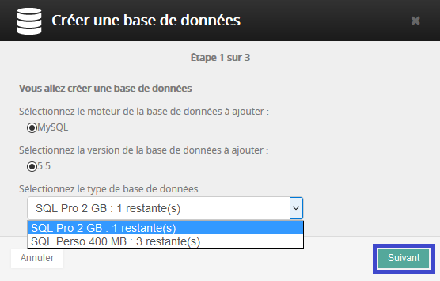
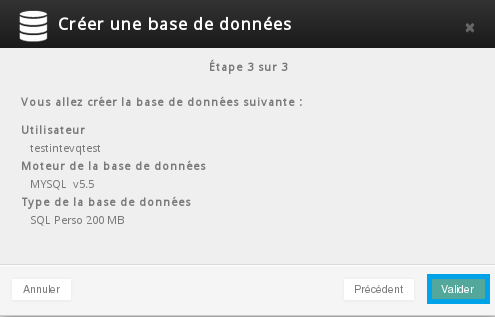
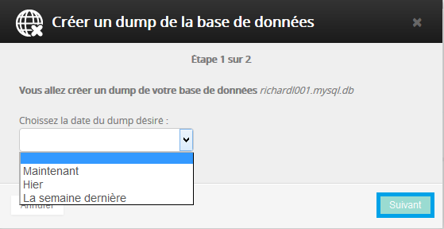

## General information
A database is a collection of data that is structured and organised so that it can easily be stored and accessed. SQL is a standard language which you can use to request that a database includes, edits, restores, or deletes data.

OVH's shared web hosting packages include SQL databases by default. The number and size of the database depends on the package that you have ordered. You can find more [details here](https://www.ovh.co.uk/web-hosting/){.external}.

You can only access these databases from OVH shared hosting packages. You cannot connect a website or application to one of these databases if it is not hosted by OVH.

OVH provides two types of databases: MySQL and PostgreSQL

## Managing a database

### Creating a database
Log in to the [OVH Control Panel](https://www.ovh.com/auth/?action=gotomanager){.external} with your ID (nic-handle, for example " **xx999-ovh** ") - and password.

{.thumbnail}

In our example we are using an OVH web hosting package which has many databases. We are going to create a MySQL database. Select your hosting platform in the "Hosting" section then go to the Database tab

{.thumbnail}

- Click on Create a database to access the form to create a database.
- If you do not have any databases available, you can order extra databases .

{.thumbnail}

You can now:

- Select MySQL or PostgreSQL
- Select your database version
- Select the type of database

(option available with professional hosting)

{.thumbnail}

Once you have filled in the details, click "Next" You now need to create:

- A username ( a maximum of 6 alphabetic characters )
- A password, this must meet certain criteria indicated on the form.

{.thumbnail}

Click "next" to reach the final step.

A summary of your database settings will appear, if there are no errors you can click "Confirm".

{.thumbnail}

If there are no problems, you will see a message confirming that your database will be created. It could take a few minutes before your database starts working properly. You will receive an email when it is available.

{.thumbnail}

You have now completed the final step to create your database.

## Management options available from your OVH Control Panel
Once you have created your database, you will be provided with a little interface in order to simplify your database admin.

{.thumbnail}

### Change the password
This lets you update your database password from your Control Panel.

- Careful: there may be some negative consequences to changing the password for a database. Your website or services might go down if they are using this database. .

If you are changing the password and you have a website which is using this database, it is  **imperative**  that you update the password in the connection file on the FTP server.

### Create a backup (dump)
You can back up your database directly from your Control Panel.

OVH lets you restore whatever data is on your database on various dates:

- Now: i.e the data currently stored on the database
- Yesterday: the data as it was stored on your database 24 hours ago
- Last week: the data as it was stored 7 days ago.

This feature lets you restore data if it has been deleted or altered (maliciously or otherwise)

{.thumbnail}

Once you have selected the date click "Next" and then "Confirm". It may take a few minutes to create a backup. When it has finished, an email will be sent to your customer account email address.

### Restore a backup (dump)
You can restore the data from a backup you created using the above method by doing the following:

In the restoration menu, to the right of each backup, you can:

- Download the backup to your desktop
- Restore the database from this backup

{.thumbnail}

### Delete the database
If you do not want to keep a database, you can use this button to permanently delete it.

**This action is irreversible and you will lose the data contained in the database** .

A pop-up window will remind you that the deletion is permanent and you will be asked for confirmation.

{.thumbnail}

### Recalculate the quota
**Important information on quotas** :

Quotas are refreshed automatically every  **24h** .

You can also manually refresh a database from your Control Panel.

If you exceed the recommended storage space, you will only be granted read rights for the database.

To avoid this limitation, we suggest that you purge your database and recalculate your quotas so that you get back below the recommended size. Your database will be automatically unlocked shortly after.

### Acccess phpMyAdmin
You only have to enter your database password. The rest of the information will be filled in automatically.

- Password: your database password.

Version: you can choose to log on to your current database or a backup which is between 1 and 7 days old.

{.thumbnail}

## Recurring errors

### Can't connect to local MySQL
/mysql.sock' (2)) At OVH, MySQL (on shared hosting) does not work locally but on the network. You may have incorrectly put localhost in your script configuration. Instead you have to enter "name_of_your_db.mysql.db" as the server name in your website's configuration file.

### Too Many Connections
If you get a " **Too many connections**" error when trying to connect to MySQL, this means that all available connections are in use by other customers. The number of connections permitted is controlled by the  **max_connections**  system variable. In this case you have reached the authorised number of simultaneous connections (limited to 30). You should check that the script has closed all your SQL connections correctly after each request.

## Other actions

### Import a dump (backup)
How do I import my MySQL database backup? What different methods are there?

There is a guide available: [here](https://docs.ovh.com/gb/en/hosting/web_hosting_guide_to_importing_a_mysql_database/){.external}