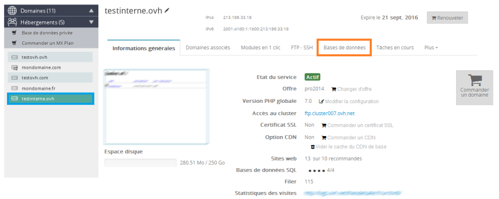
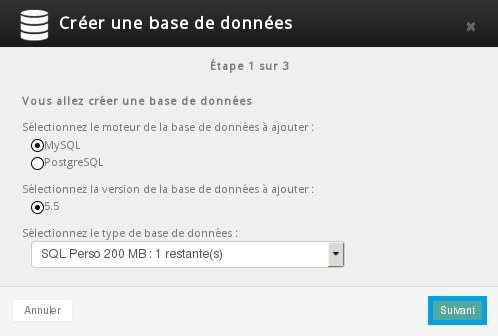
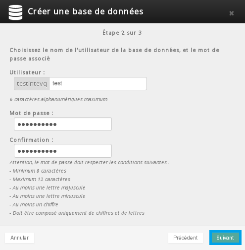
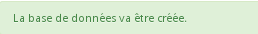
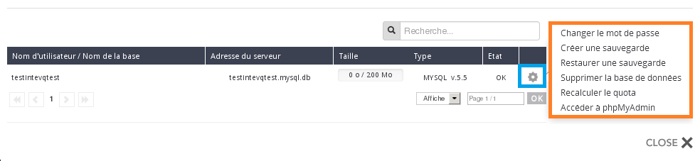
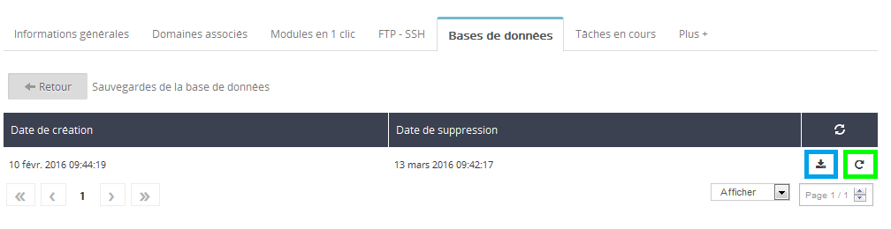
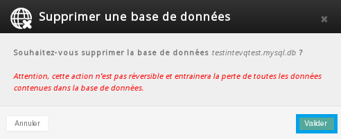
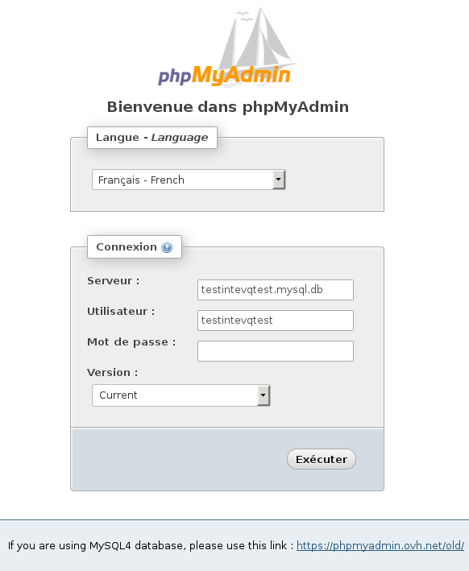

## 
Un database è un insieme di dati strutturati e organizzati per archiviare e accedere in modo efficace a grandi quantità di informazioni. Si parla spesso di "BDD" o di "SQL".
SQL è il linguaggio che consente di richiedere al database di inserire, modificare, recuperare o eliminare dati.

Le soluzioni di hosting condiviso OVH includono di default database SQL. Il loro numero e la loro dimensione massima dipende dall'offerta che scegli.
Per visualizzarne tutte le nostre offerte di hosting, [clicca qui](https://www.ovh.it/hosting-web/).

Questi database sono accessibili solo dagli hosting condivisi OVH, quindi non è possibile collegarli con siti o applicazioni esterne a OVH.

OVH propone 2 tipi di database: MySQL e PostgreSQL.

## Crea il tuo database
Accedi al tuo [Spazio Cliente OVH](https://www.ovh.com/manager/web) utilizzando il tuo identificativo OVH (Nic-handle, ad esempio xx999-ovh) e la tua password.

{.thumbnail}
Nel nostro esempio, utilizziamo un'offerta di hosting condiviso OVH che include più database e creiamo un database MySQL.
Seleziona il tuo hosting nella sezione Hosting a sinistra e clicca sul tab Database

{.thumbnail}

- Clicca su Crea un database
- Se non hai più database disponibili, puoi ordinare database aggiuntivi.

{.thumbnail}
A questo punto, puoi:

- definire il motore del database, MySQL o PostgreSQL
- selezionare la versione del tuo database
- selezionare il tipo di database (opzione disponibile con un'offerta Pro)

{.thumbnail}
Una volta completata l'operazione, clicca su Seguente.
A questo punto, inserisci:

- un username (massimo 6 caratteri alfanumerici)
- una password (che deve rispettare i criteri indicati)

{.thumbnail}
Clicca su Seguente per passare allo step successivo.

Visualizzi il riepilogo del database che stai creando. Se i dati inseriti sono corretti, Conferma.

{.thumbnail}
Se hai effettuato correttamente l'operazione, visualizzi un messaggio. La creazione del tuo database potrebbe richiedere qualche minuto.
Appena il database sarà disponibile, riceverai un'email.

{.thumbnail}
La creazione del tuo database è completata.

## 
Una volta creato il tuo database, puoi utilizzare le funzionalità disponibili nel tuo Spazio Cliente OVH per gestirlo in autonomia.

{.thumbnail}

## Modifica la password
Ti permette di aggiornare la password del tuo database.

- Attenzione: modificare la password non è un'operazione priva di rischi, può causare l'irraggiungibilità dei siti o dei servizi che utilizzano questo database.

Se modifichi la password di un database utilizzato dal tuo sito è strettamente necessario aggiornarla nel file di connessione presente sul server FTP.

## Crea un backup (dump)
In caso di cancellazioni o modifiche, dal tuo Spazio Cliente OVH puoi recuperare i dati del tuo database in diversi momenti:

- Adesso: i dati attualmente presenti nel database
- Ieri: i dati presenti nel database 24 ore fa
- Settimana scorsa: i dati presenti nel database 7 giorni fa

{.thumbnail}
Per confermare, clicca su Seguente e poi su Conferma.
La creazione del backup può richiedere qualche minuto. Una volta completata, riceverai un'email.

## Ripristina un backup (dump)
Dal menu a destra di ogni backup creato, puoi:

- scaricare il backup sul tuo pc
- ripristinare il database utilizzando questo backup

{.thumbnail}

## Elimina il database
Clicca su questa opzione per eliminare definitivamente il tuo database.

Questa operazione è irreversibile e comporta la perdita di tutti i dati contenuti nel tuo database.

Una finestra pop-up ti ricorderà che l'eliminazione è definitiva e ti chiederà di confermare l'operazione.

{.thumbnail}

## Ricalcola la quota
Importante:

- le informazioni relative alla tua quota vengono aggiornate automaticamente ogni 24 ore

- puoi avviare un aggiornamento del calcolo della tua quota manualmente, dal tuo Spazio Cliente OVH

- se superi lo spazio di storage consigliato, i tuoi permessi saranno limitati a un accesso in sola lettura

- per evitare queste restrizioni, ti consigliamo di effettuare una pulizia del tuo database e poi ricalcolare la tua quota. Il tuo database verrà sbloccato automaticamente dopo pochi minuti.

## Accedi a phpMyAdmin
Inserisci solo la password del tuo database, il resto delle informazioni saranno compilate automaticamente.

- Password: la password del tuo database

- Versione: scegli se accedere al tuo database corrente o a un backup precedente (da 1 a 7 giorni).

{.thumbnail}

## Per accedere manualmente a phpMyAdmin,
[clicca qui](https://phpmyadmin.ovh.net/).

## Can't connect to local MySQL

## (#2002 - Can't connect to local MySQL server through socket '/var/lib/mysql/mysql.sock' (2))
È un errore di connessione al server MySQL. Il messaggio ti informa che il tuo script tenta di connettersi in locale a MySQL senza riuscirci. Sugli hosting condivisi OVH, MySQL non funziona in locale ma utilizza la rete. Probabilmente nel file di configurazione del tuo sito hai erroneamente inserito localhost come nome del tuo server. Per correggere l'errore, sostituiscilo con nome_del_tuo_bdd.mysql.db.

## Too Many Connection
Se quando tenti di accedere a MySQL si verifica l'errore Too many connections, significa che il tuo database ha raggiunto max_connections, cioè il numero massimo di connessioni consentite (limitato a 30). In questo caso, verifica nel codice del tuo sito che tutte le connessioni SQL vengano correttamente chiuse dopo ogni richiesta.

## Importa un backup (dump)
Come fai ad importare il backup del tuo database MySQL e quali sono le diverse modalità per farlo?

Per consultare la guida sull'importazione del database MySql,  [clicca qui](https://www.ovh.it/g1393.import-database-mysql)

## Esporta un database
Come fai ad esportare il tuo database SQL e quali sono le diverse modalità per eseguirne il backup?

Per consultare la guida sull'esportazione del database [clicca qui](https://www.ovh.it/g1394.web_hosting_come_esportare_un_database)

