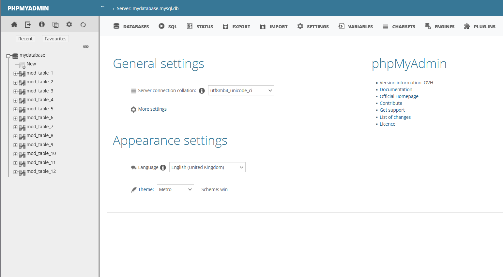

**Última actualización: 23/01/2023**

> [!primary]
> Esta traducción ha sido generada de forma automática por nuestro partner SYSTRAN. En algunos casos puede contener términos imprecisos, como en las etiquetas de los botones o los detalles técnicos. En caso de duda, le recomendamos que consulte la versión inglesa o francesa de la guía. Si quiere ayudarnos a mejorar esta traducción, por favor, utilice el botón «Contribuir» de esta página.
>

## Objetivo

Una base de datos permite, por ejemplo, almacenar información relativa a su sitio web y a su funcionamiento. Estos datos están organizados para que su sitio web acceda fácilmente a ellos, lo que permite una consulta óptima y personalizada para los usuarios/visitantes de su sitio web. 

Durante su uso, una base de datos puede adquirir, modificar o eliminar información (datos de conexión, datos de usuarios, datos de visualización, datos necesarios para el buen funcionamiento de su sitio web, etc.). 

En algunos casos, la base de datos registra tal cantidad de información, lo que provoca una saturación del espacio de almacenamiento que se le asigna. Cuando la base de datos está saturada, se habla de **overquota**.

Este tutorial explica las acciones que debe realizar cuando la base de datos en alojamiento compartido de OVHcloud está cerca de la saturación o ya está en **overquota*.

**Descubra cómo actuar cuando la base de datos está saturada.**

## Requisitos

- Estar conectado a su [área de cliente de OVHcloud](https://www.ovh.com/auth/?action=gotomanager&from=https://www.ovh.es/&ovhSubsidiary=es).
- Disponer de un [plan de hosting de OVHcloud](https://www.ovhcloud.com/es-es/web-hosting/) con una base de datos en alojamiento compartido de OVHcloud asociada.
  
## Procedimiento

> [!warning]
>
La configuración, la gestión y la responsabilidad de los servicios que OVHcloud pone a su disposición recaen sobre usted. Por lo tanto, usted deberá asegurarse de que estos funcionan correctamente.
> 
> Ponemos a su disposición este tutorial para ayudarle lo mejor posible en tareas habituales. No obstante, si tiene alguna duda, le recomendamos que contacte con un [proveedor especializado](https://partner.ovhcloud.com/es-es/). Nosotros no podremos asistirle. Más información en la sección ["Más información"](#go-further) de esta guía.
>

Cuando su base de datos en alojamiento compartido OVHcloud se satura (**overquota**), nuestros robots le advierten por correo electrónico en la dirección de correo electrónico del [contacto "Administrador"](https://docs.ovh.com/es/customer/gestion-de-los-contactos/) de la base de datos. 

Cuando la base de datos ha consumido más de **80%** de su capacidad de almacenamiento, recibirá un primer mensaje de correo electrónico. Cuando **90%** de esta capacidad de almacenamiento se alcanza, se envía un segundo mensaje de correo.

Cuando su base de datos está en **overquota**, se le enviará un tercer mensaje de aviso. A continuación, la base de datos pasará a "*READ ONLY*" (solo lectura). Ya no puede añadir ni modificar los registros de la base de datos, pero sigue estando disponible en **lectura** y **supresión**. 

### Etapa 1: identificar las tablas voluminosas

Una base de datos se compone de una o más **tablas**, compuestas a su vez por una o varias **filas** organizadas con **columnas** predeterminadas.

En primer lugar, es necesario identificar las tablas de gran tamaño de la base de datos.

> [!primary]
>
> Todas las acciones siguientes descritas en este tutorial se realizarán a partir de **phpMyAdmin**.
>
> [phpMyAdmin](https://www.phpmyadmin.net/){.external} está disponible en todas las bases de datos compartidas de OVHcloud.
> Esta aplicación de gestión de bases de datos facilita la realización de las acciones manuales que puede realizar con su base de datos.
>

#### 1.1 - Conectarse a la base de datos a través de phpMyAdmin

Descargue la contraseña de acceso a su base de datos directamente en el archivo de configuración de su sitio web. Para ello, consulte el apartado [Cambio de la contraseña de una base de datos](https://docs.ovh.com/es/hosting/cambiar-contrasena-base-de-datos/) de nuestra guía (**etapa 1**) .

Conéctese a su [área de cliente de OVHcloud](https://www.ovh.com/auth/?action=gotomanager&from=https://www.ovh.es/&ovhSubsidiary=es) y seleccione `Web Cloud`{.action} en la barra de navegación en la parte superior de la pantalla. Haga clic en `Alojamientos`{.action} y seleccione el alojamiento web asociado a la base de datos en alojamiento compartido de OVHcloud. A continuación, abra la pestaña `Bases de datos`{.action}.

{.thumbnail}

Abra la pestaña `Base de datos`{.action} y haga clic en el botón `...`{.action} a la derecha de la base de datos saturada y después seleccione `Acceder a phpMyAdmin`{.action}.

{.thumbnail}

Introduzca la contraseña de acceso a la base de datos, completando la información que se haya completado, y haga clic en `Ejecutar`{.action}.

#### 1.2 - Buscar las tablas más voluminosas

> [!alert]
>
> Desde ahora, usted interviene directamente en el contenido de su base de datos. Las operaciones que realice en phpMyAdmin pueden tener consecuencias irreversibles si no se realizan correctamente.
>
> Asegúrese de realizar las operaciones que desee. Si necesita ayuda, le recomendamos que contacte con un [proveedor especializado](https://partner.ovhcloud.com/es-es/). OVHcloud no podrá ayudarle con el contenido de su base de datos.
>

Una vez que se haya conectado, se abrirá la siguiente página:

{.thumbnail}

Haga clic en el botón `"Nombre de la base de datos"`{.action} en la columna izquierda y seleccione `Tamaño`{.action} en la parte superior derecha de la tabla que aparece:

{.thumbnail}

Las tablas más voluminosas aparecen en la parte superior de la tabla. Identifique estas y vaya al **etapa 2**.

### Etapa 2: determinar la utilidad del contenido de la tabla o tablas voluminosas

Una vez que haya identificado las tablas voluminosas, deberá determinar si todo su contenido es necesario para el funcionamiento de su sitio web.

> [!primary]
>
Si utiliza un sistema de gestión de contenidos (CMS) como WordPress, Joomla, PrestaShop o Drupal, compruebe que sus tablas voluminosas no estén relacionadas con un plugin o tema recientemente instalado o actualizado.
>
> En ese caso, contacte con el editor del plugin/tema para que le comunique las acciones a realizar en su CMS.
>
 
Si tiene algún otro CMS, le recomendamos que contacte directamente con el editor del CMS antes de realizar las siguientes acciones.

A continuación se muestran los enlaces a los sitios web oficiales de los CMS que OVHcloud ofrece instalados **en un clic**:

- [WordPress](https://wordpress.org/){.external}
- [Joomla!](https://www.joomla.org){.external}
- [PrestaShop](https://www.prestashop.com/){.external}
- [Drupal](https://drupal.org){.external}

> [!primary]
>
Si su sitio ha sido desarrollado "**manualmente**" por un proveedor especializado, le recomendamos que contacte con él para que le acompañe.
>

### Etape 3: realizar una acción correctiva

Una vez que haya determinado si el contenido de las tablas es necesario para el funcionamiento del sitio web, podrá elegir entre varias opciones:

#### Caso n°1 - Todo el contenido de la tabla voluminosa es necesario para el buen funcionamiento de su sitio web

Deberá bascular su base de datos con una base de datos más voluminosa.

Consulte nuestra oferta de bases de datos [Cloud Databases](https://www.ovh.es/cloud/cloud-databases/) para elegir su nuevo servicio de bases de datos. 

Es recomendable para bases de datos de gran tamaño.

Consulte nuestras guías para mover el contenido de su antigua base de datos a la nueva:

- [Exportar la base de datos existente](https://docs.ovh.com/es/hosting/web_hosting_exportacion_de_una_base_de_datos/)
- [Primeros pasos con Cloud Databases](https://docs.ovh.com/es/clouddb/empezar-con-clouddb/)
- [Importar su antigua base de datos a su solución Cloud Databases](https://docs.ovh.com/es/clouddb/restaurar-importar-base-de-datos/)

#### Caso n°2 - No es necesario para el funcionamiento de su sitio web una parte o el conjunto del contenido de la tabla voluminosa

Antes de realizar esta operación, compruebe si los datos de la tabla de tamaño considerable corresponden a elementos que pueden eliminarse desde el área de administración de su CMS. 

**Ejemplos**:

- comentarios/publicaciones antiguos;
- elementos presentes en el menú `Papelera` de su CMS;
- datos relacionados con un tema antiguo y/o plugin.

> [!alert]
>
> Esta guía explica cómo eliminar datos de la base de datos. En caso de duda, asegúrese de lo que está haciendo o contacte con un [proveedor especializado](https://partner.ovhcloud.com/es-es/).
>

Las bases de datos compartidas de OVHcloud disponen de varios comandos SQL para modificar su contenido.

Si se trata de una tabla de overquota o de una voluminosa, puede elegir entre **tres comandos**.

Puede realizar estas consultas directamente desde la interfaz **phpMyAdmin**, a través de la pestaña `SQL`{.action} :

{.thumbnail}

- El pedido **DELETE**: 

Permite eliminar **una o más filas** de una tabla dada. Este comando es útil si una parte del contenido de la tabla es necesaria para que su sitio web funcione correctamente.

**Ejemplo**:

```bash
DELETE FROM `table_1` WHERE `id` = 1
```

> En este ejemplo, el comando elimina la(s) línea(s) de **table_1** cuyo valor de columna **id** es igual a **1**.

- El comando **TRUNCATE**: 

Permite eliminar **todas las filas** de una tabla dada.

**Ejemplo**:

```bash
TRUNCATE TABLE `table_1`
```

> En este ejemplo, la orden elimina todas las líneas de la **table_1** sin excepción.

- El comando **DROP**: 

Permite eliminar completamente **una tabla y todas las filas que contiene**. Este comando no se puede utilizar si la tabla debe seguir existiendo.

**Ejemplo**:

```bash
DROP TABLE `table_1`
```

> En este ejemplo, la orden elimina la tabla **table_1** y todas las filas que contiene.

## Más información <a name="go-further"></a>

Para servicios especializados (posicionamiento, desarrollo, etc.), contacte con [partners de OVHcloud](https://partner.ovhcloud.com/es-es/).

Si quiere disfrutar de ayuda para utilizar y configurar sus soluciones de OVHcloud, puede consultar nuestras distintas soluciones [pestañas de soporte](https://www.ovhcloud.com/es-es/support-levels/).

Interactúe con nuestra comunidad de usuarios en <https://community.ovh.com/en/>.
