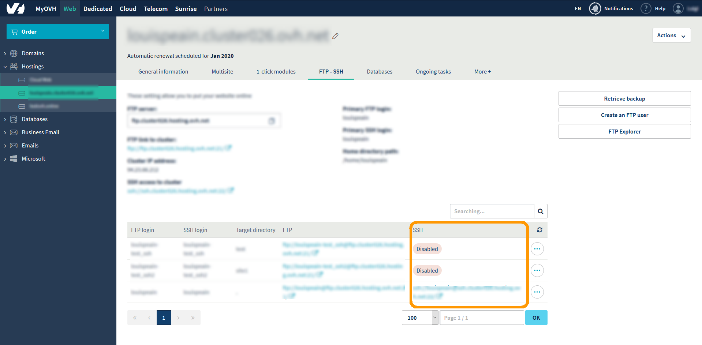
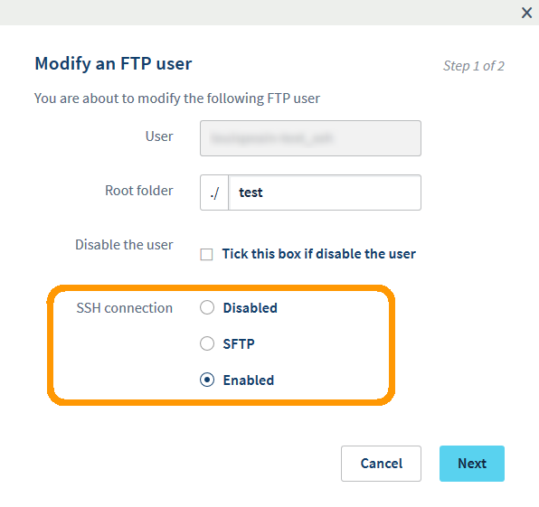

## What is SSH and how do you use it?
SSH is available on professional and performance hosting plans.

PLEASE NOTE: On old offers, access is only possible with the primary FTP account. This means that additional FTP users will not have SSH access. 

SSH allows you log on to your server and work with your files (as in FTP).
For more information on the SSH protocol, [click here](https://en.wikipedia.org/wiki/Secure_Shell).

## Prerequisites

- The SSH option, available on: Hosting plans starting with [Professional hosting](https://www.ovh.co.uk/web-hosting/).
- An SSH client.
- Port 22 must be open on your firewall and your router.

## Enable/Disable SSH for a user
You can manage your SSH logins in your control panel. You just have to click on the name of your website in the left-hand column, then go to the "FTP - SSH" tab.

{.thumbnail}

You can disable the SSH connection for a user by clicking on the button to the right of your login and then "Edit".

This modification will take a few minutes.

{.thumbnail}

## Command prompt
Linux: KDE: Open the main menu (by default this will be at the bottom left of your screen), then in the search bar which appears, tap "konsole", then click on the first search result.

Mac: The Terminal application comes preinstalled with OS X and you can launch it from Finder > Applications > Utilities.

Windows: There is no native SSH client but you can use a free, open-source application called PuTTY. Download it: [here](http://www.putty.org/).

## Connecting to your server via SSH
Linux and Mac: To connect to your server in SSH, open your command prompt as indicated above and enter:
SSH YourFtpLogin@YourFtpServer

{.thumbnail}

Windows: It is best to follow a this guide on
[PuTTy](https://docs.ovh.com/gb/en/hosting/web_hosting_using_putty_on_windows/).

## List of common SSH commands
Just replace arg with the filename or directory that you want to work with. 

|Command to enter|Definition|Explanation|
|---|---|---|
|pwd|print working directory|Show the full path of the current directory|
|cd arg| change directory | Move in to another directory; arg |refers to this new directory. The cd command without adding arg goes to the home directory. | 
|cd ..|change directory to ..|Change working directory by going up a directory level.|
|ls arg|list|List the contents of arg if this is a directory. Without arg,ls lists the contents of the working directory.|
|ll arg|long list|Show detailed information about the arg file.|
|ls -a arg|list all|Show all the arg files, even those that start with .., if this is a directory. The ls options can be combined as follows: ls -al.|
|chmod [permission type]  arg|change  mode|Change permissions for the arg file.|
|mkdir arg|make directory|Create the arg directory.|
|rmdir arg|remove directory|Remove the arg directory if it is empty.|
|rm arg|remove|Remove the arg file.|
|rm -r arg|remove recursively|Remove arg and all the files which it contains.|
|mv arg1 arg2|move|Rename or move arg1 to arg2.|
|touch arg|touch|Create an empty file named arg if it does not exist. If you use an existing file name, it will instead "touch" that file and update its last-modified date.|

## Launch a script with a specific version of PHP
To run your scripts from an SSH command, using a specific version of PHP, you have to use specific commands.

|Command|Version|
|---|---|
|php.ORIG.4 (cgi)|4.4.9|
|php.ORIG.5_2 (cgi)|5.2.17|
|php.ORIG.5_3 (cgi-fcgi)|5.3.29|
|/usr/local/php5.3/bin/php (cli)|5.3.29|
|php.ORIG.5_4 (cgi-fcgi)|5.4.38|
|/usr/local/php5.4/bin/php (cli)|5.4.38|
|/usr/local/php5.5/bin/php (cli)|5.5.22|
|/usr/local/php5.6/bin/php (cli)|5.6.6|

For example, to run the "myScript.php" script with version 5.3 of PHP, you have to run this command:

```
php.ORIG.5_3 myScript.php
```

Before the name of the script you also have to enter its location, 
For example if your "myScript.php" file is in the "WWW" folder, and you want to run it in version 5.3 of PHP, you have to run this command:

```
php.ORIG.5_3 www/myScript.php
or
php.ORIG.5_3 /www/myScript.php
```

## Public key fingerprints (to be verified when you first connect in SSH)
When you first connect to the server you will be asked to verify the public key.
