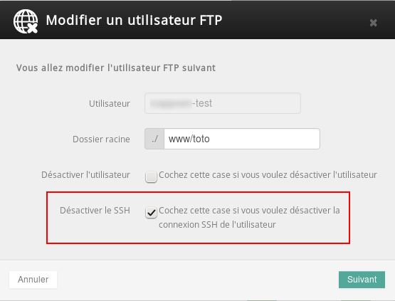

## ¿En qué consiste el acceso SSH y cómo utilizarlo?
El acceso SSH está disponible a partir del plan Profesional (a partir de los alojamientos Plan en los [antiguos planes](https://www.ovh.es/hosting/antiguos_productos_hosting.xml)). 

Atención: En los antiguos planes solo se puede acceder con la cuenta FTP principal, por lo que los usuarios FTP adicionales no tendrán acceso SSH. 

El protocolo SSH le permite conectarse a su alojamiento y manipular los archivos (como en FTP). 

Si necesita más información sobre el protocolo SSH, haga clic [aquí](https://es.wikipedia.org/wiki/Secure_Shell).


## Requisitos

- La opción SSH, disponible para los alojamientos web a partir del plan [Profesional](https://www.ovh.es/hosting/hosting-profesional.xml). 

- Un software que permita el acceso SSH.

- El puerto 22 abierto en su cortafuegos (firewall) y su router (box).


## Activar / desactivar la conexión SSH de un usuario
Es posible administrar los accesos SSH desde el área de cliente. Para ello, seleccione el nombre de su alojamiento en la sección «Alojamientos» de la columna de la izquierda y, a continuación, acceda a la pestaña «FTP - SSH». 

Al crear nuevos usuarios FTP, se activa automáticamente la conexión SSH para ese mismo usuario.

{.thumbnail}
Puede desactivar la conexión SSH del usuario haciendo clic en la rueda dentada que aparece a la derecha del usuario y seleccionando la opción «Editar». 

El cambio se hará efectivo en unos minutos.

{.thumbnail}


## Prompt
En Linux:

En KDE, abra el menú principal (en la esquina inferior izquierda de su pantalla), escriba «konsole» en la barra de búsqueda que aparece y haga clic en el primer resultado de la búsqueda. 

En Mac:

Haga clic en el disco duro en su escritorio, a continuación en el directorio de aplicaciones, después en el directorio utilitario y, por último, en la aplicación «Terminal». 

En Windows:
Windows no posee un cliente SSH nativo, por lo que deberá descargar uno. 
PuTTY es uno de los clientes más conocidos. Para descargarlo haga clic [aquí](http://www.putty.org/).


## Conexión a su alojamiento en SSH
En Linux y Mac:

Para conectarse a su alojamiento en SSH, abra su prompt, tal y como se indica a continuación, e introduzca: 
SSH SuUsuarioFtp@SuServidorFtp

Si necesita información sobre cómo recuperar los usuarios FTP, consulte nuestra [guía](https://www.ovh.es/g1909.web_hosting_administrar_y_acceder_a_sus_contrasenas).

{.thumbnail}
En Windows:

Para Windows le recomendamos que siga esta guía sobre PuTTY. 


- []({legacy}1964).


## Lista de los principales comandos
Tan solo tendrá que sustituir el término arg por el nombre del directorio o del archivo en el que desea operar. 

|Comando a introducir|Traducción (en inglés)|Explicación|
|pwd|print working directory|Muestra el directorio de trabajo|
|cd arg|change directory|Cambia el directorio de trabajo; arg corresponde a un nuevo directorio. El comando cd sin añadir arg sitúa en el directorio home.|
|cd ..|change directory to ..|Cambia el directorio de trabajo subiendo un nivel en el árbol de directorios.|
|ls arg|list|Muestra el contenido de arg si este último es un directorio. Sin arg, ls muestra el contenido del directorio de trabajo.|
|ll arg|long list|Muestra información detallada sobre el archivo arg.|
|ls -a arg|list all|Muestra todos los archivos de arg, incluso los que comienzan por .., si son directorios. Las opciones de ls pueden combinarse: ls -al.|
|chmod droit arg|change droits|Cambia los permisos del archivo arg, de acuerdo a droit.|
|mkdir arg|make directory|Crea el directorio arg.|
|rmdir arg|remove directory|Elimina el directorio arg si está vacío.|
|rm arg|remove|Elimina la referencia arg.|
|rm -r arg|remove recursively|Elimina arg y todos los archivos que contiene.|
|mv arg1 arg2|move|Cambia el nombre o mueve arg1 en arg2.|
|touch arg|touch|Crea un archivo vacío llamado arg si no existe; si existe, lo actualiza con la fecha actual, la fecha de la última modificación.|


## Ejecutar un script con una versión específica de PHP
Para ejecutar sus scripts desde un comando SSH utilizando una versión específica de PHP, deberá utilizar comandos especiales.

|Comando|Versión|
|php.ORIG.4 (cgi)|4.4.9|
|php.ORIG.5_2 (cgi)|5.2.17|
|php.ORIG.5_3 (cgi-fcgi)|5.3.29|
|/usr/local/php5.3/bin/php (cli)|5.3.29|
|php.ORIG.5_4 (cgi-fcgi)|5.4.38|
|/usr/local/php5.4/bin/php (cli)|5.4.38|
|/usr/local/php5.5/bin/php (cli)|5.5.22|
|/usr/local/php5.6/bin/php (cli)|5.6.6|


Por ejemplo, para ejecutar el script «miScript.php» con la versión 5.3 de PHP, deberá ejecutar el siguiente comando: 

```
php.ORIG.5_3 miScript.php
```


Antes del nombre del script también deberá indicar su ubicación. 

Por ejemplo, si su archivo «miScript.php» se encuentra en la carpeta «WWW» y desea ejecutarlo en versión 5.3 de PHP, deberá lanzar el siguiente comando: 

```
php.ORIG.5_3 www/miScript.php
o
php.ORIG.5_3 /www/miScript.php
```


## Huellas de las claves públicas (deberá validarlas la primera vez que se conecte mediante SSH)
La primera vez que se conecte al servidor deberá validar su clave pública.

