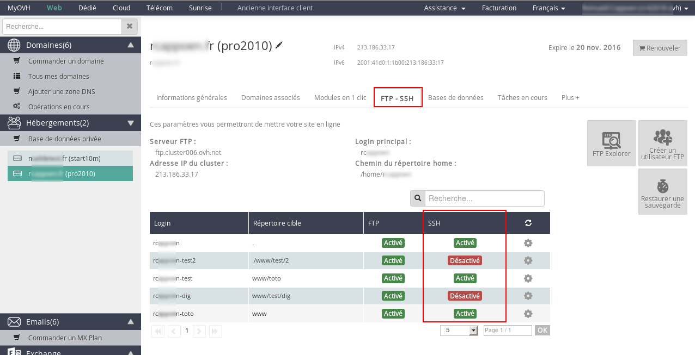
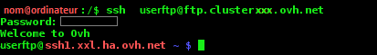

Vous trouverez dans ce guide différentes informations et aides concernant l'utilisation du SSH sur vos hébergements.

Retrouvez nos [autres guides des hébergements Web](https://docs.ovh.com/fr/hosting/){.external}.


## Généralités sur le SSH

### Qu'est-ce que le SSH et comment en beneficier ?
L'utilisation de SSH sur votre hébergement est possible à partir de l'offre Pro (sur les [anciennes offres](https://www.ovh.com/fr/hebergement-web/anciennes_offres_hebergement_mutualise.xml){.external} c'est à partir des hébergements de la gamme plan).

ATTENTION: Sur les anciennes offres, l'accès est possible uniquement avec l'utilisateur FTP principal. Les autres utilisateurs FTP n'auront pas l'accès SSH.

SSH vous permet de vous connecter à votre hébergement et d'en manipuler les fichiers (comme en FTP), ceci depuis un terminal en lignes de commande. Pour plus d'informations sur le protocole SSH, [cliquez ici](https://fr.wikipedia.org/wiki/Secure_Shell){.external}.


### Prérequis
- L'offre pour bénéficier du SSH : [l'offre PRO ou supérieure](https://www.ovh.com/fr/hebergement-web/hebergement-pro.xml){.external}.
- Un logiciel permettant l'accès SSH.


## Gérer les utilisateurs

### Activer / Desactiver le SSH pour un utilisateur
Vous pouvez gérer vos logins SSH dans votre espace client. Il suffit pour cela de cliquer sur le nom de votre hébergement dans la colonne de gauche, puis de vous rendre dans l'onglet "FTP - SSH".

Lorsque vous créez un nouvel utilisateur FTP, cela lui active la connexion SSH, par défaut.


{.thumbnail}

Vous pouvez désactiver la connexion SSH d'un utilisateur en cliquant sur la roue dentée à droite de son login puis sur "Modifier".

*Cette modification sera effective sous quelques minutes.*


{.thumbnail}


## Comment se connecter à votre hébergement en SSH ?

> [!warning]
>
> Des connaissances plus avancées sont nécessaires pour utiliser ce type d’accès. Quelques informations sur comment procéder sont présentes ci-dessous mais elles ne peuvent se substituer à l’aide d’un webmaster. Nous vous recommandons de faire appel à un prestataire spécialisé si vous éprouvez des difficultés. En effet, nous ne serons pas en mesure de vous fournir une assistance à ce propos.
>

### L'invite de commande
Sous Linux :

- Sous KDE : Ouvez le menu principal (par défaut en bas à gauche de votre écran), puis dans la barre de recherche qui apparait, tapez "konsole", puis cliquez sur le premier résultat de la recherche.
- Cliquez sur le disque dur sur votre bureau, ensuite cliquez sur le répertoire applications, puis sur le répertoire utilitaire et enfin sur l'application "Terminal"


> [!primary]
>
> - Si vous n'avez pas de client SSH natif, il faut donc en télécharger un
> (Windows 10 inclut dorénavant un client SSH natif).
> 
> Par exemple, Putty, à télécharger ici.
> 


### La connexion à votre hébergement en SSH

#### Sous Linux et Mac
Pour vous connecter à votre hébergement en SSH, ouvrez votre invite de commande, comme indiqué ci-dessus.

Comme dans l'exemple ci-dessous, renseignez vos identifiants SSH (FTP). Pour plus de renseignement sur ces identifiants, [consultez ce guide](../guide.fr-fr.md){.ref} .


{.thumbnail}


#### Sous Windows
Pour Windows, le mieux est de suivre ce guide sur [Putty]({legacy}1964){.ref} .


## Utilisation du SSH

### Liste des principales commandes
Il vous suffit de remplacer le terme **arg** par le nom du répertoire ou du fichier sur lequel vous souhaitez agir.

|Commande à entrer|Traduction (en Anglais)|Explication (En Français)| 
|---|---|---|
|pwd|print working directory|Affiche le répertoire de travail| 
|cd arg|change directory|Change de répertoire de travail; arg correspond à ce nouveau répertoire. La commande cd sans ajouter de arg positionne dans le répertoire home .| 
|cd ..|change directory to ..|Change de répertoire de travail en remontant d’un niveau dans l’arborescence de vos répertoires.| 
|ls arg|list|Liste le contenu de arg si celui-ci est un répertoire. Sans arg , ls liste le contenu du répertoire de travail.| 
|ll arg|long list|Affiche des informations détaillées sur le fichier arg .| 
|ls -a arg|list all|Affiche tous les fichiers de arg , même ceux commençant par .. , si celui-ci est un répertoire. Les options de ls peuvent être combinées: ls -al .| 
|chmod droit arg|change droits|Change les droits du fichier arg , conformément à droit .| 
|mkdir arg|make directory|Crée le répertoire arg .| 
|rmdir arg|remove directory|Supprime le répertoire arg s’il est vide.| 
|rm arg|remove|Supprime la référence arg .| 
|rm -r arg|remove recursively|Supprime arg et tous les fichiers qu’il contient.| 
|mv arg1 arg2|move|Renomme ou déplace arg1 en arg2 .| 
|touch arg|touch|Crée un fichier vide nommé arg s’il n’existe pas, sinon, met à jour avec la date courante, sa date de dernière modification.|


### Lancer un script avec une version specifique de PHP
Pour exécuter vos scripts depuis une commande SSH, en utilisant une version spécifique de PHP, il faut utiliser des commandes particulières.


|Commande|Type|Version|
|---|---|---|
|php.ORIG.5_2|cgi|5.2.17|
|php.ORIG.5_3|cgi-fcgi|5.3.29|
|/usr/local/php5.3/bin/php|cli|5.3.29|
|php.ORIG.5_4|cgi-fcgi|5.4.38|
|/usr/local/php5.4/bin/php|cli|5.4.38|
|/usr/local/php5.5/bin/php|cli|5.5.22|
|/usr/local/php5.6/bin/php|cli|5.6.6|
|/usr/local/php7.0/bin/php|cli|7.0.10|
|/usr/local/php7.1/bin/php|cli|7.1.0RC1|

<cite>Exécuter des scripts en version PHP 7.1 est disponible uniquement en version "stable". Plus plus d'informations, référez vous au guide : [Modifier l’environnement d’exécution de mon hébergement web](https://docs.ovh.com/fr/hosting/modifier-lenvironnement-dexecution-de-mon-hebergement-web/)</cite>

Par exemple, pour exécuter le script "monScript.php" avec la version 5.3 de PHP, il faut lancer cette commande :


```bash
php.ORIG.5_3 monScript.php
```


> [!success]
>
> Avant le nom du script il faut également indiquer son emplacement.
> Par exemple si votre fichier "monScript.php" se trouve dans le dossier "WWW", et que vous voulez l'exécuter en version 5.3 de PHP, il faut lancer cette commande :
> 
> ```bash
> php.ORIG.5_3 www/monScript.php
> ```
>


> [!primary]
>
> Si vous souhaitez utiliser par défaut la version PHP présente dans votre
> fichier .ovhconfig, vous pouvez vous référer à l'URL suivante :
> https://github.com/ovh/webhosting-ssh-bashrc
> 


### Empreintes de nos clés publiques (sera à valider lors de votre première connexion en SSH)
Une validation de la clé publique vous sera demandé lors de votre première connexion sur le serveur.


> [!faq]
>
> Cluster002
>> 
>> 2048 MD5:59:7f:56:82:24:10:87:16:81:e4:d9:81:fb:cf:ad:a5 ssh.cluster002.ovh.net (RSA)
>> 
>> 
>> 2048 SHA256:XeKMErcIcIyNTGEqBNU4KgoWitKM7jzbHZdniFUGEME ssh.cluster002.ovh.net (RSA)
>> 
>> 
> Cluster003
>> 
>> 2048 MD5:59:7f:56:82:24:10:87:16:81:e4:d9:81:fb:cf:ad:a5 ssh.cluster003.ovh.net (RSA)
>> 
>> 
>> 2048 SHA256:XeKMErcIcIyNTGEqBNU4KgoWitKM7jzbHZdniFUGEME ssh.cluster003.ovh.net (RSA)
>> 
>> 
> Cluster005
>> 
>> 2048 MD5:1a:5e:55:da:b0:b9:53:1e:09:33:eb:30:43:31:64:59 ssh.cluster005.ovh.net (RSA)
>> 
>> 
>> 2048 SHA256:h9pa+J2x4nqFUNiIDi/gyPY61OwhaC1PoAXQH/Fupqs ssh.cluster005.ovh.net (RSA)
>> 
>> 
> Cluster006
>> 
>> 2048 MD5:2f:f3:57:46:ce:54:5d:06:be:5c:82:a4:0b:ed:81:d1 ssh.cluster006.ovh.net (RSA)
>> 
>> 
>> 2048 SHA256:PUQMDCkIagO1ltct0dSxuG6f3UxF3r6KVDpWZbYFwjM ssh.cluster006.ovh.net (RSA)
>> 
>> 
> Cluster007
>> 
>> 2048 MD5:0e:7a:cb:ad:e3:3a:67:92:f4:3d:24:db:53:75:3a:df ssh.cluster007.ovh.net (RSA)
>> 
>> 
>> 2048 SHA256:ACImqZ9DPplf6qlDB2tnK8nZCco2udxsRfxdUakziTs ssh.cluster007.ovh.net (RSA)
>> 
>> 
> Cluster010
>> 
>> 2048 MD5:52:f8:78:4e:5f:6e:05:63:dd:4b:9e:d9:72:2f:04:87 ssh.cluster010.ovh.net (RSA)
>> 
>> 
>> 2048 SHA256:oNTxGop/dkoiQtdIEiaBRsMb4/tBsHCweS6Tp14A+Bg ssh.cluster010.ovh.net (RSA)
>> 
>> 
> Cluster011
>> 
>> 2048 MD5:3f:c7:97:25:8d:24:1f:a1:03:b1:a5:20:0b:b3:1e:ad ssh.cluster011.ovh.net (RSA)
>> 
>> 
>> 2048 SHA256:7Gg64Fv66gYLt91BWIj2l9YfcsPXtcZaef5CqueTFg8 ssh.cluster011.ovh.net (RSA)
>> 
>> 
> Cluster012
>> 
>> 2048 MD5:cd:72:7c:81:db:00:63:5d:d9:0d:96:7b:4b:c6:cd:97 ssh.cluster012.ovh.net (RSA)
>> 
>> 
>> 2048 SHA256:m65ntn6YQheOp7k6kVBd8YBY4XUC4mScxlwWqKIHEmQ ssh.cluster012.ovh.net (RSA)
>> 
>> 
> Cluster013
>> 
>> 2048 MD5:a6:d3:8a:a5:5d:85:6f:29:e8:74:df:41:19:22:c0:72 ssh.cluster013.ovh.net (RSA)
>> 
>> 
>> 2048 SHA256:hcBosB/lzVaR1XgmyiGiw/1agKAdCjN63mv+vWNAHEs ssh.cluster013.ovh.net (RSA)
>> 
>> 
> Cluster014
>> 
>> 2048 MD5:78:b6:83:cd:5f:08:e9:fe:de:08:f3:eb:dd:09:4a:ce ssh.cluster014.ovh.net (RSA)
>> 
>> 
>> 2048 SHA256:4IB8ujyHoNaoOMnHOtWByrHTQStqkiHczD7Nf5inpmE ssh.cluster014.ovh.net (RSA)
>> 
>> 
> Cluster015
>> 
>> 2048 MD5:0a:dd:5f:f7:4d:f4:57:79:a6:2f:96:83:c6:d2:6e:37 ssh.cluster015.ovh.net (RSA)
>> 
>> 
>> 2048 SHA256:4/DMom7RrUB0Hv9PrCMjsfsJvTmVKrXyPZUt7lB7iEE ssh.cluster015.ovh.net (RSA)
>> 
>> 
> Cluster017
>> 
>> 2048 MD5:a6:d3:8a:a5:5d:85:6f:29:e8:74:df:41:19:22:c0:72 ssh.cluster017.ovh.net (RSA)
>> 
>> 
>> 2048 SHA256:hcBosB/lzVaR1XgmyiGiw/1agKAdCjN63mv+vWNAHEs ssh.cluster017.ovh.net (RSA)
>> 
>> 
> Cluster020
>> 
>> 2048 MD5:39:5c:f9:ba:37:c2:b2:dd:0c:06:3f:ea:f2:50:fe:75 ssh.cluster020.hosting.ovh.net (RSA)
>> 
>> 
>> 2048 SHA256:ld+oa9+HjvyRunGbyRGHX6BsYTnQy2Mmzup16ViPC68 ssh.cluster020.hosting.ovh.net (RSA)
>> 
>> 
> Cluster021
>> 
>> 2048 MD5:40:87:f4:87:a3:10:96:16:06:74:cc:0e:b3:a1:a5:1c ssh.cluster021.hosting.ovh.net (RSA)
>> 
>> 
>> 2048 SHA256:UvPbVboOiaocVPEqENI9QIFRhaf5jGahc72xmDQ5wGM ssh.cluster021.hosting.ovh.net (RSA)
>> 
>> 
> Cluster023
>> 
>> 2048 MD5:5b:93:ed:80:50:dc:f0:5e:bb:a0:a7:f7:ca:76:1e:c4 ssh.cluster023.hosting.ovh.net (RSA)
>> 
>> 
>> 2048 SHA256:4GKTsSefE7aUjrf976U9lu8o75npkTd6qXQjqxETUnQ ssh.cluster023.hosting.ovh.net (RSA)
>> 
>> 
>