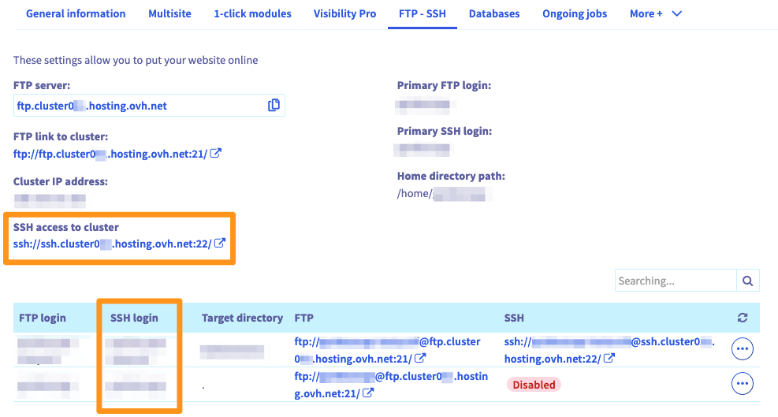
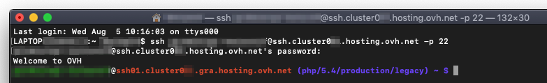

**Dernière mise à jour le 04/06/2019**

## Objectif

Les offres d'hébergement web d'OVH vous donnent accès à un espace de stockage permettant la mise en ligne des fichiers de vos sites internet ou de vos applications. L'accès à cet espace est possible notamment via un utilisateur FTP ou SSH et des mots de passe qui leur sont associés.

**Découvrez comment vous connecter et utiliser l'accès SSH de votre hébergement web OVH.**

## Prérequis

- Disposer d'une offre d'[hébergement web OVH]({ovh_www}/hebergement-web/){.external} bénéficiant d'un accès SSH.
- Être en possession des informations permettant de vous connecter en SSH à l'espace de stockage.
- Être connecté à votre [espace client OVH](https://www.ovh.com/auth/?action=gotomanager){.external}, partie `Web`{.action}.

## En pratique

### Étape 1 : s'assurer que l'accès SSH est actif

Commencez en vous connectant à votre [espace client OVH](https://www.ovh.com/auth/?action=gotomanager){.external} dans la partie « Web », puis cliquez sur `Hébergements`{.action} dans la barre de services à gauche. Choisissez alors le nom de l'hébergement concerné, puis positionnez-vous sur l'onglet `FTP - SSH`{.action}. Les informations liées à votre espace de stockage apparaissent alors. 

Repérez dans le tableau la colonne « SSH » afin de vérifier que l'utilisateur (ou « login ») SSH concerné dispose bien d'un accès SSH actif. La mention « Désactivé » apparaît si ce n'est pas le cas.

{.thumbnail}

Si l'accès SSH n'est pas actif, cliquez sur le bouton `...`{.action} à droite de l'utilisateur concerné, puis sur `Modifier`{.action}. Dans la fenêtre qui s'affiche, activez alors l'accès SSH puis finalisez la modification. Si vous n'avez pas la possibilité de l'activer, assurez-vous que [votre offre d'hébergement web OVH]({ovh_www}/hebergement-web/){.external} bénéficie bien d'un accès SSH.

### Étape 2 : récupérer les informations nécessaires pour se connecter

Pour vous connecter en SSH à votre espace de stockage, vous devez être en possession des éléments suivants. Si ce n'est pas le cas, vous pouvez les retrouver depuis l'onglet « FTP - SSH ».

|Élément|Comment le récupérer ?|
|---|---|
|Utilisateur SSH actif|Repérez-le dans la colonne « Login SSH » du tableau. Pour rappel, cet utilisateur doit [disposer d'un accès SSH actif](./#etape-1-sassurer-que-lacces-ssh-est-actif).|
|Mot de passe de l'utilisateur SSH|Si vous avez oublié ce mot de passe, vous avez la possibilité de le modifier en cliquant sur le bouton `...`{.action}, puis sur `Changer le mot de passe`{.action}.|
|Adresse du serveur SSH|Repérez la mention « Accès SSH au cluster ». Dans l'élément qui apparaît, l'adresse du serveur SSH débute après « ssh:// » et se termine avant les « : ».|
|Port de connexion au serveur SSH|Repérez la mention « Accès SSH au cluster ». Dans l'élément qui apparaît, le numéro de port est mentionné après les « : ».|

On pourrait par exemple retrouver : « ssh://`ssh.cluster023.hosting.ovh.net`:`22`/ ». Donc « ssh.cluster023.hosting.ovh.net » comme adresse de serveur SSH et « 22 » en port de connexion SSH.

{.thumbnail}

### Étape 3 : se connecter en SSH à l'espace de stockage

Pour vous connecter en SSH, utilisez un terminal afin d’interagir directement avec votre espace de stockage via des lignes de commande. 

Cet outil est installé par défaut sur macOS ou Linux. Un environnement Windows nécessitera l’installation d’un logiciel comme PuTTY ou l’ajout de la fonctionnalité OpenSSH. Cette démarche étant spécifique au système d’exploitation que vous utilisez, nous ne pouvons pas la détailler dans cette documentation.

Dès lors, il existe deux possibilités pour vous connecter selon la méthode que vous utilisez :

#### 3.1 Depuis un terminal

Une fois le terminal ouvert, utilisez la commande suivante en remplaçant les éléments « sshlogin », « sshserver » et « connectionport » par ceux adaptés à votre situation personnelle. 

```ssh
ssh sshlogin@sshserver -p connectionport
```

Après l'envoi de la commande, vous serez invité à renseigner le mot de passe de l’utilisateur SSH. Une fois connecté, poursuivez vers l'étape suivante « [Interagir en SSH avec son espace de stockage](./#etape-4-interagir-en-ssh-avec-son-espace-de-stockage) ».

{.thumbnail}

#### 3.2 Depuis un logiciel

Une fois le logiciel (PuTTY par exemple) ouvert, vous devriez trouver un endroit où renseigner les informations de connexion. Cette manipulation étant inhérente à celui-ci, nous ne pouvons pas la détailler dans cette documentation. Si besoin, voici un rappel des informations que vous devrez y renseigner :

|Information à renseigner|Détails|
|---|---|
|Serveur SSH|Indiquez l'adresse de serveur SSH récupérée [lors de l'étape 2](./#etape-2-recuperer-les-informations-necessaires-pour-se-connecter). Selon le logiciel utilisé, la dénomination peut ressembler à : « Adresse de serveur », « Nom d'hôte », ou encore « Host Name ».|
|Port de connexion|Renseignez le port de connexion SSH récupéré [lors de l'étape 2](./#etape-2-recuperer-les-informations-necessaires-pour-se-connecter).|
|Login SSH|Renseignez l'utilisateur SSH. Selon le logiciel utilisé, la dénomination peut ressembler à « Nom d'utilisateur », « Identifiant », « Login » ou encore « Username ».|
|Mot de passe de l'utilisateur SSH|Indiquez le mot de passe associé au login SSH.<br><br> Selon le logiciel utilisé, sa dénomination peut également ressembler à « Password ».|

Une fois connecté, poursuivez vers l'étape suivante.

### Étape 4 : interagir en SSH avec son espace de stockage

Pour interagir avec votre espace de stockage, vous devez utiliser des commandes. Celles-ci ont une signification directe tirée de l'anglais. Aidez-vous de la liste ci-dessous si nécessaire. Attention, **celle-ci n'est pas exhaustive**.

|Commande|Signification en anglais|Description| 
|---|---|---|
|pwd|Print working directory|Affiche le répertoire de travail dans lequel vous vous situez.| 
|cd `arg`|Change directory|Permet de changer de répertoire de travail pour celui renseigné à la place de `arg`.|
|cd `..`|Change directory|Permet de changer de répertoire de travail en remontant d’un niveau dans l’arborescence de vos répertoires.|
|cd|Change directory|En ne spécifiant pas d'argument, permet de se repositionner à la racine de votre espace de stockage (home).|
|ls|List|Liste le contenu du répertoire de travail. Ajoutez des attributs pour modifier l'affichage du résultat de la commande (comme `ls -ulhG`).| 
|chmod `droit` `arg`|Change mode|Change les droits du fichier ou du répertoire mentionné en tant qu'argument `arg`.| 
|mkdir `arg`|Make directory|Permet de créer un repertoire portant le nom de l'argument `arg`.| 
|touch `arg`|Touch|Crée un fichier vide, s'il n'existe pas déjà, portant le nom mentionné en tant qu'argument `arg`.|
|rm `arg`|Remove|Supprime le fichier mentionné en tant qu'argument `arg`.| 
|rm -r `arg`|Remove|Supprime le répertoire mentionné en tant qu'argument `arg`, ainsi que tout son contenu de manière récursive.| 
|mv `arg1` `arg2`|Move|Renomme ou déplace un élément (spécifié en tant que `arg1`) vers un nouvel endroit (spécifié en tant que `arg2`).| 

Via une commande, vous pouvez également lancer un script en utilisant une version spécifique de PHP. Par exemple, pour la version de PHP 7.1, utilisez la commande suivante. Adaptez-en ses éléments à votre situation personnelle.

```sh
/usr/local/php7.1/bin/php myscript.php
```

Selon la version de PHP que vous souhaitez utiliser, il se peut que l'environnement d'exécution doive être modifié pour une question de compatibilité. Reportez-vous à notre documentation « [Modifier la configuration de son hébergement web](../modifier-lenvironnement-dexecution-de-mon-hebergement-web/) » pour en apprendre plus. Si vous souhaitez utiliser la version par défaut de PHP renseignée dans votre [fichier .ovhconfig](../configurer-fichier-ovhconfig/), reportez-vous aux informations de la page ci-contre : <https://github.com/ovh/webhosting-ssh-bashrc>.

## Aller plus loin

[Modifier la configuration de son hébergement web](../modifier-lenvironnement-dexecution-de-mon-hebergement-web/).

[Configurer le fichier .ovhconfig de son hébergement web](../configurer-fichier-ovhconfig/).

Échangez avec notre communauté d'utilisateurs sur <https://community.ovh.com>.