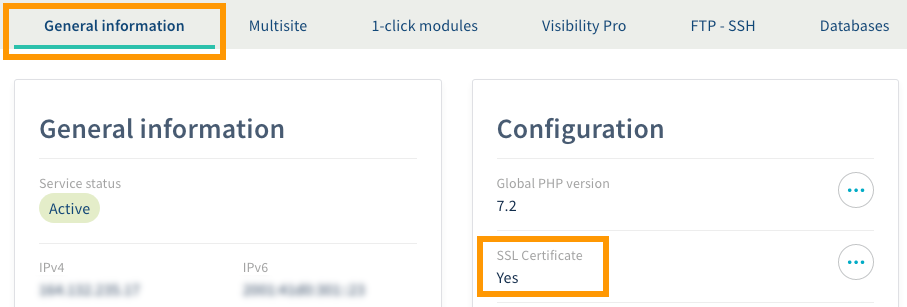

**Last updated 5th December 2018**

## Objective

With an OVH Web Hosting plan, you can get a free SSL certificate. An SSL certificate provides one or more of your websites with secure connections by making them accessible via HTTPS. You will need to follow several steps to ensure that your websites can use this secure connection.

**Find out how to activate HTTPS on your website with an SSL certificate.**

## Requirements

- an [SSL certificate](https://www.ovh.co.uk/ssl/){.external} set up on your [OVH Web Hosting plan](https://www.ovh.co.uk/web-hosting/){.external}
- at least one website set up and accessible via your OVH Web Hosting plan
- access to the [OVH Control Panel](https://www.ovh.com/auth/?action=gotomanager){.external}

## Instructions

With strong cyber security gaining increasing importance, it is absolutely essential to take special care regarding data privacy and the ways in which your data is transferred online. Generally, web users trust the sites they visit to provide secure connections, especially when the data they provide is sensitive. 

When you visit a website with a secure connection, your web browser will show this in the URL address bar in the form of a logo (usually a padlock), a message, a colour code, or the use of HTTPS protocol rather than HTTP. With this many visible indicators of a secure connection, websites that do not offer this security are becoming increasingly conspicuous.

{.thumbnail}

**Please take special care when switching your website to HTTPS.** Several steps of the process involve making changes to your website’s configuration (i.e. its code). Incorrect changes to the code could result in a number of issues, such as lower SEO ranking, and in the worst case, your website could become inaccessible. 

The table below provides a breakdown of the changes you will need to make.

|Steps|Description|Details|
|---|---|---|
|1|Activate the SSL certificate on the Web Hosting plan.|Allows you to activate the SSL certificate, check that it has been set up properly on your Web Hosting plan, and that it has been activated for your website.|
|2|Check the technical environment.|Allows you to check that the switch to HTTPS has not caused any issues for your website before you make any changes.|
|3|Activate HTTPS for your website.|By activating HTTPS, your website can then use HTTPS protocol. There is no universal method for making this change. The method you need to use will vary, depending on your website.|
|4|Check that your website is working properly.|With this final step, you can ensure that your website displays correctly after you have activated HTTPS.|

### Step 1: Activate the SSL certificate on the Web Hosting plan.

You can activate the SSL certificate on your Web Hosting plan via the  [OVH Control Panel](https://www.ovh.com/auth/?action=gotomanager){.external}. To do this, you will need to make two separate changes:

|Change|Description|
|---|---|
|Activate an SSL certificate on the Web Hosting plan.|Allows OVH to set up an SSL certificate on your Web Hosting plan. You can choose between two certificate types. Please ensure you select the certificate that best suits your needs.|
|Activate SSL on the multi-site concerned.|The website you would like to use HTTPS for must be configured as a multi-site on your Web Hosting plan. Please ensure that SSL is active for your Web Hosting plan.|

You can read a detailed version of the changes you need to make in our guide to [Managing an SSL certificate on a Web Hosting plan](https://docs.ovh.com/gb/en/hosting/ssl-certificates-on-web-hosting-plans){.external}. If you have just ordered an OVH Web Hosting plan, you may find that a free SSL certificate has already been set up on it, and that the multisite already has an active SSL connection.

To check this, log in to the [OVH Control Panel](https://www.ovh.com/auth/?action=gotomanager){.external}. Click `Web hosting`{.action} in the services bar on the left-hand side, then choose the Web Hosting plan concerned. Click on the `General information`{.action} tab. Beneath ‘SSL certificate’, the word ‘Yes’ should be visible, showing that an SSL certificate is set up on your Web Hosting plan. 

{.thumbnail}

Go to the `Multisite`{.action} tab. The table displayed will contain all of the domain names that have been added to your Web Hosting plan. In the ‘SSL’ column, you will see the activation status for secure SSL connections on your multisites. 

{.thumbnail}

If, from these verifications, it seems that an SSL certificate may not be set up properly on your Web Hosting plan and/or is not active on the multisite concerned, please read our guide to [Managing an SSL certificate on a Web Hosting plan](https://docs.ovh.com/gb/en/hosting/ssl-certificates-on-web-hosting-plans/){.external}.

### Step 2: Check the technical environment.

Before you make any changes to your website’s configuration, you need to ensure that it is ready to use the HTTPS protocol under the right conditions. There is no universal approach for this. It will depend on the nature of your website. 

As a result, we strongly recommend taking the following information into consideration. Please note that this information is designed to help you as much as possible, but it is not a substitute for the support of a webmaster.

> [!warning]
>
> OVH provides services which you are responsible for with regard to their configuration and management. You are responsible for ensuring that they work properly.
>
> We have provided you with this guide in order to help you with common tasks. Nevertheless, we recommend contacting a specialist provider and/or the service’s software publisher if you encounter any difficulties. We will not be able to assist you ourselves. You can find more information in the "Go further" section in this guide. 
>

#### 2.1: Avoid mixing HTTP and HTTPS content.

As a general rule, when your website loads in HTTPS, it is absolutely essential not to mix HTTP and HTTPS content on either a single webpage, or your whole website. If your website must load in HTTPS, please ensure that all of its content loads in HTTPS, too.

If this is not the case, you are providing web browsers with what is known as ‘mixed content’. As a result, you are at risk of providing potentially non-secure content on a page that is marked as secure. There are two possible consequences to providing mixed content, depending on its type:

- **The website will display properly, but a warning will appear in the URL address bar.** This can indicate that passive content (images, videos, etc.) is loaded from a non-secure source.

- **Some parts of the website will not display properly, and a warning will appear in the URL address bar.** This can indicate that active content (scripts, iframes, CSS files, etc.) is loaded from a non-secure source.

For this reason, it is absolutely vital to ensure that all of the content loaded from your website comes from a secure source. 

{.thumbnail}

Please note that even if your Web Hosting plan has an SSL certificate, the content hosted on it can be loaded in HTTP or HTTPS. This will depend on the way you have identified the content in your website’s code. As a result, you will need to ensure that the content loaded from your website uses HTTPS protocol.

For example, pay special attention to the addresses you use in your website’s code. If possible:

- Try to use relative addresses, e.g. `../img/header.png`.
- Avoid using absolute addresses that include HTTP protocol, e.g. `http://mypersonaldomain.ovh/img/header.png`.

You may need to adapt your entire website’s code like this. However, if you are using a turn-key website (e.g. WordPress), the website’s structure is usually ready to switch to HTTPS. As a result, you will not need to modify your website’s code.

#### 2.2: Avoid generating duplicate content.

Depending on how your website’s code is written, you will need to ensure that is not accessible via different URLs — for example, the first using HTTP and the second using HTTPS. If the same content can be accessed via different URLs, then search engines will treat it as duplicate content.

This will have a negative effect on your SEO ranking. For this reason, you need to ensure that you force an HTTPS connection on your website. You can do this by implementing a rewrite rule in your website’s code when you want to activate HTTPS.

If you are using a turn-key website (e.g. WordPress), the structure of these websites automatically manages rewrite rules. As a result, you will not need to modify your website’s code.

### Step 3: Activate HTTPS for your website.

Once your Web Hosting plan has a working SSL certificate, the multisite concerned has an active SSL connection, and you have ensured that your website is ready to switch to HTTPS, you can activate it.

> [!warning]
>
> Before you make any changes, we strongly recommend creating a full backup of your website — i.e. a backup that contains the files kept on the storage space, as well as any databases it uses. 
>

There are a number of ways you can activate HTTPS on your website. For this operation, you will need to make changes to your website’s configuration. This information below is designed to help you with the activation process, but depending on the nature of your website, the information may be incomplete or irrelevant.

- **If you are using a turn-key website (e.g. WordPress)** 

You can usually activate HTTPS via your website’s administration interface. The area for activating HTTPS and the changes you need to make in order to activate it will vary, depending on the specific turn-key website you are using. 

For example, you may have a setting called ‘Force HTTPS’, which you can activate. Otherwise, you may need to edit your website’s URL by adding an ‘s’.  ‘**http**://mypersonaldomain.ovh’ would then become  ‘**https**://mypersonaldomain.ovh’.

If you are unsure about how to make this change via your website’s administration interface, please refer to the official documentation published by its developers. 

- **If you are using a hand-coded website (i.e. code written manually by yourself, or written for you by a webmaster)** 

You will need to activate HTTPS directly in your website’s code. If you have the level of technical knowledge required to do so, adapt your website’s code so that it can use HTTPS. If you are unsure how to do so, please contact the webmaster who built the website for you. 

Below, we have provided an example of the script to add to a **.htaccess** file, which may help you with this approach. Please note, however, that this is not a substitute for the support of a webmaster. Please ensure that you replace the generic information present in this script example with your own domain name, and adapt the script as required.

```
RewriteEngine On
RewriteCond %{SERVER_PORT} 80
RewriteRule ^(.*)$ https://www.mypersonaldomain.ovh/$1 [R,L]
```

### Step 4: Check that your website is working properly.

Once you have activated HTTPS on your website, please check that it works properly, and that all of your content displays the same way it did before you made any changes. To do this, try loading the website and check that no messages or warnings appear. Then take a few moments to check the layout and formatting for different areas of your website. 

If you notice that something is not working or displaying properly, we strongly advise trying to resolve it as soon as possible, or going back by deactivating HTTPS. If you really need it, you can also use the full website backup you created earlier.

If your website loads and displays properly, and there are no warning messages appearing once you activate HTTPS, then you have carried out the operation correctly. If you would like to activate HTTPS for another website, you will need to follow all of the steps described in this guide again for it.

## Go further

Join our community of users on <https://community.ovh.com/en/>.