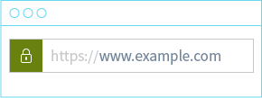
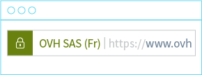
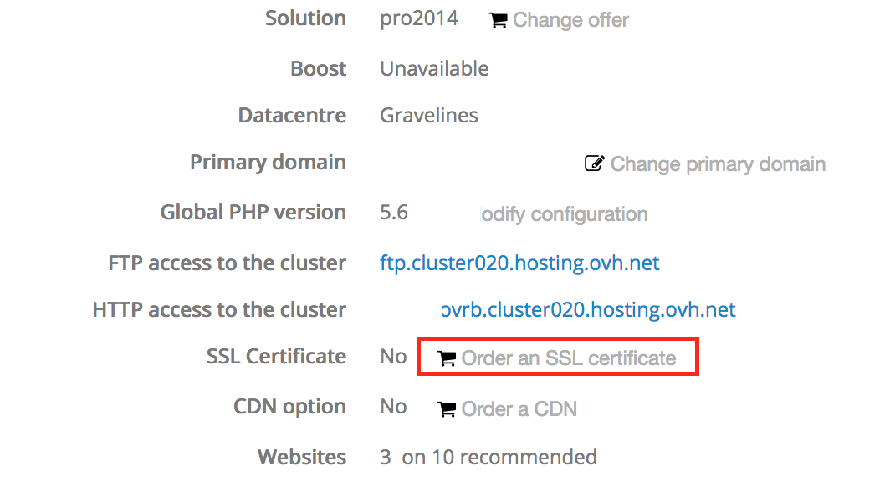

## Overview
EV SSL certificates offered by OVH are published by the certificate authority Comodo. Comodo establishes the legitimacy of your company.

See all commercial details on our site: [https://www.ovh.co.uk/ssl/](https://www.ovh.co.uk/ssl/){.external}


### Why choose an EV SSL certificate?
EV SSL certificates guarantee that a website is really managed by the website publisher and that it exists legally. When you visit a website secured by an EV SSL certificate, the EV SSL certificate displays the name of the company in question near the famous green lock.

SSL certificate


{.thumbnail}

EV SSL certificate


{.thumbnail}


## How do I order an EV SSL certificate from OVH?

### If OVH already hosts your website
Order an EV SSL certificate from your control panel.


{.thumbnail}


{.thumbnail}

Simply follow the different steps.


### If your website does not yet exist
When you order a domain name with your future web hosting plan we will ask if you want to order an EV SSL certificate.


{.thumbnail}

You then simply enter your company details:


{.thumbnail}


## How do I get my company verified?
After placing your order with OVH, you will get an email from Comodo

```
 Subject : "ORDER #xxxxxxxxxx - Agreement"
 From : noreply_support@comodo.com
 
 Dear votreadresseemail@domaine.fr
 
 In order to complete your request for an EV SSL Certificate, we
 require that you confirm the SSL Request and execute an SSL Subscriber
 Agreement. This can be done via click through by following the link
 below and filling in the required details:
 
 Agreement Link
 
 If that link doesn't work, please browse to Another Agreement Link and provide the following "verification code":
 
 xxxxxxxxxxxxxxxxxxxXXXXXXXxxxxxxxxx
 
 If you do not wish to complete this process online via the click
 through above, you may also download hard copies of the EV SSL
 Certificate Request Form, and the SSL Subscriber Agreement via the links
 below. Should you choose to complete these hardcopy forms you will need
 to print and sign them, then scan and email them to docs@comodo.com.
 Please reference your order number in the subject line.
 
 Certificate Request Form
 
 SSL Subscriber Agreement
 
 Kind Regards,
 
 Comodo Security Services on behalf of ovhssl
 Support Telephone: +1.888.266.6361 / +1.703.581.6361
 Support Website: http://support.comodo.com
 Validation Docs Fax: US and Canada +1.866.446.7704 / Worldwide +1.801.303.9359
 
 We now operate a registration-based system for support.
 Please submit your ticket at the support website.
 Please do not reply to this email as this email address is not monitored.
 
 Comodo Group, Inc. - US Office
 1255 Broad Street
 Clifton, NJ 07013-3398
 United States
 
 
 Comodo CA Limited - European Office
 26 Office Village,
 Exchange Quay, Trafford Road,
 Salford, Manchester M5 3EQ,
 United Kingdom
 
 Comodo offers
 essential infrastructure to enable e-merchants, and other
 Internet-connected companies, software providers, and individual
 consumers to interact and conduct business via the Internet safely and
 securely. Our PKI solutions, including SSL Certificates, EV SSL Certificates, Code Signing Certificates as well as Secure E-Mail Certificates,
 increase consumer trust in transacting business online, secure
 information through strong SSL encryption, and satisfy many industry
 best practices or security compliance requirements.
```

Click on the validation link to confirm your order. You will also have to state your authority within your company and verify the email address associated with your OVH account, via a link.

If your company is on a third party database (such as Dun & Bradstreet [http://www.dnb.com/](http://www.dnb.com/){.external},) Comodo will call you to ask for additional information.

If your company can't be found on a third party database, Comodo will email you to ask you to register. Comodo will then try to contact you via the telephone number available in this directory.

```
 Subject : Information Required Order xxxxxxx
 From : evdocs@comodo.com
 
 
 Dear Customer,
 
 Thank you for placing an EV order.
 
 Your Order is awaiting for Business phone verification.
 
 Business phone verification: Please update/register your company phone
 number in the Dun & Bradstreet site or else kindly provide legal
 opinion signed by your attorney, or a Latin Notary, if you are in a
 jurisdiction in which a Latin Notary is recognized,
 
 or Verified legal opinion from a registered Attorney.
 
 or Verified accountant letter from a registered CPA.
 
 Please refer the below URL for legal opinion sample.
 
 https://support.comodo.com/index.php?/Default/Knowledgebase/Article/View/900/87/sample-legal-opinion-letter-for-ev
 
 If you need assistance, or wish to speak to a Customer Service
 Representative, please contact us toll-free at anytime at 1-888-266-6361
 (U.S.) and +1-703-581-6361 (Worldwide).
 
 Regards,
 
 COMODO Validation Team
```

Once COMODO has verified that your company exists and that you have the authority to represent it, OVH will automatically receive your EV SSL certificate and deploy it automatically on your website.


## What are the eligibility conditions?
Click here for a summary of eligibility conditions: [https://support.comodo.com/index.php?/Default/Knowledgebase/Article/View/702/28/](https://support.comodo.com/index.php?/Default/Knowledgebase/Article/View/702/28/){.external}

Only companies are eligible.

You must have a customer account at OVH and be registered as a company. The following will be verified:

- The existence of your company in a third party database.
- Your company telephone number.
- Domain name ownership is verified in the WHOIS database. Domain confidentiality must be suspended until the validation process is complete.
- Name, title and authority of the signatory of the contract.


### Legal notice


> [!alert]
>
> OVH will not refund your certificate if you are not eligible.
> 