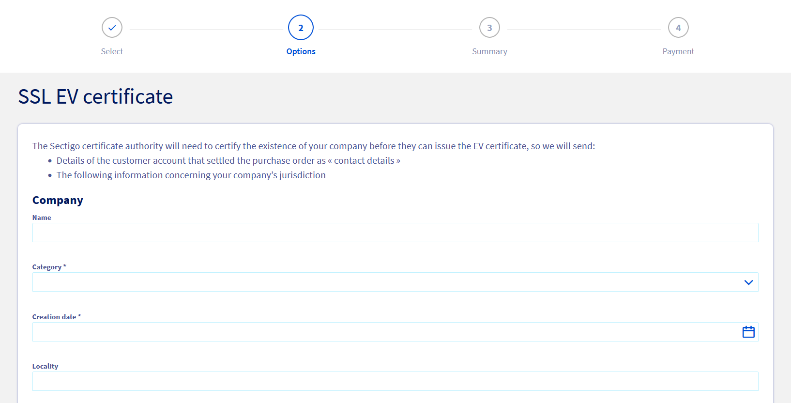
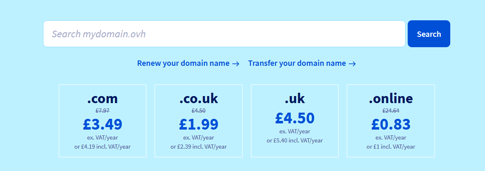
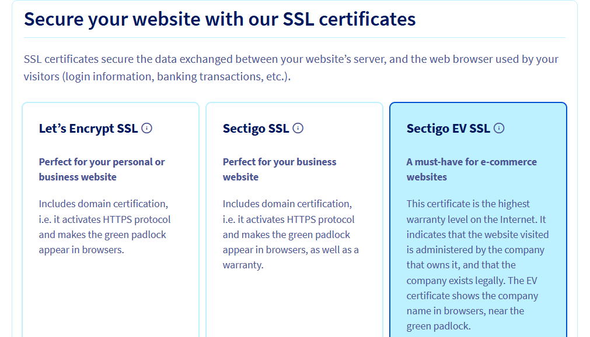

> [!primary]
> Esta traducción ha sido generada de forma automática por nuestro partner SYSTRAN. En algunos casos puede contener términos imprecisos, como en las etiquetas de los botones o los detalles técnicos. En caso de duda, le recomendamos que consulte la versión inglesa o francesa de la guía. Si quiere ayudarnos a mejorar esta traducción, por favor, utilice el botón «Contribuir» de esta página.
>

**Última actualización: 13/12/2022**
  
## Objetivo

Los certificados Secure Socket Layer (SSL) permiten cifrar los intercambios realizados desde o hacia su sitio web. Esto evita que una persona o robot malintencionado venga a "escuchar" claramente las peticiones enviadas o enviadas a su sitio web.

OVHcloud ofrece varios tipos de certificados SSL en nuestros [planes de hosting de OVHcloud](https://www.ovhcloud.com/fr/web-hosting/). Estos datos se presentan en la guía [Gestionar un certificado SSL en un alojamiento web](https://docs.ovh.com/fr/hosting/les-certificats-ssl-sur-les-hebergements-web/). Los certificados SSL son imprescindibles para la seguridad de su sitio web.

Existen tres tipos de certificados SSL:

- Dominio Validación (DV)
- Organization validation (OV)
- Extended Validation (EV)

Los niveles de cifrado SSL son idénticos entre estos tres tipos de certificado.

La principal diferencia radica en el nivel de verificaciones que realizará la Autoridad de Certificación (AC), que emite el certificado SSL y atestigua su autenticidad.

Los certificados SSL EV son aquellos en los que los niveles de verificación y seguridad son más elevados. Por lo general, el certificado SSL EV se utiliza para sitios web muy grandes o sensibles. Este certificado proporcionará el nivel de identificación más alto disponible.

Para los alojamientos compartidos de OVHcloud, la autoridad de certificación que emite los certificados SSL EV es [Sectigo](https://sectigostore.com){.external}.

> [!warning]
>
> Los certificados SSL EV no están disponibles para todo el mundo. Compruebe si puede optar a la suscripción **antes** de contratar este último, utilizando los elementos indicados en los [requisitos](#requirements) de esta guía.
>
> Tenga en cuenta que, una vez iniciado el pedido y enviado a nuestro proveedor de certificados/autoridad de certificación Sectigo, **no será posible realizar ninguna devolución**.
>

**Descubra cómo contratar e instalar un certificado SSL EV en su alojamiento web de OVHcloud**
    
## Requisitos 

- Estar conectado a su [área de cliente de OVHcloud](https://www.ovh.com/auth/?action=gotomanager&from=https://www.ovh.com/fr/&ovhSubsidiary=fr).
- Contratar o disponer de un [hosting OVHcloud](https://www.ovhcloud.com/fr/web-hosting/) en el que no haya ningún certificado SSL instalado.
- Contratar o disponer de un [nombre de dominio](https://www.ovhcloud.com/fr/domains/) y disponer de los derechos exclusivos sobre su uso. El nombre de dominio no debe estar ya asociado a un certificado SSL.
- Ser una organización (empresa, agencia gubernamental...) registrada en un registro oficial.
- La autorización de su organización para contratar un certificado SSL EV.
- Estar en condiciones de justificar con exactitud la información y los datos relativos a su organización.

Para comprobar si puede contratar un certificado SSL EV, acceda a [este enlace](https://help.sectigostore.com/support/solutions/articles/22000218717-extended-validation-ev-){.external}.
  
## Procedimiento

### Etapa 1: contratar el certificado SSL EV

#### 1.1 - Para un dominio y un alojamiento ya existentes en OVHcloud

Consulte nuestra guía sobre cómo [gestionar un certificado SSL en su alojamiento web](https://docs.ovh.com/fr/hosting/les-certificats-ssl-sur-les-hebergements-web/) y seleccione el **Certificado SSL EV** una vez haya llegado al túnel de pedido.

Introduzca con exactitud la información solicitada por **Sectigo** antes de que se le emita el certificado SSL EV. 

{.thumbnail}

Haga clic en `Continuar`{.action} una vez **todos los elementos** correctamente introducidos.

Continúe con el pedido hasta que abone el importe pendiente para validar la solicitud de creación del certificado SSL.

> [!alert]
>
> Una vez validado el pedido, la solicitud de certificado SSL EV se envía a la autoridad de certificación **Sectigo**.
>
> Asegúrese de que cumple los requisitos para contratar un certificado SSL EV **antes de abonar el certificado**.
>
> En efecto, no será posible ninguna devolución del SSL EV, **aunque el procedimiento de verificación ante Sectigo no haya finalizado**.
>

#### 1.2 - Para un nuevo dominio y alojamiento

Si todavía no ha contratado su dominio y el alojamiento asociado, acceda a nuestra [página de inicio de OVHcloud](https://www.ovhcloud.com/fr/), introduzca un dominio en el **formulario de búsqueda previsto a tal efecto** y haga clic en `Buscar`{.action} para iniciar el pedido.

{.thumbnail}

Seleccione el dominio y elija el alojamiento y las opciones hasta que se abra la pestaña `Configure su alojamiento web`.

Seleccione su elección de instalación de `módulo en 1 clic`{.action} y de `CDN` {.action} y descienda al final de la página hasta la sección `Proteja su sitio web con nuestros certificados SSL`{.action}.

{.thumbnail}

Seleccione `Sectigo EV SSL`{.action} y haga clic en `Continuar`{.action}.

Introduzca la información solicitada por **Sectigo** antes de expedir el certificado SSL EV en la nueva página.

{.thumbnail}

Haga clic en `Continuar`{.action} una vez **todos los elementos** correctamente introducidos.

Continúe con el pedido hasta que se abone el importe pendiente para iniciar la instalación de sus servicios.

> [!alert]
>
> Una vez validado el pedido, la solicitud de certificado SSL EV se envía a la autoridad de certificación **Sectigo**. 
>
> Asegúrese de que cumple los requisitos para contratar un certificado SSL EV **antes de abonar el certificado**.
>
> En efecto, no será posible ninguna devolución del SSL EV, **aunque el procedimiento de verificación ante Sectigo no haya finalizado**.
>

### Etapa 2: verificaciones con la Autoridad de Certificación (AC) Sectigo

Todas las acciones descritas en esta etapa se pueden realizar en varios días. Los plazos **dependerán** de las comprobaciones realizadas por Sectigo.

> [!warning]
>
> En esta etapa, todo el proceso depende del proveedor de certificado **Sectigo** y de la información que se haya introducido al contratar el certificado SSL EV. 
>
> Solo **Sectigo** podrá intervenir en esta etapa y OVHcloud no podrá actuar en este sentido.
>
> En efecto, la función del AC Sectigo es certificar, independientemente y con total imparcialidad, los datos de su organización para integrarlos en el certificado SSL EV.
>
> Es **Sectigo** quien decide expedir un certificado SSL EV y no OVHcloud. Sectigo es por definición el único que tiene autoridad sobre la certificación.
>

#### 2.1 - Recepción del email de confirmación por Sectigo

Una vez realizado el pedido, Sectigo le enviará un mensaje de correo electrónico con un enlace de validación y un procedimiento a seguir.
Compruebe que la información y la solicitud son correctos siguiendo las indicaciones que se ofrecen en este email. 

Para asegurarse de que la comunicación con Sectigo se realiza correctamente, compruebe también la validez de la dirección de correo electrónico que se indica en el formulario al contratar el SSL EV y la dirección de correo electrónico de contacto asociada a su [área de cliente de OVHcloud](https://www.ovh.com/auth/?action=gotomanager&from=https://www.ovh.com/fr/&ovhSubsidiary=fr).

#### 2.2 - Verificaciones realizadas por la Autoridad de Certificación Sectigo

Sectigo comprobará que su organización existe y que está registrada en los registros oficiales.

> [!primary]
>
> Sectigo puede no poder verificar toda la información con los registros oficiales. Los servicios de Sectigo pueden entonces contactar por teléfono con el número que haya indicado al realizar su pedido, o con el número de teléfono oficial de su organización.
>

A continuación, Sectigo comprobará si tiene la exclusividad/autoridad sobre la propiedad y el uso del dominio con el que va a utilizar el certificado SSL EV.

#### 2.3 - Últimas comprobaciones por teléfono con Sectigo

Una vez realizadas las comprobaciones realizadas por Sectigo, sus servicios le contactarán por teléfono para finalizar la contratación de su certificado SSL EV.

> [!success]
>
> Para más información sobre las operaciones descritas en **el Etapa 2** anterior, consulte la [documentación oficial de Sectigo](https://help.sectigostore.com/support/solutions/articles/22000218717-extended-validation-ev-){.external} sobre el asunto.
>

### Etapa 3: instalación del certificado SSL EV con su dominio y su alojamiento OVHcloud

Una vez que Sectigo haya procedido a todas las verificaciones, sus servicios generan el certificado SSL EV y nos transmiten los elementos necesarios para su instalación en su alojamiento.

Solo tendrá que [pasar su sitio web en HTTPS](https://docs.ovh.com/fr/hosting/passer-site-internet-https-ssl/) para utilizar plenamente su certificado SSL EV.

## Más información 

[Sitio Oficial Sectigo](https://sectigostore.com){.external}

[Descripción de las verificaciones realizadas por Setigo](https://help.sectigostore.com/support/solutions/articles/22000218717-extended-validation-ev-){.external}

[Gestionar un certificado SSL en un alojamiento web](https://docs.ovh.com/fr/hosting/les-certificats-ssl-sur-les-hebergements-web/)

[Habilitar HTTPS en el sitio web](https://docs.ovh.com/fr/hosting/passer-site-internet-https-ssl/)

Para servicios especializados (posicionamiento, desarrollo, etc.), contacte con [partners de OVHcloud](https://partner.ovhcloud.com/es-es/).

Si quiere disfrutar de ayuda para utilizar y configurar sus soluciones de OVHcloud, puede consultar nuestras distintas soluciones [pestañas de soporte](https://www.ovhcloud.com/es-es/support-levels/).

Interactúe con nuestra comunidad de usuarios en <https://community.ovh.com/en/>.