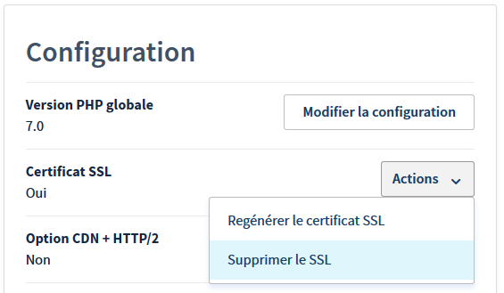
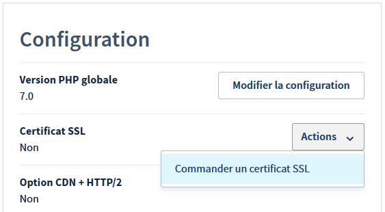
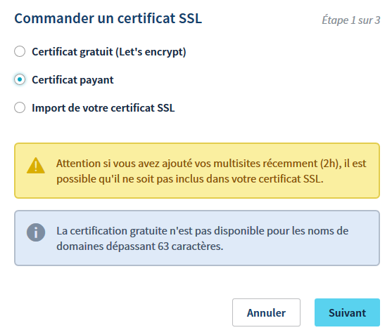
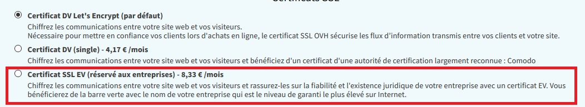
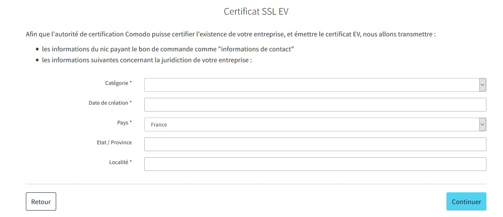

## Informations generales
Les certificats SSL EV commercialisés par OVH sont édités par l'autorité de certification Comodo. Elle est en charge de la vérification de l'existence juridique de votre entreprise.

Retrouvez toutes les informations commerciales sur notre site : [https://www.ovh.com/fr/ssl/](https://www.ovh.com/fr/ssl/){.external}.


### Pourquoi un certificat SSL EV ?
Les certificats SSL EV peuvent garantir que le site web visité est bien administré par la société éditrice et que celle-ci existe juridiquement. Lorsque vous consultez un site Internet sécurisé par un certificat SSL EV, ce dernier fait apparaître le nom de l'entreprise correspondante à proximité du fameux cadenas vert.

Certificat SSL non EV


{.thumbnail}

Certificat SSL EV


{.thumbnail}


## Comment commander un certificat SSL EV chez OVH ?

### Si votre site internet est déjà en place chez OVH

Rendez-vous pour cela dans votre espace client afin de passer commande de votre futur certificat SSL EV :

**Étape 1 : supprimer le certificat de base fourni gratuitement par OVH**

Attention : cette tâche peut nécessiter quelques minutes.

{.thumbnail}
 
**Étape 2 : ajouter un nouveau certificat SSL**

{.thumbnail}

**Étape 3 : sélectionner le certificat payant**

{.thumbnail}

Vous n'avez qu'à suivre ensuite les différentes étapes.

### Si votre site n'existe pas encore
Nous vous proposerons directement lors de la commande d’un nouveau nom de domaine avec votre futur hébergement si vous souhaitez souscrire à un certificat SSL EV.


{.thumbnail}

Il vous suffit ensuite de spécifier les informations de votre société :


{.thumbnail}


## Comment valider ma societe ?
Après avoir passé commande chez OVH, vous recevrez un e-mail de la part de Comodo

```
 Subject : "ORDER #xxxxxxxxxx - Agreement"
 From : noreply_support@comodo.com
 
 Dear votreadresseemail@domaine.fr
 
 In order to complete your request for an EV SSL Certificate, we
 require that you confirm the SSL Request and execute an SSL Subscriber
 Agreement. This can be done via click through by following the link
 below and filling in the required details:
 
 Agreement Link
 
 If that link doesn't work, please browse to Another Agreement Link and provide the following "verification code":
 
 xxxxxxxxxxxxxxxxxxxXXXXXXXxxxxxxxxx
 
 If you do not wish to complete this process online via the click
 through above, you may also download hard copies of the EV SSL
 Certificate Request Form, and the SSL Subscriber Agreement via the links
 below. Should you choose to complete these hardcopy forms you will need
 to print and sign them, then scan and email them to docs@comodo.com.
 Please reference your order number in the subject line.
 
 Certificate Request Form
 
 SSL Subscriber Agreement
 
 Kind Regards,
 
 Comodo Security Services on behalf of ovhssl
 Support Telephone: +1.888.266.6361 / +1.703.581.6361
 Support Website: http://support.comodo.com
 Validation Docs Fax: US and Canada +1.866.446.7704 / Worldwide +1.801.303.9359
 
 We now operate a registration-based system for support.
 Please submit your ticket at the support website.
 Please do not reply to this email as this email address is not monitored.
 
 Comodo Group, Inc. - US Office
 1255 Broad Street
 Clifton, NJ 07013-3398
 United States
 
 
 Comodo CA Limited - European Office
 26 Office Village,
 Exchange Quay, Trafford Road,
 Salford, Manchester M5 3EQ,
 United Kingdom
 
 Comodo offers
 essential infrastructure to enable e-merchants, and other
 Internet-connected companies, software providers, and individual
 consumers to interact and conduct business via the Internet safely and
 securely. Our PKI solutions, including SSL Certificates, EV SSL Certificates, Code Signing Certificates as well as Secure E-Mail Certificates,
 increase consumer trust in transacting business online, secure
 information through strong SSL encryption, and satisfy many industry
 best practices or security compliance requirements.
```

Vous devrez cliquez sur le lien de validation qui vous permettra de confirmer votre commande. Vous devrez également préciser votre autorité  au sein de votre société et une validation de l'adresse e-mail associé à votre compte OVH sera effectué grâce au lien cliquable.

Si votre société est bien présente sur l'annuaire de la chambre des commerces ([http://www.aef.cci.fr/accueil/listeEntreprises](http://www.aef.cci.fr/accueil/listeEntreprises){.external}), vous recevrez un appel de la part de COMODO afin de réaliser des vérifications supplémentaires.

Si votre société n'est pas présente sur cet annuaire, alors un e-mail vous sera envoyé par COMODO afin de vous demander de vous y inscrire. COMODO cherchera ensuite à vous joindre avec le numéro de téléphone disponible au sein de cet annuaire

```
 Subject : Information Required Order xxxxxxx
 From : evdocs@comodo.com
 
 
 Dear Customer,
 
 Thank you for placing an EV order.
 
 Your Order is awaiting for Business phone verification.
 
 Business phone verification: Please update/register your company phone
 number in the Dun & Bradstreet site or else kindly provide legal
 opinion signed by your attorney, or a Latin Notary, if you are in a
 jurisdiction in which a Latin Notary is recognized,
 
 or Verified legal opinion from a registered Attorney.
 
 or Verified accountant letter from a registered CPA.
 
 Please refer the below URL for legal opinion sample.
 
 https://support.comodo.com/index.php?/Default/Knowledgebase/Article/View/900/87/sample-legal-opinion-letter-for-ev
 
 If you need assistance, or wish to speak to a Customer Service
 Representative, please contact us toll-free at anytime at 1-888-266-6361
 (U.S.) and +1-703-581-6361 (Worldwide).
 
 Regards,
 
 COMODO Validation Team
```

Lorsque Comodo a validé que votre société existe et que vous avez le pouvoir de la représenter, OVH recevra automatiquement votre certificat SSL EV et le déploiera automatiquement sur votre site web.


## Quelles sont les conditions deligibilite ?
Comme définies ici sur le lien suivant, voici un récapitulatif des conditions d’éligibilité : [https://support.comodo.com/index.php?/Default/Knowledgebase/Article/View/702/28/](https://support.comodo.com/index.php?/Default/Knowledgebase/Article/View/702/28/){.external}

Sont éligibles uniquement les sociétés.

Il est obligatoire de disposer chez OVH d'un compte client enregistré comme société, un numéro de SIRET vous sera d'ailleurs demandé lors de la commande.

Sont vérifiés :

- L’existence de votre société sur l’annuaire de la chambre des commerces : [http://www.aef.cci.fr/accueil/listeEntreprises](http://www.aef.cci.fr/accueil/listeEntreprises){.external}
- Le numéro de téléphone de votre société.
- La propriété de votre nom de domaine est vérifiée sur les bases WHOIS. La confidentialité des domaines doit être suspendue jusqu'à ce que le processus de validation soit terminé.
- Nom, titre et autorité du signataire du contrat : Si le nom du signataire du contrat figure sur les documents d'enregistrement ou sur la base de données de la chambre des commerces, une vérification supplémentaire n'est généralement pas nécessaire. Si une validation plus approfondie est nécessaire, un appel sera effectué par Comodo afin de vérifier la légitimité de la demande.


### Avertissement legal


> [!alert]
>
> OVH ne sera pas en mesure d’effectuer le remboursement d’un certificat si vous n’êtes pas éligible.
> Sachez qu’il s’agit d’un produit hautement personnalisé qui ne permet donc pas de bénéficier d’un délai de rétractation de 15 jours.
> 