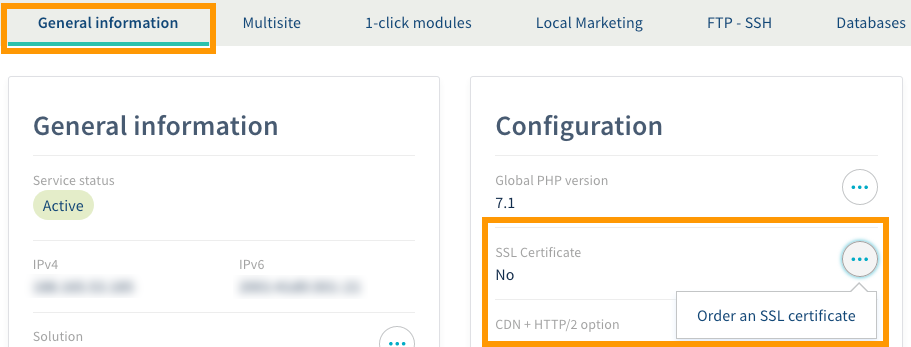
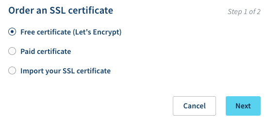
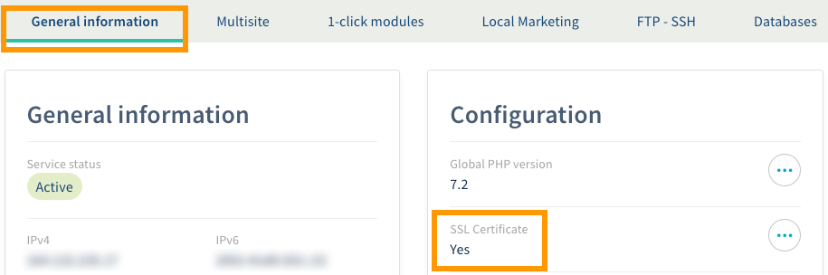
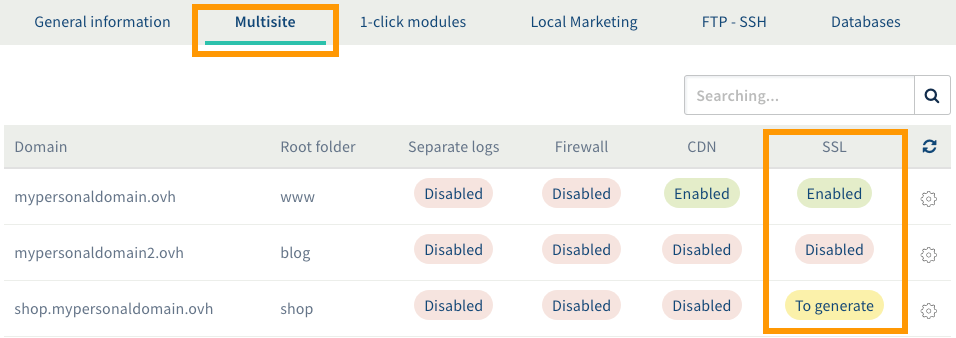
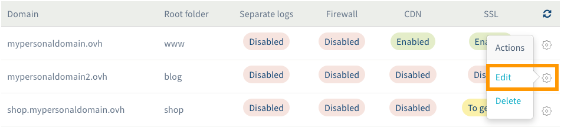
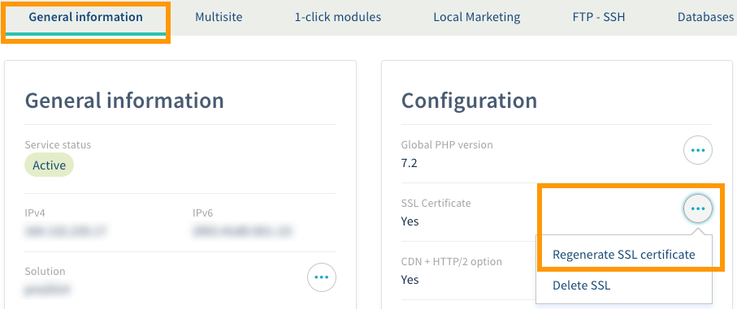
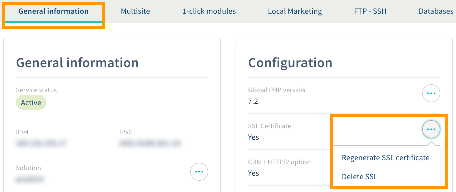

**Last updated 5th December 2018**

## Objective

You can manage an SSL certificate on your Web Hosting plan. You can either order a certificate through OVH, or you can order one elsewhere and import it on to your Web Hosting plan. Once you have set it up, it will provide one or more of your websites with a secure SSL connection, enabling the websites to work in HTTPS. 

**Find out how to manage an SSL certificate on an OVH Web Hosting plan.**

## Requirements

- an [OVH Web Hosting plan](https://www.ovh.co.uk/web-hosting/){.external}
- at least one [domain name](https://www.ovh.co.uk/domains/){.external}
- access to the [OVH Control Panel](https://www.ovh.com/auth/?action=gotomanager){.external}

## Instructions

There are several ways of managing an SSL certificate on your OVH Web Hosting plan. We recommend reading these guides, and focusing on the method you wish to follow.

- [Activate an SSL certificate on your Web Hosting plan.](https://docs.ovh.com/gb/en/hosting/ssl-certificates-on-web-hosting-plans/#activate-an-ssl-certificate-on-your-web-hosting-plan){.external} Helps you activate an SSL certificate on your Web Hosting plan. This can be a free or paid certificate ordered from OVH, or you can import your own SSL certificate ordered from another provider.

- [Activate an SSL certificate on a multisite.](https://docs.ovh.com/gb/en/hosting/ssl-certificates-on-web-hosting-plans/#activate-an-ssl-certificate-on-a-multisite){.external} If you are able to do so with your SSL certificate or solution, you can give several of your multisites a secure SSL connection.

- [Regenerate an SSL certificate on a Web Hosting plan.](https://docs.ovh.com/gb/en/hosting/ssl-certificates-on-web-hosting-plans/#regenerate-an-ssl-certificate-on-a-web-hosting-plan){.external}  Helps you regenerate an SSL certificate on your Web Hosting plan when you activate SSL on one or more multisites. 

- [Delete an SSL certificate on a Web Hosting plan.](https://docs.ovh.com/gb/en/hosting/ssl-certificates-on-web-hosting-plans/#delete-an-ssl-certificate-on-a-web-hosting-plan){.external} Helps you delete an SSL certificate on an OVH Web Hosting plan. Please note that this may pose some risks, if any of your websites are currently using the certificate you intend to delete. 

### Activate an SSL certificate on your Web Hosting plan.

With an OVH Web Hosting plan, you can choose from a range of [SSL certificate solutions](https://www.ovh.co.uk/ssl/){.external}:

- a free Let's Encrypt SSL certificate ([included with compatible Web Hosting plans](https://www.ovh.co.uk/ssl/){.external})
- a paid SSL certificate ([available as an option with compatible Web Hosting plans](https://www.ovh.co.uk/ssl/){.external})
- importing an SSL certificate ordered from another provider

To start activating your certificate, log in to the [OVH Control Panel](https://www.ovh.com/auth/?action=gotomanager){.external}, click `Web Hosting`{.action} in the services bar on the left-hand side, then select the plan concerned. Click on the `General information`{.action} tab. Beneath ‘SSL certificate’, the word ‘No’ should be visible, showing that no SSL certificates have been set up on your Web Hosting plan. Click on the three dots next to ‘SSL certificate’, then `Order an SSL certificate`{.action}.

If the word ‘Yes’ is visible, this means that an SSL certificate has already been set up on the Web Hosting plan. As a result, you will not be able to order another certificate while the existing one is set up.

{.thumbnail}

In the window that appears, select the SSL certificate you would like to order. Depending on the [Web Hosting plan](https://www.ovh.co.uk/web-hosting){.external} you have ordered and its configuration, it may be the case that none of the solutions listed below are available. Once you have selected an option, click on the `Next`{.action} button.

{.thumbnail}

Depending on which solution you have selected, there may be additional steps.

- **If you have selected a free SSL certificate:** You will not need to take any further actions, unless there is a technical element stopping the SSL certificate from being activated (a message will then appear in the OVH Control Panel listing the elements you need to check) or a domain name validation for SSL certificate delivery. In this case, you would be notified in advance, and should follow the instructions sent to you.

- **If you have selected a paid SSL certificate:** You will need to complete the order process in order to receive a certificate. Special validation may be required for certain SSL certificate types. You may receive one or more emails regarding this validation. If this is the case, please read the information included in these emails and follow any instructions provided in order to complete the setup.

- **If you have chosen to import an SSL certificate:** You will need to enter the certificate details into the boxes that appear. Please refer to the information sent by the service provider you ordered the certificate from. 

Certificate setup may take between several minutes and several days, depending on the type of certificate you have chosen. To check if the SSL certificate has been set up on your Web Hosting plan, go to the `General information`{.action} tab in the OVH Control Panel. The word ‘Yes’ should then appear below ‘SSL certificate’. 

{.thumbnail}

Once you have set it up, you can proceed with the [Activate an SSL certificate on a multisite](https://docs.ovh.com/gb/en/hosting/ssl-certificates-on-web-hosting-plans/#activate-an-ssl-certificate-on-a-multisite){.external} step, to ensure that all of the websites concerned have an active secure SSL connection.

### Activate an SSL certificate on a multisite.

Depending on which [SSL certificate](https://www.ovh.co.uk/ssl/){.external} you have ordered, you can activate a secure SSL connection on one or more of your multisites. To do this, log in to the OVH Control Panel, click [Web hosting](https://www.ovh.com/auth/?action=gotomanager){.external} in the services bar on the left-hand side, then choose the Web Hosting plan concerned. Go to the `Multisite`{.action} tab.

The table displayed will contain all of the domain names that have been added to your Web Hosting plan. In the ‘SSL’ column, you will see the activation status for secure SSL connections on your multisites. 

{.thumbnail}

There are three types of status that may appear:

|Status|Description|
|---|---|
|Enabled|An SSL certificate has already been activated for this multisite. However, if your website is not available via HTTPS, please refer to the instructions listed in our guide to [Activating HTTPS on your website with an SSL certificate](https://docs.ovh.com/gb/en/hosting/activate-https-website-ssl/){.external}.|
|To generate|An SSL certificate has been activated for this website, but it is still not technically active. To activate the SSL certificate properly, you will need to regenerate it for your Web Hosting plan, so that it includes the new domain names.|
|Disabled|An SSL certificate has not been activated for this multisite. To activate it, follow the steps listed below.|

To activate SSL on a multisite, click on the cogwheel icon to the right of the multisite concerned, then `Edit`{.action}. In the window that pops up, tick the `SSL`{.action} box, then follow the steps until you confirm the change.

Once you have submitted the activation request, the SSL secure connection status for the mutisite concerned should refresh in a few seconds, with the status changed to “To generate”. Repeat this action as necessary if you would like to activate SSL for other multisites. You can then go to [Regenerate an SSL certificate on a Web Hosting plan](https://docs.ovh.com/gb/en/hosting/ssl-certificates-on-web-hosting-plans/#regenerate-an-ssl-certificate-on-a-web-hosting-plan){.external}.

{.thumbnail}

### Activate an SSL certificate on a Web Hosting plan.

> [!primary]
>
> This operation only applies to certificates that can activate a secure SSL connection for several multisites.
>

Once you have activated a secure SSL connection across one or more of your multisites, the status will then change to “To generate”. This generation is essential for adding the domain names concerned to the SSL certificate on your Web Hosting plan. 

To do this, log in to the OVH Control Panel, click [Web hosting](https://www.ovh.com/auth/?action=gotomanager){.external} in the services bar on the left-hand side, then choose the Web Hosting plan concerned. Click on the `General information`{.action} tab. Then click on the three dots next to ‘SSL certificate’, then `Regenerate SSL certificate`{.action}.

{.thumbnail}

Read the information listed in the window that appears, then click `Confirm`{.action}. Then wait for your SSL certificate to be regenerated. This may take several hours.

Please note that Let's Encrypt, the authority that delivers the SSL certificate offered free with your Web Hosting plan, has a  [limit of five regenerations per week](https://letsencrypt.org/docs/rate-limits/){.external}. As a result, we advise taking care with regenerations over a short-term period, so you can avoid being temporarily blocked.

{.thumbnail}

### Delete an SSL certificate on a Web Hosting plan.

You can also delete an SSL certificate that has been set up on your Web Hosting plan. Before you start making any changes, **we strongly advise ensuring that the certificate deletion will not render your websites inaccessible**. Please keep in mind that your web users will see a security error when they try to access a website that works in HTTPS, but does not have a secure SSL connection. 

Since this verification involves checking your website settings, we recommend contacting a specialist service provider if you experience any difficulties in this regard. We will not be able to assist you with this ourselves. 

Once you are ready to delete the SSL certificate, log in to the [OVH Control Panel](https://www.ovh.com/auth/?action=gotomanager){.external}, click `Web Hosting`{.action} in the services bar on the left-hand side, then select the Web Hosting plan concerned. Click on the `General information`{.action} tab. Then click on the three dots next to ‘SSL certificate’, then `Delete SSL`{.action}.

On the page that appears, confirm the deletion. The deletion will take effect in a few hours, at most. 

{.thumbnail}

## Go further

Join our community of users on <https://community.ovh.com/en/>.
