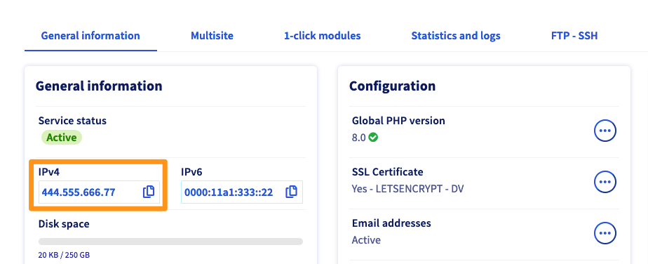

**Last updated 1st August 2022**

## Objective

You can manage an SSL certificate on your Web Hosting plan. You can either order a certificate through OVHcloud, or you can order one elsewhere and import it on to your Web Hosting plan. Once you have set it up, it will provide one or more of your websites with a secure SSL connection, enabling the websites to work in HTTPS. 

**Find out how to manage an SSL certificate on an OVHcloud Web Hosting plan.**

## Requirements

- an [OVHcloud Web Hosting plan](https://www.ovhcloud.com/en/web-hosting/){.external}
- at least one [domain name](https://www.ovhcloud.com/en/domains/){.external}
- access to the [OVHcloud Control Panel](https://ca.ovh.com/auth/?action=gotomanager&from=https://www.ovh.com/world/&ovhSubsidiary=we)

## Instructions

You will need to follow several steps to generate an SSL certificate on your OVHcloud Web Hosting plan. We recommend following the 3 steps below in **order**.

[1. Enabling SSL on a multisite](#multisite): You can give several of your multisites a secure SSL connection, depending on the Web Hosting plan and the certificate type.

[2. Enabling SSL on your Web Hosting plan](#enablessl): Helps you activate an SSL certificate on your Web Hosting plan. This can be a free or paid certificate ordered from OVHcloud, or you can import your own SSL certificate ordered from another provider.

[3. Regenerating SSL certificates on a Web Hosting plan](#regeneratessl): Helps you regenerate a Let's Encrypt SSL certificate on your Web Hosting plan when you activate SSL on one or more multisites. 

You can also [delete the SSL certificate on a Web Hosting plan](#deletessl). **Please note that this may pose a risk if one of your websites is currently using the certificate you intend to delete**.

### 1. Enabling SSL on a multisite 

Depending on which [SSL certificate](https://www.ovhcloud.com/en/web-hosting/options/ssl/){.external} you would like to order, you can activate a secure SSL connection on one or more of your multisites. To do this, log in to the [OVHcloud Control Panel](https://ca.ovh.com/auth/?action=gotomanager&from=https://www.ovh.com/world/&ovhSubsidiary=we) and switch to `Web Cloud`{.action}. Click `Hosting Plans`{.action} and select the plan concerned. Click on the `Multisite`{.action} tab.

The table displayed will contain all of the domain names that have been added to your Web Hosting plan. In the "SSL" column, you will see the activation status for secure SSL connections on your multisites. 

{.thumbnail}

There are three status types that may appear:

|Status|Description|
|---|---|
|Enabled|An SSL certificate has already been activated for this multisite. However, if your website is not available via HTTPS, please refer to the instructions listed in our guide on [Activating HTTPS on your website with an SSL certificate](../activate-https-website-ssl/).|
|To generate|An SSL certificate has been activated for this website, but it is still not technically active. To activate the SSL certificate properly, you will need to [regenerate the certificate](#regeneratessl), in order to include the new domain names.|
|Disabled|An SSL certificate has not been activated for this multisite. To activate it, follow the steps listed below.|

To activate SSL on a multisite, click on `...`{.action} icon to the right of the multisite concerned, then `Modify domain`{.action}. In the window that pops up, tick the `SSL`{.action} box. You can also tick the option to include the www subdomain when you modify the corresponding domain name. Then follow the steps until you confirm the change.

{.thumbnail}

Once you have submitted the activation request, the SSL secure connection status for the mutisite concerned should refresh in a few seconds, with the status changed to "To generate". Repeat this action as necessary if you would like to activate SSL for other multisites. 

> [!primary]
>
> You can have two situations in this state:
>
> - **You do not have a certificate.**  
>     Go to the section [Enabling SSL on a multisite](#enablessl) and choose "Free certificate (Let's Encrypt)" which supports multisites.
>
> - **SSL certificate is active, but have you added more multisites.**  
>     Proceed to [Regenerating SSL certificates on a Web Hosting plan](#regeneratessl) to regenerate the SSL certificate for the remaining multisites.
>

### 2. Enabling SSL on your Web Hosting plan 

Before you configure this, make sure that the previous step of [Activating an SSL certificate on a multisite](#multisite) was done correctly - at least one domain must have the SSL option `Enabled` or in the status `To generate` to successfully activate the Let's Encrypt SSL certificate. 
**This information does not apply if you select `Paid certificate`{.action} or `Import your own certificate`{.action}.**

> [!warning]
>
> Before you continue, please also ensure that the multisite record(s) for which you are enabling the SSL option point to the web hosting plan’s IP address. This configuration is automatically offered when you add or modify a multisite entry, but must be done manually for a domain name that is not managed in your control panel. 
> - Find the IP address of your hosting from the tab `General information`{.action}, under the mention `IPv4`.
> {.thumbnail}
> - Configure the DNS zone of the domain name declared in multisite, in the section `Domains`{.action}, tab `DNS zone`{.action}. Modify or add an A record corresponding to your multisite entry and enter your hosting plan’s IP address in the ‘Target’.
> {.thumbnail}
>
> For more details, please refer to our guides [on configuring a multisite record](https://docs.ovh.com/us/en/hosting/multisites-configuring-multiple-websites/) or [on configuring a DNS zone](https://docs.ovh.com/us/en/domains/web_hosting_how_to_edit_my_dns_zone/).

With an OVHcloud Web Hosting plan, you can choose from a range of [SSL certificate solutions](https://www.ovhcloud.com/en/web-hosting/options/ssl/){.external}:

- a free Let's Encrypt SSL certificate ([included with compatible Web Hosting plans](https://www.ovhcloud.com/en/web-hosting/options/ssl/){.external})
- a paid SSL certificate ([available as an option with compatible Web Hosting plans](https://www.ovhcloud.com/en/web-hosting/options/ssl/){.external})
- importing an SSL certificate ordered from another provider

To start activating your certificate, log in to the [OVHcloud Control Panel](https://ca.ovh.com/auth/?action=gotomanager&from=https://www.ovh.com/world/&ovhSubsidiary=we) and switch to `Web Cloud`{.action}. Click `Hosting Plans`{.action} and select the plan concerned. Click on the `General information`{.action} tab. Beneath "SSL certificate", the word "No" should be visible, showing that no SSL certificates have been set up on your Web Hosting plan.

Click on `...`{.action} next to "SSL certificate", then `Order an SSL certificate`{.action}.

If the word "Yes" is visible, an SSL certificate has already been set up on the Web Hosting plan. As a result, you will not be able to order another certificate while the existing one is active.

{.thumbnail}

In the window that appears, select the SSL certificate you would like to order. Depending on the [Web Hosting plan](hhttps://www.ovhcloud.com/en/web-hosting/){.external} you have ordered and its configuration, it may be the case that none of the solutions listed below are available. Once you have selected an option, click on the `Next`{.action} button.

{.thumbnail}

Depending on which solution you have selected, there may be additional steps.

- **If you have selected a free SSL certificate:** You will not need to take any further actions, unless there is a technical element stopping the SSL certificate from being activated (a message will then appear in the OVHcloud Control Panel listing the elements you need to check) or a domain name validation for SSL certificate delivery. In this case, you would be notified in advance, and should follow the instructions sent to you.

- **If you have selected a paid SSL certificate:** You will need to complete the order process in order to receive a certificate. Special validation may be required for certain SSL certificate types. You may receive one or more emails regarding this validation. If this is the case, please read the information included in these emails and follow any instructions provided in order to complete the setup.

- **If you have chosen to import an SSL certificate:** You will need to enter the certificate details into the boxes that appear. Please refer to the information sent by the service provider you ordered the certificate from. 

Certificate setup may take between several minutes and several days, depending on the type of certificate you have chosen. To check if the SSL certificate has been set up on your Web Hosting plan, go to the `General information`{.action} tab in the OVHcloud Control Panel. The word "Yes" should then appear below "SSL certificate". 

{.thumbnail}

### 3. Regenerating SSL certificates on a Web Hosting plan 

> [!primary]
>
> This operation only applies to Let's Encrypt free SSL certificates [included with compatible Web Hosting plans](https://www.ovhcloud.com/en/web-hosting/options/ssl/) that enable a secure SSL connection for multiple multisites.
>

Once you have activated a secure SSL connection across one or more of your multisites, the status will then change to `To generate`. This generation is essential for adding the domain names concerned to the SSL certificate on your Web Hosting plan. 

To do this, log in to the [OVHcloud Control Panel](https://ca.ovh.com/auth/?action=gotomanager&from=https://www.ovh.com/world/&ovhSubsidiary=we) and switch to `Web Cloud`{.action}. Click `Hosting Plans`{.action} and select the plan concerned. Click on the `General information`{.action} tab. Then click on `...`{.action} next to "SSL certificate", then `Regenerate SSL certificate`{.action}.

{.thumbnail}

Read the information listed in the window that appears, then click `Confirm`{.action}. Then wait for your SSL certificate to be regenerated. This may take several hours.

Please note that Let's Encrypt, the authority that delivers the SSL certificate offered free with your Web Hosting plan, has a [limit of five regenerations per week](https://letsencrypt.org/docs/rate-limits/){.external}. As a result, we advise taking care with regenerations over a short-term period, so you can avoid being temporarily blocked.

{.thumbnail}

### Deleting SSL certificates on a Web Hosting plan 

You can also delete an SSL certificate that has been set up on your Web Hosting plan. Before you start making any changes, **we strongly advise ensuring that the certificate deletion will not render your websites inaccessible**. Please keep in mind that your web users will see a security error when they try to access a website that works in HTTPS, but does not have a secure SSL connection. 

Since this verification involves checking your website settings, we recommend contacting a [specialist service provider](https://partner.ovhcloud.com/en/directory/) if you experience any difficulties in this regard. We will not be able to assist you with this ourselves. 

Once you are ready to delete the SSL certificate, log in to the [OVHcloud Control Panel](https://ca.ovh.com/auth/?action=gotomanager&from=https://www.ovh.com/world/&ovhSubsidiary=we) and switch to `Web Cloud`{.action}. Click `Hosting Plans`{.action} and select the plan concerned. Click on the `General information`{.action} tab. Then click on `...`{.action} next to "SSL certificate", then `Delete SSL`{.action}.

On the page that appears, confirm the deletion. The deletion will take effect within a few hours. 

{.thumbnail}

## Go further

Join our community of users on <https://community.ovh.com/en/>.
