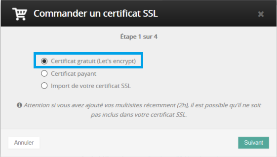
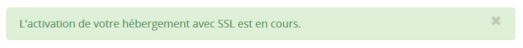
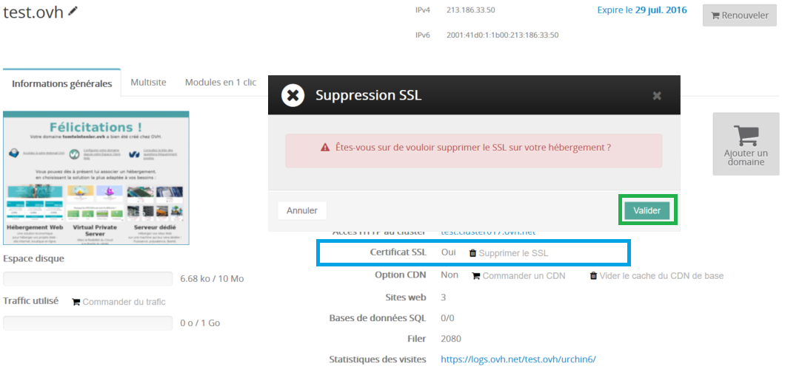
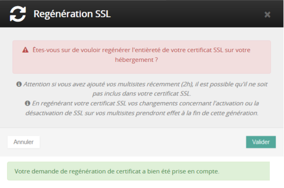
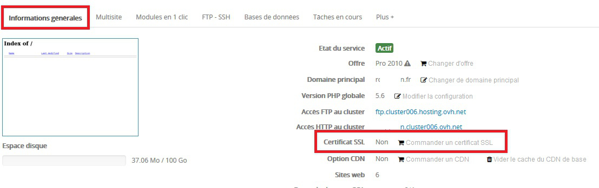
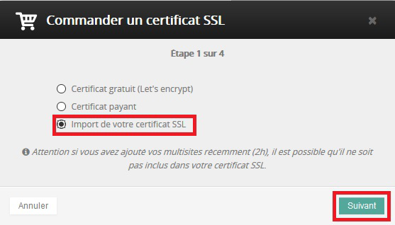
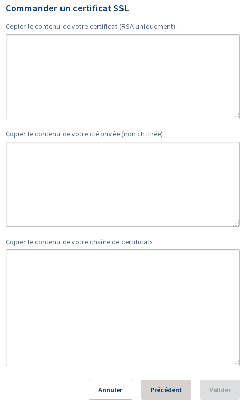

## Les differents certificats SSL

### Certificats SSL Gratuit (Let's Encrypt)
Votre offre d'hébergement web ajoute sur l'ensemble des sites un certificat SSL. Cela permet de chiffrer les communications entre les visiteurs et votre site. Il vous suffit d'utiliser **https://** à la place de **http://** et le flux entre votre ordinateur et votre site sera chiffré.

Nous vous conseillons, si la version HTTPS de votre site fonctionne correctement, de créer une redirection afin que tous vos clients soient automatiquement redirigés sur la version chiffrée. Pour cela, vous trouverez ci-dessous un exemple de script à insérer au sein d'un fichier .htaccess afin de vous aider dans votre démarche mais il ne se substitue pas à l’aide d’un webmaster.

```bash
RewriteEngine On
RewriteCond %{SERVER_PORT} 80
RewriteRule ^(.*)$ https://www.votredomaine.fr/$1 [R=301,L]
```

Si vous utilisez un CMS (comme un WordPerss par exemple), il se peut que celui-ci gére de manière native cette redirection. Consultez la documentation de votre CMS afin d'en savoir plus.

Cependant, le fonctionnement de votre site peut être altéré si vous utilisez votre certificat SSL. Avant de communiquer dessus, vérifier que votre site ne tombe pas dans les erreurs courantes liées au déploiement du SSL, rendez-vous pour cela sur ce guide : [Éviter les pièges du SSL avec mon site web](https://docs.ovh.com/fr/hosting/eviter-les-pieges-du-ssl-avec-mon-site-web/){.external}.

> [!warning]
>
> La modification des fichiers d'un site internet requiert des compétences en programmation. Nous vous recommandons de faire appel à un prestataire spécialisé et/ou de contacter l’éditeur du service si vous éprouvez des difficultés. En effet, nous ne serons pas en mesure de vous fournir une assistance à ce propos.
>

### Certificats SSL payants
Nous proposerons prochainement des certificats SSL payants (de type DV, OV et EV) vous permettant de disposer d'un meilleur chiffrement ou une vérification des données par les registres de certificats par exemple.

### Certificats SSL externes
Vous avez la possibilité d'importer un certificat SSL externe sur votre hébergement web chez OVH. Il n'y a pas de restriction sur le type de certificat que vous pouvez importer.

Retrouver comment réaliser cette manipulation [ici](#IMPORT_SSL){.external}.

## La gestion du certificat SSL gratuit

### Activer le certificat SSL gratuit
Si le certificat n'est pas actif sur votre hébergement, rendez-vous sur votre espace client. Sélectionnez votre hébergement dans la partie de gauche, puis cliquez sur " **Commander un certificat SSL** ".

> [!alert]
>
> Vous pouvez activer SSL Let's Encrypt sur un maximum de 100 domaines et/ou sous
> domaines,  par hébergement .
> 

{.thumbnail}

Choisissez ensuite  **Certificat gratuit (Let's encrypt)** . Puis  **Suivant** .

{.thumbnail}

"L'activation de votre hébergement avec SSL est en cours."

{.thumbnail}

Une fois le certificat généré, le protocole HTTPS est disponible sous quelques heures, le temps de le déployer sur l'ensemble de l'infrastructure.

> [!primary]
>
> Il n'est pas nécessaire de regénérer le certificat tous les 3 mois, cela est automatiquement réalisé par OVH.
> 

### Desactiver le certificat SSL gratuit
Si le certificat est déjà activé et que vous souhaitez le supprimer, rendez- vous sur votre espace client.

Sélectionnez votre hébergement dans la partie de gauche.

Puis, cliquez simplement sur  **Supprimer le SSL** , puis  **Valider** .

Puis, cliquez simplement sur " **Supprimer le SSL** ", puis  **Valider** . Une fois le certificat supprimé, le protocole HTTPS devient indisponible sous quelques heures, le temps de le supprimer sur l'ensemble de l'infrastructure.

{.thumbnail}

<a name="MULTI_SITE"></a>

### Gerer le certificat SSL sur vos multisites
Toujours sur votre espace client, sélectionnez votre hébergement.

Rendez-vous ensuite dans l'onglet  **Multisite** .

Dans la colonne  **SSL** , voyez s'il est  **activé**  ou  **non**  pour votre Multisite. Pour modifier cela, cliquez sur l'icone en forme de  **crayon** .

{.thumbnail}

Cochez simplement  **SSL**  si vous souhaitez l'activer, puis  **Suivant** . Vérifiez le résumé, puis cliquez sur  **Valider** .

{.thumbnail}

Vous verrez ensuite le certificat dans l'état  **À générer** . Cela signifie que lors de la prochaine  **génération de certificat** , ce multisite sera pris en compte.

C'est un état temporaire. De cette façon vous pouvez configurer tout vos multisites/SSL à la suite, puis regénérer votre certificat SSL afin de réduire les délais de ces changements.

Afin que le protocole HTTPS soit actif sur ce multisite, il reste à regénérer le certificat SSL en utilisant le bouton situé sur la droite du tableau des multisites, puis à valider le message de confirmation. Le protocole HTTPS pour ce multisite est disponible sous quelques heures, le temps de le déployer sur l'ensemble de l'infrastructure.

{.thumbnail}

{.thumbnail}

> [!alert]
>
> En cas de modification sur plusieurs multisites
> Il ne faut pas regénérer votre certificat entre chaque modification. Réalisez d'abord les modifications sur chacun de vos multisites, puis une fois terminé, regénérez une seule fois le certificat. Vous gagnerez en temps.
> 

## Les erreurs recurrentes

### Pourquoi je ne peux pas generer de certificat sur mon hebergement ?
Il se peut que vous rencontriez une erreur lors de l'activation du SSL. Retrouvez ici la liste des erreurs possibles :

- An hosted-ssl already exists for this domain

Il existe déjà un certificat SSL lié à ce compte. Il n'est pas possible d'en regénérer un.

- No attached domain with ssl enabled or no attached domain that redirect on hosting IPs, please use hosting IPs in your domain zone

Si aucun de vos multisites sur cet hébergement n'a de certificat SSL généré. Corrigez cela en générant le certificat SSL depuis l'onglet "Multisite", et suivez [la partie Multisite](#MULTI_SITE){.external}.

> [!alert]
>
> Vous pouvez activer SSL Let's Encrypt sur un maximum de 100 domaines et/ou sous domaines,  par hébergement .
> 

### Je rencontre des problemes de mixed content, duplicate content
Le fonctionnement de votre site peut être altéré si vous utilisez votre certificat SSL. Avant de communiquer dessus, vérifier que votre site ne tombe pas dans les erreurs courantes liées au déploiement du SSL de type mixed content ou duplicate content.

Retrouvez plus d'information à ce sujet sur [Éviter les pièges du SSL avec mon site web](https://docs.ovh.com/fr/hosting/eviter-les-pieges-du-ssl-avec-mon-site-web/){.external}.

<a name="IMPORT_SSL"></a>

## Importer un certificat SSL externe

### Comment faire ?
Pour importer votre propre certificat SSL sur votre hébergement, rendez-vous sur votre [espace client](https://www.ovh.com/auth/?action=gotomanager){.external}, puis dans l'onglet "Informations générales" de votre hébergement, cliquez ensuite sur "Commander un certificat SSL".

{.thumbnail}

Choisissez "Import de votre certificat SSL" puis cliquez sur "Suivant".

{.thumbnail}

Renseignez le contenu de votre certificat et votre clé privée puis cliquez sur "Suivant".

{.thumbnail}

L'import de votre certification sera disponible après quelques heures maximum, le temps qu'il soit déployé sur l'ensemble de l'infrastructure.