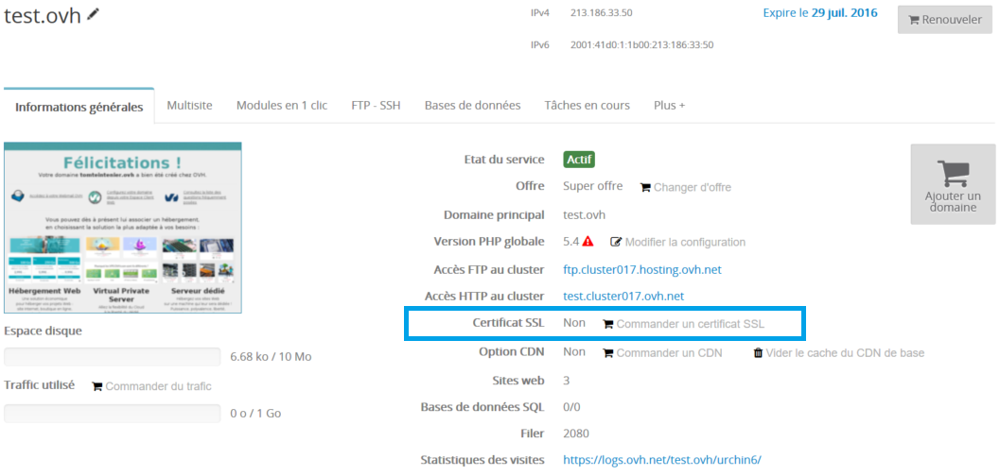
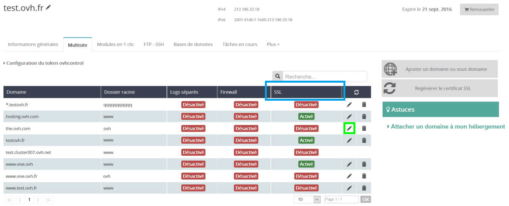
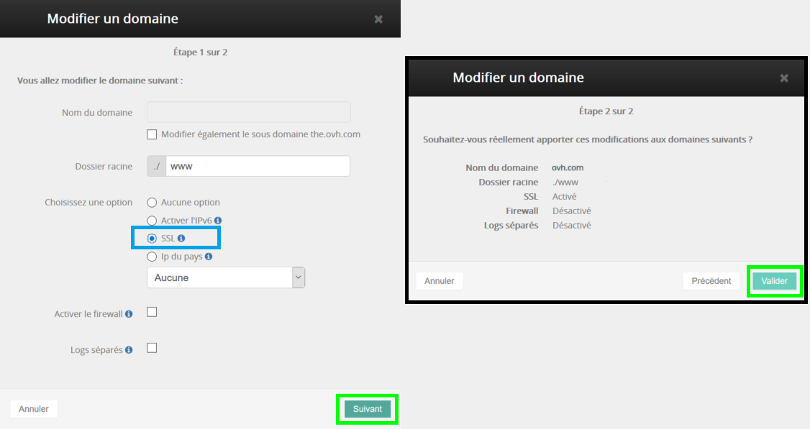
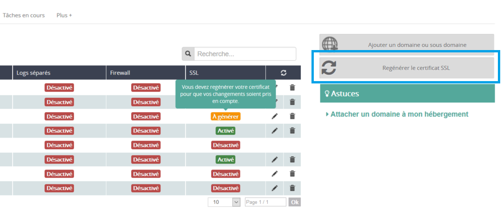
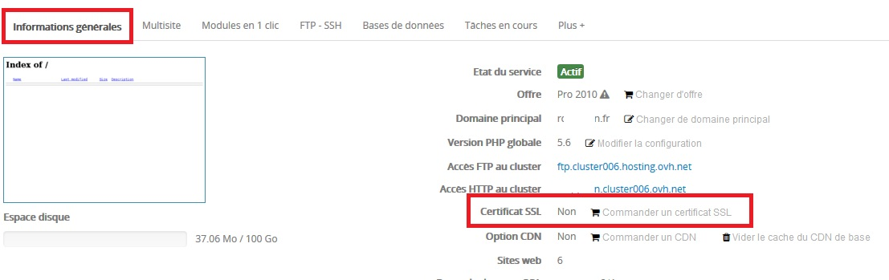
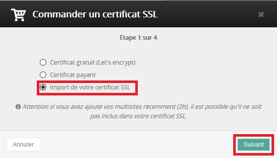
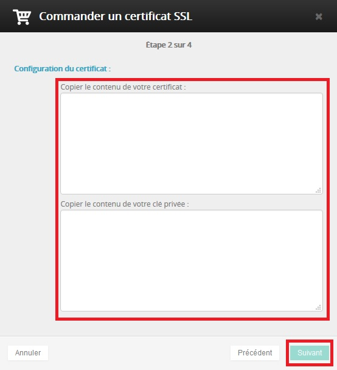

## Certificato SSL Gratuito (Let's Encrypt)
La tua offerta di hosting Web aggiunge su tutti i tuoi siti un certificato SSL che permette di cifrare la comunicazione tra i visitatori e il tuo sito. Per trasmettere informazioni in modo sicuro, è sufficiente utilizzare https:// al posto di http://.

Se la versione HTTPS del tuo sito funziona correttamente, ti consigliamo di aggiungere un reindirizzamento per consentire ai tuoi utenti di raggiungerlo automaticamente in HTTPS. Per impostare il reindirizzamento, aggiungi queste righe nel file .htaccess che si trova nella root del tuo sito (o crealo se non esiste ancora):


```
RewriteEngine On
RewriteCond %{SERVER_PORT} 80
RewriteRule ^(.*)$ https://www.tuodominio.it/$1 [R=301,L]
```


Se utilizzi un CMS, è possibile che questo reindirizzamento sia gestito di default. Per maggiori informazioni, consulra la docuemntazione del tuo CMS.

Utilizzare un certificato SSL potrebbe modificare il funzionamento del tuo sito. Per verificare l'assenza degli errori più comuni associati al suo utilizzo, consulta questa guida: []({legacy}2220)
I certificati SSL gratuiti (Let's Encrypt) non sono compatibili con i domini che contengono caratteri accentati (IDN)


## Certificati SSL a pagamento
A breve con OVH sarà possibile utilizzare certificati SSL a pagamento (di tipo DV, OV e EV) che garantiranno una cifratura migliore e permetteranno, ad esempio, la verifica dei dati da parte dei Registri di certificati.


## Certificati SSL esterni
Sugli hosting Web OVH è possibile importare un certificato SSL esterno, senza restrizioni relativamente al tipo.

Per sapere come effettuare questa operazione, [clicca qui](#IMPORT_SSL).


## Attiva il certificato SSL gratuito
Se il certificato SSL non risulta attivo sul tuo hosting:


- accedi al tuo [Spazio Cliente OVH](https://www.ovh.com/manager/web/login.html)

- seleziona il tuo hosting nella sezione Hosting del menu a sinistra

- clicca su Ordina un certificato SSL


È possibile attivare SSL Let's Encrypt su un massimo di 100 domini e sttodomini per ogni hosting.

{.thumbnail}
Seleziona l'opzione Certificato gratuito (Let's encrypt) e clicca su Seguente.

{.thumbnail}
Attivazione del tuo hosting con SSL in corso...

{.thumbnail}
Una volta generato il certificato, il protocollo HTTPS è disponibile in poche ore, il tempo necessario alla sua applicazione sull'infrastruttura.


## Disattiva il certificato SSL gratuito
Se vuoi eliminare il certificato SSL già attivo sul tuo hosting:


- accedi al tuo [Spazio Cliente OVH](https://www.ovh.com/manager/web/login.html).

- seleziona il tuo hosting nella sezione Hosting del menu a sinistra

- clicca su Elimina SSL e Conferma


Una volta eliminato il certificato, il protocollo HTTPS viene rimosso in poche ore, il tempo necessario alla sua cancellazione dall'infrastruttura.

{.thumbnail}


## Gestisci il certificato SSL sui tuoi multisiti
Seleziona il tuo hosting nel tuo Spazio Cliente OVH e clicca sulla scheda Multisito.

Nella colonna SSL, verifica se il certificato è attivo o disattivo per il tuo multisito.
Per modificarne lo stato, clicca sull'icona a forma di matita.

{.thumbnail}
Per attivare il certificato, seleziona l'opzione SSL e clicca su Seguente.
Verifica che tutte le informazioni siano corrette e Conferma.

{.thumbnail}
Il certificato passerà in Da generare, uno stato temporaneo che indica che la modifica al tuo multisito verrà gestita con la prossima generazione del certificato.

In questo modo, puoi configurare tutti i tuoi multisiti/SSL in un secondo momento e rigenerare il tuo certificato per ridurre il tempo di applicazione delle modifiche.

Per attivare il protocollo HTTPS su questo multisito, è necessario rigenerare il certificato SSL utilizzando il pulsante a destra della tabella e confermare il messaggio.
Il protocollo HTTPS è disponibile in poche ore, il tempo necessario alla sua applicazione sull'infrastruttura.

{.thumbnail}
.

{.thumbnail}
.
In caso di modifica su più multisiti
Non è necessario rigenerare il tuo certificato dopo ogni modifica: puoi effettuare questa operazione una sola volta, dopo aver apportato le modifiche su ciascuno dei tuoi multisiti.


## Non riesci a generare certificati sul tuo hosting: perché?
È possibile che durante l'attivazione del tuo SSL si sia verificato uno di questi errori:


- An hosted-ssl already exists for this domain

Esiste già un certificato SSL associato a questo account e non è possibile generarne un altro.


- Your offer is not compatible with SSL

Le offerte demo1g e 60 free non supportano l'opzione SSL. Per utilizzare il certificato SSL Let's Encrypt, attiva un'offerta compatibile.


- Your cluster is not compatible with SSL

Le offerte demo1g, Windows e 60 free non supportano l'opzione SSL. Per utilizzare il certificato SSL Let's Encrypt, attiva un'offerta compatibile.


- You already have an SSL certificate on your account. It will be migrate on new SSL offers in the next week

Questo errore indica che hai già un certificato SSL Global Sign e non è quindi necessario attivare immediatamente Let's Encrypt. A breve riceverai una comunicazione per la migrazione del tuo servizio.


- No attached domain with ssl enabled or no attached domain that redirect on hosting IPs, please use hosting IPs in your domain zone

Questo errore potrebbe verificarsi se:

- il dominio su cui vuoi generare un certificato SSL punta verso l'indirizzo IP CDN del tuo hosting. Per correggere l'errore, inserisci come destinazione, nella zona DNS associata, l'indirizzo IP senza CDN (disponibile nelle "Informazioni generali").
- su nessuno dei tuoi multisiti di questo hosting risultano generati certificati SSL.

Per correggere l'errore, genera il certificato SSL dalla scheda "Multisito" e segui [il paragrafo di questa guida relativo alla gestione dei tuoi multisiti](#MULTI_SITE).
È possibile attivare SSL Let's Encrypt su un massimo di 100 domini e sttodomini per ogni hosting.


## Hai riscontrato problemi di mixed content e duplicate content
Utilizzare un certificato SSL potrebbe modificare il funzionamento del tuo sito. Ti consigliamo quindi di verificare l'assenza degli errori più comuni associati al suo utilizzo, come il mixed content e il duplicate content.

Per maggiori informazioni sui problemi SSL, consulta [questa guida]({legacy}2220).


## Utilizza HTTPS di default
Per impostare un URL predefinito in HTTPS per il tuo sito, aggiungilo al tuo file .htaccess (o crealo nella root del tuo sito):


```
RewriteEngine On
RewriteCond %{SERVER_PORT} 80
RewriteRule ^(.*)$ https://www.tuodominio.it/$1 [R,L]
```


## Imposta un reindirizzamento del tuo dominio in HTTPS dal tuo Spazio Cliente OVH
Per impostare un reindirizzamento HTTPS dal tuo Spazio Cliente OVH, consulta [questa guida](https://www.ovh.it/g1339.reindirizzamento-dominio).


## Come fare?
1. Per importare il tuo certificato SSL personale sul tuo hosting, accedi al tuo [Spazio Cliente OVH](https://www.ovh.com/auth/?action=gotomanager)
2. Clicca sulla scheda Informazioni generali del tuo hosting
3. Clicca su Ordina un certificato SSL

{.thumbnail}
4. Seleziona l'opzione Importa il tuo certificato SSL
5. Clicca su Seguente

{.thumbnail}
6. Copia il contenuto del tuo certificato e della tua chiave privata.
7. Clicca su Seguente

{.thumbnail}
L'operazione di importazione del tuo certificato richiede al massimo qualche ora, il tempo necessario alla sua applicazione sull'infrastruttura.

