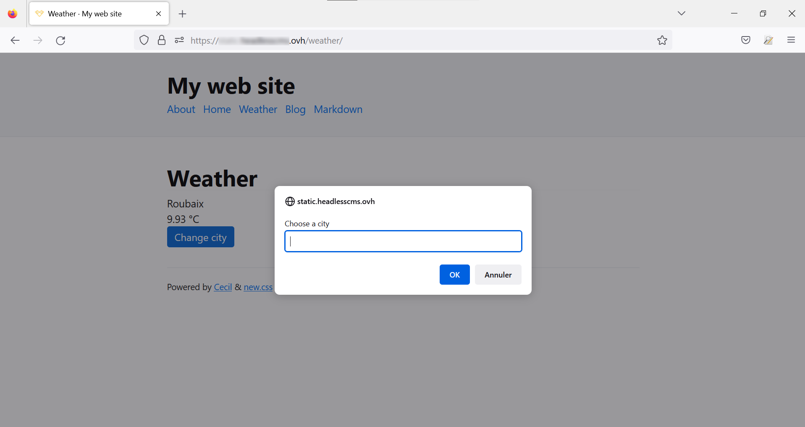
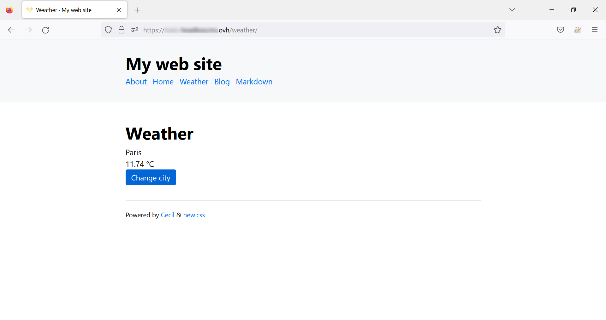

> [!primary]
> Diese Übersetzung wurde durch unseren Partner SYSTRAN automatisch erstellt. In manchen Fällen können ungenaue Formulierungen verwendet worden sein, z.B. bei der Beschriftung von Schaltflächen oder technischen Details. Bitte ziehen Sie beim geringsten Zweifel die englische oder französische Fassung der Anleitung zu Rate. Möchten Sie mithelfen, diese Übersetzung zu verbessern? Dann nutzen Sie dazu bitte den Button «Mitmachen» auf dieser Seite.
>

**Letzte Aktualisierung am 16.01.2023**

## Ziel

In dieser Anleitung erfahren Sie, wie Sie das Web-Entwicklungstool [Cecil](https://cecil.app){.external} verwenden, um den Inhalt einer dynamischen Seite wiederzugeben. Dazu wird eine externe API eingebunden, die Informationen auf einer mit **Cecil** erstellten Seite anzeigt.

**In diesem Tutorial wird erläutert, wie Sie API-Aufrufe von Ihrer statischen Webseite aus hinzufügen.**

> [!warning]
> OVHcloud stellt Ihnen Dienstleistungen zur Verfügung, für deren Konfiguration und Verwaltung Sie die alleinige Verantwortung tragen. Es liegt somit bei Ihnen, sicherzustellen, dass diese ordnungsgemäß funktionieren.
> 
> Wenn Sie Schwierigkeiten haben, den Schritten dieses Tutorials zu folgen, empfehlen wir Ihnen, einen [spezialisierten Dienstleister](https://partner.ovhcloud.com/de/directory/) zu kontaktieren oder Ihre Fragen in der OVHcloud Community zu stellen. Leider können wir Ihnen für administrative Aufgaben keine weitergehende technische Unterstützung anbieten. Weitere Informationen finden Sie am [Ende dieser Anleitung](#go-further).
>

## Voraussetzungen

- Sie verfügen über ein [OVHcloud Webhosting](https://www.ovhcloud.com/de/web-hosting/) mit SSH-Zugang. Über diesen Zugriff können Sie eine oder mehrere Alternativlösungen online installieren, ergänzend zu den Webhosting-Standarddiensten.
- Sie sind mit der Befehlszeileneingabe vertraut.
- Sie haben die Anwendung **Cecil** auf Ihrem Hosting installiert und konfiguriert (gemäß unseres Tutorials zur [Installation und Konfiguration von Cecil](https://docs.ovh.com/de/hosting/install-configure-cecil/)).

## In der praktischen Anwendung

Als Beispiel wird eine API eines Wetterdatendienstes verwendet, basierend auf einer Stadt, die vom Benutzer eingegeben wird.

Die Schritte sind dabei wie folgt:

- Erstellen einer neuen Seite in **Cecil** und diese in das Menü der Website einfügen.
- Einen Account erstellen und einen Schlüssel für Anfragen an die Wetterdaten-API abrufen.
- Die erstellte `.md`-Datei durch Hinzufügen von HTML-Code bearbeiten.
- Hinzufügen von `assets` (JavaScript und CSS).
- Die Lösung anwenden und testen.

### Eine neue Seite erstellen

Loggen Sie sich zunächst via SSH auf Ihrem Webhosting ein. Folgen Sie der Anleitung "[Installation und Konfiguration von Cecil](https://docs.ovh.com/de/hosting/install-configure-cecil/)", um Ihre **Cecil** Anwendung in einem dedizierten Verzeichnis zu installieren.

Erstellen Sie ein neues Verzeichnis wechseln Sie zu diesem:

```bash
mkdir myWebSite
cd myWebSite
```

### Verwendung der API von OpenWeather

Für dieses Tutorial verwenden wir eine API, die von [OpenWeather](https://openweathermap.org/){.external} bereitgestellt wird. Sie ermöglicht es, die meteorologischen Informationen je nach einer spezifizierten Stadt abzurufen.

Erstellen Sie einen Account auf <https://home.openweathermap.org/users/sign_up>.<br>
Sobald Ihr Account validiert wurde (per E-Mail), gehen Sie auf zum Menü "My API keys". Es wurde ein Schlüssel erstellt, den Sie hier kopieren und für die Fortsetzung dieses Tutorials speichern können.

{.thumbnail}

### HTML-Code hinzufügen

Erstellen Sie eine neue Seite mit folgendem Befehl:

```bash
php cecil.phar new:page weather
```

Bearbeiten Sie anschließend die erstellte Seite:

```bash
nano pages/weather.md
```

Ändern Sie den Header der Datei, damit die Seite im Menü erscheint:

```
---
title: "Weather"
date: 2022-11-28
published: true
menu: main
---
```

Fügen Sie nach dem Header den HTML-Code hinzu, um die gewählte Stadt, die von der API zurückgegebenen Temperaturen und einen Button zur Parameteränderung anzuzeigen:

```html
---
title: "Weather"
date: 2022-11-28
published: true
menu: main
---
<h1>Weather</h1>
<div>
    <span id="city">Roubaix</span>
    <div id="temperature"><span id="temperatureValue"></span> °C</div>
    <div id="modify">Change city</div>
</div>
```

Erzeugen Sie die HTML-Seite mit folgendem Befehl:

```bash
php cecil.phar build
```

Überprüfen Sie das Ergebnis in Ihrem Browser und klicken Sie auf den Link "Weather", der im Hauptmenü hinzugefügt wurde:

{.thumbnail}

### JavaScript-Code hinzufügen

Es ist nicht möglich, einen `<script>` Tag in eine Markdown-Datei einzufügen. Ändern Sie das Standard-Template.

#### Template bearbeiten

Die Templates sind im Verzeichnis `layouts` enthalten. Sie können sie mit folgendem Befehl anzeigen:

```bash
ls -la layouts
```

Die Datei enthält das Verzeichnis `blog` und die Datei `index.html.twig`:

{.thumbnail}

Öffnen Sie die Datei `index.html.twig`:

{.thumbnail}

Die Datei bezieht sich auf ein Template, das nicht im Verzeichnis vorhanden ist. Diese und weitere Dateien sind in `cecil.phar` enthalten. Dateien mit der Erweiterung `.phar` sind PHP-Archivdateien, die ohne Dekomprimierung bearbeitet werden können.

Entpacken Sie die Dateien dieses Archivs, um sie sichtbar zu machen:

```bash
php cecil.phar util:extract
```

Anzeige des Inhalts von `layouts`:

{.thumbnail}

Ändern Sie das Standard-Template, um einen `<skript>` Tag einzufügen, der den Code für den API-Aufruf enthält:

```bash
nano layouts/_default/page.html.twig
```

Dieser Tag und dessen Inhalt sind vor dem schließenden `</body>` am Seitenende einzufügen:

```twig
    </footer>
    {%- include 'partials/googleanalytics.js.twig' with {site}
    
    <script src="{ asset( script.js', { minify: true} }}"></script>
    
  </body>
</html>
```

Wenn eine oder mehrere Dateien in `assets` geändert wurden, muss der Cache mit folgendem Befehl erneuert werden:

```bash
php cecil.phar cache:clear:assets
```

Wenn die Änderungen in Ihrem Browser nicht angezeigt werden, leeren Sie den Cache.
Sie können auch die auf Ihrem Webhosting erzeugten Dateien löschen:

```bash
php cecil.phar clear
```

Regenerieren Sie anschließend die Seite mit folgendem Befehl:

```bash
php cecil.phar build
```

#### JavaScript-Datei hinzufügen

JavaScript-Dateien, wie etwa CSS-Dateien, sind im Verzeichnis `assets` zu platzieren. Sie können sie in verschiedenen Verzeichnissen organisieren.

Erstellen Sie die zuvor erwähnte Datei `script.js` im Wurzelverzeichnis `assets`:

```bash
nano assets/script.js
```

Ersetzen Sie den Wert der Variable `apiKey` mit Ihrem zuvor auf [OpenWeather](https://openweathermap.org/){.external} erhaltenen Schlüssel.

```javascript
let apiKey = '123456789'; // Ersetzen Sie diesen Wert
let city = 'Roubaix'; // Geben Sie hier die Stadt an, die auf der Wetterseite angezeigt wird
getTemperature(city);  // Aufrufende Funktion mit dem Parameter "city"

// Ereignis zum Klick auf "Change City"
let button = document.querySelector('#modify');
button.addEventListener('click', () => {
    city = prompt('Choose a city');
    getTemperature(city);
});

// API-Funktion unter Verwendung eines Objekts "XMLHttpRequest" für eine asynchrone Anfrage
function getTemperature(city) {
    let url = 'https://api.openweathermap.org/data/2.5/weather?q=' + city + '&appid=' + apiKey + '&units=metric';
    let xhrQuery = new XMLHttpRequest();
    xhrQuery.open('GET', url);
    xhrQuery.responseType = 'json';
    xhrQuery.send();

    xhrQuery.onload = function() {
        if (xhrQuery.readyState === XMLHttpRequest.DONE) {
            if (xhrQuery.status === 200) {
                let city = xhrQuery.response.name;
                let temperature = xhrQuery.response.main.temp;
                document.querySelector('#city').textContent = city;
                document.querySelector('#temperatureValue').textContent = temperature;
            } else {
                alert('A problem has occurred, please try later.');
            }
        }
    };
}
```

### Tests

Rufen Sie Ihre Website nun in einem Webbrowser auf.

{.thumbnail}

Klicken Sie auf "Change City" und geben Sie den Namen einer Stadt ein:

{.thumbnail}

{.thumbnail}

### Fazit

Dynamische Daten, die über APIs externer Quellen bezogen wurden, können wie oben beschrieben in statische Webseiten integriert werden. Erstellen und pflegen Sie eine Website, indem Sie den Inhalt dieser Seiten manuell ändern oder neue erstellen. Gleichzeitig bereichern sie ihre Inhalte mithilfe externer Websites.

## Weiterführende Informationen <a name="go-further"></a>

- Weitere APIs für Ihre Website:
    - [Numbers API](http://numbersapi.com/#42){.external}
    - [NASA](https://api.nasa.gov/){.external}
    - [News API](https://newsapi.org/){.external}
    - [Polygon.io](https://polygon.io/){.external}
    - [Liste öffentlicher APIs](https://github.com/public-api-lists/public-api-lists){.external}
- [Cecil Befehlsreferenz](https://cecil.app/documentation/commands/){.external}

Kontaktieren Sie für spezialisierte Dienstleistungen (SEO, Web-Entwicklung etc.) die [OVHcloud Partner](https://partner.ovhcloud.com/de/directory/).

Wenn Sie Hilfe bei der Nutzung und Konfiguration Ihrer OVHcloud Lösungen benötigen, beachten Sie unsere [Support-Angebote](https://www.ovhcloud.com/de/support-levels/).

Für den Austausch mit unserer User Community gehen Sie auf <https://community.ovh.com/en/>.
