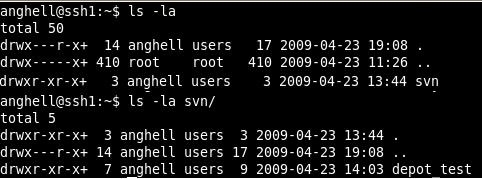
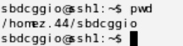

## 

- Ein Hosting mit SSH-Zugang (ab PRO Hosting)
- SSH-Verbindung zum Hosting (wie das geht, erfahren Sie in dieser [Hilfe](https://www.ovh.de/g1962.webhosting_ssh_auf_ihren_webhostings))


## 
Wenn Sie per SSH mit Ihrem Hosting verbunden sind, müssen Sie zunächst den Wurzelordner für die SVN-Depots und anschließend ein Depot erstellen.

Dazu müssen Sie die folgenden Befehle eingeben:


```
mkdir svn
```


und


```
svnadmin create svn/depot_test
```


Anschließend können Sie überprüfen, ob die Verzeichnisse erstellt wurden. Verwenden Sie dafür diesen Befehl:


```
ls -la
```


## 
Die Verzeichnisse sollten dann folgendermaßen angezeigt werden:

{.thumbnail}


## Unter Linux mit OpenSSH
Dieser Vorgang wird auf dem Computer durchgeführt, der sich mit dem SVN-Depot verbinden wird (SVN-Client).

Es muss ein DSA-Schlüsselpaar erstellt werden. Geben Sie hierfür in Ihrem Terminal folgenden Befehl ein:


```
ssh-keygen -t dsa
```


Entnehmen Sie die Zeile, die sich standardmäßig in der Datei .ssh/id_rsa.pub befindet. Um diese Datei zu bearbeiten, genügt der Befehl: vi.


```
vi .ssh/id_dsa.pub
```


Sie finden darin den Schlüssel aus drei Zeichenketten, die Typ, Schlüssel und Kommentar angeben.


## Unter Windows mit PuTTY
Dieser Vorgang wird auf dem Computer durchgeführt, der sich mit dem SVN-Depot verbinden wird (SVN-Client).

Zunächst müssen Sie Windows PuTTY herunterladen und installieren.
Es muss ein DSA-Schlüsselpaar erstellt werden. Starten Sie hierfür PuTTYgen, erstellen Sie ein Schlüsselpaar und

{.thumbnail}


## 
Wenn Sie Ihren Schlüssel erstellt haben, müssen Sie diesen in die Datei .ssh/authorized_keys2 auf Ihrem Hosting einfügen. Geben Sie dafür folgenden Befehl ein: 


```
mkdir .ssh
chmod 700 .ssh
vi .ssh/authorized_keys2
```


Wenn Sie die Datei geöffnet haben, fügen Sie folgende Zeile ein:


```
command="/usr/bin/svnserve --root=/home.XXX/loginFTP/svn --tunnel --tunnel-user=nutzer",no-port-forwarding,no-agent-forwarding,no-X11-forwarding,no-pty
```


Fügen Sie dann in derselben Zeile noch den zuvor erstellten Key an.
Bitte beachten Sie: Ersetzen Sie "/home.XXX/loginFTP" und "nutzer" mit den für Sie passenden Angaben. 

Wenn Sie die Werte für "/home.XXX/loginFTP" nicht kennen, verwenden Sie den Befehl "pwd" in SSH.

{.thumbnail}
Der Benutzer kann dann den Inhalt des Depots abrufen, sich aber nicht direkt per SSH mit der Maschine verbinden.
Bitte beachten Sie: In der Kommandozeile darf nicht derselbe Key für SVN und SSH verwendet werden.


## Unter Linux
Sie können über den Computer, der sich mit dem SVN-Depot verbindet (SVN-Client), einen Test ausführen. Geben Sie dafür folgenden Befehl ein:


```
svn checkout svn+ssh://loginFTP@clusterXXX/depot_test
```


## Unter Windows mit TortoiseSVN

- TortoiseSVN herunterladen und installieren ([http://tortoisesvn.net/downloads](http://tortoisesvn.net/downloads))
- Doppelklick auf den privaten Key. Rechts unten erscheint ein Icon und der Key wird in den Authentifizierungsclient geladen.
- Verzeichnis erstellen, Rechtsklick und "SVN Checkout" auswählen. Eingabe


```
svn+ssh://loginFTP@clusterXXX/depot_test
```


in das Feld "URL of repository" und Klick auf OK:

{.thumbnail}
Die englischsprachige Dokumentation für Subversion ist sehr empfehlenswert: [http://svnbook.red-bean.com/en/1.5/index.html](http://svnbook.red-bean.com/en/1.5/index.html)


## Erstellung mehrerer Konten
Zunächst müssen Sie mehrere SSH Keys erstellen.

Anschließend beim Hinzufügen des öffentlichen Keys auf dem Hosting:


```
command="/usr/bin/svnserve --root=/home.XXX/loginFTP/svn --tunnel --tunnel-user=marc",no-port-forwarding,no-agent-forwarding,no-X11-forwarding,no-pty
```


Ändern Sie untenstehende Parameter und ergänzen Sie jeweils die passenden Angaben für Ihre verschiedenen Nutzer:


```
--tunnel-user
```


Gut zu wissen: Sie können auch nur Read-Only-Access gewähren. Ergänzen Sie hierfür folgenden Parameter:


```
--read-only.
```


## Lokale Überprüfung über den Server
Wenn Sie eine lokale Überprüfung durchführen möchten, verwenden Sie folgenden Befehl:


```
svn+ssh://login@ftp.nome-sito.tld/home.XXX/login/svn/repository_test
```


