**Letzte Aktualisierung am 17.02.2023**

> [!primary]
> Diese Übersetzung wurde durch unseren Partner SYSTRAN automatisch erstellt. In manchen Fällen können ungenaue Formulierungen verwendet worden sein, z.B. bei der Beschriftung von Schaltflächen oder technischen Details. Bitte ziehen Sie beim geringsten Zweifel die englische oder französische Fassung der Anleitung zu Rate. Möchten Sie mithelfen, diese Übersetzung zu verbessern? Dann nutzen Sie dazu bitte den Button «Mitmachen» auf dieser Seite.
>

## Ziel

Mit dieser Anleitung können Sie Ihre ersten Inhalte erstellen, organisieren, online stellen und das Thema Ihrer Website mit dem Content Management System (CMS) **WordPress** ändern. Sie können Ihre Website ohne besondere Kenntnisse in Programmierung erstellen, mit einer breiten Palette an Themen wie Unternehmens-Website, Blog oder Website, um Ihre Aktivitäten oder Leidenschaften bekannt zu machen.

> [!warning]
>
> OVHcloud stellt Ihnen Dienste zur Verfügung, deren Konfiguration, Verwaltung und Verantwortung Ihnen obliegen. Es liegt daher an Ihnen, dafür zu sorgen, dass sie ordnungsgemäß funktionieren.
> 
> Wir stellen Ihnen dieses Tutorial zur Verfügung, um Sie bei alltäglichen Aufgaben bestmöglich zu unterstützen. Dennoch empfehlen wir Ihnen, falls Sie Hilfe brauchen, einen [spezialisierten Dienstleister](https://partner.ovhcloud.com/de/) oder [Herausgeber des CMS WordPress](https://wordpress.com/support/){.external} zu kontaktieren. Wir werden Ihnen leider keine Unterstützung anbieten können. Mehr Informationen finden Sie im Abschnitt ["Weiterführende Informationen"](#go-further) dieser Anleitung.
>

**Diese Anleitung erklärt, wie Sie eine Website mit dem CMS WordPress erstellen**

## Voraussetzungen

- Sie verfügen über ein [Webhosting](https://www.ovhcloud.com/de/web-hosting/), das mindestens eine Datenbank enthält.
- Über eine [Domainname](https://www.ovhcloud.com/de/domains/)
- Sie haben [WordPress installiert](https://docs.ovh.com/de/hosting/webhosting_installation_von_webhosting-modulen/) auf Ihrem Webhosting
- Sie sind im [OVHcloud Kundencenter](https://www.ovh.com/auth/?action=gotomanager&from=https://www.ovh.de/&ovhSubsidiary=de){.external} eingeloggt

## In der praktischen Anwendung

Ist das nicht bereits der Fall, fügen Sie vor dem Fortfahren [SSL-Zertifikat hinzufügen](https://docs.ovh.com/de/hosting/website-umstellen-https-ssl/#schritt-1-ssl-zertifikat-fur-das-hosting-aktivieren) für die zu Ihrer Website gehörende Domain ein.

Bei der Installation Ihres CMS mit 1-Klick erhalten Sie eine E-Mail mit den notwendigen Informationen zur Weiterführung dieses Tutorials:

- Zugangsverbindung zum Administrations-Interface
- Name des Administrators
- einen Link, um das Administratorpasswort zu erhalten.

Holen Sie diese Elemente, bevor Sie fortfahren.

### Mit dem Administrations-Interface verbinden

Klicken Sie auf den Zugangslink zum Administrations-Interface, der bei der Installation des CMS per E-Mail übermittelt wurde. Standardmäßig endet die URL mit einem `wp-admin`. Wenn Sie sich nicht auf Ihrem Verwaltungsinterface authentifiziert haben, wird **WordPress** Sie automatisch auf Ihre URL umleiten, die mit einem `wp-login` endet:

{.thumbnail}

> [!primary]
> 
> Auf dieser Startseite haben Sie die Möglichkeit, die Standardsprache des Interface von **WordPress** zu ändern. Begeben Sie sich in das Drop-down-Menü am Seitenende, wählen Sie die Sprache Ihrer Wahl aus und bestätigen Sie mit dem Button `Change`{.action}. Die Sprache kann später geändert werden.
> 

Geben Sie den Login (oder "Name des Administrators") ein, der Ihnen per E-Mail zugesandt wurde, sowie das in derselben E-Mail angegebene "WordPress-Passwort". So gelangen Sie auf Ihr Dashboard:

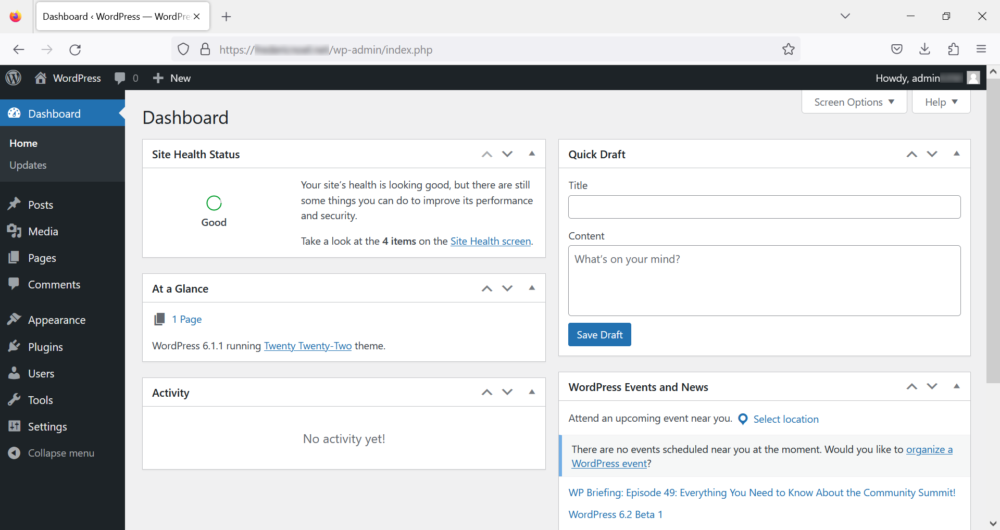{.thumbnail}

### Das Thema Ihrer Website ändern

**WordPress Themen** sind Datensätze, mit denen die Präsentation Ihrer Website ohne Änderung des Inhalts geändert werden kann. Es gibt viele Themen, die im Internet verfügbar sind, kostenfrei und mit unterschiedlichen Thematiken (Websites, Blogs, E-Commerce, Online-Presse, ...).

Um Ihr Thema zu ändern, klicken Sie im linken Menü Ihres Dashboards auf `Aussehen`{.action} und dann auf `Themen`{.action}:

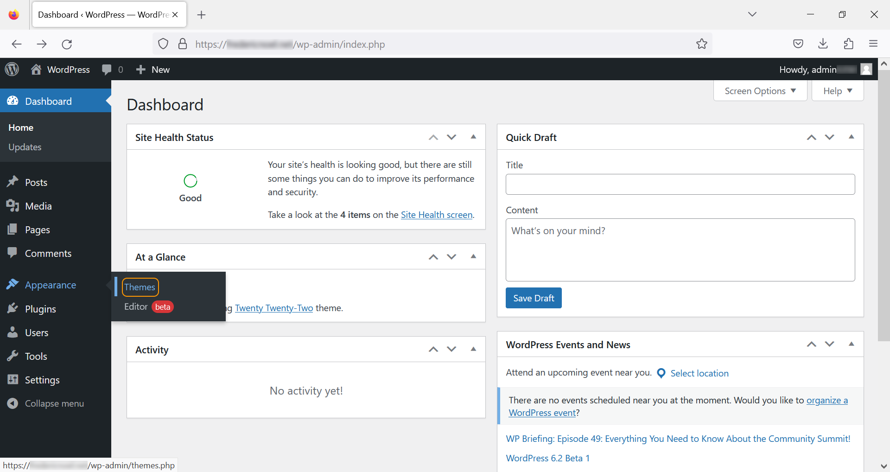{.thumbnail}

Wählen Sie aus den angebotenen Themes ein Thema aus und klicken Sie auf `aktivieren`{.action}:

{.thumbnail}

Sie können sich das Ergebnis anzeigen lassen, indem Sie mit Ihrer Domain auf Ihre Website gehen.

### Artikel schreiben

Mit WordPress können Sie ganz einfach Inhalte erstellen, ohne über Kenntnisse in der Webentwicklung zu verfügen.

Um einen Artikel zu erstellen, gehen Sie in den Bereich `Artikel`{.action} im Menü links und klicken Sie dann auf den Punkt `hinzufügen`{.action}:

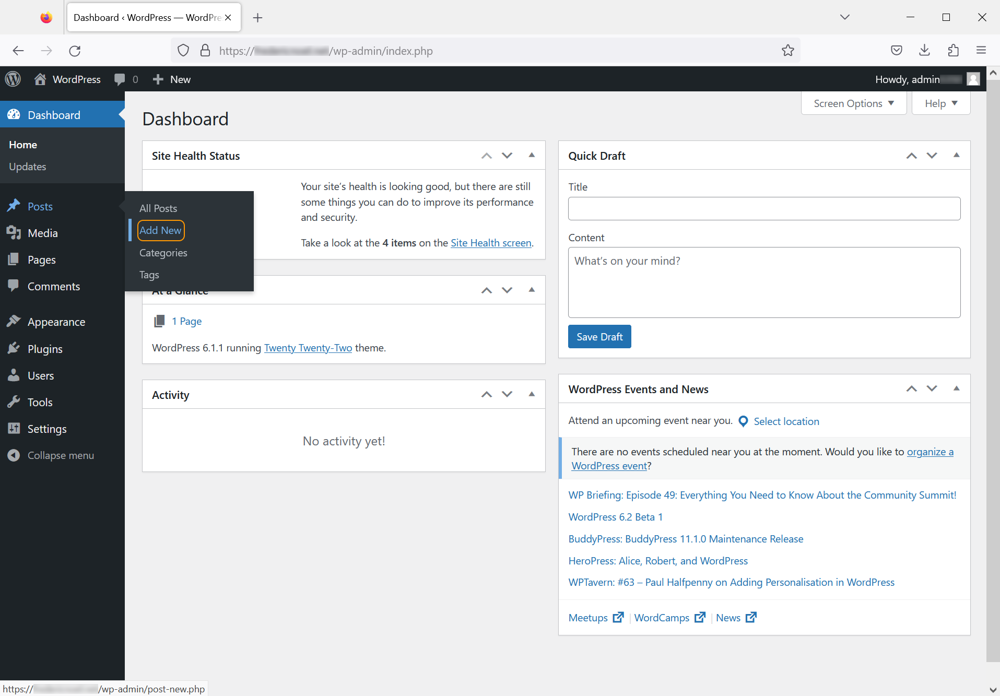{.thumbnail}

Seit Version 5 bietet **WordPress** ein Interface an, um die Erstellung und Bearbeitung von Artikeln zu vereinfachen: **Gutenberg** Es handelt sich um einen WYSIWYG-Verleger ("what you see is what you get*"). Sie können Ihre Seite direkt zusammenstellen, indem Sie Elemente wie Titel, Absätze, Listen, Bilder usw. hinzufügen. :

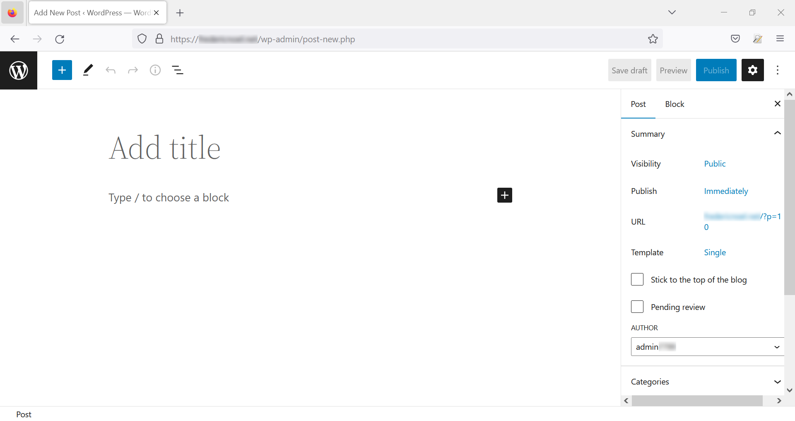{.thumbnail}

Klicken Sie auf `Tragen Sie den Titel`{.action} ein, um einen Titel zu Ihrer Seite hinzuzufügen:

{.thumbnail}

Um Inhalt hinzuzufügen, klicken Sie auf das Zeichen `+`{.action} und wählen Sie aus, was Sie einfügen möchten:

{.thumbnail}

Rechts auf Ihrer Seite können Sie über drei Links folgende Aktionen ausführen:

- `Den Entwurf speichern`{.action}, eine Aktion, die Sie auch mit der Tastkombination `Ctrl` + `S` machen können (oder daraus der Status `cmd` +`S` auf macOS).
- `Vorschau`{.action} anzeigen
- `Veröffentlichen`{.action} auf Ihrer Website .

Klicken Sie in unserem **Beispiel** auf `Visualisieren`{.action} und dann auf `Voranzeigen in einem neuen Tab`{.action}. Wählen Sie den Gerätetyp aus, für den die Wiedergabe durchgeführt werden soll (PC, Tablet oder Smartphone):

{.thumbnail}

Um zum Verwaltungsinterface von **WordPress** zurückzukehren klicken Sie oben links auf das Icon.

### Die Kategorien verwalten

**WordPress** erlaubt es, Kategorien zu definieren und Ihre Artikel mit einer oder mehreren Kategorien zu verbinden. Um die Kategorien Ihrer Website zu verwalten, gehen Sie in den Bereich `Artikel`{.action} und dann in den Bereich `Kategorien`{.action}:

{.thumbnail}

Geben Sie nun das Formular ein, um eine neue Kategorie hinzuzufügen:

- **Name**: Name Ihrer Kategorie, die auf Ihrer Website angezeigt wird.
- **Slug**: Element, das am Ende Ihrer URL erscheint (nützlich, um Ihre Referenzierung zu verbessern).
- **Elternkategorie**: erlaubt die Hierarchisierung Ihrer Kategorien (die von Ihnen erstellte Kategorie kann eine Unterkategorie einer bestehenden Kategorie sein).
- **Beschreibung**: Die Beschreibung Ihrer Kategorie ist standardmäßig nicht sichtbar, kann aber für einige Themen sichtbar sein.

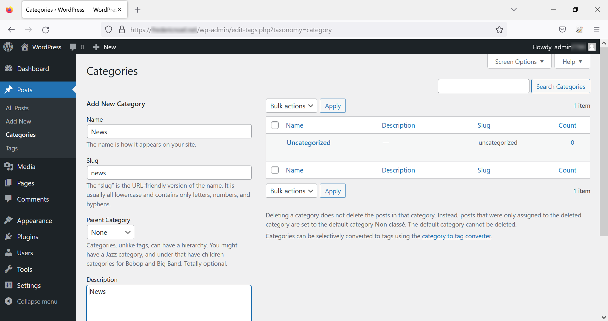{.thumbnail}

Wenn Sie diese Informationen angegeben haben, klicken Sie auf den Button `Neue Kategorie hinzufügen`{.action} :

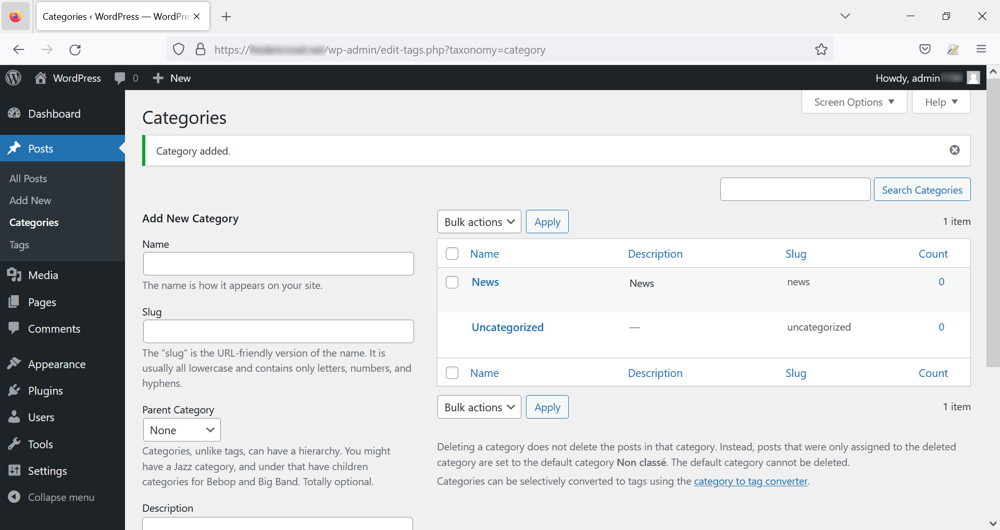{.thumbnail}

Sie können die Hierarchie Ihrer Kategorien verwalten. Eine neue Kategorie kann mit einer bestehenden Kategorie verknüpft werden:

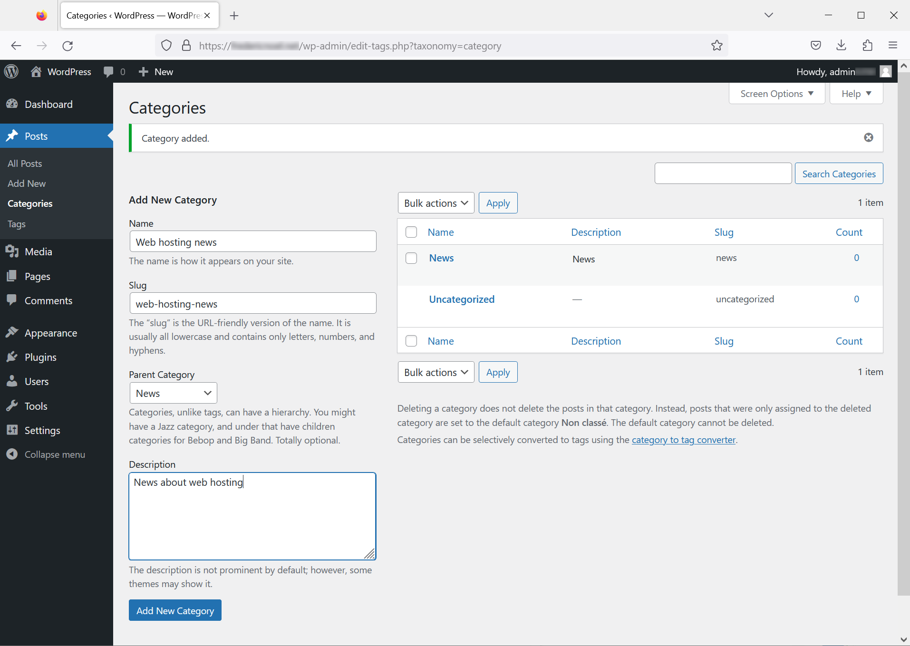{.thumbnail}

### Eine Kategorie einem Artikel zuweisen

Um einen Artikel einer oder mehreren Kategorien zuzuweisen klicken Sie auf `Artikel`{.action} (Posts). Sie erhalten die Liste mit allen Artikeln und deren Satzungen. Gehen Sie über den Titel des Artikels, den Sie klassifizieren möchten, und klicken Sie auf `Schnelle Änderung`{.action}:

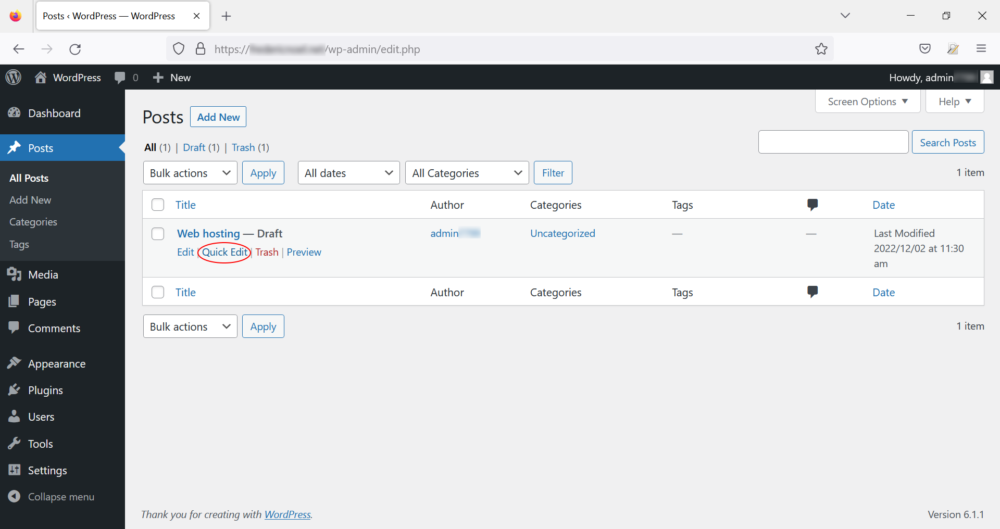{.thumbnail}

Ändern Sie die Kategorien, indem Sie die in der `Spalte`{.action} aufgeführten Elemente ankreuzen oder entfernen:

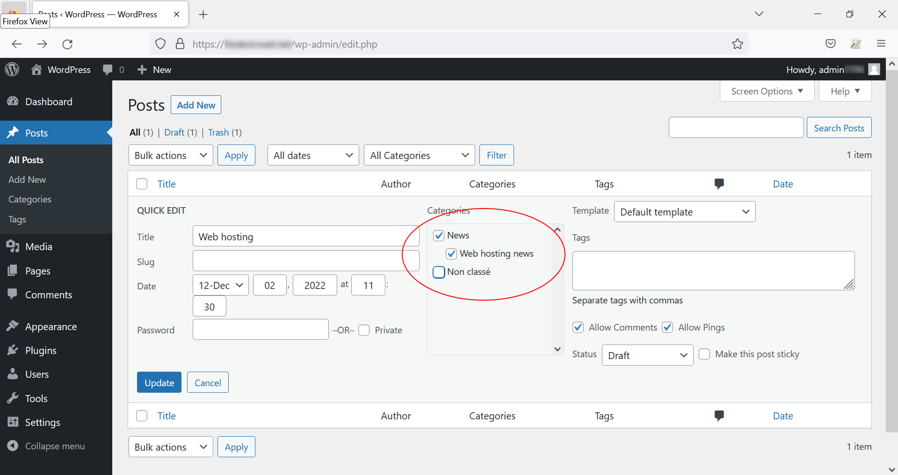{.thumbnail}

> [!warning]
>
> Die Auswahl einer Unterkategorie führt nicht zur automatischen Auswahl der Elternkategorie.
>

### Seiten erstellen

Die Seiten sind von Artikeln zu unterscheiden. Sie dienen hauptsächlich dazu, Inhalte zu schreiben, die sich im Laufe der Zeit nicht oder nur wenig verändern werden, wie z. B. AGB, allgemeine Nutzungsbedingungen usw.

Gehen Sie auf die Seite `Seite`{.action}:

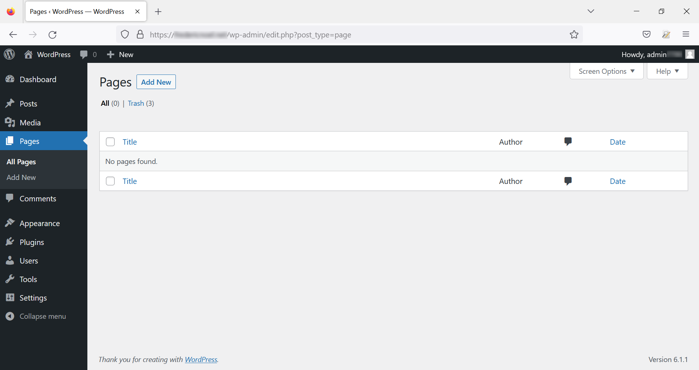{.thumbnail}

> [!primary]
>
> Standardmäßig existiert eine Seite, die bei der Installation von **WordPress** erstellt wird. Aus Gründen der Lesbarkeit wurde diese Seite aus dem Beispiel entfernt.
>

Klicken Sie auf `Hinzufügen von`{.action}. Hier sehen Sie den Verleger Gutenberg:

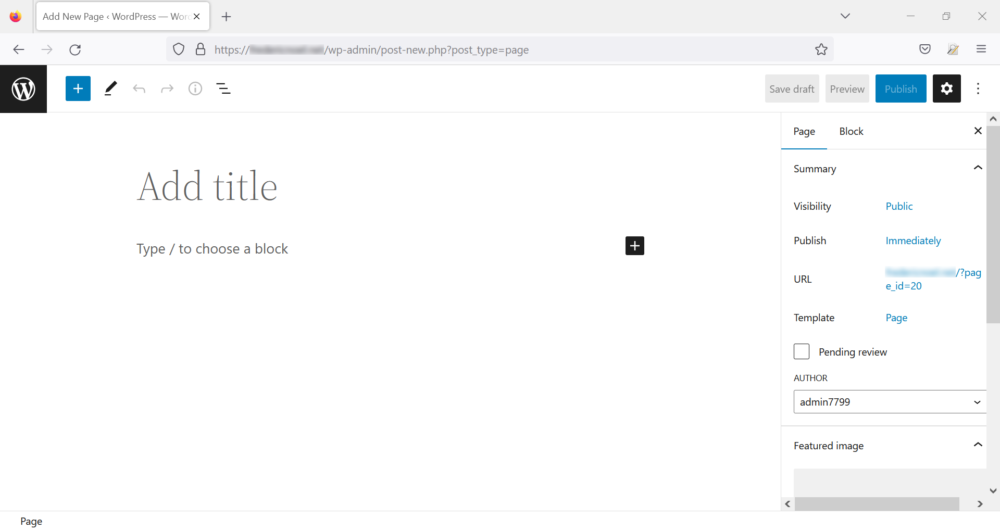{.thumbnail}

Erstellen Sie den Inhalt Ihrer Seite und veröffentlichen Sie ihn:

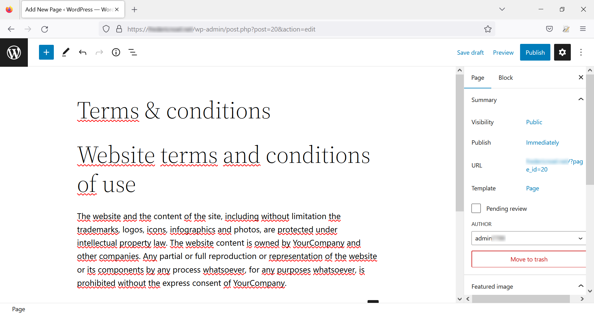{.thumbnail}

Sie können auf die Startseite Ihrer Website zurückkehren, über einen Link zu Ihrer neuen Seite:

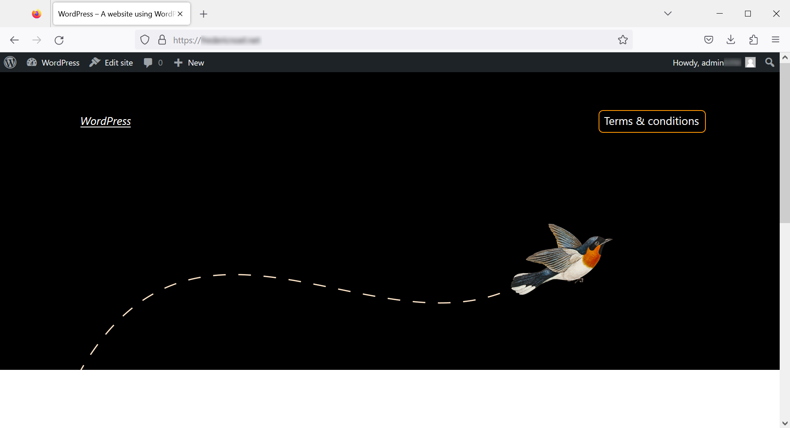{.thumbnail}

### Die Permalien verbessern

Standardmäßig werden die Links zu Ihren Seiten **WordPress** mit einer Syntax vom Typ `parameter=wert` geschrieben, wobei der `Wert` eine ganze Zahl ist, die nicht explizit ist. Die Änderung der Permalianschrift ermöglicht es, URLs im expliziteren Format zu haben. Ihre URLs werden besser lesbar sein und die natürliche Referenzierung Ihrer Website wird verbessert.

Gehen Sie auf der Startseite des Dashboards auf den Bereich `Einstellungen`{.action} und dann auf `Permalien`{.action}:

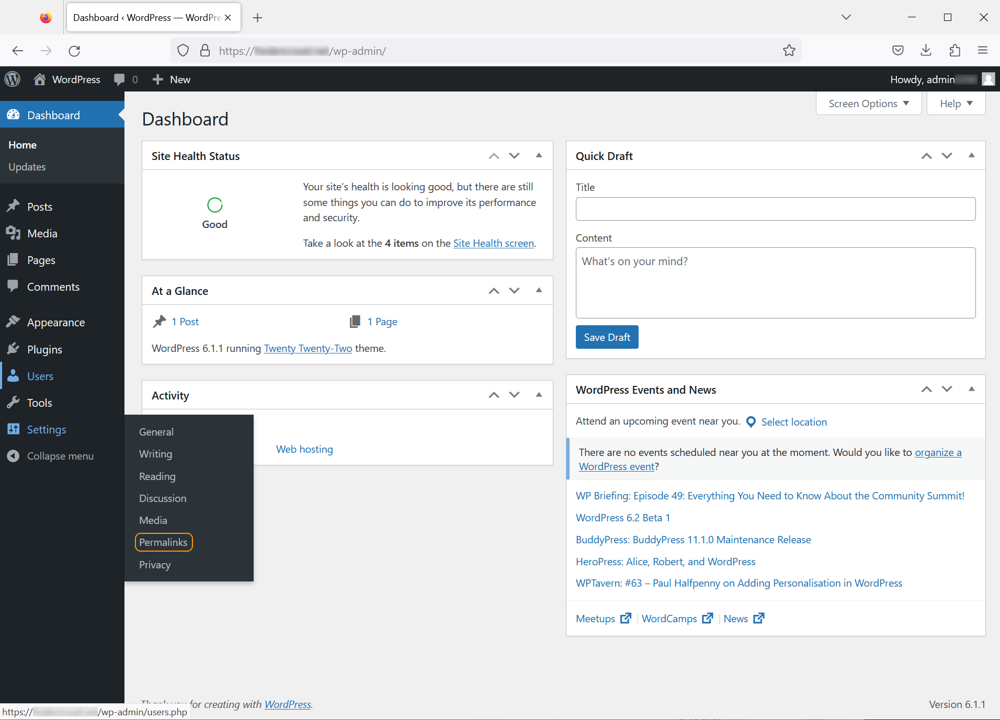{.thumbnail}

Sie haben dann die Wahl zwischen verschiedenen Permalianentypen. Wählen Sie den "Titel der Veröffentlichung"und bestätigen Sie am Ende der Seite:

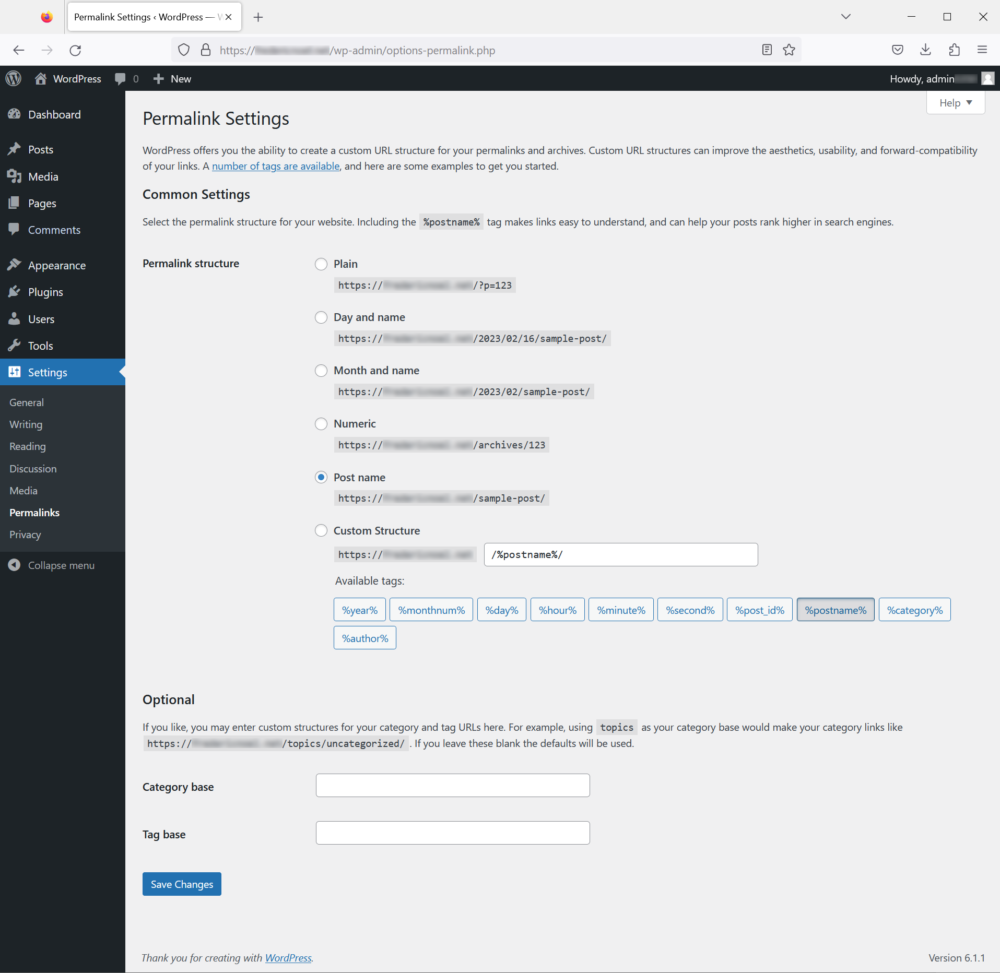{.thumbnail}

Ihre Links werden dann vom Slug aus erstellt, der zuvor beim Bearbeiten Ihrer Artikel und Seiten angegeben wurde.

## Weiterführende Informationen 

- Speichern Sie Ihre Zugriffe in einem Passwortmanager wie [KeePass](https://keepass.info/){.external}.
- Testen Sie den Standardeditor [Gutenberg](https://wordpress.org/gutenberg/){.external} online.
- Einige Ressourcen, um WordPress Themen zu finden:
    - [WordPress Themes](https://wordpress.com/themes){.external}
    - [TemplaMonster](https://www.templatemonster.com/wordpress-themes.php){.external}.
    - [Elegant Themes](https://www.elegantthemes.com/){.external}, Herausgeber des Themendatenherstellers Divi.
    - [Elementor](https://elementor.com/){.external}, ein weiterer Themenerleger.
- Die offizielle Website [WordPress](https://wordpress.org/){.external}.

Kontaktieren Sie für spezialisierte Dienstleistungen (SEO, Web-Entwicklung etc.) die [OVHcloud Partner](https://partner.ovhcloud.com/de/directory/).

Wenn Sie Hilfe bei der Nutzung und Konfiguration Ihrer OVHcloud Lösungen benötigen, beachten Sie unsere [Support-Angebote](https://www.ovhcloud.com/de/support-levels/).

Für den Austausch mit unserer User Community gehen Sie auf <https://community.ovh.com/en/>.