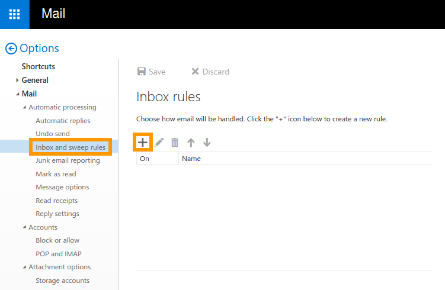
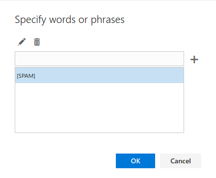
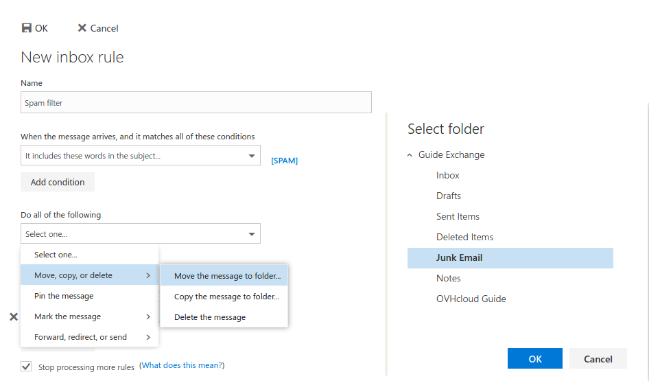

**Dernière mise à jour le 11 mars 2020**

## Objectif

Avec l’option « Règles de gestion de la boîte de réception », vous pouvez créer un ensemble de règles pour gérer votre courrier entrant. Ces règles vous permettent de maintenir l’ordre dans votre compte de messagerie en acheminant automatiquement les e-mails dans différents dossiers. Il s’agit également d’une méthode qui permet de définir les paramètres de transfert (redirections) et de filtrer les messages indésirables.

**Découvrez comment créer des filtres et des redirections e-mails depuis Outlook Web App (OWA).**

## Prérequis

- une solution e-mail OVHcloud doit avoir été configurée au préalable (**MX Plan**, proposé parmi nos [offres d’hébergement web](https://www.ovh.com/fr/hebergement-web/), inclus dans un [hébergement Start10M gratuit](https://www.ovh.com/fr/domaines/offre_hebergement_start10m.xml) ou commandé séparément comme solution autonome ; [**Hosted Exchange**](https://www.ovh.com/fr/emails/hosted-exchange/) ou [**Email Pro**](https://www.ovh.com/fr/emails/email-pro/))
- les paramètres de connexion de l’adresse e-mail que vous souhaitez configurer

## Instructions

### Étape 1 : Accéder à la section Options

Connectez-vous à votre compte Exchange via le webmail [OVHcloud](https://www.ovh.com/fr/mail/). Cliquez sur l’icône de réglages en haut à droite pour afficher le menu « Options » et sélectionnez `Options`{.action}.

{.thumbnail}

À partir de l’arborescence « Options », sélectionnez `Règles de gestion et de balayage de la boîte`{.action} pour accéder à l’interface des règles. Vous verrez ici une liste de règles qui s’appliquent à ce compte. Créez une nouvelle règle en cliquant sur l’icône `+`{.action}.

{.thumbnail}

### Étape 2 : Créer des règles

{.thumbnail}

L’éditeur de règles vous permet de définir des paramètres précis pour tous les e-mails entrants selon des hypothèses différentes. La configuration d’une règle s’effectue en trois étapes :

|Étape|Description|
|---|---|
|Ajouter une condition|Sélectionnez une ou plusieurs conditions qui vont déclencher l’application de la règle.|
|Ajouter une action|Choisissez l’action à appliquer aux e-mails qui correspondent aux conditions définies.|
|Ajouter une exception (facultatif)|Vous pouvez affiner la règle en ajoutant une ou plusieurs conditions pour exclure certains e-mails.|

Par exemple, vous pouvez définir « Reçu de...» comme condition et spécifier une adresse e-mail, puis choisir de déplacer ces messages vers un dossier spécifique.

#### Case à cocher « Arrêter l’application d’autres règles »

Si vous avez créé plusieurs règles, il est possible que plusieurs d’entre elles s’appliquent à un e-mail entrant. Laissez cette option activée pour toutes les règles qui ne doivent jamais être appliquées simultanément avec d’autres règles ; c’est un moyen simple d’éviter qu’un traitement supplémentaire ne soit appliqué aux e-mails qui correspondent à plusieurs conditions.

### Création de règles utiles à l’aide de deux exemples : Redirection et filtrage du courrier indésirable 

Puisqu’il existe une multitude de conditions et d’actions au choix, il nous est impossible de toutes les aborder dans ce guide. Nous vous proposons ci-dessous deux exemples qui sont d’une importance capitale pour l’utilisation d’un compte de messagerie OVHcloud. 

> [!warning]
>OVHcloud vous offre un certain nombre de services dont la configuration et la gestion relèvent de votre responsabilité. Il vous incombe par conséquent de veiller à ce que ces services fonctionnent correctement.
>
>Nous mettons ce guide à votre disposition afin de vous accompagner au mieux sur les tâches courantes. Toutefois, il est recommandé de contacter un fournisseur de services spécialisé et/ou l’éditeur du logiciel exploité par le service en cas de difficultés. Nous ne serons personnellement pas en mesure de vous fournir une assistance à ce propos. Plus d’informations dans la section « Aller plus loin » de ce guide.
>

#### Exemple 1 : Rediriger des e-mails vers une autre adresse

Créez une nouvelle règle en cliquant sur l’icône `+`{.action}. Nommez votre règle et sélectionnez en dessous les e-mails auxquels elle doit s’appliquer. Pour cet exemple, nous choisissons d’abord d’inclure **tous les messages**. Ensuite, sélectionnez l’action appropriée ; à ce niveau, nous allons nous appesantir sur l’illustration d’une **redirection**. 

À titre de rappel, il y a une différence technique : 

* Si vous « transférez » un e-mail, le destinataire final verra votre adresse e-mail comme expéditeur. 
* Par contre, le fait de « rediriger » un e-mail va l’envoyer à votre adresse cible sans modifier l’adresse de l’expéditeur initial. 

{.thumbnail}

Sur l’écran suivant, sélectionnez parmi « vos contacts » (`+`{.action}) ou saisissez une adresse e-mail dans la barre supérieure. Vous pouvez également rechercher des utilisateurs non répertoriés ici comme contacts. Une fois la sélection effectuée, cliquez sur `Enregistrer`{.action} pour retourner à l’écran « Nouvelle règle de la boîte de réception ». 

Vous pouvez affiner davantage cette règle en cliquant sur `Ajouter une action`{.action}. 

Le cas échéant, ajoutez également les exceptions listées en dessous, par exemple pour éviter une redirection si un message entrant a été envoyé par une adresse e-mail spécifique ou s’il contient des mots-clés précis. Enregistrez la règle en cliquant sur `OK`{.action}.

La nouvelle règle est maintenant listée avec une explication de son action et elle peut être modifiée, désactivée ou supprimée.

{.thumbnail}

#### Exemple 2 : Filtrer les e-mails indésirables (spam)

> [!primary]
>
Ces instructions ne sont applicables que si votre domaine utilise les dossiers OVHcloud MX de façon appropriée. D’autres configurations sont possibles avec le service, mais pourraient ne pas bénéficier de notre protection contre les spams.
>

Créez une nouvelle règle en cliquant sur l’icône `+`{.action}.

{.thumbnail}

Nommez votre règle et sélectionnez comme conditions « comprend les mots suivants » et « dans l’objet... ». Dans l’écran suivant, tapez « \[SPAM] » pour isoler les messages qui ont été pré-étiquetés par notre protection contre les spams. Ajoutez-le en cliquant sur `+`{.action}, puis cliquez sur `OK`{.action}.

{.thumbnail}

Étant donné qu’aucune protection automatique anti-spam ne peut déterminer avec une précision parfaite si un e-mail est véritablement un spam, il est recommandé de placer ces e-mails dans un dossier dédié. De cette façon, vous pouvez vérifier le contenu du dossier spams avant de le vider. Pour effectuer ce réglage, sélectionnez comme action « Déplacer, copier ou supprimer », puis « Déplacer le message vers le dossier... ». Sélectionnez un dossier à partir de la liste. Enregistrez la règle en cliquant sur `OK`{.action}.

{.thumbnail}

> [!primary]
>
Veuillez noter que les faux-positifs ne peuvent pas être identifiés directement depuis OWA. Si vous recevez des e-mails marqués par erreur comme [SPAM], il est recommandé d’informer notre équipe d’assistance technique en créant une requête dans votre [espace client OVHcloud](https://www.ovh.com/manager/dedicated/#/support/tickets/new).  
>

## Aller plus loin

[Création de réponses automatiques depuis OWA](../exchange_2016_guide_mise_en_place_dun_repondeur_sous_owa/)

[Partage de calendriers depuis OWA](../exchange-2016-partager-un-calendrier-via-le-webmail-owa/)

[Utilisation de Outlook Web App avec un compte de messagerie](../../utilisation-owa/)

Échangez avec notre communauté d'utilisateurs sur <https://community.ovh.com>.
