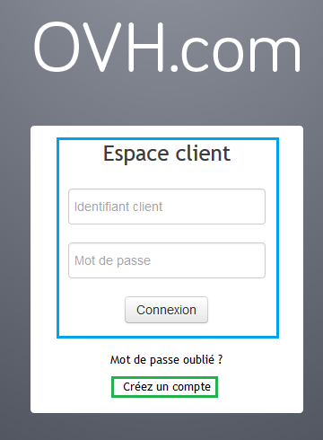
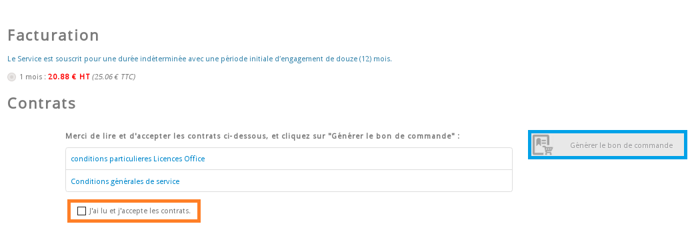
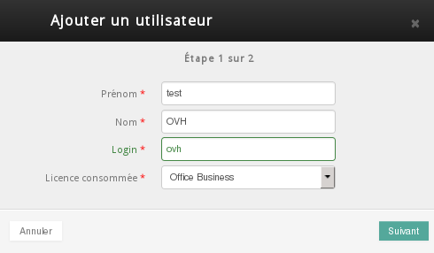
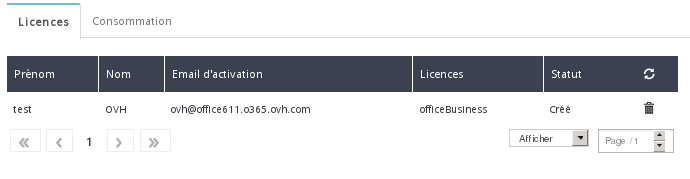
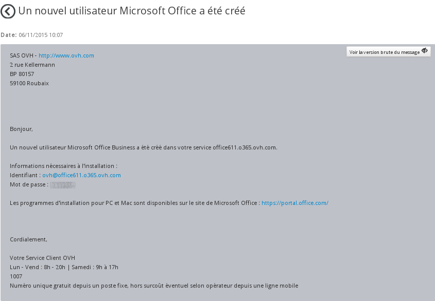
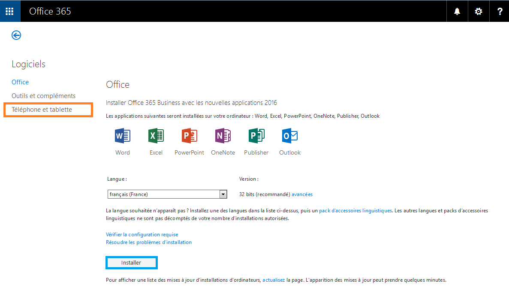

## Dal sito OVH (presto disponibile)
La procedura per effettuare l'ordine dal sito www.ovh.it sarà presto disponibile. 
Al momento, cliccando su "Ordina" vieni reindirizzato al tuo Spazio Cliente OVH e potrai procedere all'acquisto.
Ordinando le tue licenze Office 365 dal [sito OVH](https://www.ovh.it/office-365-business), crei automaticamente un nuovo gruppo di licenze.

Per aggiungere licenze in un gruppo già esistente, è necessario effettuare l'operazione dal tuo Spazio Cliente OVH.

Per ordinare il tuo Office365 e creare il tuo gruppo di licenze, accedi al [sito OVH](https://www.ovh.it/office-365-business) e clicca su Ordina.

{.thumbnail}
Scegli il numero di licenze Business e Pro Plus di cui hai bisogno e clicca su Ordina

{.thumbnail}
A questo punto, visualizzi l'anteprima del tuo ordine. Clicca su Continua.

{.thumbnail}

- Inserisci le tue credenziali.

- Se non hai ancora un identificativo cliente, clicca su Create your account.

 

{.thumbnail}
Accetta i contratti dell'offerta Office 365 e clicca su Conferma e Salda per accedere al buono d'ordine.

L'installazione del tuo servizio richiede qualche minuto. Una volta completata, ricevi un'email.

 

## Dal tuo Spazio Cliente OVH
Inserisci le credenziali per accedere al tuo [Spazio Cliente OVH](https://www.ovh.com/manager/web).

{.thumbnail}

- Nella sezione Microsoft del menu a sinistra, seleziona Office e poi clicca su Ordina un gruppo di licenze.

{.thumbnail}
Scegli il tipo e il numero di licenze che vuoi ordinare:

- Licenze Office Business: Excel, Word, PowerPoint, Outlook, Note, Publisher

- Licenze Office Pro Plus: Excel, Word, PowerPoint, Outlook, Access, Power BI.

Vantaggi della licenzaOffice Pro Plus:

- ti permette di utilizzare oltre 300 licenze
- include anche Access e Power BI

{.thumbnail}
La versione MacOS non include Note e Publisher.
Una volta scelto il tipo e il numero di licenze, leggi e accetta i contratti e clicca su Genera ordine

{.thumbnail}
Una volta saldato il buono d'ordine generato, riceverai le licenze entro 4 ore.

## 
Le informazioni generali sulla tua offerta di Office sono visualizzate con dei valori generici. Per modificarle, seleziona Modifica il gruppo di licenze.
Una volta che il tuo gruppo di licenze è disponibile nel tuo [Spazio Cliente OVH](https://www.ovh.com/manager/web), è possibile attivarle.

Di default non vengono visualizzati utenti, è necessario inserirli manualmente. Nel nostro esempio, abbiamo aggiunto un utente al nostro gruppo.

Per creare la tua licenza, clicca su Aggiungi un utente.

{.thumbnail}
Inserisci le informazioni richieste:

- Nome
- Cognome
- Login
- Licenza utilizzata

Clicca su Seguente. La tua licenza sarà disponibile in pochi minuti.

{.thumbnail}
Una volta attiva, la licenza è visibile nel tuo Spazio Cliente OVH.
Clicca sulla scheda Consumo per verificare il numero di licenze che utilizzi mensilmente.

{.thumbnail}
Per aggiungere un nuovo utente non è necessario creare un nuovo gruppo di licenze, è sufficiente cliccare su Aggiungi un utente. La fatturazione viene calcolata automaticamente in base al numero di licenze utilizzate il mese precedente.
Una volta aggiunta una nuova licenza, ricevi un'email con le credenziali necessarie per accedere al sito di [Office](https://portal.office.com), dove potrai scaricare l'installer del pacchetto.

{.thumbnail}
L'email ricevuta è disponibile sul tuo account cliente, nel menu Il tuo account > Email ricevute.

{.thumbnail}
Inserisci le credenziali di accesso ricevute via email.

{.thumbnail}
Clicca su Installa per scaricare il file eseguibile per avviare l'installazione del tuo pacchetto Office. 

Nel menu Telefono e tablet trovi le informazioni per installare la suite Office sui tuoi dispositivi.

{.thumbnail}

