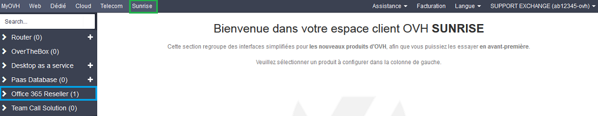
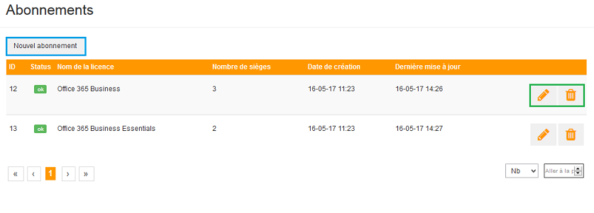
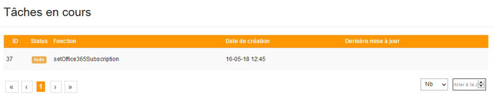
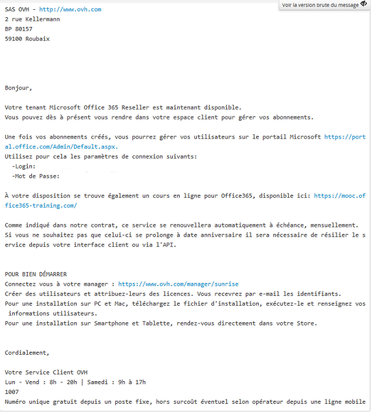

## 
Para poder subscrever uma encomenda de licenças Office 365 revendedor (CSP2) existem vários requisitos:

- Dispor de um número de [cliente OVH](https://www.ovh.pt/suporte/new_nic.xml) (Nic-Handle) e um Número de Identificação Fiscal Empresarial

- Estar inscrito no nosso programa Community Web sur [Partners.ovh.com](http://partners.ovh.com)

- Subscrever ao pack comercial Web no seu [espaço parceiros](http://partners.ovh.com), secção Encomendas parceiros e depois Programas comerciais.

- Dispor de um MPN ID Microsoft.

Após estar inscrito como parceiro OVH, iremos estudar o seu dossier de forma a validar, ou não, a sua inscrição. Somente poderá encomendar o programa comercial Web após a validação do seu dossier.

## 
Após o grupo de licenças ter sido criado e estar disponível no seu Espaço Cliente poderá ativar as suas licenças "Office 365".

Para tal deve ligar-se ao seu Espaço Cliente e clicar depois em "Sunrise". No menu à esquerda selecione "Office 365 Reseller" e depois selecione o seu grupo de licenças.

{.thumbnail}

## Informações gerais
São indicadas várias informações relativas ao seu serviço Office 365 revendedor:

- Nome interno do serviço: indique o nome do seu grupo de licença, ele será visível apenas no seu Espaço Cliente.

- Criado em: indica a data de criação do grupo de licença.

- Portal de administração Microsoft: indica o link do portal Office onde poderá administrar as suas licenças.

- Tutoriais online: Endereço de um Mooc Office de forma a poder dispor de uma assistência sobre o funcionamento dos diferentes softwares da suite Office 365.

- Reinicializar a password do administrador: Permite modificar a password de acesso ao portal Office 365.

{.thumbnail}

## Gestão das subscrições
A este nível é possível que efetue várias ações:
Nova subscrição:

Permite a encomenda de um novo tipo de licenças Office 365.

Veja os detalhes da esquerda para a direita das informações apresentadas:

- id: Cada tipo de licenças encomenda tem um id único apresentado à esquerda da sua licença.

- Estado: Corresponde ao estado da sua licença.

- Nome da licença: Lembra o tipo de licença.

- Número de lugares: Indica o número de licenças disponíveis.

- Data de criação: Lembra a data de criação do seu grupo de licenças.

- Última atualização: Indica a última modificação relacionada com o seu grupo de licença.

Estão disponíveis 2 ícones à direita:

O lápis: permite-lhe modificar o número de lugares no seu grupo de licenças.

A lixeira: Permite terminar/cancelar o grupo de licenças.

{.thumbnail}

## Trabalhos em curso
Poderá consultar aqui os trabalhos em curso.

No nosso exemplo, o trabalho diz respeito a uma modificação do número de lugares relativos a um grupo de licenças.

{.thumbnail}

## 
A gestão dos utilizadores efetua-se diretamente no portal Office 365 da Microsoft:

- No e-mail recebido é indicado: o seu identificador e a password padrão para poder aceder ao portal Office 365.

Esta password, tal como indicado em cima, poderá ser modificada no seu Espaço Cliente.

Após estar ligado ao portal Office 365 poderá gerir as suas licenças, os seus utilizadores...

{.thumbnail}

