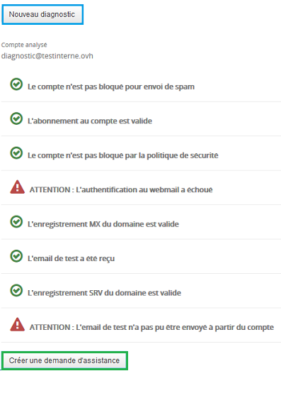

## Running a diagnostic
Go to your OVH control panel using this link: [OVH control panel](https://www.ovh.com/ca/en/manager/web/login/).

Once logged in, choose the Microsoft menu from the left column then go to your Exchange account.

{.thumbnail}
Click on the "Diagnostic" tab: in order to start the diagnostic, you need to enter the Exchange email account that's affected followed by the correct password.

The diagnostic can take anywhere between 3 and 10 minutes.

{.thumbnail}
Here's an example of the diagnostic results for an Exchange email account:

Possible actions:

- New diagnostic : Launch a new diagnostic

- Create a help request: this allows you to create a ticket for our technical support which will include the results of your diagnostic

{.thumbnail}

## Any errors in your diagnostic?
We will go over every possible error in order to help you solve any of them:

- WARNING: This account has been blocked for sending spam:

This means that sending emails from your account has been temporarily disabled. You can still receive emails, though.

When your account is blocked due to spam, it is still visible from your Exchange service, in the email account section. A SPAM tag is displayed and you can click on it to access the email that was received following the block.

You have to reply to this email in order to unblock the account.

{.thumbnail}

- WARNING: Subscription to the account has expired:

In this instance, your subscription is no longer active, so sending and receiving have been disabled. You must contact our technical support on 20 73 57 66 16.

- WARNING: This account is blocked due to the security policy:

You can set a security policy directly from your Exchange service. This can cause the account to get blocked for a certain period of time while this policy is being configured.

You can decide that the account will be blocked after a few unsuccessful login attempts, for a period of time determined by you. 

If there's a blockage at that point, you can either wait until the set period of time has passed and the account is unblocked, or you can contact our Exchange technical support by creating a support request.

- WARNING: Webmail authentication has failed:

This can be caused by an incorrect password entered while running the diagnostic. In that case, you can restart the diagnostic.

You can also update the password from your Exchange service in the email account tab and then restart the diagnostic. If the issue persists, create a support request.

- WARNING: The domain's MX record is not valid:

This error indicates that emails cannot be received and it is also linked to this error: WARNING: The test email has not been received.

Here's a list of valid MX servers for the Exchange product offer:

- Exchange only : mx1.mail.ovh.net
- Exchange + POP/IMAP email hosted by OVH : mx1.mail.ovh.net
- Exchange + POP/IMAP email not hosted by OVH : ex.mail.ovh.net or ex2.mail.ovh.net

- WARNING: The domain's SRV record is not valid:

The SRV record is essential to the automatic configuration of your Exchange account with a compatible email software such as Outlook 2010, 2013 and 2016.

You can check the SRV field in your domain's DNS zone.

Here's the mandatory SRV for an Exchange service:

|Priority|0|
|Weight|0|
|Port|443|
|Target Hosted product offer| ex.mail.ovh.net or ex2.mail.ovh.net |
|Target Private product offer| Your-host-name|

- WARNING: The test email could not be sent from this account 

This error indicates that emails cannot be sent from your account.

This may be due to several reasons:

- Your account has been suspended
- The password that was entered is incorrect
- Your account has been blocked for sending spam
- An incident has occurred on the infrastructure

In this case, please refer to the instructions above in order to correct this error or to report a help request following your diagnostic.

