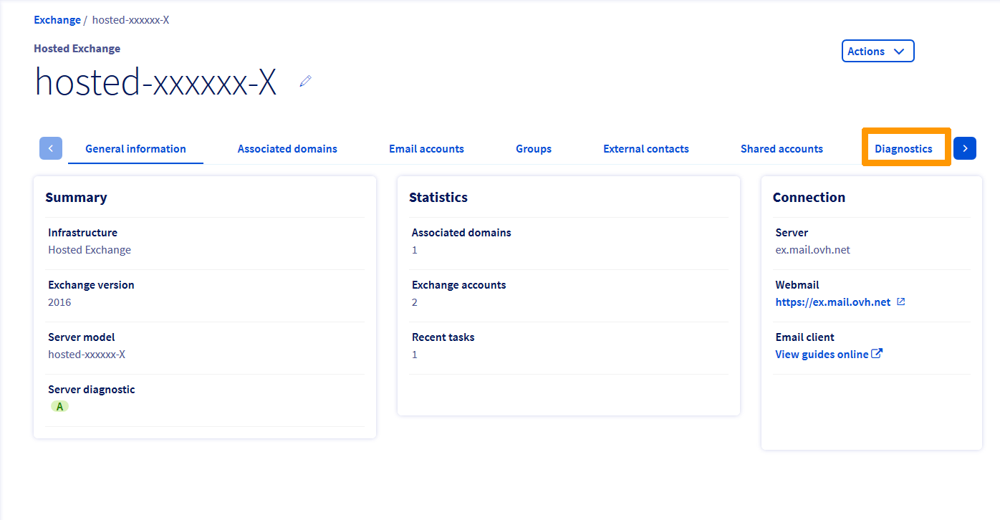
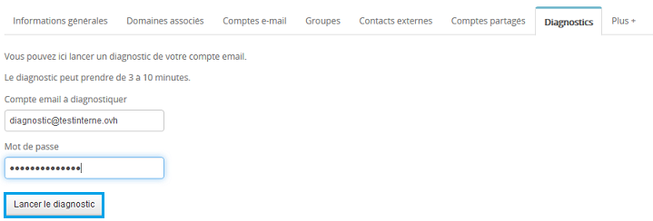

Vous avez réalisé un diagnostic de votre compte Exchange et une ou plusieurs erreurs apparaissent. Nous allons pour chaque étape décrire les actions qui peuvent la/les corriger.

## Réaliser un diagnostic de votre compte Exchange

### Realiser un diagnostic
Rendez-vous sur l'espace client via ce lien : [Espace client OVH](https://www.ovh.com/auth/?action=gotomanager&from=https://www.ovh.com/fr/&ovhSubsidiary=fr){.external}.

Une fois connecté, sélectionnez dans la colonne de gauche le menu **Microsoft**  puis votre service Exchange.

{.thumbnail}

Cliquez ensuite sur l'onglet "Diagnostic", vous devrez saisir le compte e-mail Exchange concerné puis le mot de passe associé afin de lancer le diagnostic.

Le diagnostic Exchange peut prendre entre 3 et 10 minutes.

{.thumbnail}

Voici en exemple le résultat du diagnostic d'un compte e-mail Exchange :

Les actions possibles :

- Nouveau diagnostic : Relancer un nouveau diagnostic
- Créer une demande d'assistance : Permet de créer un ticket à notre support avec le résultat de votre diagnostic

{.thumbnail}

### Des erreurs dans votre diagnostic ?
Nous allons détailler chaque erreur possible afin de vous apporter une aide dans sa résolution :

- ATTENTION : Le compte est bloqué pour envoi de spam :

Cela signifie que les envois à partir de votre compte sont temporairement désactivés. La réception n'est pas impactée.

Lorsque votre compte est bloqué pour spam, celui-ci est visible depuis votre service Exchange section compte e-mail. Un tag SPAM est indiqué. Vous pouvez cliquer dessus afin d'être redirigé vers l'e-mail reçu suite au blocage.

Il est nécessaire de répondre à cet e-mail afin de réaliser le déblocage du compte.

{.thumbnail}

- ATTENTION : L'abonnement au compte est expiré :

Dans ce cas votre abonnement n'est plus actif. La réception et l'envoi sont désactivés.

- ATTENTION : Le compte est bloqué par la politique de sécurité :

Il est possible de définir depuis votre service Exchange, une politique de sécurité. Cela peut entrainer un blocage du compte pendant un délai déterminé lors de la configuration de cette politique.

Vous pouvez définir que le compte est bloqué après un nombre déterminé de tentative(s) de connexion infructueuse(s) durant une durée que vous aurez indiqué.

Si vous rencontrez un blocage à ce niveau, vous pouvez soit patienter que le délai indiqué soit écoulé afin que le compte se débloque ou contacter notre support Exchange en créant une demande d'assistance.

- ATTENTION : L'authentification au webmail a échoué :

Cela peut provenir d'un mot de passe erroné saisi pour la réalisation du diagnostic, dans ce cas vous pouvez relancer un diagnostic.

Vous pouvez aussi mettre à jour le mot de passe depuis votre service Exchange, onglet  **compte e-mail**  puis relancer votre diagnostic. Si le souci est toujours présent vous pouvez créer une demande d'assistance.

- ATTENTION : L'enregistrement MX du domaine n'est pas valide :

Cette erreur indique une impossibilité de réception d'e-mail et sera aussi liée à cette erreur :  **ATTENTION : L'email de test n'a pas été reçu** .

Voici les serveurs MX valides pour l'offre Exchange :

- Exchange seul : mx1.mail.ovh.net
- Exchange + E-mail pop/imap hébergé par OVH : mx1.mail.ovh.net
- Exchange + E-mail pop/imap non hébergé par OVH : ex.mail.ovh.net ou ex2.mail.ovh.net
- ATTENTION : L'enregistrement SRV du domaine n'est pas valide :

L'enregistrement SRV est nécessaire pour la configuration automatique de votre compte Exchange sur un logiciel de messagerie compatible comme Outlook 2010, 2013 et 2016.

Vous pouvez vérifier votre champs SRV dans la zone DNS de votre domaine.

Voici le champ SRV requis pour une offre Exchange :

|Informations|Description|
|---|---|
|La priorité|0|
|Le poids|0|
|Le port|443|
|La cible offre Hosted|ex.mail.ovh.net ou ex2.mail.ovh.net|
|La cible offre Private|Votre-nom-d-hôte|

offre Hostedoffre Private

- ATTENTION : L'e-mail de test n'a pas pu être envoyé à partir du compte

Cette erreur indique une impossibilité d'envoyer un e-mail depuis votre compte.

Cela peut avoir plusieurs causes :

- Votre compte est suspendu
- Le mot de passe indiqué n'est pas correct
- Votre compte est bloqué pour envoi de spam
- Un incident sur l'infrastructure Exchange

Dans ce cas, reportez-vous aux indications ci-dessus afin de corriger cette erreur ou déclarer une demande d'assistance à la suite de votre diagnostic.

## Vérifications à réaliser lors d'un problème d'envoi ou de réception

### Le Webmail (OWA)
Le webmail est une page web vous permettant de consulter et d'envoyer des e-mails, cela correspond à une connexion directe vers votre serveur. Si la connexion au webmail ne fonctionne pas (sauf si cela est dû à un mauvais mot de passe), votre client de messagerie ne peut fonctionner.

Le lien d'accès au webmail peut être différent selon l'offre Exchange :

- Pour une offre Hosted Exchange : [ex.mail.ovh.net](https://ex.mail.ovh.net){.external} ou [ex2.mail.ovh.net](https://ex2.mail.ovh.net){.external}
- Pour les offres Private Exchange, remplacez le serveur ex.mail.ovh.net par le nom du certificat SSL de votre serveur.

Une fois connecté au webmail, réalisez un test d'envoi et de réception afin de vérifier que depuis celui-ci tout est fonctionnel.

Un guide concernant l'utilisation du [Webmail](../exchange-2016-guide-utilisation-outlook-web-app/) est disponible.

Si le test est fonctionnel, vérifiez la configuration de votre logiciel de messagerie via les  [guides](https://www.ovh.com/fr/emails/hosted-exchange/guides/){.external} mis à votre disposition.

**Vous ne pouvez pas vous connecter au webmail ?**

Assurez-vous d'avoir le bon mot de passe. Si nécessaire, il vous est possible de le modifier depuis votre [espace client](https://www.ovh.com/manager/web){.external} dans la section exchange puis compte e-mail.

Cliquez sur le stylo noir à droite du compte concerné. Vous pourrez mettre à jour le mot de passe et de nouveau tester la connexion au webmail.

> [!success]
>
> Cette action nécessite de mettre le mot de passe à jour dans chaque
> périphérique ou le compte Exchange est configuré.
> 

### Intervention sur l'infrastructure OVH
Vous ne pouvez pas vous connecter au webmail suite à la modification du mot de passe ou la page ne répond pas : il est important de vérifier nos interventions (mise à jour de l'infrastructure, incidents).

Voici le lien de notre page ["Travaux"](http://travaux.ovh.net/?project=3&status=all&perpage=50){.external}.

Vous pourrez vérifier si une tâche est ouverte concernant Exchange à ce niveau.

### La validité des services

#### Le domaine
Il est nécessaire que votre nom de domaine soit valide afin de pouvoir envoyer ou recevoir des e-mails via votre adresse Exchange.

- Votre domaine est enregistré chez OVH :

Vous pouvez vérifier ce point directement depuis votre [espace client](https://www.ovh.com/manager/web){.external}.

Une fois connecté, sélectionnez votre nom de domaine (menu de gauche), vous pourrez vérifier sa date de validité.

Si celui-ci n'est plus valide, il faut le renouveler pour que l'adresse Exchange puisse de nouveau fonctionner.

- Votre domaine est enregistré chez un autre prestataire :

Dans ce cas, il sera nécessaire de vérifier sa validité auprès du prestataire concerné.

#### Le compte Exchange
Une fois la vérification de votre domaine effectuée et celui-ci valide, il est nécessaire de vérifier que votre compte exchange ne soit pas suspendu.

Connectez-vous à votre [espace client](https://www.ovh.com/manager/web){.external} puis sélectionner votre service exchange (menu de gauche) et section compte e-mail.

Dans la colonne "Etat" s'il apparaît "suspendu", cela indique que votre compte n'est plus actif.

### Le pointage du domaine (reception uniquement)
Concernant un souci de réception, il est nécessaire de vérifier le pointage de votre domaine.

Vérifiez que votre nom de domaine utilise correctement les serveurs e-mail (enregistrement de type MX) de l'offre e-mail Exchange OVH.

Plusieurs possibilités de pointages sont possibles :

- Exchange Hosted sans antispam (cohabitation Exchange et pop/imap) : ex.mail.ovh.net
- Exchange Hosted avec antispam (tous les comptes sont de type Exchange) : mx0.mail.ovh.net, mx1.mail.ovh.net, mx2.mail.ovh.net, mx3.mail.ovh.net
- Exchange Private sans antispam(comptes Exchange avec compte pop/imap) : Le nom du certificat SSL de votre serveur
- Exchange Private avec antispam (tous les comptes sont de type Exchange) : mx0.mail.ovh.net, mx1.mail.ovh.net, mx2.mail.ovh.net, mx3.mail.ovh.net

La vérification du pointage se réalise au niveau de la zone DNS de votre domaine. Si vous pointez sur des DNS externes, il faudra vérifier la zone chez votre prestataire.

Si vous utilisez les serveurs DNS OVH, il faut dans ce cas depuis votre [espace client](https://www.ovh.com/manager/web){.external} sélectionner votre domaine puis cliquer sur l'onglet "Zone DNS". Vérifiez ici les enregistrements de type MX.

## Comprendre les états de remises
Les rapports de non-remise (aussi appelés  **NDR**  ou  **Bounce** ) sont des messages qui indiquent l'état de remise d'un e-mail à l'expéditeur.

Les notifications d'état de remise décrivent trois types de situations :

- Succès (codes 2 .X.X)
- Défaillance temporaire (codes 4 .X.X)
- Défaillances permanentes (codes 5 .X.X)

Le serveur qui rapporte le problème est indiqué avant le code numérique. Il arrive que le serveur qui fait état du problème ne soit pas le serveur qui rencontre le problème.

## Les defaillances temporaires (codes 4.X.X)
||Nom de l'erreur|Cause possible|Explication|
|---|---|---|---|
|4.3.1|Insufficient system resources|Une erreur de mémoire insuffisante s'est produite. Un problème de ressource, tel qu'un disque plein, peut être à l'origine du problème.|Il faut vérifier que le serveur de destination dispose d'un espace disque/mémoire suffisant|
|4.3.2|System not accepting network messages|Cette notification d'échec de remise est générée lorsqu'une file d'attente est gelée|Il est possible de résoudre le problème en libérant la file d'attente|
|4.4.1|Connection timed out|L'hôte ne répond pas|Cette erreur peut être provoquée par des conditions de réseau temporaires. Exchange tente automatiquement de remettre le message électronique. Si la remise échoue encore, un rapport de non-remise due à un échec permanent est généré|
|4.4.2|Connection dropped|La connexion a été interrompue entre les serveurs|Ce message d'erreur peut être provoqué par des problèmes de réseau temporaires ou par des serveurs hors service. Le serveur tente de remettre le message pendant un temps donné, puis il génère d'autres rapports d'état|
|4.4.7|Message expired|Le message dans la file d'attente a expiré. Le serveur d'envoi a essayé de remettre le message, mais l'action n'a pas été effectuée avant l'expiration du message|Ce code indique un problème sur le serveur de réception. Vérifiez la validité de l'adresse du destinataire et la configuration du serveur de réception|

## Les defaillances permanentes (codes 5.X.X)
||Nom de l'erreur|Cause possible|Explication|
|---|---|---|---|
|5.1.0|Sender denied|Le destinataire à bloqué l'expéditeur|Supprimer le blocage depuis le webmail : Options > bloquer ou autoriser|
|5.1.1|Bad destination mailbox address|L'adresse de messagerie du destinataire est incorrecte ou la boîte aux lettres du destinataire a été déplacée et le cache de destinataires Microsoft Office Outlook de l'expéditeur n'a pas été mis à jour|Vérifiez l'adresse du destinataire, puis renvoyez le message. Cette erreur peut également se produire si l'adresse de messagerie du destinataire était correcte dans le passé mais a été modifiée ou supprimée du système de messagerie de destination|
|5.2.2|Mailbox full|Le quota de stockage de la boîte aux lettres du destinataire étant dépassé, celle-ci ne peut plus accepter de nouveaux messages|Cette erreur se produit en cas de dépassement du quota de stockage de la boîte du destinataire. Pour que la remise réussisse, le destinataire doit réduire la taille de sa boîte ou l'administrateur doit augmenter le quota de stockage|
|5.2.3|Message too large|Le message est trop volumineux et le quota est dépassé. Par exemple, il se peut qu'une restriction de taille maximale de message entrant soit appliquée à l'utilisateur distant|Renvoyez le message sans pièce jointe ou contacter l'administrateur du serveur distant|
|5.4.4|Invalid arguments|Cette notification d'échec de remise survient s'il n'y a aucun itinéraire pour la remise des messages|Vérifiez que le nom de domaine spécifié est valide et que l'enregistrement de serveur de messagerie (MX) existe|
|5.5.3|Too many recipients|Le total combiné des destinataires dans les lignes À, Cc et Cci du message dépasse le nombre total de destinataires autorisé par message|L'expéditeur doit réduire le nombre d'adresses de destinataire dans le message|

ExplicationSource : Microsoft