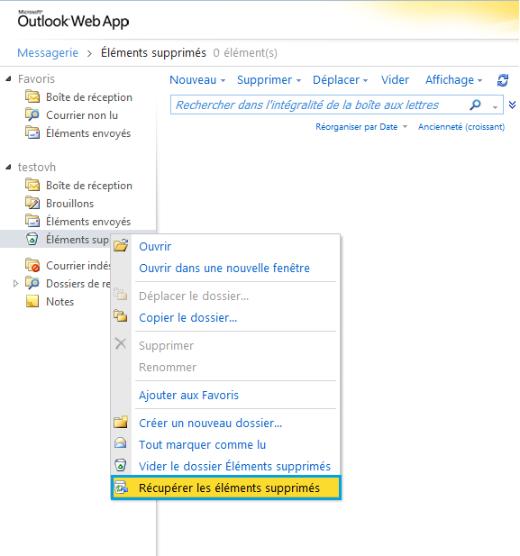
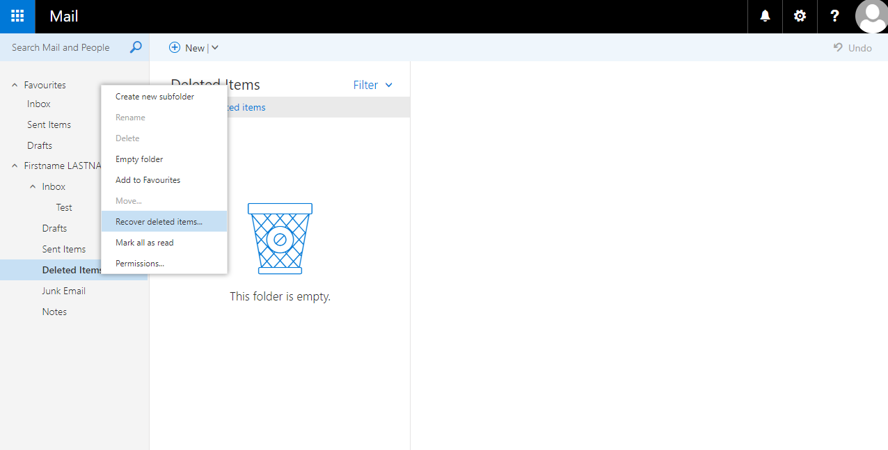
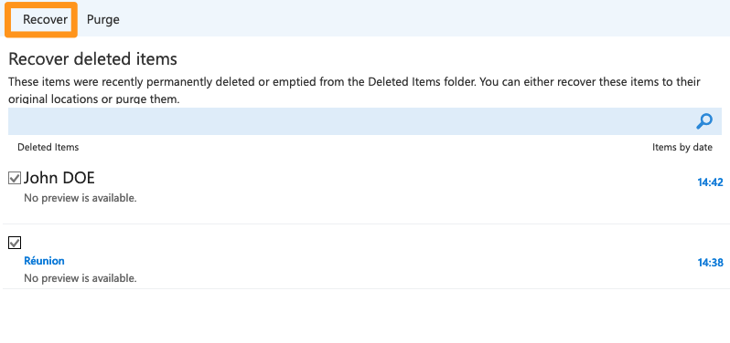
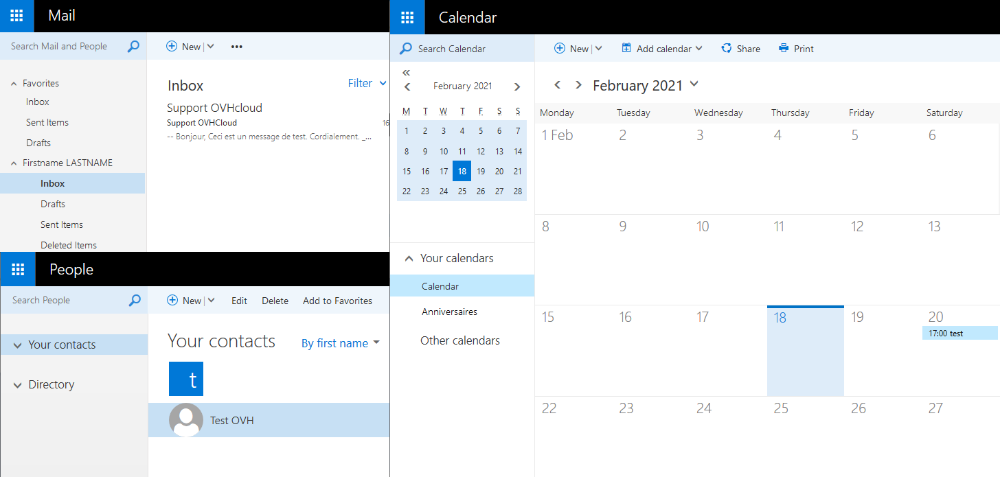

Vous avez supprimé par erreur un ou plusieurs éléments (mail, contact, rendez-vous du calendrier) et vous avez vidé votre corbeille. Il est toujours Possible de les retrouver durant une certaine pèriode avec l'option : Récupérer les éléments supprimés.

## La retention des elements supprimes
La rétention des éléments supprimés (corbeille vidée) est disponible durant14 jours pour les éléments suivants :

- e-mail
- contact
- calendrier
- Taches

La récupération des éléments supprimés peut être réalisée depuis le webmail Exchange (OWA) et depuis un client Outlook version 2013 et supérieur.

> [!alert]
>
> Certaines suppressions ne sont pas retrouvables depuis la récupération des
> éléments supprimés. Notamment lors d'un souci de synchronisation entre un
> périphérique (client de messagerie, smartphone) et le serveur Exchange. Dans
> ce cas des éléments peuvent être supprimés définitivement sans être placé
> dans la récupération des éléments supprimés.
> 

## Depuis le webmail (OWA)

### Exchange 2010
Le lien d'accès au webmail Exchange 2010 est différent selon le serveur sur le quel votre compte est installé.

Pour vous connecter au webmail cliquez [ici](https://ssl0.ovh.net/fr){.external}.

Saisissez ensuite votre adresse e-mail puis "Accéder à la page de connexion". Il vous sera ensuite demander de saisir votre adresse e-mail puis son mot de passe pour vous connecter. Une fois connecté, réalisez un clique droit dans le menu de gauche sur "Éléments supprimés" puis "Récupérer les éléments supprimés".

{.thumbnail}

Vous pouvez à ce niveau sélectionner plusieurs éléments en maintenant la touche "Ctrl" de votre clavier puis en sélectionnant les éléments souhaités.

Dans cet exemple les éléments concernés sont :

- un e-mail
- un contact
- rendez-vous du calendrier.

Une fois la sélection effectuée, vous pouvez cliquer sur l'icône en forme d'enveloppe pour restaurer ces éléments.

{.thumbnail}

> [!alert]
>
> Vous pouvez restaurez plusieurs éléments simultanément mais il est
> nécessaire de restaurer dés éléments de même nature (mail, contact,
> calendrier) car une seule destination est possible à la fois. Si vous restaurez
> un élément de type calendrier dans la boite de reception, celui-ci
> n'apparaitra plus depuis le webmail. Il faudra configurer le compte dans un
> client lourd de messagerie pour le retrouver.
> 

Vous pourrez alors choisir ou restaurez vos éléments.

Si vous souhaitez restaurer des e-mail dans un répertoire particulier, il est possible de le créer depuis la récupération des éléments supprimés.

{.thumbnail}

Vérifions la restauration des 3 éléments :

{.thumbnail}

### Exchange 2016 et ultérieur
Concernant la connexion au webmail (OWA) pour les offres de type Hosted, le lien de connexion est identique : "ex.mail.ovh.net".

Pour les offres de type Private, le lien de connexion correspond au "nom de votre certificat SSL".

Une fois connecté, réalisez un clique droit dans le menu de gauche sur "Éléments supprimés" puis "Récupérer les éléments supprimés".

{.thumbnail}

Vous pouvez à ce niveau sélectionner plusieurs éléments en maintenant la touche "Ctrl" de votre clavier puis en sélectionnant les éléments souhaités.

Dans l'exemple les éléments concernés : un e-mail, un contact et un rendez- vous du calendrier.

{.thumbnail}

Validez ensuite votre restauration en cliquant sur "récupérer".

Il est aussi possible de vider la liste des éléments mais cela est définitif.

> [!success]
>
> Il est possible de sélectionner différent types d'éléments simultanément et d'effectuer la restauration.
> Chaque type d'élément sera alors placé dans la catégorie qui le concerne.
> 

Vérifions la restauration des 3 éléments :

{.thumbnail}

## Depuis Outlook 2013
Depuis le client de messagerie Outlook 2013/2016 la récupération des éléments supprimés peut être réalisée. Cependant les éléments restaurés sont de nouveau placés dans la corbeille. Il est nécessaire de les déplacer ensuite vers la section concernée. Démarrer Outlook puis faite un clique droit sur "Éléments supprimée" puis Récupérer les éléments supprimées

{.thumbnail}

Une pop-up s'ouvre afin de choisir les éléments à restaurer.

{.thumbnail}

> [!success]
>
> La restauration depuis Outlook est différente par rapport au webmail (OWA) car
> Outlook restaure les éléments dans la corbeille. Il est ensuite nécessaire de
> déplacer manuellement les éléments.
> 

La restauration est maintenant terminé, les différents éléments sont placés dans la corbeille.

{.thumbnail}
