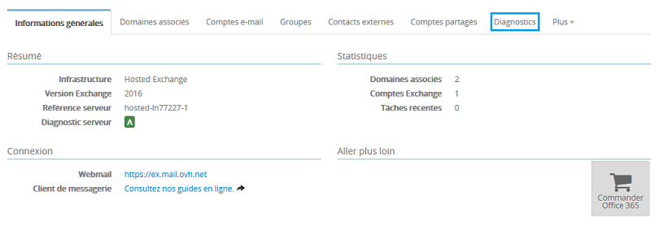

Vous avez réalisé un diagnostic de votre compte Exchange et une ou plusieurs erreurs apparaissent. Nous allons pour chaque étape décrire les actions qui peuvent la/les corriger.

## Diagnostic de votre compte Exchange

### Realiser un diagnostic
Rendez-vous sur l'espace client via ce lien : [Espace client OVH](https://www.ovh.com/manager/web/login/){.external}.

Une fois connecté, sélectionnez dans la colonne de gauche le menu **Microsoft**  puis votre service Exchange.

{.thumbnail}

Cliquez ensuite sur l'onglet "Diagnostic", vous devrez saisir le compte e-mail Exchange concerné puis le mot de passe associé afin de lancer le diagnostic.

Le diagnostic Exchange peut prendre entre 3 et 10 minutes.

{.thumbnail}

Voici en exemple le résultat du diagnostic d'un compte e-mail Exchange :

Les actions possibles :

- Nouveau diagnostic : Relancer un nouveau diagnostic
- Créer une demande d'assistance : Permet de créer un ticket à notre support avec le résultat de votre diagnostic

{.thumbnail}

### Des erreurs dans votre diagnostic ?
Nous allons détailler chaque erreur possible afin de vous apporter une aide dans sa résolution :

- ATTENTION : Le compte est bloqué pour envoi de spam :

Cela signifie que les envois à partir de votre compte sont temporairement désactivés. La réception n'est pas impactée.

Lorsque votre compte est bloqué pour spam, celui-ci est visible depuis votre service Exchange section compte e-mail. Un tag SPAM est indiqué. Vous pouvez cliquer dessus afin d'être redirigé vers l'e-mail reçu suite au blocage.

Il est nécessaire de répondre à cet e-mail afin de réaliser le déblocage du compte.

{.thumbnail}

- ATTENTION : L'abonnement au compte est expiré :

Dans ce cas votre abonnement n'est plus actif. La réception et l'envoi sont désactivés.

- ATTENTION : Le compte est bloqué par la politique de sécurité :

Il est possible de définir depuis votre service Exchange, une politique de sécurité. Cela peut entrainer un blocage du compte pendant un délai déterminé lors de la configuration de cette politique.

Vous pouvez définir que le compte est bloqué après un nombre déterminé de tentative(s) de connexion infructueuse(s) durant une durée que vous aurez indiqué.

Si vous rencontrez un blocage à ce niveau, vous pouvez soit patienter que le délai indiqué soit écoulé afin que le compte se débloque ou contacter notre support Exchange en créant une demande d'assistance.

- ATTENTION : L'authentification au webmail a échoué :

Cela peut provenir d'un mot de passe erroné saisi pour la réalisation du diagnostic, dans ce cas vous pouvez relancer un diagnostic.

Vous pouvez aussi mettre à jour le mot de passe depuis votre service Exchange, onglet  **compte e-mail**  puis relancer votre diagnostic. Si le souci est toujours présent vous pouvez créer une demande d'assistance.

- ATTENTION : L'enregistrement MX du domaine n'est pas valide :

Cette erreur indique une impossibilité de réception d'e-mail et sera aussi liée à cette erreur :  **ATTENTION : L'email de test n'a pas été reçu** .

Voici les serveurs MX valident pour l'offre Exchange :

- Exchange seul : mx1.mail.ovh.net
- Exchange + E-mail pop/imap hébergé par OVH : mx1.mail.ovh.net
- Exchange + E-mail pop/imap non hébergé par OVH : ex.mail.ovh.net ou ex2.mail.ovh.net
- ATTENTION : L'enregistrement SRV du domaine n'est pas valide :

L'enregistrement SRV est nécessaire pour la configuration automatique de votre compte Exchange sur un logiciel de messagerie compatible comme Outlook 2010, 2013 et 2016.

Vous pouvez vérifier votre champs SRV dans la zone DNS de votre domaine.

Voici le champ SRV requis pour une offre Exchange :

|---|---|
|La priorité|0|
|Le poids|0|
|Le port|443|
|La cible offre Hosted|ex.mail.ovh.net ou ex2.mail.ovh.net|
|La cible offre Private|Votre-nom-d-hôte|

offre Hostedoffre Private

- ATTENTION : L'e-mail de test n'a pas pu être envoyé à partir du compte

Cette erreur indique une impossibilité d'envoyer un e-mail depuis votre compte.

Cela peut avoir plusieurs causes :

- Votre compte est suspendu
- Le mot de passe indiqué n'est pas correct
- Votre compte est bloqué pour envoi de spam
- Un incident sur l'infrastructure Exchange

Dans ce cas, reportez-vous aux indications ci-dessus afin de corriger cette erreur ou déclarer une demande d'assistance à la suite de votre diagnostic.