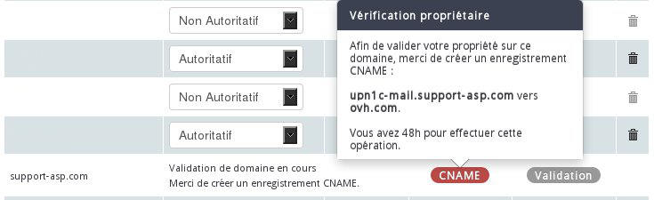

## A cosa serve il tasto di diagnostica CNAME?
Il tasto di diagnostica CNAME (o Canonical Name) viene visualizzato in casi specifici durante la dichiarazione di un dominio sulla tua piattaforma Exchange.

Serve ad attestare che sei l'amministratore del dominio.

{.thumbnail}

## Perché viene visualizzato questo pulsante?

- il dominio dichiarato non è registrato in OVH. Durante la dichiarazione hai scelto: "Inserisci un dominio registrato presso un altro provider di cui sei proprietario".

- il dominio dichiarato è registrato in OVH, punta verso i server DNS OVH ma non è registrato con lo stesso nic-handle del tuo servizio Exchange.

- il dominio è registrato in OVH ma non punta ai server DNS OVH

{.thumbnail}

## Come si crea il record CNAME?
Recupera le informazioni necessarie alla creazione del record cliccando sul pulsante di diagnostica CNAME.

{.thumbnail}

## Il dominio dichiarato non è registrato in OVH:
Crea il record CNAME presso il tuo provider DNS.

Ecco due strumenti con cui puoi sapere quale provider DNS utilizzi: [DIG](https://www.ovh.it/supporto/strumenti/dig_domain.pl) e [WHOIS](https://http://www.ovh.it/cgi-bin/whois.pl)

È possibile che i server DNS siano quelli di OVH.

In questo caso aggiungi il record CNAME dal tuo [Spazio Cliente Web OVH](https://www.ovh.com/manager/web/login.html).

In questa guida ti forniamo tutti i dettagli necessari.

## Il dominio dichiarato è registrato in OVH e punta verso i server DNS OVH ma non è gestito dallo stesso nic-handle da cui viene gestito il servizio Exchange:
la creazione del record CNAME dovrà essere effettuata dal tuo [Spazio Cliente Web OVH](https://www.ovh.com/manager/web/login.html) con cui gestisci il dominio. 

Clicca sul dominio, sezione "Zona DNS" e poi su  "Aggiungi un record".

{.thumbnail}

## Aggiunta di un record CNAME nella zona DNS
Aggiungi un record CNAME con le informazioni recuperate in precedenza e poi passa allo step successivo per poter validare la creazione del record.

Questa operazione è molto rapida, di solito richiede meno di un'ora.

{.thumbnail}

## Il dominio dichiarato è registrato in OVH ma non punta verso i server DNS OVH:
è necessario individuare i server a cui punta il dominio e poi creare il record CNAME presso il tuo provider. Ecco due strumenti con cui puoi sapere quale provider DNS utilizzi: [DIG](https://www.ovh.it/supporto/strumenti/dig_domain.pl) e [WHOIS](https://http://www.ovh.it/cgi-bin/whois.pl).

## Interfaccia DIG
I server DNS utilizzati sono: 
DNS108.ovh.net
NS108.ovh.net

{.thumbnail}

## Interfaccia WHOIS
I server DNS utilizzati sono: 
DNS108.ovh.net
NS108.ovh.net

{.thumbnail}

## Come sapere se l'aggiunta del record CNAME è avvenuta correttamente?
L'aggiunta di un record CNAME è sottoposta alla propagazione DNS, che richiede da 4 a 24 ore. Questo tipo di record, generalmente, viene preso in carico rapidamente, permettendoti di continuare la configurazione della tua piattaforma Exchange. 

Aggiornando la pagina del tuo Spazio Cliente OVH, vedrai scomparire il pulsante di diagnostica b]CNAME e apparire nuovi pulsanti di diagnostica MX e SRV.

{.thumbnail}

