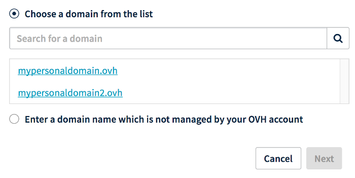
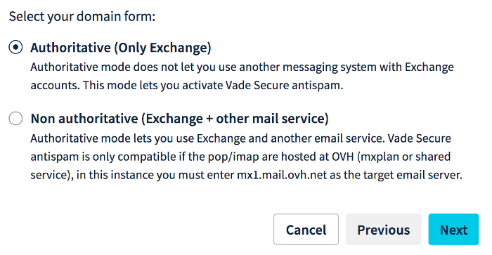

**Last updated 19th January 2018**

## Objective

To use the accounts included with an Exchange service, you will need to add a domain name to it. You can also add several domain names to an Exchange service. 

**Find out how to add a domain name to your Exchange service.**

## Requirements

- You must have an [Exchange solution](https://www.ovh.co.uk/emails/){.external}.
- You must have one or several domain names.
- You must have the right to modify your domain name’s configuration (via its DNS zone).
- You must be logged in to your [OVH Control Panel](https://www.ovh.com/auth/?action=gotomanager){.external}.

## Instructions

### Step 1: Log in to your service’s interface

Once your Exchange service has been created and is available, you can manage it from your [OVH Control Panel](https://www.ovh.com/auth/?action=gotomanager){.external}.

To do this, log in and click `Microsoft`{.action}, then `Exchange`{.action} in the left-hand services bar. Then select the name of the Exchange service concerned.

> [!primary]
>
> The name of an Exchange service in your OVH Control Panel starts with **hosted-** or **private-**, contains a part of your NIC handle, and ends with a figure (1 for the first Hosted or Private Exchange service installed, 2 for the second, etc.).
>

### Step 2: Add a domain name

To add a domain name, click on the `Associated domains`{.action} tab. The table shows the domain names currently associated with your Exchange service. To add a new domain name to it, click `Add a domain`{.action}.

> [!warning]
>
> In the directory, all of the addresses created on your Exchange service can view all other addresses associated with it, including those that have different domain names. To stop different domain names from being displayed this way, you will need to order a new [Exchange solution](https://www.ovh.co.uk/emails/){.external} for the domain name(s) concerned.
>

{.thumbnail}

In the window for adding a domain, you must choose between:

- **Select a domain in the list**: only the domains that use the OVH configuration, and are listed as contacts in your NIC handle, will appear.

- **Enter a domain name that is not managed by your OVH account**: you should be able to modify the domain name’s configuration (its DNS zone) so that the service can function correctly.

Once you have made this choice, click on the `Next`{.action} button.

{.thumbnail}

The window will then show information on configuring modes.

- **If you have entered a non-OVH domain name**: nonauthoritative mode will be configured by default.

- **If you have selected an OVH domain name in the list**: you must choose between two modes.

|Mode|Description|
|---|---|
|Authoritative|Choose this if you only use the Exchange solution with your domain name. In authoritative mode, you cannot use another email solution with your Exchange service.|
|Nonauthoritative|Choose this if you use your Exchange solution domain name with another email solution. You must enter details on your other email solution’s server.|

> [!primary]
>
> The mode choice is not definitive, and can be modified from the OVH Control Panel later on.
>

Click on the `Next`{.action} button to continue adding the domain.

{.thumbnail}

**If you have selected an OVH domain name in the list**, it will be automatically configured. To do this, tick the boxes and click on the `Next`{.action} button to continue adding the domain.

**If you have entered a non-OVH domain name**, it must be configured in the next step.

{.thumbnail}

At the end of the configuration process, we will ask you to check the information entered, then click on the `Confirm`{.action} button to confirm that you wish to add the domain. Repeat this step as many times as required, if you wish to add several domain names.

### Step 3: Configure the domain name (DNS)

Once the domain name has been added as an associated domain, make sure that its configuration is correct by using the table displayed. A green box will show that the domain name is correctly configured. If the box is red:

- **If you chose automatic configuration when adding the domain**: it can take a few minutes to appear on the OVH Control Panel.

- **If you have entered a non-OVH domain name**: click on the red box to view the modifications that you must make. If this domain name does not use OVH configuration (its DNS servers), you must carry out the modifications in the interface you use to manage your domain name’s configuration. If you need to modify the CNAME record, you can find out more by referring to this documentation: [Creating a CNAME record for adding an associated domain](https://docs.ovh.com/gb/en/microsoft-collaborative-solutions/exchange_20132016_how_to_add_a_cname_record/){.external}.

> [!primary]
>
> Changes made to a domain name’s configuration can take between 4 and a maximum of 24 hours to propagate fully.
>

To check that your domain name is correctly configured, go back to the `Associated domains`{.action} table for your Exchange service. If the box has turned green, your domain name is correctly configured. If not, then the configuration changes you have made may not have propagated fully.

{.thumbnail}

### Step 4: Configure and use the accounts

Now that you have added the domain names to your Exchange service, you can configure your Exchange accounts to be linked to them. You can do this from the `Email accounts`{.action} tab. If needed, you can order additional accounts using the `Order accounts`{.action} or `Add an account`{.action} buttons.

As a reminder, all of the addresses created on your Exchange service can view all other associated addresses, including those that have different domain names.

Once you have finished configuring your accounts, you can now start using them. To do this, OVH offers the *webmail* **Outlook Web Application** (OWA) which you can access via the following link: [https://www.ovh.co.uk/mail/](https://www.ovh.co.uk/mail/){.external}. To optimise the way you use your Exchange email address on an email client, ensure that it is compatible with the service. If you would like to configure your email address on an email client, a device such as a smartphone or tablet, or if you would like assistance regarding Exchange features, please refer to the documentation accessible via this portal: [https://docs.ovh.com/gb/en/microsoft-collaborative-solutions/](https://docs.ovh.com/gb/en/microsoft-collaborative-solutions/){.external}.

You can get Outlook licences in the [OVH Control Panel](https://www.ovh.com/auth/?action=gotomanager){.external}, and Office 365 licences on the following page: [https://www.ovh.co.uk/office-365/](https://www.ovh.co.uk/office-365/){.external}. We recommend using one of these solutions if you would like to use the Outlook email client, or other software from the Microsoft Office suite.

## Go further

[Creating a CNAME record for adding an associated domain](https://docs.ovh.com/gb/en/microsoft-collaborative-solutions/exchange_20132016_how_to_add_a_cname_record/){.external}.

Join our community of users on [https://community.ovh.com/en/](https://community.ovh.com/en/){.external}.