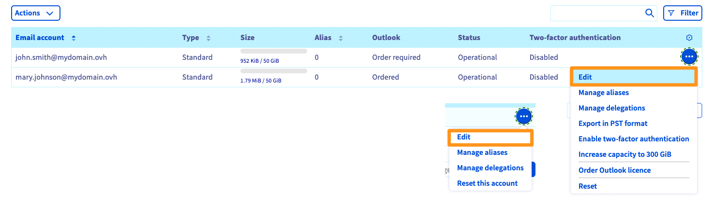
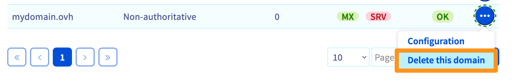

> [!primary]
> Tłumaczenie zostało wygenerowane automatycznie przez system naszego partnera SYSTRAN. W niektórych przypadkach mogą wystąpić nieprecyzyjne sformułowania, na przykład w tłumaczeniu nazw przycisków lub szczegółów technicznych. W przypadku jakichkolwiek wątpliwości zalecamy zapoznanie się z angielską/francuską wersją przewodnika. Jeśli chcesz przyczynić się do ulepszenia tłumaczenia, kliknij przycisk „Zaproponuj zmianę” na tej stronie.
>

**Ostatnia aktualizacja z dnia 07-10-2022**

## Wprowadzenie

Dodanie domeny do usługi Exchange jest niezbędne, abyś mógł korzystać z kont, które zamówiłeś w ramach usługi. Można również dodać kilka domen do usługi Exchange lub E-mail Pro.

**Dowiedz się, jak dodać domenę do platformy Exchange lub E-mail Pro.**

## Wymagania początkowe

- Posiadanie rozwiązania [Exchange](https://www.ovhcloud.com/pl/emails/) lub [Email Pro](https://www.ovhcloud.com/pl/emails/email-pro/)
- Zarejestrowana domena lub kilka domen.
- Możliwość modyfikacji konfiguracji Twojej domeny [strefy DNS](https://docs.ovh.com/pl/domains/hosting_www_jak_edytowac_strefe_dns/)
- Dostęp do [Panelu klienta OVHcloud](https://www.ovh.com/auth/?action=gotomanager&from=https://www.ovh.pl/&ovhSubsidiary=pl).

## W praktyce

### Dostęp do zarządzania usługą

Po utworzeniu i udostępnieniu usługi Exchange lub E-mail Pro, można nią zarządzać poprzez [Panel klienta OVHcloud](https://www.ovh.com/auth/?action=gotomanager&from=https://www.ovh.pl/&ovhSubsidiary=pl).

W sekcji `Web Cloud`{.action}:

- **Exchange**: Kliknij `Microsoft`{.action}, a następnie `Exchange`{.action}. 
- **E-mail Pro**: Kliknij `Email Pro`{.action}.

Następnie wybierz odpowiednią usługę.

### Dodaj domenę

Aby dodać domenę, kliknij w zakładkę `Przypisane domeny`{.action}. W tabeli wyświetlają się nazwy domen aktualnie przypisanych do Twojej usługi. Aby dodać nową domenę, kliknij w przycisk `Dodaj domenę`{.action}.

> [!warning]
>
> Wszystkie konta e-mail utworzone w ramach Twojej usługi będą mogły wyświetlać w katalogu wszystkie adresy e-mail powiązane z usługą, w tym adresy o innej nazwie domeny. Aby wyłączyć wyświetlanie domen, zamów nowe [rozwiązanie Exchange lub Email Pro](https://www.ovhcloud.com/pl/emails/) dla wybranej domeny lub domen.
>

{.thumbnail}

W oknie dodawania domeny znajdziesz następujące opcje:

- **wybierz domenę z listy**: wyświetlają się tylko domeny skonfigurowane w OVHcloud i wskazane jako kontakty w koncie klienta;

- **wpisz nazwę domeny, która nie jest zarządzana na Twoim koncie OVHcloud**: aby usługa działała poprawnie, musisz mieć możliwość modyfikacji konfiguracji domeny (jej strefy DNS). W tym przypadku należy dodać wpis DNS CNAME.

Po wybraniu opcji kliknij `Dalej`{.action}.

{.thumbnail}

Okno wyświetla teraz informacje dotyczące konfiguracji trybów. 

- **Jeśli podałeś nazwę domeny nieobsługiwanej przez OVHcloud**: tryb nieautorytatywny zostanie domyślnie skonfigurowany.

- **Jeśli wybrałeś z listy nazwę domeny obsługiwanej przez OVHcloud**: wybierz jeden z trybów.

|Tryb|Opis|
|---|---|
|Autorytatywny|Odpowiedni, jeśli do obsługi poczty w Twojej domenie używasz wyłącznie usługi Exchange lub E-mail Pro. Nie pozwala na korzystanie z innego rozwiązania poczty elektronicznej.|
|Nieautorytatywny|Odpowiedni, jeśli do obsługi Twojej domeny używasz kont Exchange lub E-mail Pro oraz jednocześnie innego rozwiązania poczty elektronicznej. Wskaż serwer, na którym hostowane jest Twoje rozwiązanie poczty elektronicznej.|

> [!primary]
>
> Wybór trybu nie jest ostateczny i możesz zmienić go później w Panelu klienta OVHcloud.
>

Kliknij przycisk `Dalej`{.action}, aby kontynuować proces dodawania domeny.

{.thumbnail}

**Jeśli wybrałeś z listy** nazwę domeny obsługiwaną przez OVHcloud, jej konfiguracja może zostać przeprowadzona automatycznie. W celu przeprowadzenia automatycznej konfiguracji zaznacz odpowiednie pola i kliknij `Dalej`{.action}, aby kontynuować proces dodawania domeny.

**Jeśli podałeś nazwę domeny nieobsługiwanej przez OVHcloud**, konfiguracja powinna zostać przeprowadzona na kolejnym etapie.

{.thumbnail}

Przed zakończeniem konfiguracji sprawdź wyświetlające się informacje, następnie kliknij przycisk `Zatwierdź`{.action}, aby zakończyć proces dodawania domeny. Wykonaj czynności tego etapu tyle razy, ile to konieczne, w zależności od liczby kont, które posiadasz.

### Konfiguracja domeny (DNS)

Po dodaniu przypisanej domeny upewnij się, że konfiguracja jest poprawna, korzystając z tabeli, która się wyświetla poniżej. Zielony przycisk oznacza, że domena została poprawnie skonfigurowana. W przypadku gdy przycisk jest czerwony:

- **jeśli podczas dodawania domeny** wybrałeś automatyczną konfigurację: wyświetlanie się w Panelu klienta OVHcloud może zająć kilka minut, aby się zaktualizować;

- **jeśli podałeś nazwę domeny nieobsługiwanej przez OVHcloud**: kliknij czerwony przycisk, aby wyświetlić listę modyfikacji do wprowadzania. Jeśli Twoja domena nie korzysta z serwerów DNS, wprowadź odpowiednie modyfikacje, korzystając interfejsu do zarządzania konfiguracją Twojej domeny. Jeśli chcesz się dowiedzieć więcej o konfiguracji CNAME, skorzystaj z dokumentacji [Tworzenie pola CNAME po dodaniu przypisanej domeny](https://docs.ovh.com/pl/microsoft-collaborative-solutions/exchange_20132016_dodanie_pola_cname/).

> [!primary]
>
> Efekty modyfikacji domeny staną się widoczne po upływie 4-24 godzin ze względu na niezbędny czas propagacji.
>

Aby sprawdzić, czy konfiguracja domeny jest prawidłowa, otwórz tabelę `Powiązane domeny`{.action}. Jeśli przycisk jest zielony, nazwa domeny została prawidłowo dodana.  Jeśli nie jest zielony, może to oznaczać, że nie zakończyła się jeszcze propagacja.

{.thumbnail}

### Konfiguracja i korzystanie z kont

Po dodaniu domen do usługi możesz je skonfigurować wraz z kontami e-mail. Operację tę możesz przeprowadzić, klikając zakładkę `Konta e-mail`{.action}. W razie potrzeby możesz zamówić dodatkowe konta, klikając przycisk `Action`{.action}/`Zamów konta`{.action} lub `Dodaj konto`{.action}.

Wszystkie konta e-mail utworzone w ramach Twojej usługi będą mogły wyświetlać w katalogu wszystkie adresy e-mail powiązane z usługą, w tym adresy o innej nazwie domeny.

Po skonfigurowaniu Twoich kont możesz zacząć ich używać. W tym celu OVHcloud udostępnia **webmail** dostępny pod adresem <https://www.ovh.com/pl/mail/>. W celu jak najlepszego wykorzystania adresu w programie upewnij się, czy jest on kompatybilny z usługą. 

Jeśli chcesz skonfigurować Twoje konto e-mail w programie pocztowym lub urządzeniu typu smartfon lub tablet lub uzyskać pomoc w zakresie funkcji usługi e-mail, skorzystaj z naszej dokumentacji dostępnej na stronach [Exchange](https://docs.ovh.com/pl/microsoft-collaborative-solutions/) i [E-mail Pro](https://docs.ovh.com/pl/emails-pro/).

Licencje Outlook możesz uzyskać w [Panelu klienta OVHcloud](https://www.ovh.com/auth/?action=gotomanager&from=https://www.ovh.pl/&ovhSubsidiary=pl) i licencje Office 365 na stronie <https://www.ovhcloud.com/pl/collaborative-tools/microsoft-365/>. Zalecamy skorzystanie z jednego z tych rozwiązań, jeśli chcesz używać programu pocztowego Outlook lub innych programów Office.

### Usuń domenę z platformy

Jeśli chcesz usunąć domenę przypisaną do Twojej usługi Exchange lub E-mail Pro, upewnij się, że domena nie jest powiązana z kontami e-mail, aliasami, zasobami, kontami współdzielonymi (tylko w ramach usługi Exchange), grupami, zewnętrznymi kontaktami lub stronami, które są zawsze skonfigurowane. W takim przypadku konieczne będzie **przypisanie tych kont do innej domeny** na Twojej platformie lub ich **usunięcie**.

> [!warning]
>
> Przed usunięciem kont e-mail upewnij się, że nie są one używane. Może zaistnieć konieczność zabezpieczenia tych kont. W razie potrzeby zapoznaj się z przewodnikiem [Ręczna migracja Twojego konta e-mail](https://docs.ovh.com/pl/emails/przenoszenie-kont-e-mail/), który opisze, jak wyeksportować dane z konta z Panelu klienta lub programu pocztowego.

Przejdź do karty `Powiązane domeny`{.action} Twojej platformy. W kolumnie `Konta` w tabeli możesz wskazać liczbę kont przypisanych do domen na Twojej liście.

{.thumbnail}

Jeśli konta e-mail są przypisane do domeny, którą chcesz odłączyć, masz 2 możliwości:

- **Przypisz konta do innej domeny**: przejdź do zakładki `Konta e-mail`{.action}. Po prawej stronie kont do zmiany kliknij przycisk `...`{.action}, a następnie `Zmień`{.action}.
    {.thumbnail}
    W oknie modyfikacji możesz zmienić nazwę domeny przypisanej do konta w rozwijanym menu.
    {.thumbnail}

- **Usuń konta z Twojej platformy**: przejdź do zakładki `Konta e-mail`{.action}. Po prawej stronie konta, które chcesz usunąć, kliknij przycisk `...`{.action}, a następnie `Zresetuj to konto`{.action} lub `Zresetuj`{.action}.
    {.thumbnail}

Po ponownym przypisaniu kont do innej domeny lub jej zresetowaniu, możesz usunąć domenę. 

W zakładce `Przypisane domeny`{.action} na Twojej platformie kliknij przycisk `...`{.action} po prawej stronie odpowiedniej domeny, a następnie `Usuń tę domenę`{.action}.

{.thumbnail}

## Sprawdź również

[Tworzenie pola CNAME po dodaniu przypisanej domeny](https://docs.ovh.com/pl/microsoft-collaborative-solutions/exchange_20132016_dodanie_pola_cname/)

[Modyfikacja strefy DNS OVHcloud](https://docs.ovh.com/pl/domains/hosting_www_jak_edytowac_strefe_dns/)

Skontaktuj się z [partnerami OVHcloud](https://partner.ovhcloud.com/pl/), jeśli szukasz zaawansowanych rozwiązań (indeksowanie, rozwój, etc).
Jeśli chcesz otrzymywać wsparcie w zakresie konfiguracji i korzystania z rozwiązań OVHcloud, sprawdź naszą [ofertę pomocy](https://www.ovhcloud.com/pl/support-levels/)

Dołącz do społeczności naszych użytkowników na stronie <https://community.ovh.com/en/>.
