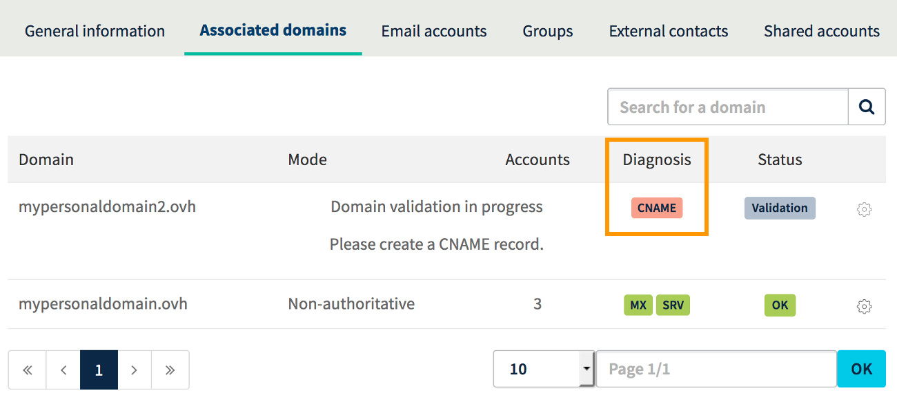
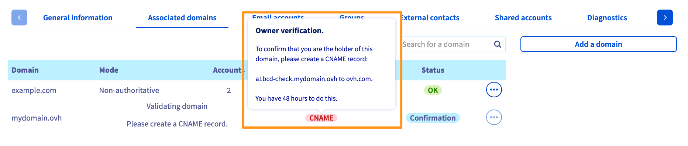

**Ostatnia aktualizacja z dnia 10-06-2019**

## Wprowadzenie

Podczas dodawania domeny do Twojej usługi e-mail możesz zostać poproszony o konfigurację pola CNAME (DNS). Celem konfiguracji jest zyskanie pewności, że dodanie domeny jest przez Ciebie autoryzowane.

**Dowiesz się, dlaczego dodanie pola CNAME może być wymagane i jak je dodać w Panelu klienta.**

## Wymagania początkowe

- Wykupienie usługi e-mail
- Przypisana domena do usługi e-mail, wymagająca dodania pola CNAME
- Możliwość modyfikacji konfiguracji Twojej domeny (strefy DNS)
- Dostęp do [Panelu klienta](https://www.ovh.com/auth/?action=gotomanager){.external}, sekcja `Web`{.action}

## W praktyce

### Etap 1: diagnostyka CNAME OVH

Przycisk diagnostyki pola **CNAME** (Canonical Name) pojawia się w niektórych przypadkach podczas deklarowania nazwy domeny w Twojej usłudze e-mail.

Ma to na celu weryfikację, czy jesteś administratorem nazwy domeny, którą chcesz zadeklarować. 

Diagnostyka może pojawić się w następujących przypadkach:

- zadeklarowana nazwa domeny nie jest zarejestrowana w OVH;
- zadeklarowana nazwa domeny nie jest przypisana do Twojego identyfikatora klienta;
- zadeklarowana nazwa domeny nie używa konfiguracji OVH (nie wskazuje na serwery DNS OVH).

{.thumbnail}

### Etap 2: konfiguracja CNAME w Panelu klienta

Wejdź w zakładkę `Przypisane domeny`{.action} i kliknij na czerwony przycisk `CNAME`{.action}, aby wyświetlić niezbędne informacje.

Pojawi się pole CNAME.

{.thumbnail}

Następnie, mogą pojawić się dwie opcje: 

- **Twoja domena używa konfiguracji OVH**: możesz przeprowadzić opisaną poniżej operację w Panelu klienta OVH:

- **Twoja domena nie używa konfiguracji OVH**: musisz wprowadzić stosowne modyfikacje w interfejsie służącym do zarządzania konfiguracją Twojej domeny.

> [!primary]
>
> Jeśli domena jest zarejestrowana w OVH, możesz sprawdzić w Panelu klienta, w zakładce `Serwery DNS`{.action}, czy używa ona konfiguracji OVH.
>

### Etap 3: Tworzenie pola CNAME w konfiguracji OVH

Kliknij w `Domeny`{.action} na pasku usług po lewej stronie w Panelu klienta, następnie w nazwę wybranej domeny. Wybierz zakładkę `Strefa DNS`{.action}.

Pojawi się tabela. Zawiera ona dane dotyczące konfiguracji Twojej domeny w OVH. Na konfigurację składają się rekordy DNS, każdy zaznaczony w oddzielnym wierszu tabeli.

Aby dodać pole CNAME, kliknij w przycisk `Dodaj wpis`{.action}.

{.thumbnail}

W oknie, które się wyświetli, pojawi się kilka pól DNS. Kliknij `CNAME`{.action} i wypełnij pola, używając informacji uzyskanych podczas diagnostyki.

{.thumbnail}

Po uzupełnieniu tych informacji kliknij `Dalej`{.action}. Upewnij się, że wyświetlane informacje są poprawne, następnie kliknij w `Zatwierdź`{.action}.

> [!primary]
>
> W związku z wprowadzoną zmianą, należy wziąć pod uwagę czas propagacji, ktόry wynosi od 4 do 24 godzin maksimum. Po tym czasie, zmiana będzie aktywna.
>

W celu sprawdzenia, czy konfiguracja pola CNAME jest poprawna, otwórz tabelę `Przypisane domeny`{.action} w Twojej usłudze e-mail. Jeśli przycisk jest zielony, nazwa domeny została prawidłowo dodana. Jeśli nie jest zielony, może to oznaczać, że nie zakończyła się jeszcze propagacja.

{.thumbnail}

## Sprawdź również

Przyłącz się do społeczności naszych użytkowników na stronie <https://community.ovh.com/en/>.