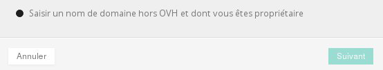
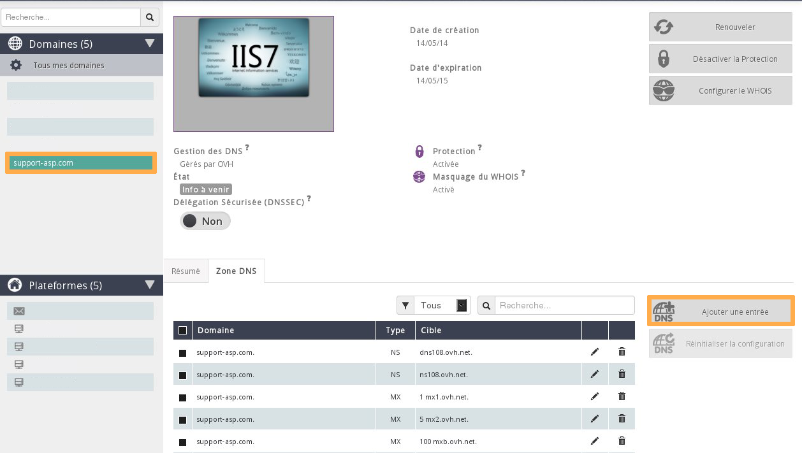
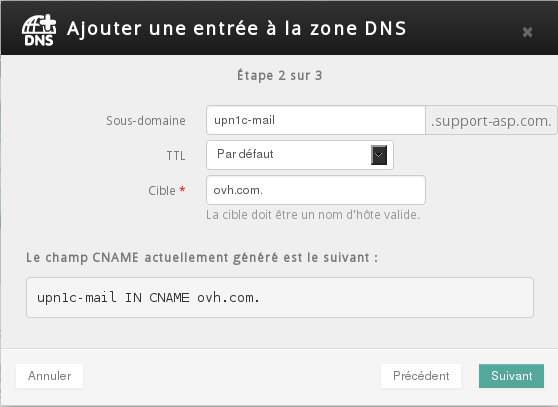

## A que corresponde o botão de diagnóstico CNAME?
O botão de diagnóstico CNAME (ou Nome Canónico) aparece em alguns casos específicos aquando da declaração de um nome de domínio na sua plataforma Exchange.

O seu objetivo é de provar que é realmente o administrador do domínio declarado.

{.thumbnail}

## Porque aparece esse botão de diagnóstico?
Vejamos as razões:

- O nome de domínio declarado não está registado na OVH. Escolheu-o aquando da declaração do mesmo: "Introduzir um nome de domínio que não está na OVH, do qual sou o seu proprietário".

- O nome de domínio declarado está registado na OVH, aponta para os servidores DNS da OVH mas não está na mesma referência cliente OVH (NICHANDLE) que o seu serviço Exchange.

- O nome de domínio declarado está registado na OVH mas não aponta para os servidores DNS da OVH.

{.thumbnail}

## Como criar o campo CNAME?
Recupere as informações necessárias à criação do campo ao clicar no botão de diasgnóstico CNAME.

{.thumbnail}

## O nome de domínio não está registado na OVH:
Crie o campo CNAME no seu prestador de DNS.

Veja duas ferramentas que permitem determinar o prestador de DNS: [DIG](http://www.ovh.pt/suporte/ferramentas/dig_domain.pl) e [WHOIS](https://www.ovh.pt/cgi-bin/whois.pl)

É possível que os servidores DNS utilizados sejam os da OVH.

Neste caso deverá adicionar o campo CNAME a partir [do Espaço Cliente Web](https://www.ovh.com/manager/web/login.html).

Mais abaixo no guia encontrará os detalhes das ações a realizar.

## O nome de domínio declarado está registado na OVH, aponta para os servidores DNS da OVH mas não está na mesma referência OVH que o seu serviço Exchange:
A criação do campo CNAME deverá ser efetuado a partir [do Espaço Cliente Web](https://www.ovh.com/manager/web/login.html) que administra o nome de domínio.

Clique no nome de domínio em questão, separador "Zona DNS", botão "Adicionar uma entrada".

{.thumbnail}

## Adição da entrada CNAME na ZONA DNS
Adicione a entrada CNAME graças às informações recuperadas anteriormente e passe à etapa seguinte para que valide a criação do campo.

Neste caos, a operação será tomada em conta rapidamente, sendo necessário aguardar uma hora.

{.thumbnail}

## O nome de domínio declarado está registado na OVH mas não aponta para os servidores DNS da OVH:
É necessário determinar quais os servidores DNS para onde apontam o seu domínio, e depois deverá criar o campo CNAME no prestador em questão. As ferramentas [DIG](http://www.ovh.pt/suporte/ferramentas/dig_domain.pl) e [WHOIS](https://www.ovh.pt/cgi-bin/whois.pl) estão à sua disposição para o ajudar a obter essa informação.

## Interface DIG:
Os servidores DNS utilizados são:

DNS108.ovh.net
NS108.ovh.net

{.thumbnail}

## Interface WHOIS  :
Os servidores DNS utilizados são:

DNS108.ovh.net
NS108.ovh.net

{.thumbnail}

## Como saber se um campo CNAME foi adicionado corretamente?
A adição de um campo CNAME necessita de uma propagação DNS que vai de 4 a 24 horas. No entanto, este tipo de campos é propagado muito rapidamente, o que permite continuar a configuração da sua plataforma Exchange.

Ao atualizar a página do seu Espaço Cliente deverá constatar que o botão de diagnóstico CNAME desapareceu e que apareceram dois novos botões de diagnóstico MX e SRV.

{.thumbnail}

