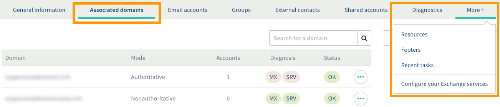

**Last updated 25th January 2019**

## Objective

With the Exchange service, you can set up professional email addresses, and use them with a range of features for collaborative work. In order to maintain this environment, you can manage the global security settings of your Exchange accounts.

**Find out how to manage the security policy of your Exchange service.**

## Requirements

- an [Exchange](https://www.ovh.co.uk/emails/){.external} service
- access to the [OVH Control Panel](https://www.ovh.com/auth/?action=gotomanager)

## Instructions

The security policy management of your Exchange service has four aspects:

- enhancing Exchange account security when users try to log in
- adding complexity to the security of your Exchange service account passwords
- strengthening the verification of incoming messages on our servers and to your Exchange addresses
- defining how the so-called "unwanted" messages will be displayed in your Exchange addresses

To access the security policy of your Exchange service, log in to the [OVH Control Panel](https://www.ovh.com/auth/?action=gotomanager) and make sure you are in the "Web" section. Click `Microsoft`{.action} in the services bar on the left-hand side, then `Exchange`{.action}, and finally, select the Exchange service concerned.

On the page that appears, click on the `More +`{.action} tab, and then on `Manage Security Policy`{.action}.

{.external}

Continue to the aspect(s) you want to modify.

|Aspect|Description| 
|---|---| 
|[Enhance connection security](./#enhance-connection-security){.external}|Define whether accounts should lock after a number of unsuccessful log-in attempts.|
|[Add complexity to the security of passwords](./#add-complexity-to-the-security-of-passwords){.external}|Define a complexity requirement, as well as rules for changing passwords.|
|[Strengthen the verification of incoming messages](./#strengthen-the-verification-of-incoming-messages){.external}|Specify whether our servers should check if the messages received come from a legitimate source (i.e. DKIM and/or SPF checks).|
|[Define the display of unwanted messages](./#define-the-display-of-unwanted-messages){.external}|Specify whether unwanted messages should have a tag to identify them, or be automatically moved to the trash.|

### Enhance connection security

This allows you to define whether Exchange accounts should lock after a number of unsuccessful log-in attempts.

To make this change, on the page that appears, enter the information set out in the table below:

|Information|Description| 
|---|---| 
|Lockout threshold|Set the number of unsuccessful log-in attempts before the account locks. Enter "0" to not apply a lockout threshold.|
|Lockout counter reset time|This field will only appear if a lockout threshold has been set. Specify the time it takes for the failed connection attempt counter to reset.|
|Account lockout duration|This field will only appear if a lockout threshold has been set. Specify the time period during which the Exchange account will remain locked if the lockout threshold has been reached.|

Once this information has been entered, you can immediately validate these changes by clicking on `Next`{.action}, then `Confirm`{.action}. You can then continue to the next part.

### Add complexity to the security of passwords

This allows you to define a complexity requirement, as well as rules for changing passwords.

To make this change, on the page that appears, enter the information set out in the table below:

|Information|Description| 
|---|---| 
|Complexity requirements|Allows user to set rules regarding the complexity of passwords:  \- not contain all or part of the user’s account name  \- be at least 6 characters long  \- contain uppercase and lowercase letters, non-alphabetic characters (! or $ for example), and numbers|
|Prevent password change|Allows to enforce a minimum lifetime for your Exchange accounts’ passwords. This means that users will have to wait a certain number of days before they can change their passwords.|
|Maximum password duration|Allows to enforce a maximum lifetime for your Exchange accounts’ passwords. This means that users will be forced to change their passwords once this time limit is reached.|
|Keep password history|This field will only appear if a maximum lifetime has been set. Specify whether previous passwords can be reused again, and if so, for how long.|
|Minimum password length|Allows to set a minimum size for password length when a user wants to change it.|

Once this information has been entered, you can immediately validate these changes by clicking on `Next`{.action}, then `Confirm`{.action}. You can then continue to the next part.

### Strengthen the verification of incoming messages

This allows you to specify whether our servers should check if the messages received in your Exchange accounts come from a legitimate source (DKIM and/or SPF checks).

To make this change, on the page that appears, enter the information set out in the table below:

|Information|Description| 
|---|---| 
|Activate DKIM signature verification|Define whether our servers should check the DKIM signature of the messages you receive on your Exchange accounts. This action guarantees the authenticity of the sending domain and the integrity of the message, making it possible to identify non-legitimate mailings, which will then be marked as spam.|
|Activate SPF protection verification|Define whether our servers must verify that the source of the messages you receive is present in the SPF record of the sender domain. This verification can identify illegitimate mailings, which will then be marked as spam.|

Once this information has been entered, you can immediately validate these changes by clicking on `Next`{.action}, then `Confirm`{.action}. You can then continue to the next part.

### Define the display of unwanted messages

This allows you to define whether unwanted messages you receive on your Exchange accounts should be tagged to identify them, or automatically moved to the trash.

To make this change, on the page that appears, enter the information set out in the table below:

|Information|Description| 
|---|---| 
|Identify SPAM email|Specify whether our servers should add a tag to identify received messages that are considered "unwanted" as spam.|
|Move SPAM to junk|Specify whether our servers should automatically move any "unwanted" messages to the trash.|

Once this information has been entered, you can immediately validate these changes by clicking on `Next`{.action}, then `Confirm`{.action}.

## Go further

Join our community of users on <https://community.ovh.com/en/>.