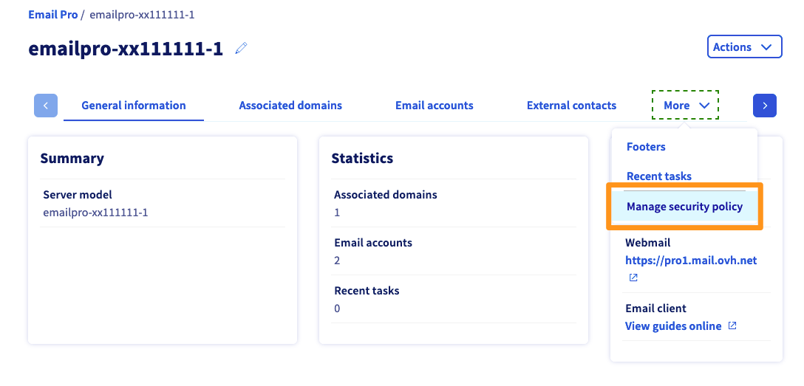
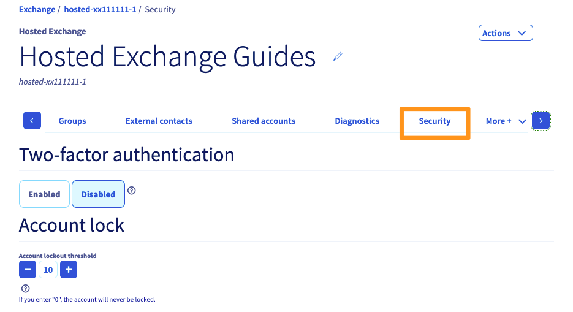

**Última atualização: 12/06/2020**

## Objetivo

Os serviços de e-mail da OVHcloud disponibilizam endereços de e-mail profissionais. Para preservar este ambiente, tem a possibilidade de gerir parâmetros gerais relativamente à segurança das suas contas de e-mail.

**Saiba como gerir a política de segurança do seu serviço de e-mail.**

## Requisitos

- Ter uma [solução de e-mail na OVHcloud](https://www.ovh.pt/emails/){.external}.
- Ter acesso à [Área de Cliente OVHcloud](https://www.ovh.com/auth/?action=gotomanager), secção `Web`{.action}.

## Instruções

A gestão da política de segurança do seu serviço de e-mail pode interagir com quatro aspetos:

- reforçar a segurança das contas de e-mail quando os utilizadores tentam conectar-se;
- reforçar a segurança das palavras-passe das contas do serviço de e-mail;
- reforçar a verificação das mensagens de entrada nos nossos servidores e com destino aos seus endereços de e-mail (exclusivamente para contas [Exchange](https://www.ovh.pt/emails/hosted-exchange/){.external};
- definir a forma como as mensagens «indesejadas» são apresentadas nas caixas de entrada (exclusivamente para contas [Exchange](https://www.ovh.pt/emails/hosted-exchange/){.external}.

Para aceder à política do seu serviço de e-mail, aceda à [Área de Cliente OVHcloud](https://www.ovh.com/auth/?action=gotomanager) e certifique-se de que está na secção `Web`{.action}. 

|E-mails e E-mail Pro|Exchange| 
|---|---| 
|Clique em `E-mails`{.action} ou `E-mail Pro`{.action}, na coluna à esquerda, e selecione o serviço em causa. Clique no separador `Mais` e selecione `Gerir a política de segurança`{.action}.|Clique em `Microsoft`{.action} na coluna à esquerda, depois em `Exchange`{.action}, e selecione o serviço em causa. Clique no separador `Mais` e selecione `Gerir a política de segurança`{.action}.|
|{.thumbnail}|{.thumbnail}|

Continue a ler este manual na secção correspondente à ação que pretende realizar:

|Ação|Descrição| 
|---|---| 
|[Reforçar a segurança do acesso](https://docs.ovh.com/pt/microsoft-collaborative-solutions/gerir-politica-de-seguranca-palavra-passe/#reforcar-a-seguranca-do-acesso){.external}|Indique se as contas devem ser bloqueadas após um certo número de tentativas de ligações sem efeito.|
|[Tornar a segurança das palavras-passe mais complexa](https://docs.ovh.com/pt/microsoft-collaborative-solutions/gerir-politica-de-seguranca-palavra-passe/#tornar-a-seguranca-das-palavras-passe-mais-complexa){.external}|Defina uma exigência de complexidade, assim como regras para a alteração da palavra-passe.|
|[Reforçar a verificação das mensagens de entrada (exclusivamente para Exchange)](https://docs.ovh.com/pt/microsoft-collaborative-solutions/gerir-politica-de-seguranca-palavra-passe/#reforcar-a-verificacao-das-mensagens-de-entrada){.external}|Indique se os nossos servidores devem verificar se as mensagens recebidas provêm de uma fonte legítima de envio (verificações DKIM e/ou SPF).|
|[Definir a apresentação das mensagens indesejadas (exclusivamente para Exchange)](https://docs.ovh.com/pt/microsoft-collaborative-solutions/gerir-politica-de-seguranca-palavra-passe/#definir-a-apresentacao-das-mensagens-indesejadas){.external}|Especifique se as mensagens indesejadas devem incluir uma identificação que as permita identificar ou mover automaticamente para a reciclagem.|

### Reforçar a segurança do acesso

Esta ação permite-lhe indicar se as contas de e-mail devem ser bloqueadas após um certo número de tentativas de ligação sem efeito.

Para isso, complete as informações mencionadas no quadro abaixo:

|Informação|Descrição| 
|---|---| 
|Limite de bloqueio|Indique o número de tentativas de ligações sem efeito que deve ser atingido para que a conta seja bloqueada. Indique “0” para não aplicar nenhum limite de bloqueio.|
|Atraso de reinicialização|Este campo aparece apenas se um limite de bloqueio tiver sido definido. Precise o prazo necessário para que o contador de tentativas de ligações sem efeito seja reposto a zero.|
|Duração do bloqueio|Este campo aparece apenas se um limite de bloqueio tiver sido definido. Especifique o tempo durante o qual a conta de e-mail ficará bloqueada se o limite de bloqueio for atingido.|

Depois de preencher estas informações, valide estas alterações clicando em `Seguinte`{.action} e, a seguir, em `Validar`{.action}, relativamente às ofertas «E-mails» e «E-mail Pro». Clique em `Registar as modificações`{.action}, relativamente à oferta Exchange.

### Tornar a segurança das palavras-passe mais complexa

Isto permite-lhe definir uma exigência de complexidade, assim como regras para a alteração da palavra-passe.

Para isso, complete as informações mencionadas no quadro abaixo:

|Informação|Descrição| 
|---|---| 
|Exigência de complexidade|Permite aplicar regras relativamente à complexidade das palavras-passe:  - não incluir toda ou parte do nome da conta de utilizador;  - ter pelo menos 6 caracteres;  - incluir caracteres em maiúsculas, minúsculas, especiais (! ou $, por exemplo), bem como números.|
|Impedir a alteração da palavra-passe|Permite aplicar um período de validade mínimo às palavras-passe das contas de e-mail. Ou seja, os utilizadores deverão aguardar um determinado número de dias antes de poder alterar a sua palavra-passe.|
|Período de validade da palavra-passe|Permite aplicar um período de validade máximo às palavras-passe das contas de e-mail. Ou seja, os utilizadores serão obrigados a alterar a palavra-passe depois de atingir esse limite.|
|Manter o histórico da palavra-passe (exclusivamente Exchange)|Este campo aparece apenas se um período de validade máximo tiver sido definido. Especificar o período de validade, em dias, das palavras-passe anteriores que poderão ser utilizadas novamente.|
|Dimensão mínima da palavra-passe|Permite aplicar um tamanho mínimo para as palavras-passe que um utilizador pretende alterar.|

Depois de preencher estas informações, valide estas alterações clicando em `Seguinte`{.action} e, a seguir, em `Validar`{.action}, relativamente às ofertas «E-mails» e «E-mail Pro». Clique em `Registar as modificações`{.action}, relativamente à oferta Exchange.

### Reforçar a verificação das mensagens de entrada (exclusivamente para Exchange)

Isto permite-lhe indicar se os nossos servidores devem verificar se as mensagens recebidas nas suas contas de e-mail provêm de uma fonte legítima de envio (verificações DKIM e/ou SPF).

Para isso, selecione as opções desejadas no quadro abaixo:

|Informação|Descrição| 
|---|---| 
|Ativar a verificação da assinatura DKIM|Especifique se os nossos servidores devem verificar a assinatura DKIM das mensagens que recebe nas contas Exchange. Esta ação garante a autenticidade do domínio remetente e a integridade da mensagem, permitindo identificar envios não legítimos, que serão identificados como spam.|
|Ativar a verificação da proteção SPF|Especifique se os nossos servidores devem verificar que a fonte de envio das mensagens que recebe está bem presente no registo SPF do domínio remetente. Esta verificação pode permitir identificar envios não legítimos, que serão identificados como spam.|

Depois de fazer a sua escolha, valide as alterações clicando em `Registar as modificações`{.action}.

### Definir a apresentação das mensagens indesejadas (exclusivamente para Exchange)

Isto permite-lhe especificar se as mensagens indesejadas que recebe nas suas contas de e-mail devem incluir uma identificação que as permita identificar ou mover automaticamente para a reciclagem.

Para isso, selecione as opções desejadas no quadro abaixo:

|Informação|Descrição| 
|---|---| 
|Identificar as mensagens indesejadas|Indique se os nossos servidores devem adicionar uma etiqueta para identificar mensagens recebidas consideradas “indesejadas” como spam.|
|Mover as mensagens indesejadas para a reciclagem|Indique se os nossos servidores devem mover automaticamente as mensagens recebidas consideradas “indesejadas” para a reciclagem.|

Depois de fazer a sua escolha, valide as alterações clicando em `Registar as modificações`{.action}.

## Quer saber mais?

Fale com a nossa comunidade de utilizadores em <https://community.ovh.com/en/>.