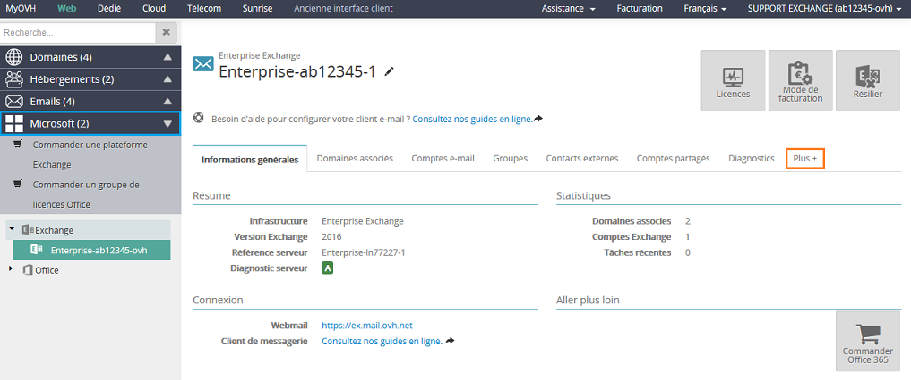

## Schritt 1: Zugang zur Dienstleistung
Wenn Sie Ihr Enterprise Exchange eben erst bezahlt haben, müssen Sie zunächst die in [dieser Anleitung](https://www.ovh.de/g2074.exchange_premiers_pas_avec_un_serveur_private) beschriebenen Schritte ausführen, bevor Sie die hier erklärten Aktionen ausführen können.

Melden Sie sich zunächst über folgenden Link in Ihrem OVH Kundencenter an: [OVH Kundencenter](https://www.ovh.com/auth/?action=gotomanager&from=https://www.ovh.de/&ovhSubsidiary=de)

Nach dem Login haben Sie Zugang zu folgendem Interface:

* In diesem Beispiel wird ein Exchange Enterprise Angebot verwendet.

Wählen Sie in der linken Spalte unter Plattform das Enterprise Angebot aus.

Sie haben unmittelbaren Zugriff auf folgende Funktionen:

- Allgemeine Informationen
- Assoziierte Domains
- E-Mail Accounts
- Gruppen
- Externe Kontakte
- Freigegebene Postfächer

Über den Tab "Mehr+" :

- Ressourcen
- Fußzeilen
- Aktuelle Tasks
- Verwaltung der Sicherheits-Policy

{.thumbnail}

## Schritt 2: Hinzufügen der Domain
Wenn Sie Ihre Exchange Plattform auswählen, erscheint ein Popup, um Ihre Domain mit dem Exchange Service zu verbinden.

Wenn Ihre Domain bei OVH regisrtiert ist, können Sie sie in der Liste auswählen.

Wenn die Domain bei einem anderen Anbieter registriert ist oder es sich um eine Subdomain handelt, können Sie diese von Hand eintragen.

 ACHTUNG 
Wenn Sie keine Domain haben, können Sie über einen Link im Popup einen Domainnamen auf unserer Webseite bestellen.

Für die Konfiguration einer externen (nicht bei OVH registrierten) Domain werden Sie aufgefordert, einen Eintrag vom Typ CNAME auf einer Subdomain Ihrer Domain anzulegen.

Klicken Sie anschließend auf "Weiter", um mit der Konfiguration fortzufahren.

{.thumbnail}

## Schritt 3: Konfiguration der Domain
Für diesen Schritt gibt es zwei verschiedene Möglichkeiten:

- Mit OVH DNS :

Setzen Sie ein Häkchen bei "SRV automatisch konfigurieren", wenn die Domain über dieselbe Kundenkennung verwaltet wird wie Ihre Exchange Plattform.

Das Feld SRV dient dazu, Ihr Mailing-Programm automatisch zu konfigurieren. Bei Outlook 2016 ist dies obligatorisch.

Setzen Sie ein Häkchen bei "MX-Einträge automatisch konfigurieren". Dies ist notwendig, damit Sie Ihre E-Mails über Exchange empfangen können. Es bedeutet, dass Ihre Mail-Server automatisch modifiziert werden.

- Wenn Sie Ihre Eingangsserver nicht ändern möchten, setzen Sie kein Häkchen. Sie können im Tab "Assoziierte Domains" auf den roten MX-Diagnose-Button klicken und die Änderung anschließend bestätigen.

{.thumbnail}

- Ohne OVH DNS:

In diesem Fall müssen Sie auf Ihrer Domain das Feld SRV manuell konfigurieren:

Das SRV besteht aus einer Subdomain: _autodiscover._tcp.ihre-domain.com.

- Sie müssen folgende Angaben machen:

|-|-|
|---|---|
|Priorität|0|
|Gewicht|0|
|Port|443|
| Enterprise Server| Ihr-Host-Name|

Bei den Eingangsservern (MX) müssen Sie Ihre Domain über die DNS Zone manuell anpassen:

|-|-|
|---|---|
|Angebot Enterprise ohne Antispam / nicht-autoritativer Modus + POP/IMAP-E-Mail-Service nicht von OVH gehostet| Ihr-Host-Name|
|Angebot Enterprise mit Antispam (autoritativer/nicht-autoritativer Modus + POP/IMAP-E-Mail-Service von OVH gehostet)|mx0.mail.ovh.net, mx1.mail.ovh.net, mx2.mail.ovh.net, mx3.mail.ovh.net|

Wenn Sie das Häkchen bei der "automatischen Konfiguration" der MX gesetzt hatten (notwendig für den E-Mail-Eingang) und in den nicht-autoritativen Modus wechseln müssen (Kompatibilität mit einem POP/IMAP-E-Mail-Service):

- Klicken Sie auf den roten MX-Diagnose-Button (im Menüpunkt "Assoziierte Domains") und wählen Sie den Eingangsserver aus: Ihr-Host-Name.

Es wird zwischen 4 und 24 Stunden dauern, bis die Änderungen wirksam werden.

Klicken Sie auf "Weiter" und anschließend auf "Bestätigen", um die Operation abzuschließen.

## Schritt 4: Konfiguration der Accounts
Wählen Sie den Tab "E-Mail Account" aus. Die Konten sind in folgender Form aufgeführt: gufbqeiixg@configureme.me.

Um eine Konfiguration vorzunehmen, klicken Sie auf den kleinen schwarzen Stift rechts neben dem betreffenden Account.

Bitte beachten Sie: Wenn Sie ein E-Mail-Konto löschen, erscheint dieses nach einigen Minuten als neues (leeres) Konto, das aber immer noch berechnet wird. Wenn Sie einen Account endgültig löschen wollen:

- Gehen Sie in den Tab "Abrechnungsmodus"
- Häkchen setzen bei "Keiner" und "Bestätigen"

{.thumbnail}

## Änderung des Accounts:
Über den Button "Konfiguration" gelangen Sie auf folgendes Interface:

Passwort

Die Passwörter müssen folgende Mindestanforderungen erfüllen:

- Der Benutzername darf weder ganz noch teilweise enthalten sein
- Mindestlänge 8 Zeichen
- Es müssen Zeichen aus drei der vier folgenden Kategorien verwendet werden:

Großbuchstaben (A bis Z)
Kleinbuchstaben (a bis z)
Ziffern (0 bis 9)
Nicht-alphabetische Zeichen (zum Beispiel: !, $, #, %)

{.thumbnail}

## Abschluss der Installation
Ihre Exchange Enterprise Dienstleistung ist nun konfiguriert!

Weitere Informationen zu diesem Thema finden Sie in unseren [Hilfen zu Exchange](https://www.ovhcloud.com/de/emails/hosted-exchange/anleitungen/) sowie in unseren [Online-FAQ](https://www.ovhcloud.com/de/emails/hosted-exchange/).

