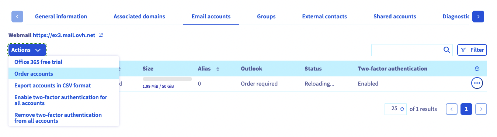

**Last updated 19th January 2018**

## Objective

With the Hosted Exchange service, you can get professional emails to use for collaborative work, with features such as calendar and contact syncing.

**Find out how to get started with your Hosted Exchange service.**

## Requirements

- You need to have a subscription to a [Hosted Exchange](https://www.ovh.co.uk/emails/hosted-exchange/){.external} solution.
- You need to have received an email confirming that your Hosted Exchange solution has been set up.
- You must have a domain name.
- You must be logged in to your [OVH Control Panel](https://www.ovh.com/auth/?action=gotomanager){.external}.

## Instructions

### Step 1: Log in to your service's interface

Once your Hosted Exchange service has been created and is available, you can manage it from your [OVH Control Panel](https://www.ovh.com/auth/?action=gotomanager){.external}.

To do this, log in and click `Microsoft`{.action}, then `Exchange`{.action} in the left-hand services bar. The click on the name of the Hosted Exchange service concerned.

> [!primary]
>
> The name of a Hosted Exchange service in your OVH Control Panel begins with **hosted-**, contains part of your NIC handle and ends with a figure (1 for the first Hosted Exchange service installed, 2 for the second, etc.).
>

### Step 2: Configure your service for the first time

Since you have not used your service yet, you will need to configure it for the first time. Once you have done so, you can then use your new Exchange email addresses.

To do this, when you first access the management interface for your Hosted Exchange service, a configuration assistant will open. To get started, click the `Start`{.action} button.

With this configuration assistant, you can make several changes. Depending on what you want to do, the following table may make some steps of this guide optional.

|Change|Kuvaus|
|---|---|
|Choose a domain name|Determine the domain name that you will use for your Exchange email addresses. This is one of the elements that will make up your email address (such as contact@mypersonaldomain.ovh, for example).|
|Configuring the domain name|The domain name you enter will be configured automatically if it is managed by OVH on the same NIC handle as your Exchange service. If this is not the case, then you will need to configure it manually.|
|Configure Exchange accounts|Determine the name of your Exchange email addresses, and add additional information.|
|Migrate data (if applicable)|If you wish to migrate your email addresses from another OVH email solution (MX Plan or Email Pro), you can launch the migration process using this assistant. If you are using an email client, you will also need to configure your accounts again.|

### Step 3: Add additional domains (optional)

Once you have finished configuring your domain, you can also configure additional domain names if you wish, and if you have not already done so via the assistant.

> [!warning]
>
> In the directory, all of the addresses created on your Exchange service can view all other addresses associated with it, including those that have different domain names. To stop different domain names from being displayed this way, you will need to order a new Hosted Exchange solution for the domain name(s) concerned.
>

To add a new domain name, select the Hosted Exchange concerned in your [OVH Control Panel](https://www.ovh.com/auth/?action=gotomanager){.external}, and click on `Associated domains`{.action}. You will see a table showing all of the domain names currently configured, or about to be configured on your service. To add new ones, click on the `Add a domain`{.action} button, then follow the various steps of the process.

To find out more, please refer to this guide on [Adding a domain name to an Exchange service](https://docs.ovh.com/gb/en/microsoft-collaborative-solutions/adding-domain-exchange/){.external}.

> [!primary]
>
> If a domain name requires a specific action for its configuration, a red box will appear in the `Diagnostic`{.action} column of the table. By clicking on it, you will see the modifications that need to be made. If this domain name does not use OVH configuration (its DNS servers), you must carry out the modifications in the interface you use to manage your domain name’s configuration. 
>

{.external}

### Step 4: Configure your additional Exchange accounts (optional)

You can configure additional accounts if you wish, and if you have not already done so via the assistant.

To do this, click on the Hosted Exchange service concerned in your [OVH Control Panel](https://www.ovh.com/auth/?action=gotomanager){.external}, then on `Email accounts`{.action}. You will see a table showing all of the accounts currently configured, or about to be configured on your service.

The accounts that have not yet been configured configuration will appear in the table as “*@configureme.me*”. To configure them, click on the pencil icon, then follow the steps.

> [!primary]
>
> Repeat this step as necessary according to the number of accounts you have. You can order new ones using the `Order accounts`{.action} button.
>

{.external}

### Step 5: Use your email addresses

Once you have configured your accounts, you can now start using them. To do this, OVH offers the **Outlook Web Application** (OWA) webmail app. You can access this via the following address: [https://www.ovh.co.uk/mail/](https://www.ovh.co.uk/mail/){.external}. To log in, enter your email address credentials. If you require any assistance using OWA, please refer to our documentation via this link: [https://docs.ovh.com/gb/en/microsoft-collaborative-solutions/](https://docs.ovh.com/gb/en/microsoft-collaborative-solutions/){.external}.

If you would like to configure your email address on an email client or device (e.g. a smartphone or tablet), please refer to our documentation via this portal: [https://docs.ovh.com/gb/en/microsoft-collaborative-solutions/](https://docs.ovh.com/gb/en/microsoft-collaborative-solutions/){.external}. To optimise the way you use your Exchange email address on an email client, ensure that it is compatible with the service.

OVH offers Outlook licences in the [OVH Control Panel](https://www.ovh.com/auth/?action=gotomanager){.external}, and Office 365 licences on the following page: [https://www.ovh.co.uk/office-365/](https://www.ovh.co.uk/office-365/){.external}. We recommend using one of these solutions if you would like to use the Outlook email client, or other software from the Microsoft Office suite.

> [!primary]
>
> With Exchange, you can sync all of your settings (filters, email signatures, folders, etc.), regardless of whether you were using a web application or a compatible email client.
> This way, if you use Exchange on three devices via different login interfaces (webmail, compatible email software or client), all of your information will be available at the same time.
>

### Step 6: Configuring collaborative features (optional)

Now that your Hosted Exchange service is configured and fully functional, you can set up the service’s collaborative features in your [OVH Control Panel](https://www.ovh.com/auth/?action=gotomanager){.external}. You can use these features to create resources (meeting rooms, equipment, etc.), groups, and much more.

To enable these features, select the Hosted Exchange service concerned in your  [OVH Control Panel](https://www.ovh.com/auth/?action=gotomanager){.external}, then choose from the tabs that show which action will be carried out.

For assistance with these features, please refer to our documentation in this portal: [https://docs.ovh.com/gb/en/microsoft-collaborative-solutions/](https://docs.ovh.com/gb/en/microsoft-collaborative-solutions/){.external}.

{.external}

## Go further

Join our community of users on [https://community.ovh.com/en/](https://community.ovh.com/en/){.external}.